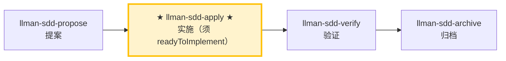

# LLMAN SDD Apply

使用此 skill 在**一个闭环内**按顺序完成 `llmanspec/changes/<id>/tasks.md` 的所有任务：
实现代码 → 补测试/验收 → 跑门禁 → 失败自修复并重跑 → 全部通过后报告结果。
除非遇到明确 blocker，否则**不要中途停下来问「要不要继续」**。

## Pipeline 位置

## Git-native 生命周期（摘要）

勿混淆：**Skill 导航** ≠ **Git-native 生命周期**。全图见根 `AGENTS.md`「领域概念区分」或 `llman-sdd-propose` 内嵌全图。

硬规则：
1. **先** Branch binding（`change start` / `attach`）→ Full；**再** Specs landing（绑定分支编辑并 commit `llmanspec/specs/**`）。
2. 无 live 合约变更 → `skip_specs_landing: true`。apply 前须 `readyToImplement=true`。
3. **禁止**在默认分支 commit live specs；已 attach 勿重复 `start`。

### Skill 导航（非生命周期；仅指示当前 skill）



> 📍 你现在在完整 Git-native 生命周期图中的 **H（apply）**：进入前须 Specs-landed（或 `skip_specs_landing`）且 `readyToImplement=true` → 下一步 `llman-sdd-verify`

## 硬约束

- **SSOT 驱动**：以 `proposal.md` / `design.md` / `tasks.md` 及 feature 分支上的 live `llmanspec/specs/**` 为唯一事实来源；specs 中的 MUST/SHALL 必须逐条落实。
- **范围锁定**：只实现当前 change 的范围；禁止顺手修「无关问题」。
- **最小改动**：改动保持最小并严格围绕当前 tasks。
- **禁止猜测**：需求不明确、specs 与实现矛盾时，先 STOP 并报告，不要自行假定行为。
- **不保留旧兼容层**：若 change 要求改行为，直接全量升级到新写法，除非 tasks/proposal 明确写了要兼容。
- **不要问「要不要继续」**：除非遇到无法自动解决的 blocker，否则一路执行到闭环结束。
- **收尾**：本 skill 闭环以建议 `llman-sdd-verify` 结束；finalize/archive 由 `llman-sdd-archive` 负责（勿在自修复循环里 finalize）。

## 步骤

### 0) Preflight（必须做）
- 读取并遵守：`llmanspec/config.yaml`、`AGENTS.md`（若存在）。
- `git status --porcelain`：
  - 若工作区不干净且改动不属于当前 change：先 `git stash push -u -m "llman-sdd-apply autopilot backup"` 做备份。
- 运行 `llman sdd validate --all --strict --no-interactive`：
  - 若失败且与当前 change 无关，先停下报告（工件不一致会导致实现无法以 SSOT 驱动）。
- **检查 spec valid_scope 完整性**：使用 `llman sdd list --specs --json` 列出所有 spec，然后对每个 spec 验证其 `valid_scope` 中的每个路径是否存在于磁盘上。若存在缺失的文件/目录，停下并建议更新 spec（从 `valid_scope` 中移除已删除的路径）。

### 1) 选择变更 id 并检查前置条件
- 若已提供 change id，直接使用。
- 否则从上下文推断；若不明确，运行 `llman sdd list --json` 并让用户选择。
- 始终说明："使用变更：<id>"，并告知如何覆盖。
- 确认已在经 `llman sdd change start <id>` 或 `change attach <id>` 绑定的非默认 feature 分支上（仅在需要重绑时用 `--force`）。分支上的 specs/features 即 SSOT——不要在 `changes/<id>/specs/` 下编写。
## 阶段守卫（`stage` / `readyToImplement`）

用权威 JSON 判定（勿凭「完整工件」口头说法）：

```bash
llman sdd show <id> --json --type change
```

解读字段：`stage`、`specsLanded`、`skipSpecsLanding`、`readyToImplement`。

| 条件 | 动作 |
|------|------|
| `stage=draft`（仅 proposal.md） | STOP。长大到 Designed（proposal + tasks；design 按需）→ Branch binding → Specs landing。draft 不能直接 apply/verify。若已有 proposal+design+tasks 仍是 `draft`：未 start/attach —— 在默认分支干净树跑 `change start`，或手动建分支后 `change attach`。**不要**建 `changes/<id>/specs/`，**不要**先在默认分支改 live specs。 |
| `stage=designed` | STOP。先 `change start` / `attach`（Branch binding）。 |
| `stage=full` 且 `readyToImplement=false` | STOP。在**绑定分支**完成 Specs landing（编辑 `llmanspec/specs/**` 并 commit），或设 `skip_specs_landing`。**不要**再跑 `change start`。丢失绑定分支 specs → checkout/重建 + 必要时 `attach --force`。 |
| `readyToImplement=true` | 可通过 apply/verify 前置检查。`changes/<id>/specs/` 预期**不存在**，勿当缺失。 |
- 使用 `llman sdd context --task "<proposal 中的目标>" --paths "<specs 中的 scope>"` 获取相关 specs。
  - 若 context 不可用，运行 `llman sdd index rebuild` 后重试。

### 2) 阅读 SSOT 工件
必须通读以下文件：
- `llmanspec/changes/<id>/proposal.md`
- `llmanspec/changes/<id>/design.md`（如存在）
- `llmanspec/changes/<id>/tasks.md`
- feature 分支上的 live specs：`llmanspec/specs/**`（`<capability>.feature`）——这是 SSOT

将 `proposal.md` 和 `design.md` 中的决策整理为不可违反的硬约束清单。把 `tasks.md` 转成可执行的最小步骤序列（保持原顺序）。

### 3) 展示状态
- 进度："N/M tasks complete"
- 接下来 1–3 个未完成任务（简短概览）

### 4) 逐任务实施（闭环执行）
对每个未完成 task：
1. **实现**：严格按 task 描述 + specs 要求，改动保持最小。
2. **完成后立刻更新 checkbox**：`- [ ]` → `- [x]`。
3. 若 task 不明确、遇到 blocker、或发现 specs/design 与现实不一致 → STOP 并报告 blocker，不要自行假定。

> 💡 上一阶段 `llman-sdd-propose`（已生成 tasks）；完成本阶段后 → `llman-sdd-verify`（验证）

### 5) 验证与自修复循环（每个 task 或每批 task 完成后执行一次）
运行项目门禁命令（根据项目实际选择）：
- 相关测试集：`just test` 或 `cargo test --all`
- 格式/lint：`just check` 或 `just lint` + `just fmt`
- Git-native：留在绑定 feature 分支；按需编辑 live `llmanspec/specs/<capability>/<capability>.feature`（规则 `@human`，验收 `@executable`）；spec 改动后跑 `llman sdd validate --specs`。勿在每个 task 后跑 `checkpoint`。勿使用 `change delta` / solidify / feature_delta。
- SDD 校验：`llman sdd validate <id> --strict --no-interactive`

**若失败 → 进入自修复循环（不要问要不要继续）：**
1. 解析失败原因（测试失败 / lint / 格式 / 校验错误）。
2. **判定是否难定位的 bug**（测试失败原因不明 / 间歇性 flake / 回归且一眼看不穿）：
   - **不是难定位的 bug**（明确的 lint/格式/编译错误/校验失败）：进行最小修复（不扩大范围），先重跑「最小失败复现命令」再重跑全部门禁。
   - **难定位的 bug → 升级诊断子流程**：
     1. **先建一个能复现失败的命令**（快、确定、agent 可运行，且能在这个 bug 上失败）——即一个能驱动真实 bug 路径并断言用户确切症状的命令。**MUST NOT 在没有这种命令前就开始猜原因**（盯着代码空想正是本流程要防止的失败）。
     2. 运行并确认失败 → 最小化复现（逐个剔除输入/调用/配置/数据，只留关键部分）。
     3. 生成 **3–5 个排序假设**，每个须可证伪（「若 X 是因，则改 Y 会让 bug 消失」）。
     4. 单变量验证（一次只改一个），找到根因后修复。
     5. 若没有合适的边界（seam）写回归测试，记录该架构缺口（交 `llman-sdd-arch-review`）。
3. 先重跑「最小失败复现命令」，再重跑全部门禁。
4. 记录为一轮自修复：`Round N：失败点 → 修复 → 重跑 → 通过/失败`。

**自修复上限 8 轮**；超过仍不通过视为 blocker：停止并输出 blocker 报告（含最后一次失败命令与输出摘要、你已尝试的修复）。

### 6) 完成报告
所有 task 完成 + 全部门禁通过后，输出结构化报告（见下方 Output Contract）。
然后建议运行 `llman-sdd-verify` 进入验证阶段。

> 💡 实施完成 → 下一步 `llman-sdd-verify`（验证）

行动前先阅读 `llmanspec/config.yaml`，并遵循其中的 `context` 与 `rules`（若有）。

常用命令：
- `llman sdd context --task "<描述>" --paths "<文件>"`（找相关 specs）。使用 pageindex agentic tree 后端（需 `LLMAN_SDD_INDEX_CHAT_MODEL`）。可用 `LLMAN_SDD_INDEX_BACKEND` 预设。
- `llman sdd list`（列出变更）
- `llman sdd list --specs`（列出 specs 及 purpose/scope 元数据）
- `llman sdd show <id>`（展示 change/spec；`--type change --output json` 含 `stage` / `specsLanded` / `skipSpecsLanding` / `readyToImplement`——apply 门禁看 `readyToImplement`，勿凭「完整工件」）
- `llman sdd validate <id>`（校验 change 或 spec）
- `llman sdd validate --all`（批量校验）
- `llman sdd index rebuild`（重建 pageindex 树索引——不需要模型）
- `llman sdd index check`（检查索引新鲜度）
- `llman sdd change new <id>`（仅创建规划壳草稿 `changes/<id>/proposal.md`；不写 live specs）
- `llman sdd change start <id> [--worktree]`（Designed→Full：干净树且在默认分支 → 创建 `sdd/<id>` 分支 + attach；仅 Branch binding，不等于 Specs landing，不等于可 apply）
- `llman sdd change attach <id> [--force]`（绑定已有非默认 feature 分支 + base SHA；拒绝绑到默认分支）
- `llman sdd change finalize <id> [--no-check]`（**推荐单 commit 收尾**——verify 之后；不要求干净树；门禁 + 自动 ff-merge + 文档改名）
- `llman sdd change checkpoint <id> [--no-check]`（干净工作区 + 归档前门禁；严格 sha = HEAD；finalize 的 fallback）
- `llman sdd change diff <id> [--export-patch <path>]`（只读 `base...HEAD` 审查/导出）
- `llman sdd change archive <id>`（封存：自动 ff-merge 到默认分支，再改名到 `changes/archive/`；单 commit 收尾优先 `finalize`）
- `llman sdd archive freeze [--before YYYY-MM-DD] [--keep-recent N] [--dry-run]`（冻结已归档目录）
- `llman sdd archive thaw [--change <id> ...] [--dest <path>]`（从冷备份恢复）
- `llman sdd graph [CHANGE] [--format mermaid] [--scope active|archived|all] [--depth N]`（生成变更依赖图）
- `llman sdd project migrate --kind spec-md2toon`（`.md`+fence → 独立 `.toon`；`partitioned` 已移除）

## Context
- 执行前先确认当前 change/spec 状态。
- 优先使用 `llman sdd context --task --paths` 获取相关 specs，而非全量读取或猜测。

## Goal
- 明确本次命令/skill 要达成的可验证结果。

## Constraints
- 变更保持最小化且范围明确。
- 标识符或意图不明确时禁止猜测。
- 在读取 spec 全文前，先使用 `llman sdd context --task --paths` 获取相关 specs。
- 判断变更规模后选择路径：行为合约变更走完整 SDD（Branch binding → Specs landing → `readyToImplement` → apply）；实现变更走快速路径（live specs 仍须绑定分支）。
- 勿混淆 Skill 导航与 Git-native 生命周期；勿在默认分支编辑 live `llmanspec/specs/**`。

## Workflow
- 以 `llman sdd` 命令结果为事实来源。
- 涉及文件/规范变更时执行校验。
- 首选 `llman sdd context` 获取相关 specs，而非全量读取或猜测。
- 当 context 不可用时，按错误提示处理（重建 index 或降级到 `list --specs --json`）。

## Decision Policy
- 高影响歧义必须先澄清。
- 已知校验错误下禁止强行继续。

## Output Contract
- 汇总已执行动作。
- 给出结果路径与校验状态。

## Ethics Governance
- `ethics.risk_level`：按 `low|medium|high|critical` 标注风险等级。
- `ethics.prohibited_actions`：列出绝对禁止执行的动作。
- `ethics.required_evidence`：列出高影响输出前必须具备的证据。
- `ethics.refusal_contract`：定义何时拒答以及安全替代响应方式。
- `ethics.escalation_policy`：定义何时必须升级为用户确认/人工复核。
