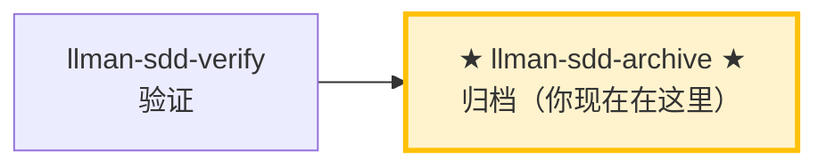

# LLMAN SDD 归档

使用此 skill 归档已完成的变更。前置：verify 全绿，且变更已 Branch binding、Specs landing 完成（或 `needs_specs_change: false`；归档时 live specs 已在绑定分支上）。`change finalize` **自动合并**到基准分支（目标：`--into` > 绑定 `base_branch` > 默认分支；方式：`--method` > 配置 `sdd.merge_method`，squash 缺省——feature diff + 改名收敛为目标分支单个 commit）、**将** change 文档改名到 `changes/archive/`，然后**自动提交** `archive(sdd): <change-id>`（实现 diff + 改名一次提交；`--no-commit` 跳过）。`change checkpoint` 已移除（无存档点概念：中途不必存档，`change finalize` 不要求干净树）。`git push` / Hosting PR 仅为可选。

## Pipeline 位置



> 📍 你现在在归档阶段：Git-native 生命周期的最后一站。
> 📎 若 specs 逐渐膨胀，可运行 `llman-sdd-specs-compact` 压缩。

## 硬约束

- **必须先通过 verify 阶段全绿**：未通过验证的 change 禁止归档。
- **须已 Branch binding**：`change start` / `attach` 已完成；无绑定则 STOP。
- **SSOT 校验**：每个 change 归档前必须通过 `llman-sdd validate <id> --strict --no-interactive`。
- **不要问「要不要继续」**：批量归档时间线上一路执行到底，除非遇到无法自动解决的错误。
- **收尾不默认导向 PR/push**：archive/finalize 后由 CLI 处理本地合并（squash 缺省），再一次性 `git commit` 提交收口。`git push` / Hosting PR 仅为可选——仅当用户或项目明确要求远程审查时才做。**Agent MUST NOT** 因本 skill 默认执行 push 或创建 PR。

## 步骤

### 0) Preflight
- `git status --porcelain`：确认工作区改动属于已完成的 change。
- 若有未预期改动，先处理（stash 或报告）。

### 1) 确认目标变更
- 确定目标 ID：单个或批量（来自用户输入或 `llman-sdd list --json`）。
- 始终说明："归档 IDs：<id1>, <id2>, ..."。
- 确认每个 change 都已通过 verify 阶段的全绿验证。

### 2) 逐个归档
- **人审检查点（每个 id 归档执行前，含批量）**：运行 `llman-sdd review --capability <id>`。退出码为零 → 继续；非零 = CRITICAL 发现：STOP 修复后重跑；MUST NOT 带着 CRITICAL 归档。
- 先逐个校验：`llman-sdd validate <id> --strict --no-interactive`。
- 校验失败 → STOP 并报告；不要跳过校验强行归档。
- 可选预览：`llman-sdd change archive <id> --dry-run`。
- 执行归档：
  - 默认：`llman-sdd change archive <id>`
  - 仅工具类变更：`llman-sdd change archive <id> --skip-specs`
  - **任一失败立即停止**，报告剩余未处理 ID。
- **Git-native 收尾**：
  - 前置：已 Branch binding（`change start` / `attach`）；仍在绑定分支上（或合并后已在目标分支）。
  - `change archive` / `change finalize` **先自动合并**（目标 `--into` > 绑定 `base_branch` > 默认分支；方式 squash 缺省或 `ff`；目标被其他 worktree 持有时跳过并打印手动命令），**再**将 change 文档改名到 `changes/archive/`——合并失败也不会回滚改名，降级提示显式可见。
  - specs 下遗留 `*.feature.delta.toon` 或 `spec.toon` 均为迁移阻断项——跑 `llman-sdd project migrate --kind toon2features`。
  - **默认：`change finalize`（单命令收口）**——门禁 → 自动合并 → 文档改名 → **自动提交** `archive(sdd): <change-id>`（squash 缺省：实现 diff + 改名收敛为目标分支**单个**提交；无需手动 `git commit`；锁定规则改动为报告制 WARNING——只警告不阻断）：
    ```text
    1. 实现 live specs + 代码（工作区可保持脏；分支上提交自由——分段或完全不提交）
    2. llman-sdd change finalize <id>    # 门禁 + 合并（squash 缺省）+ 改名 + 自动提交
    3. 可选：git commit --amend          # 调整提交说明；git branch -D <feature>  # squash 后分支不再是祖先，-d 会被 git 拒绝
    ```
    `--no-commit` 跳过自动提交（CI / pre-commit hook 冲突）：finalize 此时留脏工作区并打印手动 `git commit` 命令。幂等重试：自动提交失败后重跑会识别已归档改名并补提交。
  - **Fallback：普通 `change archive <id>`**——同样的合并 + 改名，无自动提交；要求干净树。`checkpointed`/`checkpoint_sha` 字段已随 checkpoint 一同移除（无存档点概念：`change finalize` 不要求干净树）——无需预写任何存档字段，快照审查用 `change diff`。

### 3) 全量校验
- 全部归档完成后执行：`llman-sdd validate --all --strict --no-interactive`。
- 确认归档后的 specs 工件一致。

### 4) Commit 引导
- finalize 已自动提交（`archive(sdd): <id>`）；使用 `--no-commit` 时手动提交：`git add -A && git commit -m "archive(sdd): <id1>, <id2>"`（或本 skill 建议的格式）。
- 可选：合并后 `git branch -D <feature>`（squash 后分支不再是 main 祖先，-d 会被拒绝）。push / Hosting PR 仅在用户或项目明确要求远程审查时才做。
- **破坏性合约变更**（移除/重命名 frontmatter 字段、命令、tag 或 stage 值域）MUST 提供 `migrations/v<from>-v<to>/` 升级路径（README prompt + 一次性脚本，随仓库发布）——收口前确认它存在。
- **archived `depends_on`**：archive 会把 change 目录改名为 `archive/YYYY-MM-DD-<id>`，但 validate 会把指向 archived/frozen id 的 `depends_on` 识别为 INFO（非 ERROR），所以**归档后无需**手动更新其它 change 的 `depends_on` frontmatter。

> 💡 上一阶段 `llman-sdd-verify`（验证通过）→ 本阶段归档后闭环结束。若 specs 逐渐膨胀，可运行 `llman-sdd-specs-compact` 压缩。

## Archive 冷备引导
- 当 archive 目录增长过大时，使用冷备维护：
  - 预览冻结候选：`llman-sdd archive freeze --dry-run`
  - 冻结旧归档：`llman-sdd archive freeze --before <YYYY-MM-DD> --keep-recent <N>`
  - 需要恢复时：`llman-sdd archive thaw --change <YYYY-MM-DD-id>`
- freeze/thaw 仅用于日期归档目录（`YYYY-MM-DD-*`）；建议保留少量最近目录不冻结。

> 命令细节用 `llman-sdd <cmd> --help` 查看；命令参考以 CLI 为准，skill 不内嵌命令表。
> 文中「规约」= 本项目 `llmanspec/specs/` 下的 `.feature` 文件；用 `llman-sdd list --specs` / `llman-sdd show <capability>` 查全文。

校验修复（单轨 feature-as-spec）：

1）缺少头注释（`missing # capability: header comment`）：
每个 capability `.feature`（`llmanspec/specs/<capability>.feature` 或 `llmanspec/specs/<capability>/<capability>.feature`）必须以以下注释开头：
```
# language: zh-CN
# capability: <capability>
# purpose: 一句话概述
# scope: src/
```

2）tag 语法（`@human constraint scenario must carry an @req:<req_id> tag` / `orphan acceptance scenario`）：
- 规则：`@req:<id> @human` —— statement 放场景描述（须含 MUST/SHALL）。
- 验收：`@executable` 且至少一个 `@req:<id>` 挂到规则。
- `@manual` 须与 `@human` 同用；禁止 `@human` 与 `@executable` 同场景。

3）遗留 `spec.toon`（`legacy spec.toon found ... run ... toon2features`）：
运行 `llman-sdd project migrate --kind toon2features --yes`，审阅 diff 后提交。

Git-native 护栏：
- **Branch binding** → **Specs landing**：先 `change start` / `attach`，再在绑定的非默认分支编辑 live `.feature` 并 commit。
- 锁定规则（报告制）：改/删既有 `@human` 场景只出 WARNING，不阻断 validate / change finalize / change diff；报告按 `@req:<id>` 指明被改的是哪条规则。控制点：git 分支对比 + `llman-sdd review` / `change diff` 的报告浮现。旧的锁定确认元数据（frontmatter `rules_touched` / `agent_acked`、`@agent` tag、`--yes` 的确认语义）已全部删除，无别名、无兼容层。
- apply 前须 `readyToImplement=true`（或 `needs_specs_change: false`）。收尾优先 `change finalize`。
- 勿使用 `change delta` / solidify / `*.feature.delta.toon`。

## Context
- 先查状态再动手：change/spec 状态以 `llman-sdd show/list/validate` 输出为准。
- 读 spec 全文前先用 `llman-sdd context --task --paths` 定位相关 specs。

## Goal
- 本节命令达成一个可验证结果；结果路径与校验状态随报告输出。

## Constraints
- 遵守正文「硬约束/硬规则」，本节不复读。先判断变更规模选路径（triage）：行为合约变更走完整 SDD，实现层走 quick；不确定选完整 SDD（保守）。
- 改动保持最小；已知校验错误禁止强行继续。

## Workflow
- 每步以 `llman-sdd` 命令结果为事实来源；改动工件后必跑 `llman-sdd validate`。
- 命令细节见下方生成式命令参考或 `llman-sdd <cmd> --help`。

## Decision Policy
- 高影响歧义先澄清再继续；事实自己查证，只有决策问用户。

## Output Contract
- 报告先给人读摘要（结论 / 风险 / 待决策），机器细节随后。

## Ethics Governance
- `ethics.risk_level`：low——仅读写本仓库与 `llmanspec/`，无外发动作；正文另有声明时从其声明。
- `ethics.prohibited_actions`：违反正文「硬约束」的动作；未经用户明确要求的 push / PR / 外部上传。
- `ethics.required_evidence`：结论须有命令输出或文件路径佐证；门禁状态以 `llman-sdd validate` 为准。
- `ethics.refusal_contract`：门禁 CRITICAL 未清零 → 拒绝进入下一阶段；自修复达上限 → 报告 blocker。
- `ethics.escalation_policy`：改动 SDD 合约/模板或执行不可逆动作前，暂停并请用户确认。
