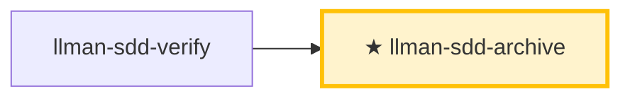

# LLMAN SDD 归档

归档已完成的变更。前置：verify 全绿，且 change 已绑定分支、specs 已落地（或 `needs_specs_change: false`）。`change finalize` **自动合并**到基准分支（目标：`--into` > 绑定 `base_branch` > 默认分支；方式：`--method` > 配置 `sdd.merge_method`，默认 squash——feature diff + 改名收敛为目标分支单个 commit）、**改名** change 文档到 `changes/archive/`、**自动提交** `archive(sdd): <change-id>`（`--no-commit` 跳过）。`git push` / PR 仅可选。

## Pipeline 位置


```mermaid
flowchart LR
    verify["llman-sdd-verify"] --> archive["★ llman-sdd-archive"]

    style archive fill:#fff3cd,stroke:#ffc107,stroke-width:3px
```

> 📍 你在归档阶段：分支生命周期最后一站。specs 膨胀时可跑 `llman-sdd-specs-compact`。

## 硬约束

- **必须先 verify 全绿**；**须已绑定分支**（`change start` / `attach`），无绑定 STOP。
- 每个 change 归档前必须通过 `llman-sdd validate <id> --strict`。
- **不要问「要不要继续」**：批量归档一路执行到底，除非遇到无法自动解决的错误。
- **收尾不默认导向 PR/push**：CLI 本地合并（默认 squash）+ 一次性收口提交。push / PR 仅在用户或项目明确要求远程审查时做——**Agent MUST NOT** 默认 push 或建 PR。

## 步骤

### 0) Preflight
- `git status --porcelain`：确认工作区改动属于已完成的 change；有未预期改动先处理（stash 或报告）。

### 1) 确认目标
- 确定 ID（单个或批量，来自用户输入或 `llman-sdd list --json`），始终说明「归档 IDs：<id1>, <id2>, ...」，并确认每个 change 都已 verify 全绿。

### 2) 逐个归档
- **人审关卡（每个 id 归档前，含批量）**：跑 `llman-sdd review`（无旗标；`--capability` 只接受 spec id）。退出码零 → 继续；非零 = CRITICAL → STOP 修复后重跑；MUST NOT 带 CRITICAL 归档。
- 先校验：`llman-sdd validate <id> --strict`；失败 → STOP 报告，禁止跳过强行归档。
- 可选预览：`llman-sdd change archive <id> --dry-run`。
- 执行：`llman-sdd change archive <id>`；**任一失败立即停止**，报告剩余 ID。
- **分支收尾**：
  - 前置：已绑定分支；仍在绑定分支上（或合并后已在目标分支）。
  - `change archive` / `change finalize` **先自动合并**（目标 `--into` > `base_branch` > 默认分支；方式默认 squash 或 `ff`；目标被其他 worktree 持有时在该 worktree 内原地执行，输出标注 `executed in target worktree <path>`；该 worktree 脏时中止报错并列出处置选项，零写入），**再**改名到 `changes/archive/`——合并失败不回滚改名，降级提示显式可见。
  - **默认 `change finalize`（单命令收口）**——门禁 → 合并 → 改名 → **自动提交** `archive(sdd): <change-id>`（无需手动 `git commit`；锁定规则改动为报告制 WARNING，只警告不阻断）：
    ```text
    1. 实现 specs + 代码（工作区可保持脏；分支上提交自由）
    2. llman-sdd change finalize <id>    # 门禁 + 合并（默认 squash）+ 改名 + 自动提交
    3. 可选：git commit --amend 调整说明；git branch -D <feature>  # squash 后分支不再是祖先，-d 会被拒
    ```
    `--no-commit` 跳过自动提交（CI / pre-commit hook 冲突）：finalize 留脏工作区并打印手动提交命令。幂等重试：自动提交失败后重跑会识别已归档改名并补提交。
  - **Fallback：`change archive <id>`**——与 finalize 同样的自动合并 + 改名 + 收口提交（此路无 `--no-commit`）；门禁：task 全勾 + 干净树 + 在绑定非默认分支（`--force` 跳过）。快照审查用 `change diff`。

### 3) 全量校验
- 全部归档后 `llman-sdd validate --all --strict`，确认 specs 工件一致。

### 4) Commit 引导
- finalize 已自动提交；`--no-commit` 时手动：`git add -A && git commit -m "archive(sdd): <id1>, <id2>"`。
- 可选：合并后 `git branch -D <feature>`。push / PR 仅在明确要求时做。
- **破坏性合约变更**（移除/重命名 frontmatter 字段、命令、tag 或 stage 值域）MUST 提供 `migrations/v<from>-v<to>/` 升级路径（README + 一次性脚本随仓库发布）——收口前确认存在。
- **archived `depends_on`**：archive 把 change 目录改名为 `archive/YYYY-MM-DD-<id>`；validate 把指向 archived/frozen id 的 `depends_on` 识别为 INFO（非 ERROR），**无需**手动更新其它 change 的 frontmatter。

## Archive 冷备引导
- archive 目录过大时用冷备维护（冻结 = 正文入 7z 冷备 + 以 `<YYYY-MM-DD>-<id>.yaml` 平铺索引卡替代目录，卡仅含 title 与 depends_on）：
  - 预览冻结候选：`llman-sdd archive freeze --dry-run`
  - 冻结旧归档：`llman-sdd archive freeze --before <YYYY-MM-DD> --keep-recent <N>`
  - 列出已冻结条目：`llman-sdd archive freeze --list`
  - 需要恢复时：`llman-sdd archive thaw --change <YYYY-MM-DD-id>`（正文解回目录并移除平铺卡）
- freeze/thaw 仅用于日期归档目录（`YYYY-MM-DD-*`）；建议保留少量最近目录不冻结。
- 平铺索引卡常驻磁盘：title（来自 proposal H1）与 depends_on（graph 依赖边种子）可 grep、可追溯；
  id 与日期由文件名隐含——冻结 change 的用途与依赖关系无需解冻即可查阅，正文在 7z 冷备按需取用。
- 在非主检出（不持有默认分支的 worktree）运行时打印警告（仅提示、不阻断）——有意为之才在该处继续。

> 命令细节用 `llman-sdd <cmd> --help` 查看；命令参考以 CLI 为准，skill 不内嵌命令表。
> 文中「规约」= 本项目 `llmanspec/specs/` 下的 `.feature` 文件；用 `llman-sdd list --specs` / `llman-sdd show <capability>` 查全文。

校验修复（单轨 feature-as-spec）：

1）缺头注释（`missing # capability: header comment`）：每个 capability `.feature`（`llmanspec/specs/<capability>.feature` 或目录内同名主文件）必须以下列注释开头：
```
# language: zh-CN
# capability: <capability>
# purpose: 一句话概述
# scope: src/
```

2）原生分层格式（`rule must carry an @req:<req_id> tag on the rule header`）：
- 规范样式只有一种：`@req:<id>` 挂在 `规则:` 块头标签,块内嵌套 `场景:`(假如/当/那么)是可执行示例——默认首选。
- 仅当需求无法程序化表达或暂不转写时才保留无嵌套场景的 `规则:`(裸规则):描述自由文本,无 MUST/SHALL 强制;validate 以聚合计数提示,review `pending` 信号计量,specs-compact 负责压降。
- 历史标签 `@executable`/`@rule`/`@human`/`@manual` 不再使用、解析惰性;旧文件报结构问题时运行 `llman-sdd spec migrate-native` 迁移。
- 不在任何 `规则:` 内的顶层 `场景:` 是功能级示例:无规则句柄、不告警、不参与规则统计(Gherkin 原生语义)。

分支护栏：
- 先 `change start` / `attach` 绑定分支，再在绑定的非默认分支编辑 `.feature` 并 commit（落地 specs）。
- 锁定规则（报告制）：改/删既有 `规则:` 块只出 WARNING，不阻断 validate / finalize / `change diff`；报告按 `@req:<id>` 指明被改规则。控制点：git 分支对比 + `llman-sdd review` / `change diff`。旧锁定确认元数据（frontmatter `rules_touched` / `agent_acked`、`@agent` tag、`--yes` 确认语义）已全部删除，无别名无兼容层。
- `stage=full` 且 specs-landed 门通过（specsLanded ∨ `needs_specs_change: false`）即可进 apply；verify/finalize 须 `readyToImplement=true`（完成信号）。收口优先 `change finalize`。

## Context
- 先查状态再动手：change/spec 状态以 `llman-sdd show/list/validate` 输出为准；读 spec 全文前先用 `llman-sdd context --task --paths` 定位。

## Goal
- 达成一个可验证结果；报告附结果路径与校验状态。

## Constraints
- 遵守正文硬约束（不复读）。先判断规模选路径：合约变更走完整 SDD，实现层走 quick；不确定选完整 SDD。改动最小；已知校验错误禁止强行继续。

## Workflow
- 每步以 `llman-sdd` 命令结果为事实来源；改动工件后必跑 `llman-sdd validate`；命令细节见 `llman-sdd <cmd> --help`。

## Decision Policy
- 高影响歧义先澄清再继续；事实自己查证，只有决策问用户。

## Output Contract
- 先给人读摘要（结论 / 风险 / 待决策），机器细节随后。

## Ethics Governance
- `ethics.risk_level`：low——仅读写本仓库与 `llmanspec/`，无外发动作；正文另有声明时从其声明。
- `ethics.prohibited_actions`：违反正文「硬约束」的动作；未经用户明确要求的 push / PR / 外部上传。
- `ethics.required_evidence`：结论须有命令输出或文件路径佐证；门禁状态以 `llman-sdd validate` 为准。
- `ethics.refusal_contract`：门禁 CRITICAL 未清零 → 拒绝进入下一阶段；自修复达上限 → 报告 blocker。
- `ethics.escalation_policy`：改动 SDD 合约/模板或执行不可逆动作前，暂停并请用户确认。
