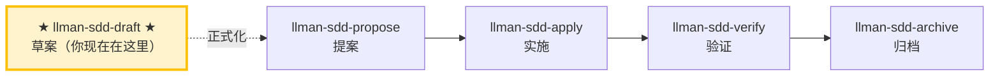

# LLMAN SDD 草案（Draft）

把一个 change 想法记成**草案提案**（仅 `proposal.md` skeleton）。这是「先把 idea / 未来需求记下来」的轻量入口——不做 triage、不写 tasks、不编辑 live specs、不 attach。等想法准备好落实时，用 `llman-sdd-propose` 正式化。

## Pipeline 位置



> 📍 你现在在草案阶段 → 下一步：完善 `proposal.md`，然后运行 `llman-sdd-propose` 正式化
> 📎 本技能创建**草案** change（仅 proposal.md）。完整提案走 Git-native：tasks → Branch binding → Specs landing（见 propose 的生命周期图）
> 🗺️ Skill 导航 ≠ Git-native 生命周期；Branch binding / Specs landing 不是独立 skill

## 硬约束

- **MUST NOT 询问用户 change id**：由 `change new --from` 从描述推导并告知用户。
- **MUST NOT 创建 tasks/design/specs/attach**：本技能仅创建 `proposal.md` 草案壳。完整规划工件属于 `llman-sdd-propose`。
- **MUST NOT 做 triage 或判断变更规模**：那是 propose 的职责。若用户想开始实现，建议 `llman-sdd-propose`。
- **适用边界**：若描述明显涉及 MUST/SHALL 行为合约变更或多文件改动，建议用 `llman-sdd-propose` 而非停在草案——但仍先建草案壳以免想法丢失。
- **frontmatter 有固定 schema**：充实 `proposal.md` 时只接受 `llmanspec/AGENTS.md`「Change Proposal Frontmatter SSOT」中的合法字段（`depends_on`、`blocks`、`branch`、`base_sha`/`baseSha`、`checkpointed`、`checkpoint_sha`/`checkpointSha`、`skip_specs_landing`）。`status`/`title`/`priority`/`author` 等会被 `llman sdd validate` 报 ERROR 拒绝。生命周期阶段是推断量——用 `llman sdd status`/`show` 查看，绝不写进 frontmatter。正文 MUST NOT 复读 frontmatter 字段（不要 `## Status` 段）；正文 H1 用人类可读标题，不要复读 change id。

## 步骤

### 0) Preflight
- 读取 `llmanspec/config.yaml` 了解项目上下文、规则、locale。
- 必须存在 `llmanspec/`；若不存在，提示先运行 `llman sdd init`，然后 STOP。

### 1) 捕获描述
- 直接采用用户的描述（如「draft: 加一个导出 json 的命令」「记一下: sdd change 应该支持 worktree」）。
- **MUST NOT 询问 change id。** 由描述推导。

### 2) 创建草案壳
```bash
llman sdd change new --from "<用户描述>"
```
- CLI 会生成合法的 kebab-case id（清洗 + 校验），在 `llmanspec/changes/<生成的 id>/` 下创建 `proposal.md`（含 `## Why` / `## What Changes` TODO 段的 skeleton），并打印最终 id 与路径。
- 若生成的 id 与既有 change 冲突，CLI 以非零退出码失败；建议改写描述或用 `--force` 覆盖（对草案很罕见）。

### 3) 告知并交接
- **MUST 告知用户已生成的 id**（例如「已创建草案 change `<id>`，路径 `llmanspec/changes/<id>/proposal.md`」）。
- 建议下一步：
  - 现在或稍后完善 `proposal.md`（Why / What Changes / Capabilities / Impact）。
  - 准备好落实时，运行 `llman-sdd-propose` 正式化（triage + tasks → `change start`/`attach` → Specs landing）。

> 💡 草案已记 → 下一步：编辑 `proposal.md`，然后 `llman-sdd-propose` 正式化。

行动前先阅读 `llmanspec/config.yaml`，并遵循其中的 `context` 与 `rules`（若有）。

常用命令：
- `llman sdd context --task "<描述>" --paths "<文件>"`（找相关 specs）。使用 pageindex agentic tree 后端（需 `LLMAN_SDD_INDEX_CHAT_MODEL`）。可用 `LLMAN_SDD_INDEX_BACKEND` 预设。
- `llman sdd list`（列出变更）
- `llman sdd list --specs`（列出 specs 及 purpose/scope 元数据）
- `llman sdd show <id>`（展示 change/spec；`--type change --output json` 含 `stage` / `specsLanded` / `skipSpecsLanding` / `readyToImplement`——apply 门禁看 `readyToImplement`，勿凭「完整工件」）
- `llman sdd validate <id>`（校验 change 或 spec）
- `llman sdd validate --all`（批量校验）
- `llman sdd index rebuild`（重建 pageindex 树索引——不需要模型）
- `llman sdd index check`（检查索引新鲜度）
- `llman sdd change new <id>`（仅创建规划壳草稿 `changes/<id>/proposal.md`；不写 live specs）
- `llman sdd change start <id> [--worktree]`（Designed→Full：干净树且在默认分支 → 创建 `sdd/<id>` 分支 + attach；仅 Branch binding，不等于 Specs landing，不等于可 apply）
- `llman sdd change attach <id> [--force]`（绑定已有非默认 feature 分支 + base SHA；拒绝绑到默认分支）
- `llman sdd change finalize <id> [--no-check]`（**推荐单 commit 收尾**——verify 之后；不要求干净树；门禁 + 自动 ff-merge + 文档改名）
- `llman sdd change checkpoint <id> [--no-check]`（干净工作区 + 归档前门禁；严格 sha = HEAD；finalize 的 fallback）
- `llman sdd change diff <id> [--export-patch <path>]`（只读 `base...HEAD` 审查/导出）
- `llman sdd change archive <id>`（封存：自动 ff-merge 到默认分支，再改名到 `changes/archive/`；单 commit 收尾优先 `finalize`）
- `llman sdd archive freeze [--before YYYY-MM-DD] [--keep-recent N] [--dry-run]`（冻结已归档目录）
- `llman sdd archive thaw [--change <id> ...] [--dest <path>]`（从冷备份恢复）
- `llman sdd graph [CHANGE] [--format mermaid] [--scope active|archived|all] [--depth N]`（生成变更依赖图）
- `llman sdd project migrate --kind spec-md2toon`（`.md`+fence → 独立 `.toon`；`partitioned` 已移除）

## Ethics Governance
- `ethics.risk_level`：按 `low|medium|high|critical` 标注风险等级。
- `ethics.prohibited_actions`：列出绝对禁止执行的动作。
- `ethics.required_evidence`：列出高影响输出前必须具备的证据。
- `ethics.refusal_contract`：定义何时拒答以及安全替代响应方式。
- `ethics.escalation_policy`：定义何时必须升级为用户确认/人工复核。
