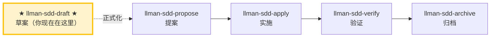

# LLMAN SDD 草案（Draft）

把一个 change 想法记成**草案提案**（仅 `proposal.md` skeleton）。这是「先把 idea / 未来需求记下来」的轻量入口——不做 triage、不写 tasks、不编辑 live specs、不 attach。等想法准备好落实时，用 `llman-sdd-propose` 正式化。

## Pipeline 位置



> 📍 你现在在草案阶段 → 下一步：完善 `proposal.md`，然后运行 `llman-sdd-propose` 正式化
> 📎 本技能创建**草案** change（仅 proposal.md）。完整提案走 Git-native：tasks → Branch binding → Specs landing（见 propose 的生命周期图）
> 🗺️ Skill 导航 ≠ Git-native 生命周期；Branch binding / Specs landing 不是独立 skill

## 硬约束

- **MUST NOT 询问用户 change id**：由 `change new --from` 从描述推导并告知用户。
- **MUST NOT 创建 tasks/design/specs/attach**：本技能仅创建 `proposal.md` 草案壳。完整规划工件属于 `llman-sdd-propose`。
- **MUST NOT 做 triage 或判断变更规模**：那是 propose 的职责。若用户想开始实现，建议 `llman-sdd-propose`。
- **适用边界**：若描述明显涉及 MUST/SHALL 行为合约变更或多文件改动，建议用 `llman-sdd-propose` 而非停在草案——但仍先建草案壳以免想法丢失。
- **frontmatter 有固定 schema**：充实 `proposal.md` 时只接受 `llmanspec/AGENTS.md`「Change Proposal Frontmatter SSOT」中的合法字段（`depends_on`、`blocks`、`branch`、`base_sha`/`baseSha`、`checkpointed`、`checkpoint_sha`/`checkpointSha`、`skip_specs_landing`）。`status`/`title`/`priority`/`author` 等会被 `llman sdd validate` 报 ERROR 拒绝。生命周期阶段是推断量——用 `llman sdd show`/`list` 查看，绝不写进 frontmatter。正文 MUST NOT 复读 frontmatter 字段（不要 `## Status` 段）；正文 H1 用人类可读标题，不要复读 change id。

## 步骤

### 0) Preflight
- 读取 `llmanspec/config.yaml` 了解项目上下文、规则、locale。
- 必须存在 `llmanspec/`；若不存在，提示先运行 `llman sdd init`，然后 STOP。

### 1) 捕获描述
- 直接采用用户的描述（如「draft: 加一个导出 json 的命令」「记一下: sdd change 应该支持 worktree」）。
- **MUST NOT 询问 change id。** 由描述推导。

### 2) 创建草案壳
```bash
llman sdd change new --from "<用户描述>"
```
- CLI 会生成合法的 kebab-case id（清洗 + 校验），在 `llmanspec/changes/<生成的 id>/` 下创建 `proposal.md`（含 `## Why` / `## What Changes` TODO 段的 skeleton），并打印最终 id 与路径。
- 若生成的 id 与既有 change 冲突，CLI 以非零退出码失败；建议改写描述或用 `--force` 覆盖（对草案很罕见）。

### 3) 告知并交接
- **MUST 告知用户已生成的 id**（例如「已创建草案 change `<id>`，路径 `llmanspec/changes/<id>/proposal.md`」）。
- 建议下一步：
  - 现在或稍后完善 `proposal.md`（Why / What Changes / Capabilities / Impact）。
  - 准备好落实时，运行 `llman-sdd-propose` 正式化（triage + tasks → `change start`/`attach` → Specs landing）。

> 💡 草案已记 → 下一步：编辑 `proposal.md`，然后 `llman-sdd-propose` 正式化。

> 命令细节用 `llman sdd <cmd> --help` 查看；命令参考以 CLI 为准，skill 不内嵌命令表（r139）。

## Ethics Governance
- `ethics.risk_level`：low——仅读写本仓库与 `llmanspec/`，无外发动作；正文另有声明时从其声明。
- `ethics.prohibited_actions`：违反正文「硬约束」的动作；未经用户明确要求的 push / PR / 外部上传。
- `ethics.required_evidence`：结论须有命令输出或文件路径佐证；门禁状态以 `llman sdd validate` 为准。
- `ethics.refusal_contract`：门禁 CRITICAL 未清零 → 拒绝进入下一阶段；自修复达上限 → 报告 blocker。
- `ethics.escalation_policy`：改动 SDD 合约/模板或执行不可逆动作前，暂停并请用户确认。
