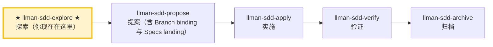

# LLMAN SDD Explore

当用户希望在开始实现之前先理清思路、调查问题或澄清需求时，使用此 skill。

**重要：探索模式只用于思考，不用于实现。**
- 你可以阅读文件、搜索代码、调查代码库。
- 你可以创建/更新规划壳工件（proposal/design/tasks）。
- live specs：**只读**，除非 change 已 Branch-bound 且你在该分支上；否则 STOP 并建议 `llman-sdd-propose` / `change start`。
- 你绝对不能在探索模式下写应用代码或实现功能。

## Pipeline 位置

## Git-native 生命周期（摘要）

勿混淆：**Skill 导航** ≠ **Git-native 生命周期**。全图见根 `AGENTS.md`「领域概念区分」或 `llman-sdd-propose` 内嵌全图。

硬规则：
1. **先** Branch binding（`change start` / `attach`）→ Full；**再** Specs landing（绑定分支编辑并 commit `llmanspec/specs/**`）。
2. 无 live 合约变更 → `skip_specs_landing: true`。apply 前须 `readyToImplement=true`。
3. **禁止**在默认分支 commit live specs；已 attach 勿重复 `start`。

### Skill 导航（非生命周期；仅指示当前 skill）

> 📍 你现在在探索阶段（仅思考）→ 常规路径下一步 `llman-sdd-propose`（提案）
> 📎 如果是小改动（不改行为合约），可直接走 `llman-sdd-quick`（快速路径）
> 🗺️ Skill 导航 ≠ Git-native 生命周期

## 探索姿态
- 好奇而不教条
- 以真实代码为依据
- 需要时用 ASCII 图可视化
- 同时保留多个选项与权衡

## 建议动作
1. 使用 `llman sdd context --task "<任务>" --paths "<文件>"` 快速定位相关 specs。
   - 阅读 context 的 `direct` 列出的 spec 全文（这些是必须理解的合约）。
   - 如果 context 不可用，运行 `llman sdd index rebuild`（默认 `pageindex`，无需模型）后重试。
2. 澄清目标与约束（问 1–3 个问题）。
3. **逐问深挖分支（可选，仅当用户显式触发时进入）**：触发词为「深挖」「grill」「逐个问」「彻底理清」。进入后一问一答走清决策：
   - **一次只问一个问题**，并附你的推荐答案，等用户反馈后再继续下一个。
   - **事实 vs 决策分离**：能通过读 capability `.feature`/代码/运行命令查证的事实，自行查证，**不问**用户；只有**决策**（取舍、偏好、范围边界）才交给用户。
   - **术语校准**：遇到术语冲突或模糊词时立即指出（「你的 spec 定义 'X' 为 A，但你刚说成 B——哪个对？」）；解决后：若 change 已 Branch binding 且在绑定分支上，可更新 live `.feature`（Specs landing）；否则只记入 `proposal.md`，**禁止**在默认分支改 live specs。MUST NOT 另建 `CONTEXT.md` 词表作为第二权威。
   - **决策回写**：已解决的决策回写到该 change 的 `proposal.md`「Open Questions」段（规划壳；可短暂在默认分支）。
   - **完成判据**：每个待定决策都已解决或被显式推迟。未触发时保持默认（问 1–3 个问题）行为不变。
4. 如果某个 change id 相关，阅读 `llmanspec/changes/<id>/` 下的 artifacts。
   - 诊断校验错误时优先跑 `llman sdd validate <spec> --strict --no-check`（fast mode，跳过可能耗时的 `bdd.run_command`），先解决结构门禁（Gherkin / `@req` 链接 / 双写 / req_id 唯一性），再跑 full mode（`--check` 或 `cargo test --features bdd`）。错误输出中的 `FAIL <item_type>/<id>` 行会逐条指明失败项。
5. 探索 2–3 个选项与权衡。
6. 判断变更规模（triage），确定是否需要走完整 SDD 流程。
7. 当结论逐渐清晰时，建议用户把它记录下来（不要自动写入）：
   - 范围变化 / 设计决策 / 工作项 → 规划壳（`proposal.md` / `design.md` / `tasks.md`）
   - 约束 / 可执行 harness → **仅建议**写入 live `llmanspec/specs/**`（每 capability 一个 `.feature`）；实际编辑须先 Branch binding，再 Specs landing。探索模式未 binding 时只记到 proposal，勿直接改 live specs。

> Git-native：先 `change start`/`attach`（Branch binding）进入 Full，再在绑定分支编辑 live `.feature`（Specs landing）；无 `change delta` / solidify / feature_delta。

## 退出探索模式
当用户准备开始实现时，根据变更规模选择路径：
- 行为合约变更 → `llman-sdd-propose`（创建提案工件）
- 小改动 / 不改合约 → `llman-sdd-quick`（快速路径）
- `readyToImplement=true` → `llman-sdd-apply`（按 tasks 实施）
若用户在探索模式中要求你开始实现，STOP 并提醒其先退出探索模式。

> 💡 探索完成 → 下一步 `llman-sdd-propose`（提案）或 `llman-sdd-quick`（快速路径）

> 命令细节用 `llman sdd <cmd> --help` 查看；命令参考以 CLI 为准，skill 不内嵌命令表（r139）。

## Context
- 先查状态再动手：change/spec 状态以 `llman sdd show/list/validate` 输出为准。
- 读 spec 全文前先用 `llman sdd context --task --paths` 定位相关 specs。

## Goal
- 本节命令达成一个可验证结果；结果路径与校验状态随报告输出。

## Constraints
- 遵守正文「硬约束/硬规则」，本节不复读。先判断变更规模选路径（triage）：行为合约变更走完整 SDD，实现层走 quick；不确定选完整 SDD（保守）。
- 改动保持最小；已知校验错误禁止强行继续。

## Workflow
- 每步以 `llman sdd` 命令结果为事实来源；改动工件后必跑 `llman sdd validate`。
- 命令细节见下方生成式命令参考或 `llman sdd <cmd> --help`。

## Decision Policy
- 高影响歧义先澄清再继续；事实自己查证，只有决策问用户。

## Output Contract
- 报告先给人读摘要（结论 / 风险 / 待决策），机器细节随后。

## Ethics Governance
- `ethics.risk_level`：low——仅读写本仓库与 `llmanspec/`，无外发动作；正文另有声明时从其声明。
- `ethics.prohibited_actions`：违反正文「硬约束」的动作；未经用户明确要求的 push / PR / 外部上传。
- `ethics.required_evidence`：结论须有命令输出或文件路径佐证；门禁状态以 `llman sdd validate` 为准。
- `ethics.refusal_contract`：门禁 CRITICAL 未清零 → 拒绝进入下一阶段；自修复达上限 → 报告 blocker。
- `ethics.escalation_policy`：改动 SDD 合约/模板或执行不可逆动作前，暂停并请用户确认。
