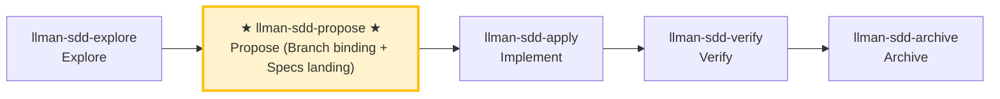

# LLMAN SDD Propose

Create a new change with planning artifacts (proposal + tasks; design optional), **first** `change start` (or `attach`) for Branch binding, **then** edit live `llmanspec/specs/<capability>/*.feature` on the bound branch (Specs landing), validate, and suggest next actions.

## Pipeline Position

## Git-native 生命周期（权威全图）

勿混淆两层：**Git-native 生命周期**（Branch binding → Specs landing → `readyToImplement`）与 **Skill 导航**（explore→propose→apply→verify→archive）。Specs landing **不是**独立 skill。


硬规则：
1. **先** `change start` / `attach`（Branch binding / 分支绑定）进入 Full；**再**在绑定的非默认分支编辑 `llmanspec/specs/**` 并 commit（Specs landing / 合约落地）。
2. 无 live 合约变更时可设 frontmatter `skip_specs_landing: true`。进入 apply 前 `llman sdd show <id> --json` 的 `readyToImplement` 须为 true（`Full ∧ (specsLanded ∨ skip)`）。
3. **禁止**为过干净树门禁把 live specs commit 到默认分支；已 attach 时不要重复 `start`。

### Skill navigation (not the lifecycle; shows current skill only)



> 📍 You are in propose: Git-native path above is **Designed → Branch binding → Specs landing** (until `readyToImplement=true`) → next: `llman-sdd-apply`
> 📎 For small changes (no behavioral contract changes), use `llman-sdd-quick` (quick path)

## Hard Constraints

- **Must confirm change id with user before writing files**: change boundaries must stay clear. **Exception**: when the user wants to quickly capture an idea (draft only, no id needed), route them to `llman-sdd-draft` instead of running full propose.
- **Live specs are SSOT**: edit `llmanspec/specs/**` only **after** Branch binding, on the **bound non-default branch** (Specs landing). **Do not** edit live specs on the default branch; **do not** author under `changes/<id>/specs/` or use `change delta` (removed). The planning shell may briefly live on the default branch.
- **Don't ask "should I continue?"**: execute the full propose phase in one pass, generate artifacts and validate.

- **If change already exists**: STOP. If `readyToImplement=true`, suggest `llman-sdd-apply`; otherwise finish the planning shell / Branch binding / Specs landing (edit `llmanspec/changes/<id>/`, or enable `extra_skills: [llman-sdd-continue]`).

- **Frontmatter has a fixed schema**: when fleshing out `proposal.md`, only the allowed fields in `llmanspec/AGENTS.md` "Change Proposal Frontmatter SSOT" are accepted (including `depends_on`, `blocks`, `branch`, `base_sha`/`baseSha`, `checkpointed`, `checkpoint_sha`/`checkpointSha`, `skip_specs_landing`). `status`/`title`/`priority`/`author` etc. are rejected by `llman sdd validate` as ERROR; lifecycle stage is inferred (query via `llman sdd status`/`show`), never stored in frontmatter. Do not re-declare frontmatter fields in the prose body; the body H1 is a human-readable title, not a repeat of the change id.

## Quick-capture routing

If the user just wants to **capture an idea** (e.g. "draft a proposal", "note down X", "remember to do Y later") without full planning, route them to the `llman-sdd-draft` skill — it creates a `proposal.md`-only draft shell via `change new --from` (no id asked, no tasks/specs/attach). Full propose (triage + tasks → `change start`/`attach` → Specs landing) starts here.

## Steps

### 0) Preflight
- Read `llmanspec/config.yaml` for project context, rules, locale.
- `llman sdd validate --all --strict --no-interactive`: ensure current artifacts are clean.
  - If pre-existing errors, stop and report (stacking new changes on dirty artifacts causes cascading errors).
- **Check spec valid_scope integrity**: use `llman sdd list --specs --json` to list all specs, then for each spec verify every path in its `valid_scope` exists on disk. If any scope file/directory is missing, stop and suggest updating the spec (remove the deleted path from `valid_scope`).

### 1) Assess change scale (triage)
   - **Behavioral contract change** (modify MUST/SHALL, change external behavior) → full SDD workflow
   - **Implementation change** (refactor, typo, perf) → quick path via `llman-sdd-quick`
   - **Meta-spec change** (SDD templates/process) → full SDD workflow
   - When uncertain, choose full SDD (conservative).
2. Use `llman sdd context --task "<goal>" --paths "<scope>"` to find relevant specs.
   - If context unavailable, rebuild with `llman sdd index rebuild` (default `pageindex`, no model needed) and continue.
3. Gather input:
   - A short description of the change
   - A change id (or derive one; kebab-case, verb prefix: `add-`, `update-`, `remove-`, `refactor-`)
   - The impacted capability/capabilities (to name `specs/<capability>/`)
   - Confirm the final id before writing files

### 2) Ensure project is initialized:
   - `llmanspec/` must exist; if missing, tell the user to run `llman sdd init`, then STOP.

### 3) Create change directory and artifacts
   - Prefer `llman sdd change new <change-id>` for the draft `proposal.md` shell (or create `llmanspec/changes/<change-id>/` manually).

   - If the change already exists, STOP and suggest filling missing artifacts or `llman-sdd-apply` (optionally enable continue via `extra_skills`).

   - Flesh out `proposal.md` (Why / What Changes / Capabilities / Impact)
   - `design.md` only when tradeoffs/migrations matter
   - **Confirm seams before writing tasks.md**: list the seams to be tested and confirm with the user. A seam = the public boundary driven by `*.feature` GWT steps (CLI subprocess or public interface) — MUST reuse existing harness seams, MUST NOT invent seams detached from `.feature`. Without `.feature`, seam = the CLI subcommand or public function boundary under test.
   - `tasks.md`: split into **vertical slices** (each task cuts a narrow but complete path through schema→API→UI→tests, independently verifiable), with `[blocked-by: <task-id>]` dependency markers. **Wide-refactor exception** (one mechanical change sweeping the codebase, single edit breaks many call sites): sequence as expand-contract (add new beside old → migrate call sites in batches → delete old), don't force into a vertical slice.
   - **First** `llman sdd change start <change-id>` (recommended; clean tree on the default branch) or manually create a branch then `change attach <change-id>` to reach Full (bound).
   - **Then** edit live `llmanspec/specs/<capability>/<capability>.feature` on the bound non-default branch and commit (Specs landing). **Do not** edit live specs before start; **do not** commit live specs to the default branch just to satisfy the clean-tree gate. If already attached, do not re-run `start` (recover lost specs by checkout/recreate + `attach --force` if needed).
   - For changes with no live contract edits, set frontmatter `skip_specs_landing: true`. Enter apply only when `llman sdd show <id> --json` has `readyToImplement=true`.

### 4) Validate:
   ```bash
   llman sdd validate <change-id> --strict --no-interactive
   ```
   This MUST pass before proceeding. If TOON parse errors appear, fix quoting:
   values containing commas/colons/brackets must be double-quoted in tabular rows.

### 4a) Optional BDD runner (`bdd:` block)
- Read `llmanspec/config.yaml`. Is there a `bdd:` block?
  - **Yes**: `validate --check` runs the harness; authoring follows 4b regardless.
  - **No**: if this change involves executable behavior scenarios (Given/When/Then the user will want to run), ask **once, up front**: "This change looks like it has executable behavior. Enable a `bdd:` runner block so scenarios can be validated as `.feature` files? (adds a `bdd:` block to `config.yaml` — runner only, does not change the lifecycle.)"
    - If **yes**: show the exact `bdd:` block to add (pick a `run_command` matching the project's test framework — `cargo test --features bdd` for rstest-bdd, `pytest {feature_dir} -k {feature_name} -v` for pytest-bdd). Let the user confirm or edit it, write it to `config.yaml`, then proceed with 4b rules.
    - If **no**: features still validate structurally; only runner execution is skipped.
- **Do NOT silently add the `bdd:` block** — always ask first. Adding it changes how `validate --check` behaves project-wide.

### 4b) Single-track feature authoring
- Planning shell (proposal/design/tasks) may briefly live on the default branch; **do not** edit live `llmanspec/specs/**` on the default branch. After Branch binding, Specs landing and implementation happen on the bound branch.
- **Single-track**: each capability is ONE `<capability>.feature`. Constraint rules are `@req:<id> @human` scenarios (statement verbatim in the description); executable acceptance scenarios carry `@executable` and link back via `@req:<req_id>`. Never nest scenarios in `Rule:` blocks (the runner skips them).
- Change shell: `llman sdd change new <change-id>` → fill proposal/design/tasks → `llman sdd change start <change-id>` (or `change attach`) → **then** edit live specs on the bound branch and commit (Specs landing).
- Do **not** use `change delta` / solidify / `*.feature.delta.toon`; if an active `*.feature.delta.toon` or a legacy `spec.toon` exists, run `llman sdd project migrate --kind toon2features` first.

### 5) Summarize and suggest next step:
   - Enter implementation phase: `llman-sdd-apply`.
   - If you need to think more: `llman-sdd-explore`.

> 💡 Proposal done → next: `llman-sdd-apply` (implement)

行动前先阅读 `llmanspec/config.yaml`，并遵循其中的 `context` 与 `rules`（若有）。

常用命令：
- `llman sdd context --task "<描述>" --paths "<文件>"`（找相关 specs）。使用 pageindex agentic tree 后端（需 `LLMAN_SDD_INDEX_CHAT_MODEL`）。可用 `LLMAN_SDD_INDEX_BACKEND` 预设。
- `llman sdd list`（列出变更）
- `llman sdd list --specs`（列出 specs 及 purpose/scope 元数据）
- `llman sdd show <id>`（展示 change/spec；`--type change --output json` 含 `stage` / `specsLanded` / `skipSpecsLanding` / `readyToImplement`——apply 门禁看 `readyToImplement`，勿凭「完整工件」）
- `llman sdd validate <id>`（校验 change 或 spec）
- `llman sdd validate --all`（批量校验）
- `llman sdd index rebuild`（重建 pageindex 树索引——不需要模型）
- `llman sdd index check`（检查索引新鲜度）
- `llman sdd change new <id>`（仅创建规划壳草稿 `changes/<id>/proposal.md`；不写 live specs）
- `llman sdd change start <id> [--worktree]`（Designed→Full：干净树且在默认分支 → 创建 `sdd/<id>` 分支 + attach；仅 Branch binding，不等于 Specs landing，不等于可 apply）
- `llman sdd change attach <id> [--force]`（绑定已有非默认 feature 分支 + base SHA；拒绝绑到默认分支）
- `llman sdd change finalize <id> [--no-check]`（**推荐单 commit 收尾**——verify 之后；不要求干净树；门禁 + 自动 ff-merge + 文档改名）
- `llman sdd change checkpoint <id> [--no-check]`（干净工作区 + 归档前门禁；严格 sha = HEAD；finalize 的 fallback）
- `llman sdd change diff <id> [--export-patch <path>]`（只读 `base...HEAD` 审查/导出）
- `llman sdd change archive <id>`（封存：自动 ff-merge 到默认分支，再改名到 `changes/archive/`；单 commit 收尾优先 `finalize`）
- `llman sdd archive freeze [--before YYYY-MM-DD] [--keep-recent N] [--dry-run]`（冻结已归档目录）
- `llman sdd archive thaw [--change <id> ...] [--dest <path>]`（从冷备份恢复）
- `llman sdd graph [CHANGE] [--format mermaid] [--scope active|archived|all] [--depth N]`（生成变更依赖图）
- `llman sdd project migrate --kind spec-md2toon`（`.md`+fence → 独立 `.toon`；`partitioned` 已移除）
校验修复（单轨 feature-as-spec）：

1）缺少头注释（`missing # capability: header comment`）：
每个 `llmanspec/specs/<capability>/<capability>.feature` 必须以以下注释开头：
```
# language: zh-CN
# capability: <capability>
# purpose: 一句话概述
# scope: src/
```

2）tag 语法（`@human constraint scenario must carry an @req:<req_id> tag` / `orphan acceptance scenario`）：
- 规则：`@req:<id> @human` —— statement 放场景描述（须含 MUST/SHALL）。
- 验收：`@executable` 且至少一个 `@req:<id>` 挂到规则。
- `@manual` 须与 `@human` 同用；禁止 `@human` 与 `@executable` 同场景。

3）遗留 `spec.toon`（`legacy spec.toon found ... run ... toon2features`）：
运行 `llman sdd project migrate --kind toon2features --yes`，审阅 diff 后提交。

Git-native 护栏：
- **Branch binding** → **Specs landing**：先 `change start` / `attach`，再在绑定的非默认分支编辑 live `.feature` 并 commit。
- 锁定规则：修改/删除既有 `@human` 场景会触发门禁，除非 proposal frontmatter 带 `rules_edit_acked: true`。
- apply 前须 `readyToImplement=true`（或 `skip_specs_landing`）。收尾优先 `change finalize`。
- 勿使用 `change delta` / solidify / `*.feature.delta.toon`。

## Context
- 执行前先确认当前 change/spec 状态。
- 优先使用 `llman sdd context --task --paths` 获取相关 specs，而非全量读取或猜测。

## Goal
- 明确本次命令/skill 要达成的可验证结果。

## Constraints
- 变更保持最小化且范围明确。
- 标识符或意图不明确时禁止猜测。
- 在读取 spec 全文前，先使用 `llman sdd context --task --paths` 获取相关 specs。
- 判断变更规模后选择路径：行为合约变更走完整 SDD（Branch binding → Specs landing → `readyToImplement` → apply）；实现变更走快速路径（live specs 仍须绑定分支）。
- 勿混淆 Skill 导航与 Git-native 生命周期；勿在默认分支编辑 live `llmanspec/specs/**`。

## Workflow
- 以 `llman sdd` 命令结果为事实来源。
- 涉及文件/规范变更时执行校验。
- 首选 `llman sdd context` 获取相关 specs，而非全量读取或猜测。
- 当 context 不可用时，按错误提示处理（重建 index 或降级到 `list --specs --json`）。

## Decision Policy
- 高影响歧义必须先澄清。
- 已知校验错误下禁止强行继续。

## Output Contract
- 汇总已执行动作。
- 给出结果路径与校验状态。

## Ethics Governance
- `ethics.risk_level`：按 `low|medium|high|critical` 标注风险等级。
- `ethics.prohibited_actions`：列出绝对禁止执行的动作。
- `ethics.required_evidence`：列出高影响输出前必须具备的证据。
- `ethics.refusal_contract`：定义何时拒答以及安全替代响应方式。
- `ethics.escalation_policy`：定义何时必须升级为用户确认/人工复核。
