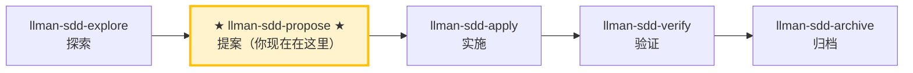

# LLMAN SDD 提案（Propose）

创建一个新变更并生成规划工件（proposal + tasks；design 可选），在 feature 分支上编辑 live `spec.toon` / `*.feature`，然后 `change start`（或 `attach`）、校验并建议下一步。

## Pipeline 位置



> 📍 你现在在提案阶段 → 下一步 `llman-sdd-apply`（实施）
> 📎 如果只是小改动（不改行为合约），可直接 `llman-sdd-quick`（快速路径）

## 硬约束

- **必须与用户确认 change id 后再写文件**：不同变更的边界不能模糊。**例外**：用户只想快速记一个想法（仅草案，不需要 id）时，引导其使用 `llman-sdd-draft` 技能，而非走完整 propose。
- **feature 分支上的 live specs 为 SSOT**：直接编辑 `llmanspec/specs/**`——**禁止**在 `changes/<id>/specs/` 下编写或使用 `change delta`（已移除）。
- **不要问「要不要继续」**：在 propose 阶段内一路执行到底，生成工件并校验。

- **若变更已存在**：STOP 并建议用户使用 `llman-sdd-apply`；若需补齐缺失 artifact，直接编辑 `llmanspec/changes/<id>/`（或启用 `extra_skills: [llman-sdd-continue]` 后使用 continue）。


## 快速记录路由

若用户只想**随手记一个想法**（如「draft 提案」「记一个提案」「先把 X 记下来」）而无需完整规划，引导其使用 `llman-sdd-draft` 技能——它通过 `change new --from` 创建仅含 `proposal.md` 的草案壳（不问 id，不写 tasks/specs/attach）。完整 propose（triage + tasks + live specs + `change start`）从这里开始。

## 步骤

### 0) Preflight
- 读取 `llmanspec/config.yaml` 了解项目上下文、规则、locale。
- `llman sdd validate --all --strict --no-interactive`：确保当前工件状态干净。
  - 若预存错误，先停下报告（在脏工件上叠加新变更会导致级联错误）。
- **检查 spec valid_scope 完整性**：使用 `llman sdd list --specs --json` 列出所有 spec，然后对每个 spec 验证其 `valid_scope` 中的每个路径是否存在于磁盘上。若存在缺失的文件/目录，停下并建议更新 spec（从 `valid_scope` 中移除已删除的路径）。

### 1) 判断变更规模（triage）
   - **行为合约变更**（改 MUST/SHALL、改外部行为）→ 走完整 SDD 流程
   - **实现变更**（重构、typo、性能）→ 建议走快速路径，用 `llman-sdd-quick`
   - **元规范变更**（改 SDD 模板/流程）→ 必须走完整 SDD 流程
   - 不确定时走完整 SDD 流程（保守选择）
2. 使用 `llman sdd context --task "<目标>" --paths "<范围>"` 获取相关 specs。
   - 如果 context 不可用，运行 `llman sdd index rebuild`（默认 `pageindex`，无需模型）后继续。
3. 收集输入：
   - 变更的简要描述
   - change id（若未给出则推导；kebab-case，动词前缀：`add-`、`update-`、`remove-`、`refactor-`）
   - 受影响的 capability/capabilities（用于命名 `specs/<capability>/`）
   - 在写入任何文件前确认最终 id

### 2) 确保项目已初始化：
   - 必须存在 `llmanspec/`；若不存在，提示先运行 `llman sdd init`，然后 STOP。

### 3) 创建变更目录与工件
   - 建议先用 `llman sdd change new <change-id>` 生成草稿 `proposal.md`（或手动创建 `llmanspec/changes/<change-id>/`）。

   - 若变更已存在，STOP 并建议补齐缺失 artifact 或改用 `llman-sdd-apply`（可选启用 `extra_skills` 中的 continue）。

   - 充实 `proposal.md`（Why / What Changes / Capabilities / Impact）
   - 仅在涉及权衡/迁移时创建 `design.md`
   - **测试边界前置确认（在写 tasks.md 之前）**：列出将测试的边界（seam）并与用户确认。seam = `*.feature` 的 GWT 步骤所驱动的公共边界（CLI 子进程或 public interface）——MUST 复用已有 harness 的边界，MUST NOT 另行发明脱离 `.feature` 的边界。无 `.feature` 时，seam 取被测的 CLI 子命令或 public 函数边界。
   - `tasks.md`：按**垂直切片**拆分（每个 task 一刀切穿 schema→API→UI→tests 的完整窄路径，且可独立验证），支持 `[blocked-by: <task-id>]` 依赖标记。**大范围机械重构例外**（一个机械改动横扫全库、单次编辑破坏大量调用点）：按「新旧并存再切换」顺序排列（先并存 → 分批迁移 → 删旧），不强行塞进垂直切片。
   - 在非默认 feature 分支上编辑 live `llmanspec/specs/<capability>/spec.toon`（配置了 `bdd:` 时再加 `*.feature`）——然后 `llman sdd change start <change-id>`（推荐）或 `change attach <change-id>` 进入 Full 阶段。

### 4) 校验：
   ```bash
   llman sdd validate <change-id> --strict --no-interactive
   ```
   此步骤必须通过后才能继续。若出现 TOON 解析错误，需修复引号：表格化行中包含逗号/冒号/方括号的值必须用双引号包裹。

### 4a) 可选 BDD runner（`bdd:` 段）
- 读取 `llmanspec/config.yaml`。是否含 `bdd:` 段？
  - **是**：按下方 4b 的 Partitioned SSOT 写作规则进行（`validate --check` 会跑 harness）。
  - **否**：如果本次变更涉及可执行的行为场景（用户会想实际运行的 Given/When/Then），**一次性 upfront 询问**：「本次变更似乎包含可执行行为。是否启用 `bdd:` runner 段，让场景能作为 `.feature` 文件被校验？（会在 `config.yaml` 添加 `bdd:` 段——仅 runner 开关，不改变生命周期。）」
    - **是**：展示要添加的确切 `bdd:` 段（`run_command` 按项目测试框架选——rstest-bdd 用 `cargo test --features bdd`，pytest-bdd 用 `pytest {feature_dir} -k {feature_name} -v`）。让用户确认或编辑后写入 `config.yaml`，再按 4b 规则继续。
    - **否**：场景留在 `spec.toon` 内仅作文档行。
- **禁止静默添加 `bdd:` 段**——必须先询问。添加它会改变 `validate --check` 在整个项目的行为。

### 4b) Git-native spec 写作（配置了 `bdd:` 时采用 Partitioned SSOT）
- 在**非默认 Git feature 分支**上工作（禁止在 main/master 上 propose/实现）。
- **Partitioned SSOT**（有 `bdd:` 时）：编辑 live `spec.toon`（约束）与 `*.feature`（可执行 GWT + `@req`）；禁止同一 scenario id 双写。

  | 场景类型 | `spec.toon` `scenarios[]` | `*.feature` |
  |---|---|---|
  | 可执行场景（有 `@req` / 走 harness） | **MUST NOT** 出现（requirements 放 toon，例子放 .feature） | **唯一**存放可执行 GWT 的地方 |
  | 不可执行场景（纯文档） | `feature: false` + GWT 可填 | n/a（不要放） |

  要点：Partitioned SSOT 下 toon 里 **不要** 写 `feature: true` 的行；requirement 语句放 toon，可执行例子放 `.feature` 并用 `@req:<req_id>` 挂回。
- Change 壳：`llman sdd change new <change-id>` → 充实 proposal/design/tasks → 在分支上编辑 live specs → `llman sdd change start <change-id>`（或 `change attach`）。
- **不要**使用 `change delta` / solidify / `*.feature.delta.toon`；若仓库里已有活跃 `*.feature.delta.toon`，先迁移再继续。

### 5) 总结已创建内容，并建议下一步：
   - 进入实现阶段：`llman-sdd-apply`。
   - 若需要先理清思路：`llman-sdd-explore`。

> 💡 提案完成 → 下一步 `llman-sdd-apply` 进入实施阶段。

行动前先阅读 `llmanspec/config.yaml`，并遵循其中的 `context` 与 `rules`（若有）。

常用命令：
- `llman sdd context --task "<描述>" --paths "<文件>"`（找相关 specs）。使用 pageindex agentic tree 后端（需 `LLMAN_SDD_INDEX_CHAT_MODEL`）。可用 `LLMAN_SDD_INDEX_BACKEND` 预设。
- `llman sdd list`（列出变更）
- `llman sdd list --specs`（列出 specs 及 purpose/scope 元数据）
- `llman sdd show <id>`（展示 change/spec）
- `llman sdd validate <id>`（校验 change 或 spec）
- `llman sdd validate --all`（批量校验）
- `llman sdd index rebuild`（重建 pageindex 树索引——不需要模型）
- `llman sdd index check`（检查索引新鲜度）
- `llman sdd change new <id>`（创建草稿 `changes/<id>/proposal.md`）
- `llman sdd change start <id> [--worktree]`（Designed→Full：干净树 → 创建 `sdd/<id>` 分支 + attach 绑定）
- `llman sdd change attach <id> [--force]`（绑定已有 feature 分支 + base SHA）
- `llman sdd change finalize <id> [--no-check]`（**推荐单 commit 路径**——不要求干净树；门禁 + 自动 ff-merge + 文档改名）
- `llman sdd change checkpoint <id> [--no-check]`（干净工作区 + 归档前门禁；严格 sha = HEAD）
- `llman sdd change diff <id> [--export-patch <path>]`（只读 `base...HEAD` 审查/导出）
- `llman sdd change archive <id>`（封存变更：自动 ff-merge 到默认分支，再将文档改名到 `changes/archive/`；单 commit 收尾优先用 `finalize`）
- `llman sdd archive freeze [--before YYYY-MM-DD] [--keep-recent N] [--dry-run]`（冻结已归档目录）
- `llman sdd archive thaw [--change <id> ...] [--dest <path>]`（从冷备份恢复）
- `llman sdd graph [CHANGE] [--format mermaid] [--scope active|archived|all] [--depth N]`（生成变更依赖图）
- `llman sdd project migrate [--kind format|partitioned|legacy-bdd|auto]`（一次性迁移）
常见校验修复（TOON 独立文件 spec）：

1) 缺少校验作用域（`Spec valid_scope must not be empty`）：
Main spec 必须在 `.toon` 文档内携带非空的 `valid_scope`。
`llmanspec/specs/<feature-id>/spec.toon`：
```toon
kind: llman.sdd.spec
name: sample
purpose: "One-line overview."
valid_scope[1]: src
requirements[1]{req_id,title,statement}:
  r1,Title,System MUST do something.
scenarios[1]{req_id,id,given,when,then}:
  r1,happy,"",a trigger happens,the outcome is observed
```

2) 表格化行引号错误（"Expected N tabular row values, but got M"）：
值包含**空格**、逗号、冒号或方括号时，必须用双引号包裹。
```toon
# 错误：未加引号的空格值会被拆成多个值
r1,happy,"",a trigger happens,the outcome is observed

# 正确：多词值加引号
r1,happy,"","a trigger happens","the outcome is observed"
```

3) Git-native 护栏（配置了 `bdd:` 时采用 Partitioned SSOT）：
`spec.toon`=约束/不可执行场景；`*.feature`=可执行 GWT（`@req`）。在非默认分支编辑 live 文件 → `change start` 或 `change attach` → 优先 `change finalize`（单 commit）或 fallback `checkpoint` → ff-merge + 文档改名 via `change archive`。勿使用 `change delta` / solidify / `*.feature.delta.toon`。配置了 `bdd:` 且空 requirements 又无 `.feature` = ERROR。

备注：
- 每个 spec 是一个独立的 `.toon` 文件；没有 Markdown 外壳，也没有 ```toon fence。
- `null` 表示可选字段缺失。
- 从旧版 `.md`+fence 迁移请使用 `llman sdd migrate`。

## Context
- 执行前先确认当前 change/spec 状态。
- 优先使用 `llman sdd context --task --paths` 获取相关 specs，而非全量读取或猜测。

## Goal
- 明确本次命令/skill 要达成的可验证结果。

## Constraints
- 变更保持最小化且范围明确。
- 标识符或意图不明确时禁止猜测。
- 在读取 spec 全文前，先使用 `llman sdd context --task --paths` 获取相关 specs。
- 判断变更规模后选择路径：行为合约变更走完整 SDD 流程，实现变更走快速路径。

## Workflow
- 以 `llman sdd` 命令结果为事实来源。
- 涉及文件/规范变更时执行校验。
- 首选 `llman sdd context` 获取相关 specs，而非全量读取或猜测。
- 当 context 不可用时，按错误提示处理（重建 index 或降级到 `list --specs --json`）。

## Decision Policy
- 高影响歧义必须先澄清。
- 已知校验错误下禁止强行继续。

## Output Contract
- 汇总已执行动作。
- 给出结果路径与校验状态。

## Ethics Governance
- `ethics.risk_level`：按 `low|medium|high|critical` 标注风险等级。
- `ethics.prohibited_actions`：列出绝对禁止执行的动作。
- `ethics.required_evidence`：列出高影响输出前必须具备的证据。
- `ethics.refusal_contract`：定义何时拒答以及安全替代响应方式。
- `ethics.escalation_policy`：定义何时必须升级为用户确认/人工复核。
