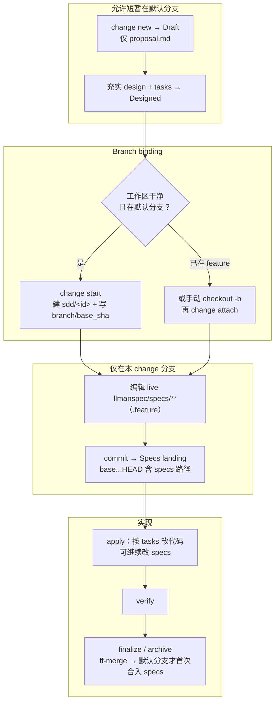
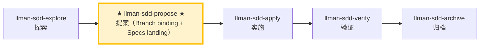

# LLMAN SDD Propose

创建一个带规划工件的新 change（proposal + tasks；design 可选），**先** `change start`（或 `attach`）完成 Branch binding，**然后**在绑定分支上编辑 live `llmanspec/specs/<capability>/*.feature`（Specs landing）、校验，并建议下一步。

## Pipeline 位置

## Git-native 生命周期（权威全图）

勿混淆两层：**Git-native 生命周期**（Branch binding → Specs landing → `readyToImplement`）与 **Skill 导航**（explore→propose→apply→verify→archive）。Specs landing **不是**独立 skill。



硬规则：
1. **先** `change start` / `attach`（Branch binding / 分支绑定）进入 Full；**再**在绑定的非默认分支编辑 `llmanspec/specs/**` 并 commit（Specs landing / 合约落地）。
2. 无 live 合约变更时可设 frontmatter `skip_specs_landing: true`。进入 apply 前 `llman sdd show <id> --json` 的 `readyToImplement` 须为 true（`Full ∧ (specsLanded ∨ skip)`）。
3. **禁止**为过干净树门禁把 live specs commit 到默认分支；已 attach 时不要重复 `start`。
# 人读摘要（强制）

在本工作流中产出的每一份报告、交接或门禁输出，MUST 在任何机器细节之前
先给出一段简短的人读摘要：

- **结论** — 一行（如「门禁全绿」/「发现 2 个 CRITICAL」）。
- **风险** — 最多三条，按影响从高到低。
- **待决策** — 明确的提问，或「无」。

控制在十行以内；细节放在折叠线以下。

### Skill 导航（非生命周期；仅指示当前 skill）



> 📍 你现在在 propose 阶段：上方 Git-native 路径为 **Designed → Branch binding → Specs landing**（直到 `readyToImplement=true`）→ 下一步：`llman-sdd-apply`
> 📎 小改动（不改行为合约）请走 `llman-sdd-quick`（快速路径）

## 硬约束

- **change id 非阻塞（r140）**：用户已给出 id 则直接采用；否则按 r99 推导规则生成合法 kebab-case id（动词前缀），宣布所用 id 与覆盖方式后继续，MUST NOT 等待确认——Branch binding 前更换 id 成本很低。仅当用户想先记 idea（草案、无需 id）时转 `llman-sdd-draft`。
- **Live specs 是 SSOT**：只在 Branch binding **之后**、在**绑定的非默认分支**上编辑 `llmanspec/specs/**`（Specs landing）。**不要**在默认分支上改 live specs；**不要**在 `changes/<id>/specs/` 下撰写或使用 `change delta`（已移除）。规划壳可以短暂留在默认分支。
- **不要问「要不要继续」**：一口气执行完整 propose 阶段，生成工件并校验。

- **change 已存在**：STOP。若 `readyToImplement=true`，建议 `llman-sdd-apply`；否则补完规划壳 / Branch binding / Specs landing（编辑 `llmanspec/changes/<id>/`，或在配置启用 `extra_skills: [llman-sdd-continue]`）。

- **frontmatter 有固定 schema**：充实 `proposal.md` 时只接受 `llmanspec/AGENTS.md`「Change Proposal Frontmatter SSOT」中的合法字段（含 `depends_on`、`blocks`、`branch`、`base_sha`/`baseSha`、`checkpointed`、`checkpoint_sha`/`checkpointSha`、`skip_specs_landing`）。`status`/`title`/`priority`/`author` 等会被 `llman sdd validate` 报 ERROR 拒绝；生命周期阶段是推断量（用 `llman sdd show`/`list` 查询），绝不写进 frontmatter。正文 MUST NOT 复读 frontmatter 字段；正文 H1 是人类可读标题，不是 change id 的复读。

## 快速记录分流

若用户只是想**记一个 idea**（如「draft 一个提案」「记下 X」「之后要做 Y」）而不需要完整规划，转 `llman-sdd-draft` skill——它经 `change new --from` 创建仅含 `proposal.md` 的草案壳（不问 id、无 tasks/specs/attach）。完整 propose（triage + tasks → `change start`/`attach` → Specs landing）从这里开始。

## 步骤

### 0) 预检
- 读 `llmanspec/config.yaml` 获取项目上下文、规则、locale。
- `llman sdd validate --all --strict --no-interactive`：确认现有工件干净。
  - 若已有错误，STOP 并报告（在脏工件上叠新 change 会造成级联错误）。
- **检查 spec valid_scope 完整性**：用 `llman sdd list --specs --json` 列出全部 specs，逐个核对其 `valid_scope` 中的路径在磁盘上是否存在。任何 scope 文件/目录缺失时，STOP 并建议更新该 spec（从 `valid_scope` 移除已删除的路径）。

### 1) 评估 change 规模（triage）
   - **行为合约变更**（修改 MUST/SHALL、改变外部行为）→ 完整 SDD 工作流
   - **实现层变更**（重构、typo、性能）→ 走 `llman-sdd-quick` 快速路径
   - **元规范变更**（SDD 模板/流程）→ 完整 SDD 工作流
   - 不确定时选完整 SDD（保守）。
2. 用 `llman sdd context --task "<目标>" --paths "<范围>"` 找相关 specs。
   - context 不可用时，跑 `llman sdd index rebuild`（默认 `pageindex`，无需模型）后继续。
3. 收集输入：
   - 一段简短的变更描述
   - 一个 change id（用户给出则用之；否则按 r140 推导并宣布）
   - 受影响的 capability（用于命名 `specs/<capability>/`）

### 2) 确认项目已初始化：
   - `llmanspec/` 必须存在；若缺失，让用户运行 `llman sdd init`，然后 STOP。

### 3) 创建 change 目录与工件
   - 优先用 `llman sdd change new <change-id>` 生成 `proposal.md` 草案壳（或手动创建 `llmanspec/changes/<change-id>/`）。

   - change 已存在时，STOP 并建议补齐缺失工件或 `llman-sdd-apply`（可通过 `extra_skills` 启用 continue）。

   - 充实 `proposal.md`（Why / What Changes / Capabilities / Impact）
   - 仅当存在权衡/迁移时写 `design.md`
   - **写 tasks.md 前确认测试边界（seam，接缝）**：列出将要测试的 seam 并与用户确认。seam = 由 `*.feature` GWT 步骤驱动的公共边界（CLI 子进程或公共接口）——MUST 复用既有 harness seam，MUST NOT 脱离 `.feature` 凭空发明 seam。没有 `.feature` 时，seam = 被测的 CLI 子命令或公共函数边界。
   - `tasks.md`：按**垂直切片**拆分（每个 task 打穿 schema→API→UI→tests 一条窄而完整的路径，可独立验证），并带 `[blocked-by: <task-id>]` 依赖标记。**大范围重构例外**（一个机械改动扫全库、单点编辑牵动大量调用处）：按 expand-contract 排序（旧的旁边加新的 → 分批迁移调用处 → 删掉旧的），不强拆垂直切片。
   - **先** `llman sdd change start <change-id>`（推荐；默认分支上工作树干净时）或手动建分支后 `change attach <change-id>` 到达 Full（bound）。
   - **然后**在绑定的非默认分支上编辑 live `llmanspec/specs/<capability>/<capability>.feature` 并 commit（Specs landing）。**不要**在 start 之前改 live specs；**不要**为过干净树门禁把 live specs commit 到默认分支。已 attach 时勿重复 `start`（丢失 specs 时用 checkout/重建 + `attach --force` 恢复）。
   - 无 live 合约编辑的 change，设置 frontmatter `skip_specs_landing: true`。仅当 `llman sdd show <id> --json` 给出 `readyToImplement=true` 才进入 apply。

### 4) 校验：
   ```bash
   llman sdd validate <change-id> --strict --no-interactive
   ```
   这一步 MUST 通过后才能继续。若出现 TOON 解析错误，修复引号：表格式行中含逗号/冒号/括号的值必须加双引号。

### 4a) 可选 BDD runner（`bdd:` 段）
- 读 `llmanspec/config.yaml`。是否含 `bdd:` 段？
  - **有**：`validate --check` 会跑 harness；撰写仍按 4b 执行。
  - **无**：若本次 change 涉及可执行行为场景（用户会想运行的 Given/When/Then），**一次性、前置**询问：「本次变更看起来有可执行行为。要启用 `bdd:` runner 段以便把场景作为 `.feature` 校验吗？（会向 `config.yaml` 加一个 `bdd:` 段——仅 runner，不改变生命周期。）」
    - **是**：展示要添加的精确 `bdd:` 段（`run_command` 选匹配项目测试框架的——rstest-bdd 用 `cargo test --features bdd`，pytest-bdd 用 `pytest {feature_dir} -k {feature_name} -v`）。让用户确认或修改后写入 `config.yaml`，再按 4b 规则继续。
    - **否**：feature 仍做结构校验；仅跳过 runner 执行。
- **MUST NOT 静默添加 `bdd:` 段**——总是先询问。添加它会改变全项目 `validate --check` 的行为。

### 4b) 单轨 feature 撰写
- 规划壳（proposal/design/tasks）可短暂留在默认分支；**不要**在默认分支上编辑 live `llmanspec/specs/**`。Branch binding 之后，Specs landing 与实现都发生在绑定分支上。
- **单轨**：每个 capability 只有一个 `<capability>.feature`。约束规则是 `@req:<id> @human` 场景（statement 全文放描述）；可执行验收场景带 `@executable` 并用 `@req:<req_id>` 挂回规则。绝不把场景嵌进 `Rule:` 块（runner 会静默跳过其中场景）。
- change 壳：`llman sdd change new <change-id>` → 填 proposal/design/tasks → `llman sdd change start <change-id>`（或 `change attach`）→ **然后**在绑定分支编辑 live specs 并 commit（Specs landing）。
- **不要**使用 `change delta` / solidify / `*.feature.delta.toon`；存在活跃 `*.feature.delta.toon` 或遗留 `spec.toon` 时，先跑 `llman sdd project migrate --kind toon2features`。

### 5) 总结并建议下一步：
   - 进入实现阶段：`llman-sdd-apply`。
   - 需要再想清楚：`llman-sdd-explore`。

> 💡 提案完成 → 下一步：`llman-sdd-apply`（实施）

> 命令细节用 `llman sdd <cmd> --help` 查看；命令参考以 CLI 为准，skill 不内嵌命令表（r139）。
校验修复（单轨 feature-as-spec）：

1）缺少头注释（`missing # capability: header comment`）：
每个 `llmanspec/specs/<capability>/<capability>.feature` 必须以以下注释开头：
```
# language: zh-CN
# capability: <capability>
# purpose: 一句话概述
# scope: src/
```

2）tag 语法（`@human constraint scenario must carry an @req:<req_id> tag` / `orphan acceptance scenario`）：
- 规则：`@req:<id> @human` —— statement 放场景描述（须含 MUST/SHALL）。
- 验收：`@executable` 且至少一个 `@req:<id>` 挂到规则。
- `@manual` 须与 `@human` 同用；禁止 `@human` 与 `@executable` 同场景。

3）遗留 `spec.toon`（`legacy spec.toon found ... run ... toon2features`）：
运行 `llman sdd project migrate --kind toon2features --yes`，审阅 diff 后提交。

Git-native 护栏：
- **Branch binding** → **Specs landing**：先 `change start` / `attach`，再在绑定的非默认分支编辑 live `.feature` 并 commit。
- 锁定规则：修改/删除既有 `@human` 场景会触发门禁，除非 proposal frontmatter 带 `rules_edit_acked: true`。
- apply 前须 `readyToImplement=true`（或 `skip_specs_landing`）。收尾优先 `change finalize`。
- 勿使用 `change delta` / solidify / `*.feature.delta.toon`。

## Context
- 先查状态再动手：change/spec 状态以 `llman sdd show/list/validate` 输出为准。
- 读 spec 全文前先用 `llman sdd context --task --paths` 定位相关 specs。

## Goal
- 本节命令达成一个可验证结果；结果路径与校验状态随报告输出。

## Constraints
- 遵守正文「硬约束/硬规则」，本节不复读。先判断变更规模选路径（triage）：行为合约变更走完整 SDD，实现层走 quick；不确定选完整 SDD（保守）。
- 改动保持最小；已知校验错误禁止强行继续。

## Workflow
- 每步以 `llman sdd` 命令结果为事实来源；改动工件后必跑 `llman sdd validate`。
- 命令细节见下方生成式命令参考或 `llman sdd <cmd> --help`。

## Decision Policy
- 高影响歧义先澄清再继续；事实自己查证，只有决策问用户。

## Output Contract
- 报告先给人读摘要（结论 / 风险 / 待决策），机器细节随后。

## Ethics Governance
- `ethics.risk_level`：low——仅读写本仓库与 `llmanspec/`，无外发动作；正文另有声明时从其声明。
- `ethics.prohibited_actions`：违反正文「硬约束」的动作；未经用户明确要求的 push / PR / 外部上传。
- `ethics.required_evidence`：结论须有命令输出或文件路径佐证；门禁状态以 `llman sdd validate` 为准。
- `ethics.refusal_contract`：门禁 CRITICAL 未清零 → 拒绝进入下一阶段；自修复达上限 → 报告 blocker。
- `ethics.escalation_policy`：改动 SDD 合约/模板或执行不可逆动作前，暂停并请用户确认。
