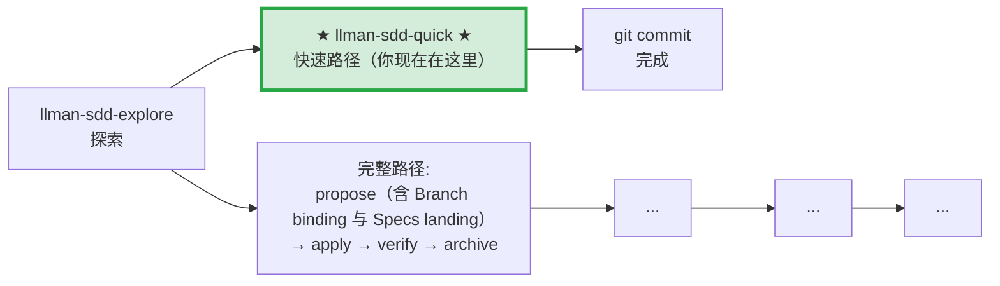

# LLMAN SDD Quick Path

对于不涉及行为合约变更的小改动使用此路径。

## Pipeline 位置

> 📍 快速路径：不改行为合约，直接改代码 commit。如果发现需要改合约 → STOP，改走完整路径 `llman-sdd-propose`
> 🗺️ 完整路径含 Git-native Branch binding + Specs landing（不是把 Specs landing 当成独立 skill）

## 使用条件（所有条件必须满足）
- 不改变任何 spec 中 MUST/SHALL 定义的外部可观测行为
- 不涉及跨 capability 的修改
- 不涉及迁移/兼容性
- 不是 SDD 元规范变更

## 步骤
1. 用 `llman sdd context --task "..." --paths "..."` 确认无相关 spec 变更需要。
   - 如果 context 返回 `quality: "unavailable"`，运行 `llman sdd index rebuild`（默认 `pageindex`，无需模型）。
   - 可以用 `llman sdd list --specs --json` 查看 specs 元数据。
2. 直接修改代码。
3. 若要动 `llmanspec/specs/**`，STOP——除非已在绑定的非默认 change 分支上（迷你 change：`change start`/`attach` → 编辑 → commit）。禁止在默认分支 commit live specs，即使是 typo 或仅收紧 scope 也不行。优先把 live specs 维护路由到 `llman-sdd-propose`，或要求已有绑定分支。
4. git commit（message 写明 why）。
5. 无需 change 目录，无需 archive。

## 边界处理
- 如果在修改中发现需要改变行为合约 → STOP，改走 `llman-sdd-propose`（完整路径）。
- 如果涉及到多个文件且不确定 scope → 先用 `llman sdd context` 确认。

> 💡 快速路径完成 → git commit 即可。若需要走完整路径 → `llman-sdd-propose` → `llman-sdd-apply` → `llman-sdd-verify` → `llman-sdd-archive`

> 命令细节用 `llman sdd <cmd> --help` 查看；命令参考以 CLI 为准，skill 不内嵌命令表（r139）。

## Ethics Governance
- `ethics.risk_level`：low——仅读写本仓库与 `llmanspec/`，无外发动作；正文另有声明时从其声明。
- `ethics.prohibited_actions`：违反正文「硬约束」的动作；未经用户明确要求的 push / PR / 外部上传。
- `ethics.required_evidence`：结论须有命令输出或文件路径佐证；门禁状态以 `llman sdd validate` 为准。
- `ethics.refusal_contract`：门禁 CRITICAL 未清零 → 拒绝进入下一阶段；自修复达上限 → 报告 blocker。
- `ethics.escalation_policy`：改动 SDD 合约/模板或执行不可逆动作前，暂停并请用户确认。
