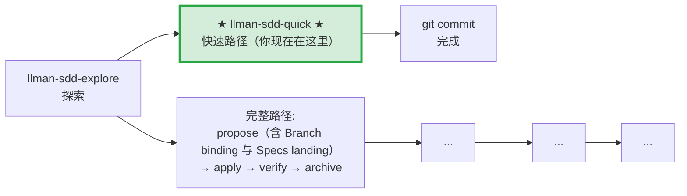

# LLMAN SDD Quick Path

对于不涉及行为合约变更的小改动使用此路径。

## Pipeline 位置

> 📍 快速路径：不改行为合约，直接改代码 commit。如果发现需要改合约 → STOP，改走完整路径 `llman-sdd-propose`
> 🗺️ 完整路径含 Git-native Branch binding + Specs landing（不是把 Specs landing 当成独立 skill）

## 使用条件（所有条件必须满足）
- 不改变任何 spec 中 MUST/SHALL 定义的外部可观测行为
- 不涉及跨 capability 的修改
- 不涉及迁移/兼容性
- 不是 SDD 元规范变更

## 步骤
1. 用 `llman sdd context --task "..." --paths "..."` 确认无相关 spec 变更需要。
   - 如果 context 返回 `quality: "unavailable"`，运行 `llman sdd index rebuild`（默认 `pageindex`，无需模型）。
   - 可以用 `llman sdd list --specs --json` 查看 specs 元数据。
2. 直接修改代码。
3. 若要动 `llmanspec/specs/**`，STOP——除非已在绑定的非默认 change 分支上（迷你 change：`change start`/`attach` → 编辑 → commit）。禁止在默认分支 commit live specs，即使是 typo 或仅收紧 scope 也不行。优先把 live specs 维护路由到 `llman-sdd-propose`，或要求已有绑定分支。
4. git commit（message 写明 why）。
5. 无需 change 目录，无需 archive。

## 边界处理
- 如果在修改中发现需要改变行为合约 → STOP，改走 `llman-sdd-propose`（完整路径）。
- 如果涉及到多个文件且不确定 scope → 先用 `llman sdd context` 确认。

> 💡 快速路径完成 → git commit 即可。若需要走完整路径 → `llman-sdd-propose` → `llman-sdd-apply` → `llman-sdd-verify` → `llman-sdd-archive`

行动前先阅读 `llmanspec/config.yaml`，并遵循其中的 `context` 与 `rules`（若有）。

常用命令：
- `llman sdd context --task "<描述>" --paths "<文件>"`（找相关 specs）。使用 pageindex agentic tree 后端（需 `LLMAN_SDD_INDEX_CHAT_MODEL`）。可用 `LLMAN_SDD_INDEX_BACKEND` 预设。
- `llman sdd list`（列出变更）
- `llman sdd list --specs`（列出 specs 及 purpose/scope 元数据）
- `llman sdd show <id>`（展示 change/spec；`--type change --output json` 含 `stage` / `specsLanded` / `skipSpecsLanding` / `readyToImplement`——apply 门禁看 `readyToImplement`，勿凭「完整工件」）
- `llman sdd validate <id>`（校验 change 或 spec）
- `llman sdd validate --all`（批量校验）
- `llman sdd index rebuild`（重建 pageindex 树索引——不需要模型）
- `llman sdd index check`（检查索引新鲜度）
- `llman sdd change new <id>`（仅创建规划壳草稿 `changes/<id>/proposal.md`；不写 live specs）
- `llman sdd change start <id> [--worktree]`（Designed→Full：干净树且在默认分支 → 创建 `sdd/<id>` 分支 + attach；仅 Branch binding，不等于 Specs landing，不等于可 apply）
- `llman sdd change attach <id> [--force]`（绑定已有非默认 feature 分支 + base SHA；拒绝绑到默认分支）
- `llman sdd change finalize <id> [--no-check]`（**推荐单 commit 收尾**——verify 之后；不要求干净树；门禁 + 自动 ff-merge + 文档改名）
- `llman sdd change checkpoint <id> [--no-check]`（干净工作区 + 归档前门禁；严格 sha = HEAD；finalize 的 fallback）
- `llman sdd change diff <id> [--export-patch <path>]`（只读 `base...HEAD` 审查/导出）
- `llman sdd change archive <id>`（封存：自动 ff-merge 到默认分支，再改名到 `changes/archive/`；单 commit 收尾优先 `finalize`）
- `llman sdd archive freeze [--before YYYY-MM-DD] [--keep-recent N] [--dry-run]`（冻结已归档目录）
- `llman sdd archive thaw [--change <id> ...] [--dest <path>]`（从冷备份恢复）
- `llman sdd graph [CHANGE] [--format mermaid] [--scope active|archived|all] [--depth N]`（生成变更依赖图）
- `llman sdd project migrate --kind spec-md2toon`（`.md`+fence → 独立 `.toon`；`partitioned` 已移除）

## Ethics Governance
- `ethics.risk_level`：按 `low|medium|high|critical` 标注风险等级。
- `ethics.prohibited_actions`：列出绝对禁止执行的动作。
- `ethics.required_evidence`：列出高影响输出前必须具备的证据。
- `ethics.refusal_contract`：定义何时拒答以及安全替代响应方式。
- `ethics.escalation_policy`：定义何时必须升级为用户确认/人工复核。
