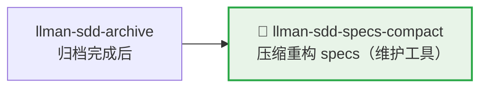

# LLMAN SDD Specs Compact

使用此 skill 在不改变规范行为的前提下压缩 specs。

## Pipeline 位置



> 📎 维护工具，通常在归档积累较多后执行。日常开发 → `llman-sdd-propose`（含 Branch binding + Specs landing）/ `llman-sdd-apply`（须 `readyToImplement`）。

## Context
- specs 会随着变更积累而膨胀，并出现重复 requirement/scenario。
- 压缩必须保持可验证、可回归。
- 当 archive 历史过大时，会干扰压缩评审与定位。

## Goal
- 识别并合并冗余 requirement/scenario。
- 形成更紧凑且可维护的规范结构。

## Constraints
- 未经明确替代，不得删除规范性行为。
- 尽量保持 requirement 标题稳定。
- 每个保留 requirement 至少保留一个有效 scenario。
- **编辑 live `llmanspec/specs/**` 须走 change**：先 Branch binding（`change start` / `attach`），在绑定分支上做 Specs landing 式提交；**禁止**在默认分支直接压缩改写 live specs。

## Workflow
1. 盘点当前 specs（`llman sdd list --specs`）。
2. 如果已归档历史较大，先执行 archive freeze：
   - 预览：`llman sdd archive freeze --dry-run`
   - 执行：`llman sdd archive freeze --before <YYYY-MM-DD> --keep-recent <N>`
3. 识别跨 capability 的重叠项。
4. 产出压缩计划（canonical requirements + keep/merge/remove 决策 + 迁移说明）。
5. 执行并验证（`llman sdd validate --specs --strict --no-interactive`）。

## Decision Policy
- 两条 requirement 语义等价时优先合并。
- 仅在引用关系清晰时提取共享规范文本。
- archive 目录噪声较大时，优先建议先 freeze 再压缩。
- 若压缩会改变外部行为，必须先暂停并询问用户。

## Output Contract
- 输出按 capability 分组的压缩方案。
- 包含：keep/merge/remove 决策及理由。
- 包含验证命令与预期结果。

> 💡 维护完成后，新需求走正常 pipeline：`llman-sdd-propose`（含 Branch binding + Specs landing）→ `llman-sdd-apply`（须 `readyToImplement`）→ `llman-sdd-verify` → `llman-sdd-archive`。

行动前先阅读 `llmanspec/config.yaml`，并遵循其中的 `context` 与 `rules`（若有）。

常用命令：
- `llman sdd context --task "<描述>" --paths "<文件>"`（找相关 specs）。使用 pageindex agentic tree 后端（需 `LLMAN_SDD_INDEX_CHAT_MODEL`）。可用 `LLMAN_SDD_INDEX_BACKEND` 预设。
- `llman sdd list`（列出变更）
- `llman sdd list --specs`（列出 specs 及 purpose/scope 元数据）
- `llman sdd show <id>`（展示 change/spec；`--type change --output json` 含 `stage` / `specsLanded` / `skipSpecsLanding` / `readyToImplement`——apply 门禁看 `readyToImplement`，勿凭「完整工件」）
- `llman sdd validate <id>`（校验 change 或 spec）
- `llman sdd validate --all`（批量校验）
- `llman sdd index rebuild`（重建 pageindex 树索引——不需要模型）
- `llman sdd index check`（检查索引新鲜度）
- `llman sdd change new <id>`（仅创建规划壳草稿 `changes/<id>/proposal.md`；不写 live specs）
- `llman sdd change start <id> [--worktree]`（Designed→Full：干净树且在默认分支 → 创建 `sdd/<id>` 分支 + attach；仅 Branch binding，不等于 Specs landing，不等于可 apply）
- `llman sdd change attach <id> [--force]`（绑定已有非默认 feature 分支 + base SHA；拒绝绑到默认分支）
- `llman sdd change finalize <id> [--no-check]`（**推荐单 commit 收尾**——verify 之后；不要求干净树；门禁 + 自动 ff-merge + 文档改名）
- `llman sdd change checkpoint <id> [--no-check]`（干净工作区 + 归档前门禁；严格 sha = HEAD；finalize 的 fallback）
- `llman sdd change diff <id> [--export-patch <path>]`（只读 `base...HEAD` 审查/导出）
- `llman sdd change archive <id>`（封存：自动 ff-merge 到默认分支，再改名到 `changes/archive/`；单 commit 收尾优先 `finalize`）
- `llman sdd archive freeze [--before YYYY-MM-DD] [--keep-recent N] [--dry-run]`（冻结已归档目录）
- `llman sdd archive thaw [--change <id> ...] [--dest <path>]`（从冷备份恢复）
- `llman sdd graph [CHANGE] [--format mermaid] [--scope active|archived|all] [--depth N]`（生成变更依赖图）
- `llman sdd project migrate --kind spec-md2toon`（`.md`+fence → 独立 `.toon`；`partitioned` 已移除）

校验修复（单轨 feature-as-spec）：

1）缺少头注释（`missing # capability: header comment`）：
每个 `llmanspec/specs/<capability>/<capability>.feature` 必须以以下注释开头：
```
# language: zh-CN
# capability: <capability>
# purpose: 一句话概述
# scope: src/
```

2）tag 语法（`@human constraint scenario must carry an @req:<req_id> tag` / `orphan acceptance scenario`）：
- 规则：`@req:<id> @human` —— statement 放场景描述（须含 MUST/SHALL）。
- 验收：`@executable` 且至少一个 `@req:<id>` 挂到规则。
- `@manual` 须与 `@human` 同用；禁止 `@human` 与 `@executable` 同场景。

3）遗留 `spec.toon`（`legacy spec.toon found ... run ... toon2features`）：
运行 `llman sdd project migrate --kind toon2features --yes`，审阅 diff 后提交。

Git-native 护栏：
- **Branch binding** → **Specs landing**：先 `change start` / `attach`，再在绑定的非默认分支编辑 live `.feature` 并 commit。
- 锁定规则：修改/删除既有 `@human` 场景会触发门禁，除非 proposal frontmatter 带 `rules_edit_acked: true`。
- apply 前须 `readyToImplement=true`（或 `skip_specs_landing`）。收尾优先 `change finalize`。
- 勿使用 `change delta` / solidify / `*.feature.delta.toon`。

## Ethics Governance
- `ethics.risk_level`：按 `low|medium|high|critical` 标注风险等级。
- `ethics.prohibited_actions`：列出绝对禁止执行的动作。
- `ethics.required_evidence`：列出高影响输出前必须具备的证据。
- `ethics.refusal_contract`：定义何时拒答以及安全替代响应方式。
- `ethics.escalation_policy`：定义何时必须升级为用户确认/人工复核。
