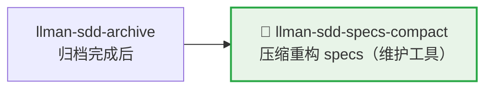

# LLMAN SDD Specs Compact

使用此 skill 在不改变规范行为的前提下压缩 specs。

## Pipeline 位置



> 📎 维护工具，通常在归档积累较多后执行。日常开发 → `llman-sdd-propose`（含 Branch binding + Specs landing）/ `llman-sdd-apply`（须 `readyToImplement`）。

## Context
- specs 会随着变更积累而膨胀，并出现重复 requirement/scenario。
- 压缩必须保持可验证、可回归。
- 当 archive 历史过大时，会干扰压缩评审与定位。

## Goal
- 识别并合并冗余 requirement/scenario。
- 形成更紧凑且可维护的规范结构。

## Constraints
- 未经明确替代，不得删除规范性行为。
- 尽量保持 requirement 标题稳定。
- 每个保留 requirement 至少保留一个有效 scenario。
- **编辑 live `llmanspec/specs/**` 须走 change**：先 Branch binding（`change start` / `attach`），在绑定分支上做 Specs landing 式提交；**禁止**在默认分支直接压缩改写 live specs。

## Workflow
1. 盘点当前 specs（`llman sdd list --specs`）。
2. 如果已归档历史较大，先执行 archive freeze：
   - 预览：`llman sdd archive freeze --dry-run`
   - 执行：`llman sdd archive freeze --before <YYYY-MM-DD> --keep-recent <N>`
3. 识别跨 capability 的重叠项。
4. 产出压缩计划（canonical requirements + keep/merge/remove 决策 + 迁移说明）。
5. 执行并验证（`llman sdd validate --specs --strict --no-interactive`）。

## Decision Policy
- 两条 requirement 语义等价时优先合并。
- 仅在引用关系清晰时提取共享规范文本。
- archive 目录噪声较大时，优先建议先 freeze 再压缩。
- 若压缩会改变外部行为，必须先暂停并询问用户。

## Output Contract
- 输出按 capability 分组的压缩方案。
- 包含：keep/merge/remove 决策及理由。
- 包含验证命令与预期结果。

> 💡 维护完成后，新需求走正常 pipeline：`llman-sdd-propose`（含 Branch binding + Specs landing）→ `llman-sdd-apply`（须 `readyToImplement`）→ `llman-sdd-verify` → `llman-sdd-archive`。

> 命令细节用 `llman sdd <cmd> --help` 查看；命令参考以 CLI 为准，skill 不内嵌命令表（r139）。

校验修复（单轨 feature-as-spec）：

1）缺少头注释（`missing # capability: header comment`）：
每个 `llmanspec/specs/<capability>/<capability>.feature` 必须以以下注释开头：
```
# language: zh-CN
# capability: <capability>
# purpose: 一句话概述
# scope: src/
```

2）tag 语法（`@human constraint scenario must carry an @req:<req_id> tag` / `orphan acceptance scenario`）：
- 规则：`@req:<id> @human` —— statement 放场景描述（须含 MUST/SHALL）。
- 验收：`@executable` 且至少一个 `@req:<id>` 挂到规则。
- `@manual` 须与 `@human` 同用；禁止 `@human` 与 `@executable` 同场景。

3）遗留 `spec.toon`（`legacy spec.toon found ... run ... toon2features`）：
运行 `llman sdd project migrate --kind toon2features --yes`，审阅 diff 后提交。

Git-native 护栏：
- **Branch binding** → **Specs landing**：先 `change start` / `attach`，再在绑定的非默认分支编辑 live `.feature` 并 commit。
- 锁定规则：修改/删除既有 `@human` 场景会触发门禁，除非 proposal frontmatter 带 `rules_edit_acked: true`。
- apply 前须 `readyToImplement=true`（或 `skip_specs_landing`）。收尾优先 `change finalize`。
- 勿使用 `change delta` / solidify / `*.feature.delta.toon`。

## Ethics Governance
- `ethics.risk_level`：low——仅读写本仓库与 `llmanspec/`，无外发动作；正文另有声明时从其声明。
- `ethics.prohibited_actions`：违反正文「硬约束」的动作；未经用户明确要求的 push / PR / 外部上传。
- `ethics.required_evidence`：结论须有命令输出或文件路径佐证；门禁状态以 `llman sdd validate` 为准。
- `ethics.refusal_contract`：门禁 CRITICAL 未清零 → 拒绝进入下一阶段；自修复达上限 → 报告 blocker。
- `ethics.escalation_policy`：改动 SDD 合约/模板或执行不可逆动作前，暂停并请用户确认。
