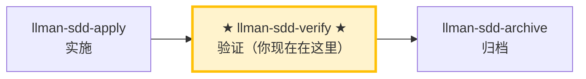

# LLMAN SDD Verify

使用此 skill 验证实现是否与该 change 的 artifacts 一致。

## Pipeline 位置

### Skill 导航（非生命周期；仅指示当前 skill）



> 📍 你现在在验证阶段 → 通过后下一步 `llman-sdd-archive`（归档）；失败则回到 `llman-sdd-apply`（修复）。对应 Git-native 图中的 **I（verify）**，对象应已 Specs-landed（`readyToImplement=true`）。
> 🗺️ Skill 导航 ≠ Git-native 生命周期；完整生命周期见底部 brief 单元。

## 硬约束

- **必须先通过 apply 阶段全绿**：未完成实现的 change 跳过验证。
- **CRITICAL 必须修复**：标记为 CRITICAL 的问题归档前必须修复。
- **不要问「要不要继续」**：跑完整个验证流程，输出完整报告。

## 阶段守卫（`stage` / `readyToImplement`）

用权威 JSON 判定（勿凭「完整工件」口头说法）：

```bash
llman sdd show <id> --json --type change
```

解读字段：`stage`、`specsLanded`、`needsSpecsChange`、`readyToImplement`、`gateChecks`（逐项 `pass` + 未过时一行 `hint`）。

| 条件 | 动作 |
|------|------|
| `stage=draft`（仅 proposal.md） | STOP。长大到 Designed（补 design.md）→ Planned（补 tasks.md）→ Branch binding → Specs landing。draft 不能直接 apply/verify。若已有 proposal+design+tasks 仍是 `draft`：tasks 无 design 需先补 design.md。**不要**建 `changes/<id>/specs/`，**不要**先在默认分支改 live specs。 |
| `stage=designed`（proposal + design） | 下一步：补 tasks.md → `planned`。规划工件齐全后再 `change start` / `attach`（Branch binding）。 |
| `stage=planned`（proposal + design + tasks） | STOP 直到绑定：跑 `change start` / `attach`（Branch binding）→ `full`。 |
| `stage=full` 且 `readyToImplement=false` | STOP。在**绑定分支**完成 Specs landing（编辑 `llmanspec/specs/**` 并 commit），或设 `needs_specs_change: false`。**不要**再跑 `change start`。丢失绑定分支 specs → checkout/重建 + 必要时 `attach --force`。 |
| `readyToImplement=true` | 可通过 apply/verify 前置检查。`changes/<id>/specs/` 预期**不存在**，勿当缺失。 |

## 步骤
1. 确定 change id（不明确时让用户从 `llman sdd list --json` 选择）。
2. 先跑一个快速校验门禁：
   - `llman sdd validate <id> --strict --no-interactive`
   - **诊断结构问题（Gherkin 解析 / `@req` 链接 / 双写 / 全局 req_id 唯一性）时优先加 `--no-check`**（BDD-on 下跳过可能耗时的 `bdd.run_command`），结构门禁全绿后再跑完整 `--check`（full mode）。`FAIL <item_type>/<id>` 行会逐条列出失败项（在 Totals 行上方）。
3. 阅读：
   - feature 分支上的 live specs：`llmanspec/specs/**`（`<capability>.feature`）——SSOT
   - `proposal.md` 与 `design.md`（如存在）
   - `tasks.md`（理解实现范围）
   - `llmanspec/changes/<id>/specs/` 若残留旧文档可忽略；SSOT 是 live specs
4. **双轴审查（标准轴 + 合约轴分离，互不掩盖）**——对比 diff（`git diff <merge-base>...HEAD`，merge-base 用现算 `git merge-base <本地默认分支> HEAD`；存储的 base_sha 仅作审计、MUST NOT 参与范围计算）分两轴：
   - **合约轴（Spec）**：实现是否满足 `@human` 规则的 MUST/SHALL 与 `@executable` 的 GWT。
     - 缺失/部分实现的行为、错误实现、以及 diff 中未被 spec 要求的超范围改动。
     - 给出最小修复建议，或建议更新 artifacts。
   - **标准轴（Standards）**：代码是否符合 `AGENTS.md` 的编码规范 + 常见代码坏味（code smell）清单。
     - **权威优先级**：`AGENTS.md` 文档规范 > 坏味清单（文档说了算）；工具已强制的项跳过。
     - 坏味标记为**判断性提示**（「可能是 Feature Envy」），不是硬性违规。
     - 坏味清单（每项「是什么 → 怎么修」）：

     | 坏味 | 怎么修 |
     |------|--------|
     | Mysterious Name（名不达意） | 重命名 |
     | Duplicated Code（重复逻辑） | 抽取共享部分 |
     | Feature Envy（方法更爱用别人的数据） | 把方法移过去 |
     | Data Clumps（同组字段到处走） | 打包成类型 |
     | Primitive Obsession（原始类型充当领域概念） | 给专门类型 |
     | Repeated Switches（同类 switch 反复出现） | 多态或共享 map |
     | Shotgun Surgery（一处改动散落多处） | 聚到一个模块 |
     | Divergent Change（一个文件因多个无关原因被改） | 拆分 |
     | Speculative Generality（为未发生的需求加抽象） | 删掉 |
     | Message Chains（长链 a.b().c()） | 隐入一个方法 |
     | Middle Man（只转发） | 删掉，直连 |
     | Refused Bequest（子类拒绝大部分继承） | 改组合 |
   - 两轴可并行（sub-agent）审查；报告 MUST 分离呈现，MUST NOT 合并或交叉重排（一轴通过不能掩盖另一轴失败）。
5. **BDD-on 验证（Git-native Partitioned SSOT）**——仅当 `config.yaml` 含 `bdd:` 段时：
   - 确认 change 已 attach，且当前在对应 feature 分支上。
   - `llman sdd validate --specs`：Gherkin + `@req`/双写门禁；默认跑 `bdd.run_command`（可用 `--no-check` 跳过）。
   - 可选只读审查：`llman sdd change diff <id>`（或 `--export-patch <path>`）。diff 仅作审查/导出——绝不当作 apply 步骤。
   - 检查：无遗留 `spec.toon` / `*.feature.delta.toon`；若存在，先跑 toon2features（不要自创 solidify/找补步骤）。
   - verify 通过后下一步：`llman-sdd-archive`（勿在此 inline finalize）。

   - 额外要求: Each scenario in the feature file MUST be mapped to an implemented step definition. Run `cargo test --lib --all-features tests::bdd::` to confirm all scenarios pass.

6. 输出简短报告：
   - **CRITICAL**（归档前必须修复）
   - **WARNING**（建议修复）
   - **SUGGESTION**（可选优化）
7. **人审检查点**：报告无 CRITICAL 后、建议归档前，运行 `llman sdd review`：
   - 退出码为零 → 建议 `llman-sdd-archive` 进行 finalize/archive。
   - 非零退出 = CRITICAL 发现：用 `llman-sdd-apply` 修复后重跑 review；MUST NOT 带着 CRITICAL 进入 finalize/archive。

> 💡 验证通过 → 下一步 `llman-sdd-archive`（归档）；有 CRITICAL → 回到 `llman-sdd-apply`（修复）

## Git-native 生命周期（摘要）

勿混淆：**Skill 导航** ≠ **Git-native 生命周期**。全图见根 `AGENTS.md`「领域概念区分」或 `llman-sdd-propose` 内嵌全图。

硬规则：
1. **先** Branch binding（`change start` / `attach`）→ Full；**再** Specs landing（绑定分支编辑并 commit `llmanspec/specs/**`）。
2. 无 live 合约变更 → `needs_specs_change: false`。apply 前须 `readyToImplement=true`。
3. 收口用 `change finalize`（自动提交 `archive(sdd): <id>`；`--no-commit` 可跳过）。`change checkpoint` 已移除（调用即以非零退出报错，指向 finalize）。
4. **禁止**在默认分支 commit live specs；已 attach 勿重复 `start`。
# 人读摘要（强制）

在本工作流中产出的每一份报告、交接或门禁输出，MUST 在任何机器细节之前
先给出一段简短的人读摘要：

- **结论** — 一行（如「门禁全绿」/「发现 2 个 CRITICAL」）。
- **风险** — 最多三条，按影响从高到低。
- **待决策** — 明确的提问，或「无」。

控制在十行以内；细节放在折叠线以下。
> 命令细节用 `llman sdd <cmd> --help` 查看；命令参考以 CLI 为准，skill 不内嵌命令表。
> 文中「规约」= 本项目 `llmanspec/specs/` 下的 `.feature` 文件；用 `llman sdd list --specs` / `llman sdd show <capability>` 查全文。

校验修复（单轨 feature-as-spec）：

1）缺少头注释（`missing # capability: header comment`）：
每个 capability `.feature`（`llmanspec/specs/<capability>.feature` 或 `llmanspec/specs/<capability>/<capability>.feature`）必须以以下注释开头：
```
# language: zh-CN
# capability: <capability>
# purpose: 一句话概述
# scope: src/
```

2）tag 语法（`@human constraint scenario must carry an @req:<req_id> tag` / `orphan acceptance scenario`）：
- 规则：`@req:<id> @human` —— statement 放场景描述（须含 MUST/SHALL）。
- 验收：`@executable` 且至少一个 `@req:<id>` 挂到规则。
- `@manual` 须与 `@human` 同用；禁止 `@human` 与 `@executable` 同场景。

3）遗留 `spec.toon`（`legacy spec.toon found ... run ... toon2features`）：
运行 `llman sdd project migrate --kind toon2features --yes`，审阅 diff 后提交。

Git-native 护栏：
- **Branch binding** → **Specs landing**：先 `change start` / `attach`，再在绑定的非默认分支编辑 live `.feature` 并 commit。
- 锁定规则（报告制）：改/删既有 `@human` 场景只出 WARNING，不阻断 validate / change finalize / change diff；报告按 `@req:<id>` 指明被改的是哪条规则。控制点：git 分支对比 + `llman sdd review` / `change diff` 的报告浮现。旧的锁定确认元数据（frontmatter `rules_touched` / `agent_acked`、`@agent` tag、`--yes` 的确认语义）已全部删除，无别名、无兼容层。
- apply 前须 `readyToImplement=true`（或 `needs_specs_change: false`）。收尾优先 `change finalize`。
- 勿使用 `change delta` / solidify / `*.feature.delta.toon`。

## Context
- 先查状态再动手：change/spec 状态以 `llman sdd show/list/validate` 输出为准。
- 读 spec 全文前先用 `llman sdd context --task --paths` 定位相关 specs。

## Goal
- 本节命令达成一个可验证结果；结果路径与校验状态随报告输出。

## Constraints
- 遵守正文「硬约束/硬规则」，本节不复读。先判断变更规模选路径（triage）：行为合约变更走完整 SDD，实现层走 quick；不确定选完整 SDD（保守）。
- 改动保持最小；已知校验错误禁止强行继续。

## Workflow
- 每步以 `llman sdd` 命令结果为事实来源；改动工件后必跑 `llman sdd validate`。
- 命令细节见下方生成式命令参考或 `llman sdd <cmd> --help`。

## Decision Policy
- 高影响歧义先澄清再继续；事实自己查证，只有决策问用户。

## Output Contract
- 报告先给人读摘要（结论 / 风险 / 待决策），机器细节随后。

## Ethics Governance
- `ethics.risk_level`：low——仅读写本仓库与 `llmanspec/`，无外发动作；正文另有声明时从其声明。
- `ethics.prohibited_actions`：违反正文「硬约束」的动作；未经用户明确要求的 push / PR / 外部上传。
- `ethics.required_evidence`：结论须有命令输出或文件路径佐证；门禁状态以 `llman sdd validate` 为准。
- `ethics.refusal_contract`：门禁 CRITICAL 未清零 → 拒绝进入下一阶段；自修复达上限 → 报告 blocker。
- `ethics.escalation_policy`：改动 SDD 合约/模板或执行不可逆动作前，暂停并请用户确认。
