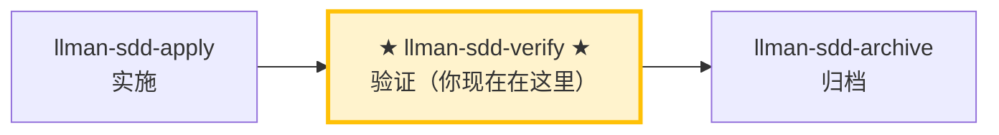

# LLMAN SDD Verify

使用此 skill 验证实现是否与该 change 的 artifacts 一致。

## Pipeline 位置

### Skill 导航（非生命周期；仅指示当前 skill）



> 📍 你现在在验证阶段 → 通过后下一步 `llman-sdd-archive`（归档）；失败则回到 `llman-sdd-apply`（修复）。对应 Git-native 图中的 **I（verify）**，对象应已 Specs-landed（`readyToImplement=true`）。
> 🗺️ Skill 导航 ≠ Git-native 生命周期；完整生命周期见底部 brief 单元。

## 硬约束

- **必须先通过 apply 阶段全绿**：未完成实现的 change 跳过验证。
- **CRITICAL 必须修复**：标记为 CRITICAL 的问题归档前必须修复。
- **不要问「要不要继续」**：跑完整个验证流程，输出完整报告。

## 步骤
1. 确定 change id（不明确时让用户从 `llman sdd list --json` 选择）。
## 阶段守卫（`stage` / `readyToImplement`）

用权威 JSON 判定（勿凭「完整工件」口头说法）：

```bash
llman sdd show <id> --json --type change
```

解读字段：`stage`、`specsLanded`、`skipSpecsLanding`、`readyToImplement`。

| 条件 | 动作 |
|------|------|
| `stage=draft`（仅 proposal.md） | STOP。长大到 Designed（proposal + tasks；design 按需）→ Branch binding → Specs landing。draft 不能直接 apply/verify。若已有 proposal+design+tasks 仍是 `draft`：未 start/attach —— 在默认分支干净树跑 `change start`，或手动建分支后 `change attach`。**不要**建 `changes/<id>/specs/`，**不要**先在默认分支改 live specs。 |
| `stage=designed` | STOP。先 `change start` / `attach`（Branch binding）。 |
| `stage=full` 且 `readyToImplement=false` | STOP。在**绑定分支**完成 Specs landing（编辑 `llmanspec/specs/**` 并 commit），或设 `skip_specs_landing`。**不要**再跑 `change start`。丢失绑定分支 specs → checkout/重建 + 必要时 `attach --force`。 |
| `readyToImplement=true` | 可通过 apply/verify 前置检查。`changes/<id>/specs/` 预期**不存在**，勿当缺失。 |
3. 先跑一个快速校验门禁：
   - `llman sdd validate <id> --strict --no-interactive`
   - **诊断结构问题（Gherkin 解析 / `@req` 链接 / 双写 / 全局 req_id 唯一性）时优先加 `--no-check`**（BDD-on 下跳过可能耗时的 `bdd.run_command`），结构门禁全绿后再跑完整 `--check`（full mode）。`FAIL <item_type>/<id>` 行会逐条列出失败项（在 Totals 行上方）。
4. 阅读：
   - feature 分支上的 live specs：`llmanspec/specs/**`（`spec.toon` + 配置了 `bdd:` 时的 `*.feature`）——SSOT
   - `proposal.md` 与 `design.md`（如存在）
   - `tasks.md`（理解实现范围）
   - `llmanspec/changes/<id>/specs/` 若残留旧文档可忽略；SSOT 是 live specs
5. **双轴审查（标准轴 + 合约轴分离，互不掩盖）**——对比 diff（`git diff <merge-base>...HEAD`，merge-base 取 attach 的 base_sha 或 `main`）分两轴：
   - **合约轴（Spec）**：实现是否满足 `spec.toon` 的 MUST/SHALL 与 `*.feature` 的 GWT。
     - 缺失/部分实现的行为、错误实现、以及 diff 中未被 spec 要求的超范围改动。
     - 给出最小修复建议，或建议更新 artifacts。
   - **标准轴（Standards）**：代码是否符合 `AGENTS.md` 的编码规范 + 常见代码坏味（code smell）清单。
     - **权威优先级**：`AGENTS.md` 文档规范 > 坏味清单（文档说了算）；工具已强制的项跳过。
     - 坏味标记为**判断性提示**（「可能是 Feature Envy」），不是硬性违规。
     - 坏味清单（每项「是什么 → 怎么修」）：Mysterious Name（名不达意→重命名）/ Duplicated Code（重复逻辑→抽取共享）/ Feature Envy（方法更爱用别人的数据→移过去）/ Data Clumps（同组字段到处走→打包成类型）/ Primitive Obsession（原始类型充当领域概念→给专门类型）/ Repeated Switches（同类 switch 反复出现→多态或共享 map）/ Shotgun Surgery（一处改动散落多处→聚到一模块）/ Divergent Change（一文件因多无关原因被改→拆分）/ Speculative Generality（为未发生的需求加抽象→删除）/ Message Chains（长链 a.b().c()→隐藏于一方法）/ Middle Man（只转发→删掉直连）/ Refused Bequest（子类拒绝大部继承→改组合）。
   - 两轴可并行（sub-agent）审查；报告 MUST 分离呈现，MUST NOT 合并或交叉重排（一轴通过不能掩盖另一轴失败）。
6. **BDD-on 验证（Git-native Partitioned SSOT）**——仅当 `config.yaml` 含 `bdd:` 段时：
   - 确认 change 已 attach，且当前在对应 feature 分支上。
   - `llman sdd validate --specs`：Gherkin + `@req`/双写门禁；默认跑 `bdd.run_command`（可用 `--no-check` 跳过）。
   - 可选只读审查：`llman sdd change diff <id>`（或 `--export-patch <path>`）。diff 仅作审查/导出——绝不当作 apply 步骤。
   - 检查：可执行 GWT 只在 live `.feature`；`morphology.dualWriteCount` 应为 0；若已有活跃 `*.feature.delta.toon` 则先迁移（不要自创 solidify/找补步骤）。
   - verify 通过后下一步：`llman-sdd-archive`（勿在此 inline finalize）。

   - 额外要求: Each scenario in the feature file MUST be mapped to an implemented step definition. Run `cargo test --test bdd` to confirm all scenarios pass.

7. 输出简短报告：
   - **CRITICAL**（归档前必须修复）
   - **WARNING**（建议修复）
   - **SUGGESTION**（可选优化）
8. 若存在 CRITICAL，建议用 `llman-sdd-apply` 修复；若通过则建议 `llman-sdd-archive` 进行 finalize/archive。

> 💡 验证通过 → 下一步 `llman-sdd-archive`（归档）；有 CRITICAL → 回到 `llman-sdd-apply`（修复）

## Git-native 生命周期（摘要）

勿混淆：**Skill 导航** ≠ **Git-native 生命周期**。全图见根 `AGENTS.md`「领域概念区分」或 `llman-sdd-propose` 内嵌全图。

硬规则：
1. **先** Branch binding（`change start` / `attach`）→ Full；**再** Specs landing（绑定分支编辑并 commit `llmanspec/specs/**`）。
2. 无 live 合约变更 → `skip_specs_landing: true`。apply 前须 `readyToImplement=true`。
3. **禁止**在默认分支 commit live specs；已 attach 勿重复 `start`。
行动前先阅读 `llmanspec/config.yaml`，并遵循其中的 `context` 与 `rules`（若有）。

常用命令：
- `llman sdd context --task "<描述>" --paths "<文件>"`（找相关 specs）。使用 pageindex agentic tree 后端（需 `LLMAN_SDD_INDEX_CHAT_MODEL`）。可用 `LLMAN_SDD_INDEX_BACKEND` 预设。
- `llman sdd list`（列出变更）
- `llman sdd list --specs`（列出 specs 及 purpose/scope 元数据）
- `llman sdd show <id>`（展示 change/spec；`--type change --output json` 含 `stage` / `specsLanded` / `skipSpecsLanding` / `readyToImplement`——apply 门禁看 `readyToImplement`，勿凭「完整工件」）
- `llman sdd validate <id>`（校验 change 或 spec）
- `llman sdd validate --all`（批量校验）
- `llman sdd index rebuild`（重建 pageindex 树索引——不需要模型）
- `llman sdd index check`（检查索引新鲜度）
- `llman sdd change new <id>`（仅创建规划壳草稿 `changes/<id>/proposal.md`；不写 live specs）
- `llman sdd change start <id> [--worktree]`（Designed→Full：干净树且在默认分支 → 创建 `sdd/<id>` 分支 + attach；仅 Branch binding，不等于 Specs landing，不等于可 apply）
- `llman sdd change attach <id> [--force]`（绑定已有非默认 feature 分支 + base SHA；拒绝绑到默认分支）
- `llman sdd change finalize <id> [--no-check]`（**推荐单 commit 收尾**——verify 之后；不要求干净树；门禁 + 自动 ff-merge + 文档改名）
- `llman sdd change checkpoint <id> [--no-check]`（干净工作区 + 归档前门禁；严格 sha = HEAD；finalize 的 fallback）
- `llman sdd change diff <id> [--export-patch <path>]`（只读 `base...HEAD` 审查/导出）
- `llman sdd change archive <id>`（封存：自动 ff-merge 到默认分支，再改名到 `changes/archive/`；单 commit 收尾优先 `finalize`）
- `llman sdd archive freeze [--before YYYY-MM-DD] [--keep-recent N] [--dry-run]`（冻结已归档目录）
- `llman sdd archive thaw [--change <id> ...] [--dest <path>]`（从冷备份恢复）
- `llman sdd graph [CHANGE] [--format mermaid] [--scope active|archived|all] [--depth N]`（生成变更依赖图）
- `llman sdd project migrate --kind spec-md2toon`（`.md`+fence → 独立 `.toon`；`partitioned` 已移除）

## Context
- 执行前先确认当前 change/spec 状态。
- 优先使用 `llman sdd context --task --paths` 获取相关 specs，而非全量读取或猜测。

## Goal
- 明确本次命令/skill 要达成的可验证结果。

## Constraints
- 变更保持最小化且范围明确。
- 标识符或意图不明确时禁止猜测。
- 在读取 spec 全文前，先使用 `llman sdd context --task --paths` 获取相关 specs。
- 判断变更规模后选择路径：行为合约变更走完整 SDD（Branch binding → Specs landing → `readyToImplement` → apply）；实现变更走快速路径（live specs 仍须绑定分支）。
- 勿混淆 Skill 导航与 Git-native 生命周期；勿在默认分支编辑 live `llmanspec/specs/**`。

## Workflow
- 以 `llman sdd` 命令结果为事实来源。
- 涉及文件/规范变更时执行校验。
- 首选 `llman sdd context` 获取相关 specs，而非全量读取或猜测。
- 当 context 不可用时，按错误提示处理（重建 index 或降级到 `list --specs --json`）。

## Decision Policy
- 高影响歧义必须先澄清。
- 已知校验错误下禁止强行继续。

## Output Contract
- 汇总已执行动作。
- 给出结果路径与校验状态。

## Ethics Governance
- `ethics.risk_level`：按 `low|medium|high|critical` 标注风险等级。
- `ethics.prohibited_actions`：列出绝对禁止执行的动作。
- `ethics.required_evidence`：列出高影响输出前必须具备的证据。
- `ethics.refusal_contract`：定义何时拒答以及安全替代响应方式。
- `ethics.escalation_policy`：定义何时必须升级为用户确认/人工复核。
