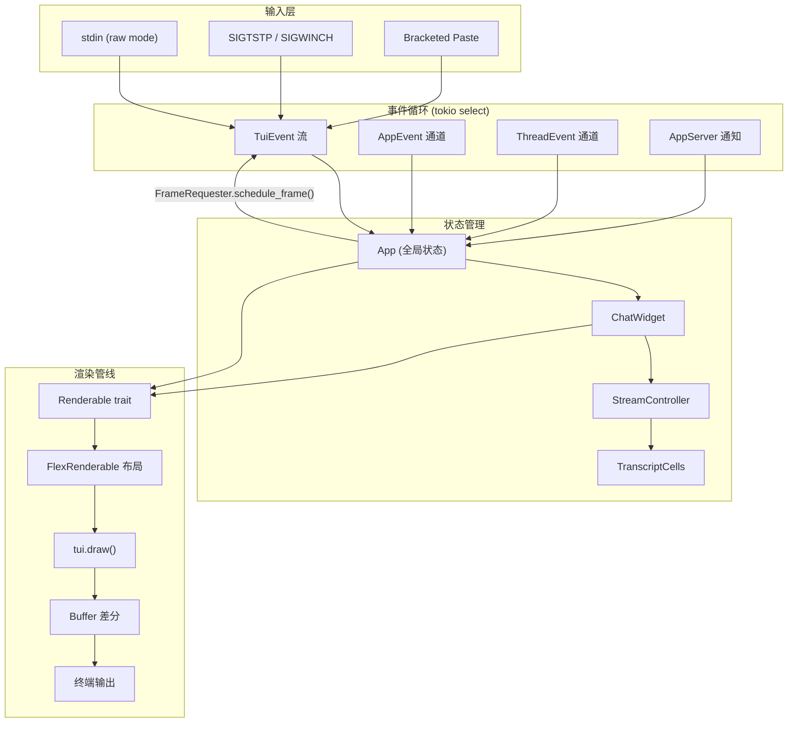
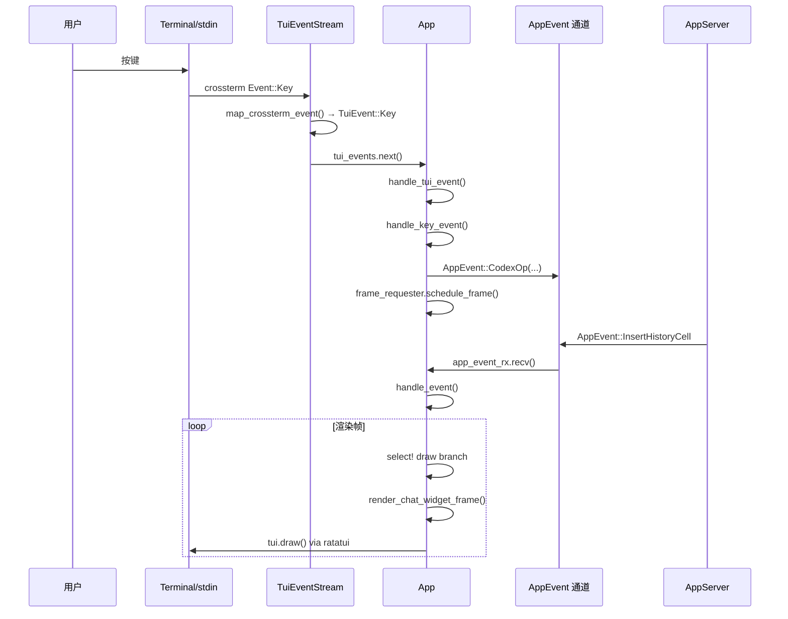
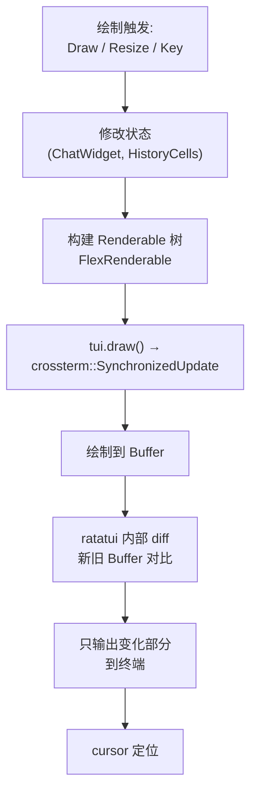
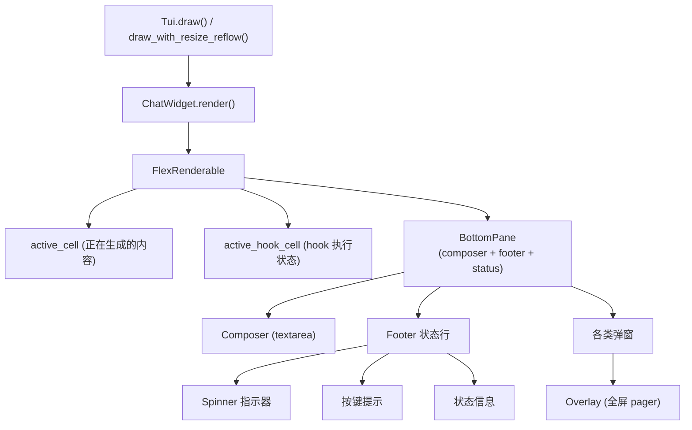
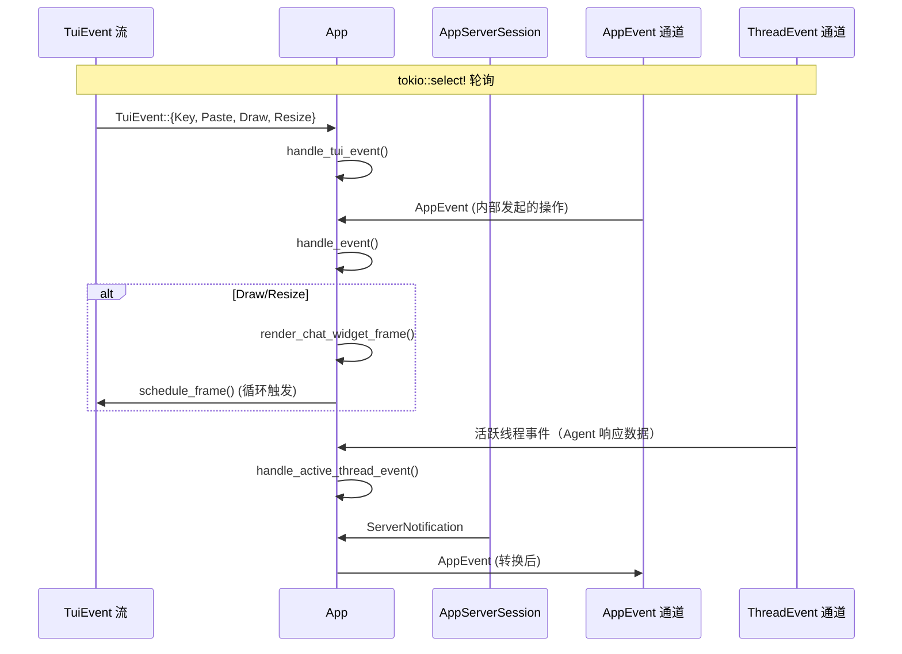
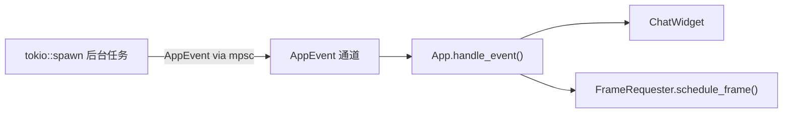
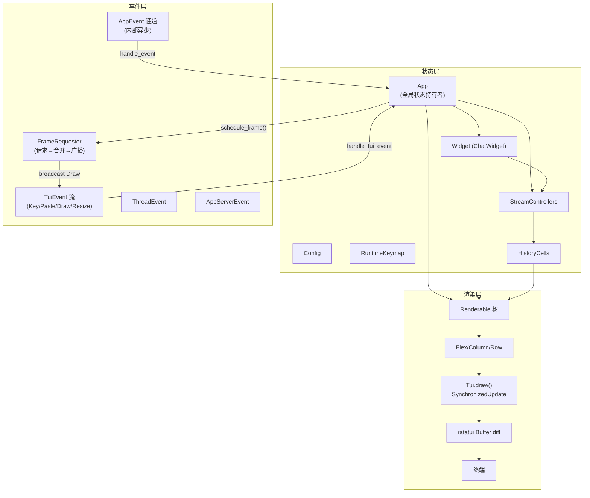

# tui-expert-of-codex

> 基于 OpenAI Codex CLI 项目的 TUI/CLI 交互层深度分析。Codex CLI 是一个用 Rust 编写的、运行在终端中的 Coding Agent，其 TUI 层基于 `ratatui` + `crossterm` 构建，体现代码量大（数百个模块文件）、技术深度高的工业级终端应用经验。

---

## 1. 总体架构

### 1.1 技术栈

| 层次 | 技术选型 |
|------|----------|
| 终端框架 | [ratatui](https://github.com/ratatui/ratatui)（基于立即模式渲染） |
| 后端/输入 | [crossterm](https://github.com/crossterm-rs/crossterm)（跨平台终端控制） |
| 异步运行时 | tokio（多通道 select 事件驱动） |
| 渲染模式 | 立即模式 + 差分更新（ratatui 内置 Buffer diff） |
| 排版 | 自定义 `Renderable` trait + `FlexRenderable`（Flutter 风格弹性布局） |
| 流式处理 | 新行门控（newline-gated）+ 双区域流模型（stable + mutable tail） |
| Markdown 渲染 | 自实现 markdown → `Vec<Line>` 管线 |
| 颜色探测 | `supports-color` crate + 自定义终端调色板探测 |

### 1.2 顶层数据流



### 1.3 核心文件结构

```
tui/src/
├── main.rs                      # 入口, arg0 dispatch
├── lib.rs                       # run_main, run_ratatui_app 启动编排
├── tui.rs                       # Tui struct: 终端生命周期, draw, alt_screen
├── tui/
│   ├── event_stream.rs          # EventBroker + TuiEventStream
│   ├── frame_rate_limiter.rs    # 120 FPS limiter
│   ├── frame_requester.rs       # FrameScheduler (actor 模式)
│   ├── job_control.rs           # ^Z suspend/resume
│   └── keyboard_modes.rs        # 键盘增强, 终端检测
├── app.rs                       # App struct + 主事件循环
├── app/
│   ├── input.rs                 # 键盘分发
│   ├── event_dispatch.rs        # AppEvent 路由
│   └── ...
├── render/
│   ├── mod.rs                   # Insets, RectExt
│   ├── renderable.rs            # Renderable trait + Column/Flex/Row 布局
│   └── highlight.rs             # 语法高亮
├── streaming/
│   ├── mod.rs                   # StreamState (队列管理)
│   ├── controller.rs            # StreamCore + StreamController + PlanStreamController
│   └── chunking.rs              # 自适应批量 drain
├── chatwidget.rs                # ChatWidget (主聊天 UI)
├── chatwidget/
│   ├── rendering.rs             # ChatWidget 渲染组合
│   └── streaming.rs             # 流式渲染集成
├── keymap.rs                    # RuntimeKeymap
├── style.rs                     # 自适应背景样式
├── color.rs                     # 颜色工具: blend, perceptual_distance
├── terminal_palette.rs          # 终端颜色能力探测
├── terminal_probe.rs            # 启动期终端探测 (100ms 超时)
├── custom_terminal.rs           # 自定义 Terminal + Frame
├── markdown_stream.rs           # 新行门控的 markdown 收集器
├── clipboard_paste.rs           # 剪贴板粘贴 (含图片)
├── notifications/               # 桌面通知
└── pets/                        # 宠物动画 (sixel 图像渲染)
```

---

## 2. 事件循环与输入处理

### 2.1 事件循环实现

Codex CLI 使用 **tokio `select!` 多路复用** 五个事件源：



主循环位于 `app.rs#L1108-L1167` — 这是一个 `select!` 宏同时等待：

```rust
// app.rs#L1109-L1156
loop {
    let control = select! {
        Some(event) = app_event_rx.recv() => { /* AppEvent 处理 */ }
        active = async { /* 线程事件 */ } => { /* 活跃线程事件 */ }
        event = tui_events.next() => { /* TuiEvent 处理 */ }
        app_server_event = app_server.next_event() => { /* 服务端推送 */ }
    };
}
```

**四个通道的优先级在编译期由 select! 的公平轮转保证**，而 TuiEventStream 内部也有 draw 事件和 crossterm 事件之间的轮转 (`event_stream.rs#L268-L291`)。

### 2.2 EventBroker 设计

关键设计：**crossterm EventStream 在被 drop 后才会完全释放 stdin**。为了能临时交出终端（如运行外部编辑器时），设计了 `EventBroker`：

- `event_stream.rs#L51-L54`: `EventBroker` 持有 `Mutex<EventBrokerState<S>>`，状态为 `Paused | Start | Running`
- `event_stream.rs#L90-L96`: `pause_events()` — 将状态设为 `Paused`，drop 底层事件源
- `event_stream.rs#L99-L106`: `resume_events()` — 设为 `Start`，触发 `watch` 通知
- `event_stream.rs#L178-L222`: `poll_crossterm_event()` — Poll 时如果 broker 为 `Paused`，转为 poll `resume_stream` 等待唤醒

### 2.3 终端初始化与原始模式

`tui.rs#L168-L182` — `set_modes()`:
```rust
pub fn set_modes() -> Result<()> {
    execute!(stdout(), EnableBracketedPaste)?;
    enable_raw_mode()?;
    keyboard_modes::enable_keyboard_enhancement();
    let _ = execute!(stdout(), EnableFocusChange);
    Ok(())
}
```

- **Bracketed Paste** (`EnableBracketedPaste`): 启用括号粘贴模式以区分粘贴与直接输入
- **Keyboard Enhancement** (`DISAMBIGUATE_ESCAPE_CODES | REPORT_EVENT_TYPES | REPORT_ALTERNATE_KEYS`): 增强键盘模式使 Ctrl+Enter 等组合键可被区分
- **Focus Change** (`EnableFocusChange`): 监听终端焦点事件，用于桌面通知条件判断

### 2.4 启动探针 (Terminal Probe)

`terminal_probe.rs#L31` — 使用 **100ms 超时**（而非 crossterm 默认的 2 秒）做启动探测：
- 光标位置 (`DEFAULT_TIMEOUT = 100ms`)
- 默认前景/背景色 (OSC 10 / OSC 11)
- 键盘增强支持度

`tui.rs#L359-L392` — 探测结果用于初始化阶段：设置默认颜色、确定 viewport 起始位置、决定是否启用增强键盘。

### 2.5 跨平台键盘增强检测

`tui/keyboard_modes.rs` 有复杂的终端兼容性逻辑：

- `keyboard_modes.rs#L18-L38`: 通过环境变量 `CODEX_TUI_DISABLE_KEYBOARD_ENHANCEMENT` 和 WSL + VSCode 自动检测来控制是否启用
- `keyboard_modes.rs#L141-L167`: tmux 检测——是否启用 `modifyOtherKeys` 模式取决于 `extended-keys-format` 是否为 `csi-u`
- `keyboard_modes.rs#L98-L119`: WSL 环境通过执行 `cmd.exe /c set TERM_PROGRAM` 探测 Windows 侧的终端类型

### 2.6 粘贴模式处理

`app.rs#L1227-L1233` — 粘贴事件中的 `\r` → `\n` 标准化：
```rust
TuiEvent::Paste(pasted) => {
    let pasted = pasted.replace("\r", "\n");
    self.chat_widget.handle_paste(pasted);
}
```
这是为了兼容 iTerm2 等终端在粘贴时将换行转换为 CR 的行为。

### 2.7 函数式按键映射 (key_hint)

`key_hint` 模块（`src/key_hint.rs`）和 `keymap.rs` 实现了**声明式键映射系统**：

- 三层优先级：`context 特定` → `global 回退` → `内置默认值`
- `RuntimeKeymap` 包含 `app`, `chat`, `composer`, `editor`, `vim_normal`, `vim_operator`, `pager`, `list`, `approval` 九组上下文
- 支持冲突检测：同一键在 app 和 composer 上下文中不可重复绑定

---

## 3. 渲染管线

### 3.1 渲染策略

Codex CLI 采用 **ratatui 的立即模式 + 差分更新**：



### 3.2 帧调度与限速

**FrameRequester** (`tui/frame_requester.rs`) 采用 **actor 风格设计**：

- `FrameRequester` 是轻量级可 clone 的 handle
- `FrameScheduler` 是后台异步任务，使用 `mpsc` 通道接收请求
- **合并 (coalescing)**：多个 `schedule_frame()` 调用在 deadline 到期前只会发送一次 draw 通知
- **120 FPS 上限** (`frame_rate_limiter.rs#L13`): `MIN_FRAME_INTERVAL = 8.333ms`

```rust
// frame_requester.rs#L96-L127
async fn run(mut self) {
    let mut next_deadline: Option<Instant> = None;
    loop {
        let target = next_deadline.unwrap_or_else(|| Instant::now() + ONE_YEAR);
        tokio::select! {
            draw_at = self.receiver.recv() => {
                let draw_at = self.rate_limiter.clamp_deadline(draw_at);
                next_deadline = Some(next_deadline.map_or(draw_at, |cur| cur.min(draw_at)));
                continue;  // 不立即发通知，回到 select 等待
            }
            _ = &mut deadline => {
                // 真正发送 draw 通知
                let _ = self.draw_tx.send(());
            }
        }
    }
}
```

关键技巧：**永不立即发送 draw 通知** — 每次收到请求后回到 select 循环并更新 deadline，这样在同一个 deadline 窗口内的多个请求会被合并为一次发送。

### 3.3 同步更新 (Synchronized Update)

`tui.rs#L800-L851` — `draw()` 方法使用 `crossterm::SynchronizedUpdate`：
```rust
stdout().sync_update(|_| {
    // viewport 调整、历史行刷新、suspend 恢复
    terminal.draw(|frame| { draw_fn(frame); })
})?
```
这确保了整个绘制过程是一个原子的终端更新，避免中间状态暴露。

### 3.4 双渲染路径

Codex CLI 有两套渲染路径，通过特性开关控制：

1. **Legacy `draw()`** (`tui.rs#L784-L851`): 包含 `pending_viewport_area` 启发式逻辑，在 resize 时通过光标位置变化推断 viewport 偏移
2. **Resize-Reflow `draw_with_resize_reflow()`** (`tui.rs#L902-L947`): viewport 调整由 `update_inline_viewport_for_resize_reflow()` 处理，不从光标位置推断

### 3.5 自定义 Terminal

`custom_terminal.rs` — 从 ratatui `Terminal` 派生并增强：

- `Frame` 结构体 (`custom_terminal.rs#L82-L97`): 包含 `cursor_position`, `cursor_style`, `viewport_area`, `buffer` 四个字段
- `viewport_area` 追踪：支持滚动历史 > 可见区域的两层结构
- `last_known_screen_size` 和 `last_known_cursor_pos` 用于 resize 启发式

---

## 4. 组件/视图系统

### 4.1 Renderable Trait

`render/renderable.rs#L14-L23` — 自定义 `Renderable` trait，是比 ratatui `Widget` 更接近应用层的抽象：

```rust
pub trait Renderable {
    fn render(&self, area: Rect, buf: &mut Buffer);
    fn desired_height(&self, width: u16) -> u16;  // 用于弹性布局
    fn cursor_pos(&self, _area: Rect) -> Option<(u16, u16)>;
    fn cursor_style(&self, _area: Rect) -> SetCursorStyle;
}
```

核心特点：
- `desired_height()` 使**弹性布局**成为可能 — 父容器在布局前就能知道子组件需要的高度
- `cursor_pos()` 和 `cursor_style()` 支持**光标代理** — 只有实际拥有光标的组件才需要实现

### 4.2 Flex 布局系统

**Flutter 风格 Flex 布局** (`render/renderable.rs#L246-L362`):

```rust
pub struct FlexRenderable<'a> {
    children: Vec<FlexChild<'a>>,  // 每个孩子有 flex factor
}
```

布局算法分为两步：
1. 为非弹性孩子分配空间（按 `desired_height`）
2. 将剩余空间按 `flex` 比例分配给弹性孩子
3. 最后一个弹性孩子获得全部剩余空间（消除舍入误差）

### 4.3 行、列和内嵌布局

- `ColumnRenderable` (`render/renderable.rs#L170-L245`): 垂直堆叠，适合组成从上到下的界面
- `RowRenderable` (`render/renderable.rs#L364-L436`): 水平排列，支持宽度溢出截断
- `InsetRenderable` (`render/renderable.rs#L438-L460`): 在渲染区域周围添加 padding

### 4.4 ChatWidget 组件树



### 4.5 Overlay / 全屏 Pager

`app.rs#L1220-L1283` — `Overlay` 全屏覆盖层用于：
- Diff 查看 (`AppEvent::DiffResult` → `enter_alt_screen` + pager lines)
- 审批请求 (`FullScreenApprovalRequest`)
- 历史回顾

当 `self.overlay.is_some()` 时，TUI 事件全部委托给 `handle_backtrack_overlay_event()`，普通逻辑被短路。

---

## 5. 状态管理与数据流

### 5.1 全局状态组织

App 作为全局状态容器，持有：

| 状态组件 | 说明 |
|---------|------|
| `chat_widget: ChatWidget` | 所有 UI 状态（转录、composer、弹窗、流式控制器） |
| `config: Config` | 用户配置 |
| `keymap: RuntimeKeymap` | 实时键映射 |
| `transcript_cells: Vec<Arc<dyn HistoryCell>>` | 完整的对话历史（用于 overlay） |
| `overlay: Option<Overlay>` | 当前覆盖层 |
| `app_event_tx: mpsc::UnboundedSender<AppEvent>` | 自身事件发送器（跨任务通信用） |

### 5.2 四通道事件系统



### 5.3 流式生成的状态管理

**双区域流模型** (`streaming/controller.rs#L63-L91`):

```
StreamCore {
    raw_source: String,      // 累积的原始 markdown
    rendered_lines: Vec<Line<'static>>,  // 全部渲染行
    emitted_stable_len: usize,  // 已提交到 scrollback 的行数
    enqueued_stable_len: usize, // 已入动画队列的行数
    state: StreamState {         // 动画队列
        queued_lines: VecDeque<QueuedLine>,
        collector: MarkdownStreamCollector,
    }
}
```

三个长度值的关系：`emitted_stable_len <= enqueued_stable_len <= rendered_lines.len()`

1. Agent 发送 markdown token delta
2. `MarkdownStreamCollector` 在新行边界提交完整源
3. `StreamCore::push_delta()` 重新渲染 → 计算 stable/tail 分界 → 入队新 stable 行
4. commit tick 驱动队列逐行或批量弹出（动画效果）
5. 未完成的行（含表格检测）留在 **mutable tail** 区域

### 5.4 表格 Holdback 机制

`streaming/controller.rs#L378-L403` — 表格渲染需要等行列结构完整后才能显示，否则列宽变化会导致跳动：

- `TableHoldbackState::None` → 无表格，直接提交
- `TableHoldbackState::PendingHeader` → 见到表头行但未见分隔线，暂缓
- `TableHoldbackState::Confirmed` → 表头+分隔线确认，从指定行开始保留为 tail
- 表格结束后 `finalize()` 一次性将完整表格渲染为稳定行

---

## 6. 异步任务与 UI 反馈

### 6.1 后台任务通信模式



典型模式：`spawn` 后台任务执行 I/O（如 API 调用、文件搜索），完成后通过 `app_event_tx.send(AppEvent::...)` 发送事件回到主循环。

### 6.2 打字机动画效果

```rust
// streaming/controller.rs#L166-L184
fn tick(&mut self) -> Vec<Line<'static>> {
    let step = self.state.step();    // 每次出队一行
    self.emitted_stable_len += step.len();
    step
}

fn tick_batch(&mut self, max_lines: usize) -> Vec<Line<'static>> {
    let step = self.state.drain_n(max_lines);
    self.emitted_stable_len += step.len();
    step
}
```

- **逐行** `tick()`: 单步动画
- **批量** `tick_batch()`: 压力大时一次出队多行
- `commit_tick` 模块 (`streaming/commit_tick.rs`) 根据队列深度和行龄自动选择单步/批量模式

### 6.3 ^Z 暂停/恢复

`tui/job_control.rs` — SUSPEND 支持：

- `SuspendContext` 追踪当前 inline viewport 的底部行
- `suspend()` 时根据是否在 alt screen 选择不同恢复路径
- `RawModeRestore::Disable vs Keep`: 运行外部程序时是否保留 raw mode
- `KeyboardRestore::PopStack vs ResetAfterExit`: 退出进程时使用更强的键盘复位

### 6.4 外部编辑器集成

`tui.rs#L576-L608` — `with_restored()` 方法是临时交出终端控制的通用模式：

1. `pause_events()` — 丢弃 crossterm EventStream 释放 stdin
2. `leave_alt_screen()` — 退出 alt screen
3. `restore()` — 恢复终端模式（可选保持 raw mode）
4. 运行外部程序
5. `set_modes()` — 重新设置 Codex 终端模式
6. `flush_terminal_input_buffer()` — 清除缓冲中残留按键
7. `enter_alt_screen()` — 回到 alt screen
8. `resume_events()` — 重建 EventStream

### 6.5 任务取消与并行处理

- **Commit 动画** (`app/event_dispatch.rs#L278-L295`): 使用 `AtomicBool` 控制动画线程的生命周期
- **线程切换**: `primary_thread_id` 和 `active_thread_id` 管理多个并发 Agent 会话

---

## 7. 样式与主题

### 7.1 自适应背景检测

`style.rs#L25-L30` — 样式根据终端实际背景色动态调整：

```rust
pub fn user_message_style_for(terminal_bg: Option<(u8, u8, u8)>) -> Style {
    match terminal_bg {
        Some(bg) => Style::default().bg(user_message_bg(bg)),
        None => Style::default(),  // 未知背景时使用默认样式
    }
}
```

### 7.2 颜色混合与感知距离

`color.rs` 实现了完整的颜色工具链：

- `is_light()` (L.1-5): 用加权亮度公式判断背景深浅
- `blend()` (L.7-12): Alpha 混合前景/背景
- `perceptual_distance()` (L.16-75): CIE76 颜色距离（完整 sRGB→XYZ→Lab 转换）

### 7.3 终端颜色能力探测

`terminal_palette.rs#L12-L19` — 根据 `supports-color` 探测结果选择颜色模式：

```rust
pub fn stdout_color_level() -> StdoutColorLevel {
    match supports_color::on_cached(supports_color::Stream::Stdout) {
        Some(level) if level.has_16m => StdoutColorLevel::TrueColor,
        Some(level) if level.has_256 => StdoutColorLevel::Ansi256,
        Some(_) => StdoutColorLevel::Ansi16,
        None => StdoutColorLevel::Unknown,
    }
}
```

`best_color()` (`terminal_palette.rs#L32-L47`) — 将目标 RGB 颜色映射到终端支持的最佳值：
- **TrueColor** 终端 → 直接输出 RGB
- **256 色** 终端 → 计算到 xterm 固定色板的感知距离，选最近者
- **16 色** 或未知 → 使用默认色

### 7.4 高亮与语法着色

`render/highlight.rs` — 自定义语法高亮系统，支持主题配置（通过 `SyntaxThemeSelected` AppEvent）。

---

## 8. 关键技巧与避坑指南

### 8.1 实现技巧 (≥10)

**技巧 1: 帧合并不立即发送** (`frame_requester.rs#L113-L117`)
收到 draw 请求时**不直接发送通知**，而是更新 deadline 后回到 select 等待。这相当于**被动去抖**——同一个 deadline 窗口内的 N 个请求只触发一次绘制。

**技巧 2: EventBroker 的 pause/resume 模式** (`event_stream.rs#L51-L115`)
通过 `Mutex<EventBrokerState>` + `watch channel` 的组合实现 stdin 的完全释放和重建。关键点在于 crossterm EventStream 的 drop 语义——只有真正 drop 了底层 stream，外部程序才能读到 stdin。

**技巧 3: 双区域流渲染** (`streaming/controller.rs#L204-L215`)
将流式输出分为 **stable 区域**（已提交到 scrollback）和 **tail 区域**（可变，仅显示在 active cell 中）。tail 在每一次 delta 后可以自由重渲染，而 stable 区域通过 commit tick 逐行推入历史。

**技巧 4: Flutter 风格弹性布局** (`render/renderable.rs#L246-L362`)
`FlexRenderable` 的 `allocate()` 两步算法：先分配非弹性孩子，再按比例分配剩余空间。最后一个弹性孩子获得全部剩余空间，避免了整数除法的舍入误差累积。

**技巧 5: 100ms 启动探针** (`terminal_probe.rs#L31`)
crossterm 默认的终端查询超时是 2 秒，这对于启动流程不可接受。Codex 实现了自定义探针，配有 **100ms 超时**，同时先用 stdio 后 fallback 到 `/dev/tty` 来提高兼容性。

**技巧 6: 交替屏幕滚轮支持** (`tui.rs#L186-L224`)
实现了自定义 `EnableAlternateScroll` / `DisableAlternateScroll` ANSI 命令（`\x1b[?1007h` / `\x1b[?1007l`），让进入 alt screen 后鼠标滚轮能翻译为方向键事件。

**技巧 7: WSL 跨环境探测** (`keyboard_modes.rs#L98-L119`)
WSL 中 Linux 进程看不到 Windows 侧的环境变量。通过执行 `cmd.exe /c set TERM_PROGRAM` 来探测 Windows 端的终端类型，从而决定键盘增强是否启用。

**技巧 8: 粘贴内容的 CR→LF 标准化** (`app.rs#L1227-L1233`)
iTerm2 等终端在粘贴时会将 `\n` 转为 `\r`。textarea 库期望 `\n`，因此需要在事件处理层做标准化转换。

**技巧 9: 逐行 vs 批量动画自适** (`streaming/controller.rs#L166-L184`)
commit tick 支持单步和批量两种模式。批量模式在队列压力大时自动启用（参见 `commit_tick.rs`），保证高吞吐时不阻塞后续数据处理。

**技巧 10: 四源 select 事件循环** (`app.rs#L1108-L1156`)
`tokio::select!` 同时轮询 4 个通道（AppEvent、ThreadEvent、TuiEvent、AppServerEvent），实现了松耦合的事件驱动架构。每个源独立运行，通过 `tokio::select!` 的公平轮转保证无源饿死。

**技巧 11: 组合式桌面通知** (`tui.rs#L75-L80`)
通知的触发条件为 `NotificationCondition::{Unfocused, Always}` 结合 `terminal_focused` 状态（通过 `Event::FocusGained / FocusLost` 更新），只有终端失焦时才发送通知，避免烦扰。

**技巧 12: disable raw mode 三态恢复** (`tui.rs#L226-L284`)
`restore_common()` 接受 `RawModeRestore::{Disable, Keep}` 和 `KeyboardRestore::{PopStack, ResetAfterExit}` 组合，在运行外部编辑器只需要部分恢复终端，而在进程退出时使用更强力的键盘复位。

### 8.2 常见陷阱与解决方案 (≥5)

**陷阱 1: crossterm EventStream 不释放 stdin**
`event_stream.rs#L10-L18` — 当 TUI 需要运行外部文本编辑器时，crossterm 的 `EventStream` 内部有一个线程持续读取 stdin。仅仅停止 poll 是不够的，因为如果停止发生在 poll 进入 Pending 之后，线程仍会继续读。**解决方案**：必须 drop 整个 EventStream（通过 `EventBroker::pause_events()`），让外部程序独占 stdin。

**陷阱 2: Resize 时屏幕闪烁 / 错位**
`tui.rs#L726-L762` — resize 时 viewport 调整是一个复杂问题。旧的启发式（`pending_viewport_area`）通过光标位置变化推断偏移量，但在 iTerm2 以外的终端可能不准确。**解决方案**：新的 `draw_with_resize_reflow()` 路径配合 `update_inline_viewport_for_resize_reflow()`，直接从终端尺寸变化计算 viewport 偏移，避免 cursor 启发式的竞态条件。

**陷阱 3: 键盘增强模式导致终端不兼容**
`keyboard_modes.rs#L16-L38` — 启用 `DISAMBIGUATE_ESCAPE_CODES` 等增强键盘标记后，某些终端（特别是 WSL 下的 VSCode）会发送不兼容的转义序列。**解决方案**：通过环境变量和自动检测（WSL+VSCode、tmux 版本）禁用键盘增强，在兼容性和功能之间做平衡。tmux 环境下还额外检测 `extended-keys-format` 是否为 `csi-u` 格式才启用。

**陷阱 4: 流式表格渲染抖动**
`streaming/controller.rs#L383-L403` — 表格的行列结构未完成前，每一行 delta 都可能改变列宽，导致已渲染行内容跳变。**解决方案**：`TableHoldbackState` 机制——检测到 pipe 表头+分隔线模式后，从表头位置起的内容全部保持为 mutable tail，直到 stream `finalize()` 时才一次性渲染。注意这要求 `MarkdownStreamCollector` 以新行为门控提交，未完成的行不能进入 stable 区。

**陷阱 5: Suspend/Resume 后的 viewport 混乱**
`tui/job_control.rs#L82-L105` — ^Z 暂停后恢复进程，终端的绝对光标位置已经改变。**解决方案**：`SuspendContext` 记录两种恢复路径：`RealignInline`（普通模式）和 `RestoreAlt`（alt screen 模式）。`prepare_resume_action()` 在 synchronized update 内部执行 viewport 调整，避免在 draw 之外操作终端。

**陷阱 6: 终端颜色查询的竞态条件**
`tui.rs#L949-L969` — `pending_viewport_area()` 会在 draw 前调用 `get_cursor_position()` 查询光标位置。如果事件 reader 也同时在查询终端，两个进程会读取彼此查询的响应，造成错乱。**解决方案**：将 `pending_viewport_area()` 的计算移到 `SynchronizedUpdate` 之外，在安全窗口提前完成 cursor 查询。

---

## 9. 可复用实现蓝图

### 9.1 推荐目录结构

```
src/tui/
├── main.rs              # 入口点 + 命令行解析
├── lib.rs               # run() 启动编排
├── tui.rs               # Tui 结构体：终端生命周期、draw、alt_screen、suspend/resume
├── tui/
│   ├── event_stream.rs  # EventBroker + 可暂停事件流
│   ├── frame_rate_limiter.rs  # FPS 限速器
│   ├── frame_requester.rs     # 帧调度 Actor
│   └── keyboard_modes.rs      # 键盘增强、终端检测
├── app.rs               # App 结构体 + 主事件循环
├── app/
│   ├── input.rs         # 键盘输入分发
│   ├── event_dispatch.rs # AppEvent → handler 映射
│   └── ...              # 按领域拆分
├── render/
│   ├── renderable.rs    # Renderable trait + Flex/Column/Row 布局
│   └── highlight.rs     # 语法高亮
├── streaming/
│   ├── mod.rs           # StreamState (队列)
│   ├── controller.rs    # 双区域流控制器
│   └── commit_tick.rs   # 自适应批量策略
├── widget/
│   ├── mod.rs           # 主 Widget（如 ChatWidget）
│   ├── input.rs         # 输入框 / textarea
│   ├── status.rs        # 状态行 / spinner
│   ├── footer.rs        # 底部提示
│   └── popup.rs         # 弹窗系统
├── style.rs             # 自适应样式
├── color.rs             # 颜色工具
├── terminal_palette.rs  # 终端颜色能力探测
├── terminal_probe.rs    # 启动期终端探测
├── clipboard.rs         # 剪贴板
└── notifications.rs     # 桌面通知
```

### 9.2 核心接口定义（伪代码）

```rust
// === Renderable Trait ===
pub trait Renderable {
    fn render(&self, area: Rect, buf: &mut Buffer);
    fn desired_height(&self, width: u16) -> u16;
    fn cursor_pos(&self, area: Rect) -> Option<(u16, u16)>;
    fn cursor_style(&self, area: Rect) -> SetCursorStyle;
}

// === Flex 弹性布局 ===
pub struct FlexChild<'a> {
    flex: i32,                          // flex factor (0 = 非弹性)
    child: Box<dyn Renderable + 'a>,
}

pub struct FlexRenderable<'a> {
    children: Vec<FlexChild<'a>>,
}
// allocate() 两步算法：非弹性分配 → 弹性按比例分配

// === 事件系统 ===
pub enum TuiEvent {
    Key(KeyEvent),
    Paste(String),
    Resize,
    Draw,
}

pub trait EventSource: Send + 'static {
    fn poll_next(self: Pin<&mut Self>, cx: &mut Context<'_>) -> Poll<Option<EventResult>>;
}

pub struct EventBroker<S: EventSource> {
    state: Mutex<EventBrokerState<S>>,
    resume_events_tx: watch::Sender<()>,
}
// pause_events(): Drop 底层事件源，释放 stdin
// resume_events(): 重建事件源

// === 帧调度 ===
pub struct FrameRequester {
    frame_schedule_tx: mpsc::UnboundedSender<Instant>,
}
// schedule_frame(): 请求立即绘制
// schedule_frame_in(dur): 请求延迟绘制
// 内部 FrameScheduler: 合并请求 + 120FPS 限速

// === 双区域流控制器 ===
pub struct StreamCore {
    state: StreamState,
    raw_source: String,
    rendered_lines: Vec<Line<'static>>,
    enqueued_stable_len: usize,
    emitted_stable_len: usize,
}
// push_delta(delta) → 新行提交 + stable/tail 分区
// tick() / tick_batch(n) → 逐行/批量推出
// set_width() → resize 时重新渲染
// finalize() → 输出剩余行
```

### 9.3 事件/渲染/状态耦合关系



### 9.4 通用代码骨架

**主事件循环骨架：**

```rust
async fn run_loop(
    tui: &mut Tui,
    app: &mut App,
    app_server: &mut AppServerSession,
) -> Result<ExitReason> {
    let app_event_rx = app.event_receiver();   // mpsc 通道
    let tui_events = tui.event_stream();        // 广播 + crossterm
    tokio::pin!(tui_events);

    let mut server_events_active = true;

    loop {
        let control = tokio::select! {
            // 1. 内部 AppEvent（异步任务完成的回调）
            Some(event) = app_event_rx.recv() => {
                app.handle_event(tui, app_server, event).await?
            }
            // 2. TUI 事件（键盘、粘贴、resize、绘制）
            Some(event) = tui_events.next() => {
                app.handle_tui_event(tui, app_server, event).await?
            }
            // 3. 服务端推送事件
            Some(event) = app_server.next_event(), if server_events_active => {
                app.handle_server_event(event).await;
                AppRunControl::Continue
            }
            // 4. 活跃流线程事件
            Some(event) = active_thread_rx.next() => {
                app.handle_thread_event(tui, app_server, event).await?
            }
        };

        match control {
            AppRunControl::Continue => continue,
            AppRunControl::Exit(reason) => break reason,
        }
    }
}
```

**初始化和清理骨架：**

```rust
pub fn init() -> Result<InitializedTerminal> {
    set_modes()?;                           // 原始模式 + 粘贴 + 键盘增强
    flush_terminal_input_buffer();
    set_panic_hook();                       // panic 时恢复终端
    let probe = startup_probe(100ms)?;      // 短超时终端探针
    let terminal = CustomTerminal::new(crossterm_backend, probe.cursor_pos)?;
    Ok(InitializedTerminal { terminal, enhanced_keys_supported })
}

pub fn restore() -> Result<()> {
    disable_raw_mode();
    DisableBracketedPaste;
    PopKeyboardEnhancementFlags;
    SetCursorStyle::DefaultUserShape, Show;
}

pub fn restore_after_exit() -> Result<()> {
    // 使用更强的 ResetKeyboardEnhancementFlags
    // 防止父 shell 继承增强键盘报告
}
```

---

## 10. 源码引用索引

| 文件路径 | 行号 | 章节 | 内容 |
|---------|------|------|------|
| `tui/src/tui.rs` | L66-69 | 1 | `InitializedTerminal` 定义 |
| `tui/src/tui.rs` | L168-182 | 2.3 | `set_modes()` 终端初始化 |
| `tui/src/tui.rs` | L238-284 | 2.3 | `restore_common()` / `restore()` / `restore_after_exit()` |
| `tui/src/tui.rs` | L305-339 | 2.3 | `flush_terminal_input_buffer()` 跨平台实现 |
| `tui/src/tui.rs` | L342-426 | 2.4 | `init()` 终端初始化完整流程 |
| `tui/src/tui.rs` | L443-449 | 2.3 | `set_panic_hook()` 崩溃恢复 |
| `tui/src/tui.rs` | L466-486 | 1 | `Tui` 结构体定义 |
| `tui/src/tui.rs` | L506-532 | 1 | `Tui::new()` |
| `tui/src/tui.rs` | L561-569 | 2.2 | `pause_events()` / `resume_events()` |
| `tui/src/tui.rs` | L576-608 | 6.4 | `with_restored()` 暂交终端控制 |
| `tui/src/tui.rs` | L638-654 | 2.1 | `event_stream()` 创建 TuiEventStream |
| `tui/src/tui.rs` | L658-677 | 4.5 | `enter_alt_screen()` |
| `tui/src/tui.rs` | L680-692 | 4.5 | `leave_alt_screen()` |
| `tui/src/tui.rs` | L726-762 | 3.4 | `update_inline_viewport_for_resize_reflow()` |
| `tui/src/tui.rs` | L784-851 | 3.3 | `draw()` — legacy 渲染路径 |
| `tui/src/tui.rs` | L898-947 | 3.4 | `draw_with_resize_reflow()` — 新渲染路径 |
| `tui/src/tui.rs` | L949-969 | 8.2 | `pending_viewport_area()` cursor 启发式 |
| `tui/src/tui/event_stream.rs` | L43-45 | 2.2 | `EventSource` trait 定义 |
| `tui/src/tui/event_stream.rs` | L51-54 | 2.2 | `EventBroker` 结构体 |
| `tui/src/tui/event_stream.rs` | L57-61 | 2.2 | `EventBrokerState` 三态枚举 |
| `tui/src/tui/event_stream.rs` | L90-96 | 2.2 | `pause_events()` — drop 事件源 |
| `tui/src/tui/event_stream.rs` | L99-106 | 2.2 | `resume_events()` — 重建事件源 |
| `tui/src/tui/event_stream.rs` | L139-149 | 2.1 | `TuiEventStream` 结构体 |
| `tui/src/tui/event_stream.rs` | L178-222 | 2.2 | `poll_crossterm_event()` |
| `tui/src/tui/event_stream.rs` | L237-260 | 2.1 | `map_crossterm_event()` |
| `tui/src/tui/event_stream.rs` | L265-291 | 2.1 | `Stream` impl 轮转 poll |
| `tui/src/tui/frame_rate_limiter.rs` | L13 | 3.2 | 120 FPS 上限 (8.33ms) |
| `tui/src/tui/frame_rate_limiter.rs` | L17-37 | 3.2 | `FrameRateLimiter` 实现 |
| `tui/src/tui/frame_requester.rs` | L31-57 | 3.2 | `FrameRequester` Actor handle |
| `tui/src/tui/frame_requester.rs` | L76-128 | 3.2 | `FrameScheduler` 合并实现 |
| `tui/src/tui/job_control.rs` | L25 | 6.3 | `SUSPEND_KEY = Ctrl+Z` |
| `tui/src/tui/job_control.rs` | L43-48 | 6.3 | `SuspendContext` 结构体 |
| `tui/src/tui/job_control.rs` | L64-76 | 6.3 | `suspend()` 暂停流程 |
| `tui/src/tui/job_control.rs` | L82-105 | 6.3 | `prepare_resume_action()` 恢复路径 |
| `tui/src/tui/job_control.rs` | L176-182 | 6.3 | `suspend_process()` SIGTSTP  |
| `tui/src/tui/keyboard_modes.rs` | L18-38 | 2.5 | 键盘增强自动禁用逻辑 |
| `tui/src/tui/keyboard_modes.rs` | L98-119 | 2.5 | WSL 跨环境探测 |
| `tui/src/tui/keyboard_modes.rs` | L121-139 | 2.5 | 启用键盘增强 |
| `tui/src/tui/keyboard_modes.rs` | L141-167 | 2.5 | tmux 兼容检测 |
| `tui/src/app.rs` | L1108-L1167 | 2.1 | 主事件循环 `select!` |
| `tui/src/app.rs` | L1204-L1284 | 2.1 | `handle_tui_event()` |
| `tui/src/app/event_dispatch.rs` | L12-L2117 | 2.1 | `AppEvent` 超大规模分发 |
| `tui/src/app/input.rs` | L94-L150 | 2.7 | `handle_key_event()` 全局键分发 |
| `tui/src/render/renderable.rs` | L14-23 | 4.1 | `Renderable` trait 定义 |
| `tui/src/render/renderable.rs` | L170-245 | 4.3 | `ColumnRenderable` |
| `tui/src/render/renderable.rs` | L247-362 | 4.2 | `FlexRenderable` 弹性布局 |
| `tui/src/render/renderable.rs` | L364-436 | 4.3 | `RowRenderable` |
| `tui/src/render/renderable.rs` | L438-469 | 4.3 | `InsetRenderable` + `RenderableExt` |
| `tui/src/streaming/mod.rs` | L25-101 | 5.3 | `StreamState` 队列管理 |
| `tui/src/streaming/controller.rs` | L63-91 | 5.3 | `StreamCore` 定义 (三长度) |
| `tui/src/streaming/controller.rs` | L127-143 | 5.3 | `push_delta()` 新行提交流程 |
| `tui/src/streaming/controller.rs` | L166-184 | 6.2 | `tick()` / `tick_batch()` 逐行动画 |
| `tui/src/streaming/controller.rs` | L325-373 | 5.3 | `compute_target_stable_len()` + `sync_stable_queue()` |
| `tui/src/streaming/controller.rs` | L383-403 | 5.4 | 表格 holdback 决策 |
| `tui/src/streaming/controller.rs` | L467-568 | 5.3 | `StreamController` 实现 |
| `tui/src/streaming/controller.rs` | L577-729 | 5.3 | `PlanStreamController` 实现 |
| `tui/src/terminal_probe.rs` | L31 | 2.4 | 100ms 启动探测超时 |
| `tui/src/terminal_probe.rs` | L44-48 | 2.4 | `StartupProbe` 结构体 |
| `tui/src/terminal_palette.rs` | L12-19 | 7.3 | `stdout_color_level()` 检测 |
| `tui/src/terminal_palette.rs` | L32-47 | 7.3 | `best_color()` 最佳色映射 |
| `tui/src/style.rs` | L11-46 | 7.1 | 自适应背景样式 |
| `tui/src/color.rs` | L1-5 | 7.2 | `is_light()` 亮度判断 |
| `tui/src/color.rs` | L7-12 | 7.2 | `blend()` Alpha 混合 |
| `tui/src/color.rs` | L16-75 | 7.2 | `perceptual_distance()` CIE76 |
| `tui/src/custom_terminal.rs` | L82-97 | 3.5 | `Frame` 结构体 |
| `tui/src/keymap.rs` | L42-52 | 2.7 | `RuntimeKeymap` 9 组上下文 |
| `tui/src/chatwidget/rendering.rs` | L6-41 | 4.4 | `ChatWidget` 渲染组合 |
| `tui/src/clipboard_paste.rs` | L6-11 | 2.6 | 粘贴图片错误类型 |
| `tui/src/markdown_stream.rs` | L30-59 | 5.3 | `MarkdownStreamCollector` |
| `tui/src/lib.rs` | L1272+ | 1 | `run_ratatui_app()` 启动编排 |

---

> **总结**: Codex CLI 的 TUI 层代表了 Rust 终端应用开发的一流实践。其核心设计亮点包括：(1) 通过 `EventBroker` 实现 stdin 的完全释放以支持外部程序集成；(2) 双区域流模型配合表格 holdback 实现平滑的流式内容展示；(3) Flutter 风格弹性布局系统提供灵活的自适应排版；(4) 帧合并调度器平衡渲染流畅度和性能；(5) 完备的终端兼容性检测（tmux、WSL、VSCode、颜色能力）。这些设计模式可直接迁移到任何需要高交互质量的 Rust TUI 项目。
