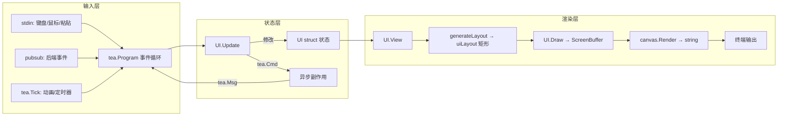
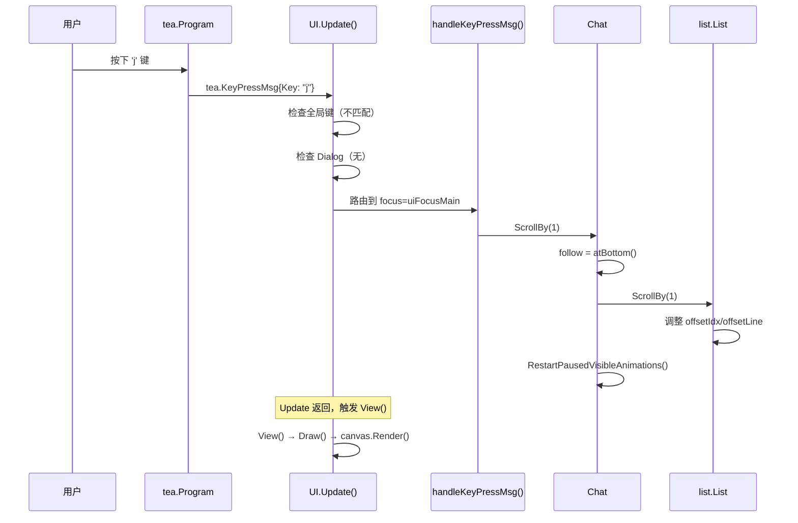
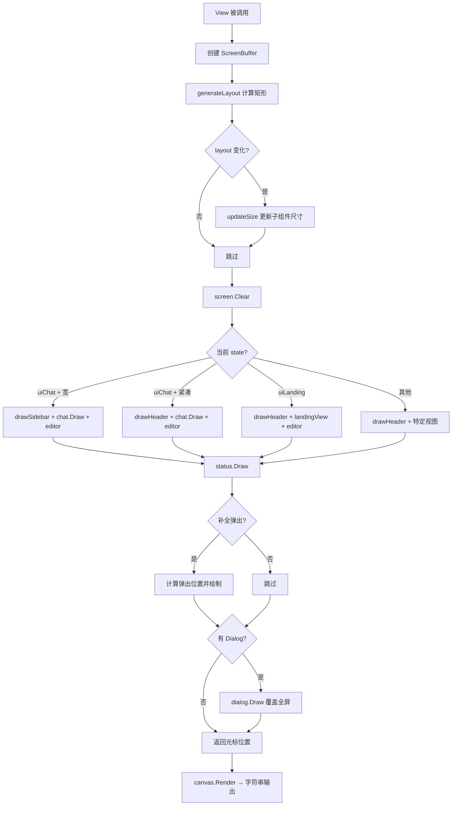
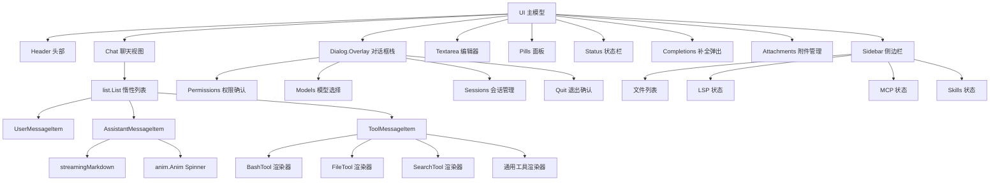
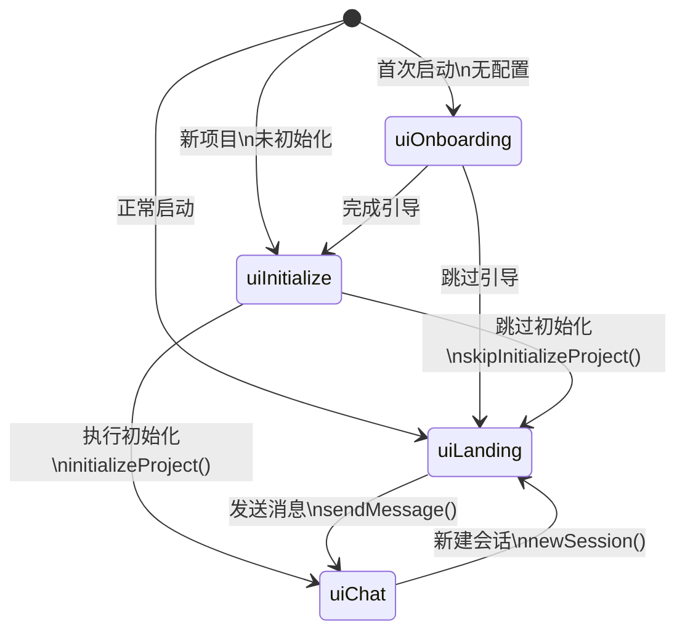
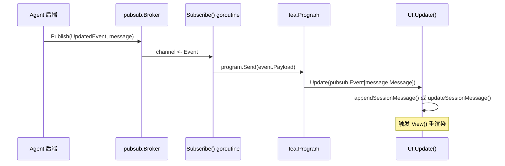
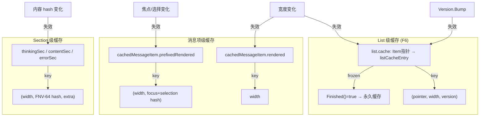
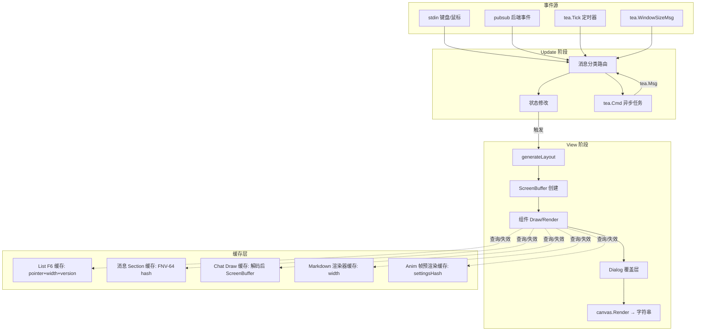

# tui-expert-of-crush

> 从 Crush（Charmbracelet 出品的终端 AI 编程助手）源码中提炼的 TUI 架构设计精髓。
> 本文档基于 Go + Bubble Tea v2 + Ultraviolet 技术栈，可直接用于指导新 Agent TUI 的实现。

---

## 1. 总体架构

### 1.1 技术栈

| 层级 | 技术 | 作用 |
|------|------|------|
| TUI 框架 | `charm.land/bubbletea/v2` | Elm Architecture 事件循环 |
| 渲染缓冲 | `github.com/charmbracelet/ultraviolet` (uv) | ScreenBuffer + 矩形布局 |
| 终端样式 | `charm.land/lipgloss/v2` | 声明式样式 |
| Markdown | `charm.land/glamour/v2` | 终端 Markdown 渲染 |
| ANSI 操作 | `github.com/charmbracelet/x/ansi` | 安全字符串切割/宽度 |
| 图片协议 | Kitty Graphics Protocol | 终端内联图片 |
| 测试快照 | `charm.land/catwalk` | Golden File 回归测试 |

### 1.2 架构风格

Crush 采用**集中式单模型架构**——只有一个 Bubble Tea Model（`UI` struct），子组件不参与标准 Elm 消息循环，而是暴露命令式方法由主模型直接调用。渲染使用**混合模式**：顶层通过 Ultraviolet `ScreenBuffer` 做矩形布局，子组件返回字符串再绘入对应区域。

### 1.3 顶层数据流



### 1.4 关键文件地图

| 目录/文件 | 职责 |
|-----------|------|
| `internal/ui/model/ui.go` | 主模型：状态、Update、View、Draw、布局 |
| `internal/ui/model/chat.go` | 聊天视图：滚动、鼠标选择、动画管理 |
| `internal/ui/model/keys.go` | 全部键绑定定义 |
| `internal/ui/model/sidebar.go` | 侧边栏渲染（文件、LSP、MCP、Skills） |
| `internal/ui/model/header.go` | 头部 Logo 和紧凑模式详情 |
| `internal/ui/model/status.go` | 底部状态栏和帮助提示 |
| `internal/ui/model/pills.go` | Todo/Queue 药丸面板 |
| `internal/ui/list/list.go` | 通用惰性渲染滚动列表 |
| `internal/ui/chat/streaming_markdown.go` | 流式 Markdown 增量渲染 |
| `internal/ui/chat/assistant.go` | 助手消息（流式、思考、动画） |
| `internal/ui/chat/messages.go` | 消息项接口与缓存体系 |
| `internal/ui/dialog/dialog.go` | 对话框接口与叠加层栈 |
| `internal/ui/styles/styles.go` | 全局样式定义 |
| `internal/ui/anim/anim.go` | 渐变动画 Spinner |
| `internal/ui/common/markdown.go` | Markdown 渲染器缓存 |

---

## 2. 事件循环与输入处理

### 2.1 事件循环启动

程序在 `internal/cmd/root.go#L126-L144` 启动 Bubble Tea Program：

```go
program := tea.NewProgram(
    model,
    tea.WithEnvironment(env),
    tea.WithContext(cmd.Context()),
    tea.WithFilter(ui.MouseEventFilter),  // 鼠标节流过滤器
)
go ws.Subscribe(program)  // 后端事件桥接
```

- **不使用** `WithAltScreen` 或 `WithMouseCellMotion` —— 这些通过 `View()` 返回值的声明式属性控制（`v.AltScreen = true`, `v.MouseMode = tea.MouseModeCellMotion`）。
- 鼠标事件经 `MouseEventFilter` 节流：15ms 内重复的 `MouseWheelMsg`/`MouseMotionMsg` 被丢弃，防止触控板泛滥 (`model/filter.go#L11-L22`)。
- 后端事件通过 `app.Subscribe()` 中的 goroutine 桥接到 `program.Send()`（`internal/app/app.go#L553-L583`）。

### 2.2 Update 消息路由

`UI.Update()` 是一个约 450 行的巨型 `switch msg.(type)`（`model/ui.go#L493-L936`），按优先级处理：

1. **Agent 状态检查**（line 495）：检测 prompt 队列变化
2. **终端能力更新**（line 503）：每条消息更新 Capabilities
3. **系统消息**：Session/MCP/LSP/Skills/Permission 等 pubsub 事件
4. **窗口 resize**：`tea.WindowSizeMsg` → `updateLayoutAndSize()`
5. **鼠标事件**：路由到 Chat 或 Dialog
6. **动画 tick**：`anim.StepMsg` → Chat 动画步进
7. **键盘/粘贴**：`tea.KeyPressMsg` → `handleKeyPressMsg()`
8. **Dialog 拦截**：当有 Dialog 打开时，所有未处理消息路由到 Dialog overlay

### 2.3 键盘路由层级

`handleKeyPressMsg()`（`model/ui.go#L1743-L2111`）实现三级路由：

```
第一级：全局键（无论状态如何都响应）
  ├── ctrl+c → 退出对话框
  ├── ctrl+p → 命令面板
  ├── ctrl+m → 模型选择（需增强键盘）
  ├── ctrl+s → 会话管理
  ├── ctrl+g → 帮助切换
  ├── ctrl+z → 挂起
  └── ctrl+t → Pills 面板切换

第二级：Dialog 拦截（line 1813）
  └── 所有键 → dialog.HandleMsg()

第三级：状态 + 焦点路由
  ├── uiOnboarding → 无操作
  ├── uiInitialize → updateInitializeView()
  └── uiChat / uiLanding
      ├── uiFocusEditor
      │   ├── enter → 发送消息
      │   ├── shift+enter / ctrl+j → 换行
      │   ├── @ → 打开自动补全
      │   ├── up/down → 历史浏览
      │   └── tab → 切换到 Main 焦点
      └── uiFocusMain
          ├── j/k → 上下滚动
          ├── J/K → 按项滚动
          ├── d/u → 半页滚动
          ├── f/b → 整页滚动
          ├── g/G → 顶部/底部
          ├── space → 展开/折叠
          ├── c/y → 复制选中内容
          └── tab → 切换到 Editor 焦点
```

### 2.4 按键到状态变更的序列图



### 2.5 增强键盘支持

通过 `tea.KeyboardEnhancementsMsg`（`model/ui.go#L189`）检测终端是否支持 Key Disambiguation（Kitty 协议），启用后可区分：
- `ctrl+m`（模型选择）vs `Enter`
- `shift+enter`（换行）vs `enter`（发送）

参见 `model/keys.go` 中 `SupportsKeyDisambiguation()` 的使用。

---

## 3. 渲染管线

### 3.1 混合渲染策略

Crush 的渲染管线是**两阶段混合模式**：

1. **屏幕缓冲层**（Ultraviolet）：顶层 `UI.View()` 创建 `uv.NewScreenBuffer(width, height)`，各组件通过 `uv.NewStyledString(str).Draw(scr, rect)` 绘入指定矩形区域 (`model/ui.go#L2248-L2279`)。
2. **字符串层**：子组件（如 `list.List`）通过 `Render(width) string` 返回渲染后的字符串，再由父组件绘入 ScreenBuffer。

```go
// model/ui.go#L2259-L2262
canvas := uv.NewScreenBuffer(m.width, m.height)
v.Cursor = m.Draw(canvas, canvas.Bounds())
content := strings.ReplaceAll(canvas.Render(), "\r\n", "\n")
```

### 3.2 View() 声明式属性

`View()` 不直接返回字符串，而是返回 `tea.View` 结构体，声明式设置终端模式 (`model/ui.go#L2249-L2279`)：

```go
v.AltScreen = true
v.BackgroundColor = m.com.Styles.Background
v.MouseMode = tea.MouseModeCellMotion
v.ReportFocus = m.caps.ReportFocusEvents
v.WindowTitle = "crush " + home.Short(...)
v.ProgressBar = tea.NewProgressBar(...)  // Ghostty/iTerm2/Rio 进度条
```

### 3.3 布局计算

`generateLayout()` (`model/ui.go#L2609-L2792`) 根据状态和屏幕尺寸计算 `uiLayout`——一组 `uv.Rectangle` 矩形：

```go
type uiLayout struct {
    area           uv.Rectangle  // 全屏区域
    header         uv.Rectangle  // 头部
    main           uv.Rectangle  // 聊天区域
    pills          uv.Rectangle  // Todo/Queue 面板
    editor         uv.Rectangle  // 输入编辑器
    sidebar        uv.Rectangle  // 侧边栏（宽模式）
    status         uv.Rectangle  // 底部帮助栏
    sessionDetails uv.Rectangle  // 会话详情覆盖层（紧凑模式）
}
```

两种布局模式：

| 模式 | 条件 | 布局结构 |
|------|------|----------|
| 宽模式 | width≥120 且 height≥30 | `[main+editor | sidebar(30col)]` 水平分割 |
| 紧凑模式 | width<120 或 height<30 | `[header(1行)] → [chat+pills] → [editor]` 垂直堆叠 |

### 3.4 Draw() 分发

`UI.Draw()` (`model/ui.go#L2127-L2246`) 根据状态分发到不同渲染路径：

```go
switch m.state {
case uiOnboarding:  → drawHeader + (dialog overlay)
case uiInitialize:  → drawHeader + initializeView
case uiLanding:     → drawHeader + landingView + editor
case uiChat:
    if compact:     → drawHeader + chat.Draw + pills + editor + details
    else:           → drawSidebar + chat.Draw + pills + editor
}
// 最后：status.Draw → completions popup → debug overlay → dialog.Draw
```

### 3.5 一帧渲染决策流程图



### 3.6 Chat 绘制缓存

`Chat.Draw()` 使用 `chatDrawCache` 记忆化已解码的 ANSI 输出 (`model/chat.go#L75-L205`)：

- **缓存命中**：若 `list.Render()` 返回的字符串未变，直接 blit 已解码的 `uv.ScreenBuffer`
- **缓存未命中**：调用 `uv.NewStyledString(rendered).Draw(buf, ...)` 重新解码并缓存
- 避免每帧重复 ANSI 解析，显著降低渲染开销

### 3.7 Resize 处理

窗口大小变化通过 `tea.WindowSizeMsg` 处理 (`model/ui.go#L687-L694`)：

```go
case tea.WindowSizeMsg:
    m.width, m.height = msg.Width, msg.Height
    m.updateLayoutAndSize()
    if m.state == uiChat && m.chat.Follow() {
        m.chat.ScrollToBottomAndAnimate()
    }
```

布局重算会级联到所有子组件的 `SetSize()` 调用，Markdown 渲染器缓存按宽度 key (`common/markdown.go#L28-L32`)，宽度变化自动创建新渲染器实例。

---

## 4. 组件/视图系统

### 4.1 组件设计模式

Crush 的子组件**不是** Bubble Tea Model——它们不实现 `Init()/Update()/View()` 三件套，而是暴露命令式方法：

```
标准 Bubble Tea Model:       Crush 组件模式:
  Init() tea.Cmd               New(...) *Component
  Update(tea.Msg) tea.Cmd      SetFoo(v)  // 状态修改
  View() string                HandleKeyMsg(msg) tea.Cmd  // 事件处理
                                Render(width) string  // 渲染
                                Draw(scr, area)       // 或直接绘入缓冲
```

这种设计的核心原则（`internal/ui/AGENTS.md#L6-L11`）：
- **永远不要用 Command 传递消息，能直接修改子组件状态就直接修改**
- **永远不要在 Command 中修改 Model 状态**，用消息和 Update 循环
- **永远不要在 Update 中做 IO 或昂贵操作**，总是用 `tea.Cmd`

### 4.2 接口层级

消息系统使用分层接口组合 (`chat/messages.go#L51-L69`, `list/item.go#L21-L100`)：

```
list.Item (基础)
  ├── Render(width) string
  ├── Version() uint64      // 缓存失效计数器
  └── Finished() bool       // 冻结标记

MessageItem (扩展 list.Item + RawRenderable + Identifiable)

ToolMessageItem (扩展 MessageItem + 工具状态方法)

可选能力接口（Opt-in）:
  ├── Focusable    → SetFocused(bool)
  ├── Highlightable → SetHighlight(startLine, startCol, endLine, endCol)
  ├── Expandable   → 展开/折叠
  ├── Animatable   → StartAnimation() / Animate(StepMsg)
  ├── Compactable  → 紧凑渲染
  ├── KeyEventHandler → 按键处理
  └── MouseClickable → HandleMouseClick(btn, x, y) bool
```

### 4.3 焦点管理

两级焦点状态 (`model/ui.go#L92-L100`)：

```go
type uiFocusState uint8
const (
    uiFocusNone   uiFocusState = iota  // 无焦点（初始化/引导）
    uiFocusEditor                       // 输入框获焦
    uiFocusMain                         // 聊天列表获焦
)
```

焦点决定：
- **键盘事件路由方向**：Editor 焦点 → textarea 处理；Main 焦点 → 聊天列表滚动/选择
- **光标显示**：仅 `uiFocusEditor` 且 textarea 获焦时显示光标 (`model/ui.go#L2227-L2243`)
- **Tab 键切换**：在 Editor 和 Main 之间切换

### 4.4 对话框叠加层

`dialog.Overlay` 管理对话框栈 (`dialog/dialog.go#L50-L53`)：

```go
type Overlay struct {
    dialogs []Dialog  // 栈：最后一个是活跃对话框
}

type Dialog interface {
    ID() string
    HandleMsg(msg tea.Msg) Action  // 返回 Action 指示结果
    Draw(scr uv.Screen, area uv.Rectangle) *tea.Cursor
}
```

- **栈式管理**：Push/Pop/BringToFront/Contains
- **最后绘制**：Dialog 永远在所有内容之上 (`model/ui.go#L2220-L2225`)
- **消息拦截**：当有 Dialog 时，键盘事件优先路由到 Dialog (`model/ui.go#L1813`)
- **Action 模式**：Dialog 不直接修改外部状态，返回 `Action` 类型由主模型解释 (`dialog/actions.go#L22-L89`)

### 4.5 典型界面组件树



---

## 5. 状态管理与数据流

### 5.1 全局状态组织

所有 UI 状态集中在 `UI` struct（`model/ui.go#L163-L282`），关键字段分组：

```go
type UI struct {
    // === 核心上下文 ===
    com          *common.Common     // 样式 + 工作区配置
    session      *session.Session   // 当前会话

    // === 终端状态 ===
    width, height int               // 终端尺寸
    layout        uiLayout          // 计算后的布局矩形
    caps          Capabilities      // 终端能力（TrueColor、Kitty等）

    // === 应用状态 ===
    state  uiState                  // 当前页面：Onboarding|Initialize|Landing|Chat
    focus  uiFocusState             // 焦点：None|Editor|Main

    // === 子组件 ===
    chat        *Chat               // 聊天列表
    textarea    textarea.Model      // 输入编辑器
    dialog      *dialog.Overlay     // 对话框栈
    completions *completions.Completions
    attachments *attachments.Attachments
    status      *Status
    header      *header

    // === 外部状态镜像 ===
    lspStates   map[string]app.LSPClientInfo
    mcpStates   map[string]mcp.ClientInfo
    skillStates []*skills.SkillState
    sessionFiles []SessionFile
}
```

### 5.2 状态机



所有状态转换通过 `setState(state, focus)` 统一执行 (`model/ui.go#L452-L462`)：
```go
func (m *UI) setState(state uiState, focus uiFocusState) {
    if state == uiLanding { m.isCompact = false }
    m.state = state
    m.focus = focus
    m.updateLayoutAndSize()  // 触发布局重算
}
```

### 5.3 Pubsub 事件驱动

后端状态变更通过 `pubsub.Broker` 推送到 UI (`internal/pubsub/pubsub.go`, `internal/app/app.go#L479-L525`)：



Pubsub 特性：
- **有损传递**：`Publish()` 非阻塞，满缓冲丢弃事件（4096 缓冲）(`pubsub.go#L165-L188`)
- **保证传递**：`PublishMustDeliver()` 阻塞等待最多 50ms (`pubsub.go#L201-L236`)
- **多订阅者**：每个 `Subscribe()` 返回独立 channel，所有订阅者收到所有事件

### 5.4 特殊状态管理

**Follow 模式**（自动滚动到底部）：
- `chat.follow` 标志 (`model/chat.go#L67`)
- 发送消息时设为 `true`
- 向上滚动时设为 `false`
- 新消息到达时若 `follow=true` 自动滚动到底部

**紧凑模式**：
- 自动：`width<120 || height<30` 时启用
- 手动：`ctrl+d` 切换 `forceCompactMode` (`model/ui.go#L227-L230`)
- 紧凑模式下侧边栏折叠为 1 行头部 + `ctrl+d` 详情覆盖层

**历史浏览**：
- `promptHistory.index = -1` 表示未浏览
- `promptHistory.draft` 保存浏览前的输入草稿 (`model/ui.go#L266-L271`)
- 上/下键在历史记录中导航

---

## 6. 异步任务与 UI 反馈

### 6.1 tea.Cmd 模式

所有异步操作返回 `tea.Cmd`（`func() tea.Msg`），通过 Bubble Tea 框架调度：

```go
// 模式 1：简单异步
func (m *UI) loadCustomCommands() tea.Cmd {
    return func() tea.Msg {
        cmds := loadCommands()
        return userCommandsLoadedMsg{commands: cmds}
    }
}

// 模式 2：批量并行
return tea.Batch(
    createSessionCmd,
    recordReadsCmd,
    agentRunCmd,
)

// 模式 3：顺序链式
return tea.Sequence(
    sendMessageCmd,
    markInitializedCmd,
)
```

### 6.2 动画 Spinner

`anim.Anim` (`anim/anim.go#L109-L124`) 实现渐变色循环字符动画：

- **帧率**：20 FPS（50ms/帧），省略号动画 400ms 一次
- **ID 路由**：`StepMsg{ID}` 确保只有目标 Anim 响应 tick
- **交错入场**：每列有独立的 `birthSteps` 延迟，创建波浪效果
- **帧预渲染缓存**：`settingsHash` → 缓存预计算的初始/循环帧 (`anim/anim.go#L71-L89`)

```go
// anim/anim.go#L405-L409
func (a *Anim) Step() tea.Cmd {
    return tea.Tick(time.Second/time.Duration(fps), func(t time.Time) tea.Msg {
        return StepMsg{ID: a.id}
    })
}
```

### 6.3 动画可见性优化

`Chat.Animate()` (`model/chat.go#L297-L322`) 实现关键优化——**只有可见项运行动画**：

- 不可见的动画项被暂停并记入 `pausedAnimations` 集合
- 滚动时 `RestartPausedVisibleAnimations()` (`model/chat.go#L326-L357`) 检查新进入视口的项并重启动画
- 防止长聊天会话中数百个已完成消息的动画消耗 CPU

### 6.4 流式 Markdown 增量渲染

`streamingMarkdown` (`chat/streaming_markdown.go#L35-L39`) 是流式输出的核心创新——**稳定前缀缓存**：

```
问题：glamour 的 wrap 状态在两次调用间重置，
      简单拼接两段渲染结果 ≠ 整体渲染结果。

解决方案：
1. findSafeMarkdownBoundary() 向后搜索空行边界
2. 验证边界安全：无开放的代码块、列表、表格、块引用
3. 缓存 stablePrefix 的渲染结果
4. 只重新渲染 trailing 部分
5. 拼接 cached_prefix + fresh_trailing
```

安全边界检查 (`chat/streaming_markdown.go#L204-L243`)：
- 偶数个三反引号围栏（无开放代码块）
- 无开放的列表、HTML 块、链接引用定义
- 下一行不是 Setext 标题下划线

### 6.5 消息项缓存体系

三层缓存架构 (`chat/messages.go#L166-L234`, `chat/assistant.go#L55-L94`)：



### 6.6 任务取消

- `esc` 键在 Agent 运行时触发 `cancelAgent()` (`model/ui.go#L1818-L1825`)
- Prompt 队列支持：排队的提示可通过再按 `esc` 清空

---

## 7. 样式与主题

### 7.1 样式架构

所有样式集中在 `styles.Styles` 大结构体 (`styles/styles.go`)，按语义分组：

```
Styles
├── Background          // 全局背景色
├── Header              // Logo、工作目录、键位提示
├── Editor              // 输入框（Normal / YOLO 模式）
├── Messages            // 用户/助手/思考/错误消息样式
├── Tool                // 工具调用（图标/名称/内容/状态/错误/任务）
├── Dialog              // 对话框（渐变标题、滚动条）
├── Sidebar             // 侧边栏（标题、路径）
├── Section             // 分区标题和分割线
├── Files               // 文件路径、diff 统计
├── LSP                 // 诊断级别样式（Error/Warning/Hint/Info）
├── Logo                // Logo 渐变色
├── WorkingGrad         // 工作动画渐变
├── Resource            // LSP/MCP/Skills 列表样式
├── ModelInfo           // 模型名称/提供者/推理/令牌
├── Radio               // 单选按钮
├── Initialize          // 初始化屏幕
└── Pills               // Todo/Queue 面板
```

### 7.2 样式传递

通过 `*common.Common` 注入所有组件 (`common/common.go#L24-L27`)：

```go
type Common struct {
    Workspace workspace.Workspace
    Styles    *styles.Styles
}
```

组件构造时接收 `*Common`，渲染时使用语义化字段而非硬编码颜色。

### 7.3 Unicode 图标体系

`styles/styles.go#L19-L54` 定义统一图标常量：

```go
IconCheck      = "✓"   // 成功
IconX          = "✗"   // 失败
IconRadio      = "●"   // 单选激活
IconRadioEmpty = "○"   // 单选未选
IconBorderV    = "│"   // 垂直边框
IconBorderH    = "─"   // 水平边框
IconScrollThumb = "┃"  // 滚动条拇指
IconScrollTrack = "│"  // 滚动条轨道
```

### 7.4 终端能力检测

`common/capabilities.go#L14-L38` 检测终端特性：

```go
type Capabilities struct {
    Profile       colorprofile.Profile  // TrueColor / 256 / 16 / None
    KittyGraphics bool                  // Kitty 图片协议
    SixelGraphics bool                  // Sixel 图片协议
    Env           uv.Environ            // 终端环境变量
}
```

支持渐进增强：TrueColor 渐变 → 256 色降级 → 纯文本回退。

### 7.5 Markdown 样式集成

Markdown 渲染器注册自定义格式化器 `"crush"` (`common/markdown.go#L19`)，样式通过 `Styles.Markdown` (类型 `ansi.StyleConfig`) 和 `Styles.Chroma` 配置语法高亮配色。渲染器按宽度缓存 (`common/markdown.go#L28-L32`)，宽度变化时创建新实例。

---

## 8. 关键技巧与避坑指南

### 8.1 实现技巧（≥10）

**技巧 1：命令式子组件而非 Elm 子模型**
子组件暴露 `SetFoo()` / `HandleKeyMsg()` / `Render()` 等命令式方法，由主 Model 直接调用，避免消息传递的间接开销。
📍 `internal/ui/AGENTS.md#L56-L77`

**技巧 2：Version 计数器驱动的缓存失效**
每个 `list.Item` 嵌入 `Versioned`，突变时调用 `Bump()` 递增版本号。List 缓存以 `(pointer, width, version)` 为 key，version 变化自动失效。
📍 `list/item.go#L50-L70`

**技巧 3：Finished 冻结优化**
`Item.Finished()` 返回 `true` 后，List 永久缓存其渲染结果不再调用 `Render()`。选择拖拽期间通过 `freezeSuppressed` 临时解冻。
📍 `list/list.go#L42-L53`

**技巧 4：视口边界渲染（O(viewport) 而非 O(total)）**
`List.Render()` 使用 `budget` 变量限制输出为 `height` 行，只渲染可见项。
📍 `list/list.go#L459-L538`

**技巧 5：流式 Markdown 稳定前缀缓存**
识别安全的 Markdown 边界（空行 + 无开放构造），缓存前缀渲染结果，只重新渲染新增尾部。
📍 `chat/streaming_markdown.go#L64-L116`

**技巧 6：动画可见性感知**
不可见项的动画暂停，滚入视口时重启。防止长对话中的 CPU 浪费。
📍 `model/chat.go#L297-L357`

**技巧 7：Chat 绘制缓存（双重解码避免）**
`chatDrawCache` 缓存 `list.Render()` 的 ANSI 解码结果到 `uv.ScreenBuffer`，相同内容跳过重复解码。
📍 `model/chat.go#L75-L205`

**技巧 8：鼠标事件节流**
`MouseEventFilter` 以 15ms 间隔节流 wheel/motion 事件，防触控板 spam。
📍 `model/filter.go#L11-L22`

**技巧 9：双击/三击检测的延迟确认**
单击后设置 400ms `DelayedClickMsg`。若双击在窗口内到达则取消单击展开动作，否则执行单击逻辑。
📍 `model/chat.go#L677-L735`

**技巧 10：Section 级 FNV-64 缓存**
助手消息的 thinking/content/error 三段独立缓存，streaming 时只失效变化的段。
📍 `chat/assistant.go#L55-L94`

**技巧 11：Markdown 渲染器互斥锁**
glamour 渲染器非线程安全。`LockMarkdownRenderer()` 为每个渲染器实例维护独立 mutex，序列化并发调用。
📍 `common/markdown.go#L130-L139`

**技巧 12：声明式终端模式**
不通过 Option 设置 AltScreen/鼠标模式，而是在 `View()` 返回值中声明，允许运行时动态切换。
📍 `model/ui.go#L2249-L2257`

### 8.2 常见陷阱（≥5）

**陷阱 1：宽度计算忘记扣除 padding/border**
Lipgloss 样式的 Padding、Border、Margin 都占据字符宽度。渲染子组件时必须用 `area.Dx()` 而非原始 `width`。
📍 `internal/ui/AGENTS.md#L189`
💡 解决：使用 `uv.Rectangle` 的 `Dx()/Dy()` 获取实际可用空间。

**陷阱 2：在 Update 中做 IO 或昂贵操作**
阻塞 Update 会冻结整个 TUI。必须将 IO 包装为 `tea.Cmd` 异步执行。
📍 `internal/ui/AGENTS.md#L9`
💡 解决：所有 IO 返回 `tea.Cmd`，结果通过 `tea.Msg` 回到 Update。

**陷阱 3：在 Command 闭包中修改 Model 状态**
`tea.Cmd` 在独立 goroutine 中执行，修改 Model 会导致数据竞争。
📍 `internal/ui/AGENTS.md#L10-L11`
💡 解决：Command 只返回 `tea.Msg`，状态修改严格在 `Update` 中进行。

**陷阱 4：ANSI 字符串的字节级操作**
直接 `string[:n]` 切割含 ANSI 转义序列的字符串会破坏格式。
📍 `internal/ui/AGENTS.md#L15-L18`
💡 解决：使用 `ansi.Cut`、`ansi.Truncate`、`ansi.StringWidth` 等安全函数。

**陷阱 5：List 缓存与选择拖拽冲突**
Frozen 的已完成项在选择拖拽时无法更新高亮样式，导致选中区域显示错误。
📍 `list/list.go#L47-L53`
💡 解决：`BeginSelectionDrag()` 将范围内的项加入 `freezeSuppressed`，拖拽结束后清除。

**陷阱 6：glamour 渲染器并发安全**
glamour 内部的 goldmark BlockStack 非线程安全，并发 Render 导致 panic。
📍 `chat/streaming_markdown.go#L57-L63`
💡 解决：通过 `LockMarkdownRenderer()` 获取 per-renderer mutex，序列化渲染调用。

**陷阱 7：流式 Markdown 拼接不等式**
`render(A) + render(B) ≠ render(A+B)` 因为 glamour wrap 状态在调用间重置。
📍 `chat/streaming_markdown.go#L19-L23`
💡 解决：`findSafeMarkdownBoundary()` 保守地选择安全切分点，不确定时回退到全量渲染。

---

## 9. 可复用实现蓝图

### 9.1 推荐目录结构

```
internal/ui/
├── model/           # 主模型和主要子模型
│   ├── app.go       # 顶层 Model：Init/Update/View/Draw
│   ├── chat.go      # 聊天视图（滚动、选择、动画管理）
│   ├── keys.go      # 键绑定定义
│   ├── sidebar.go   # 侧边栏（文件、状态信息）
│   ├── header.go    # 头部渲染
│   ├── status.go    # 状态栏
│   └── editor.go    # 输入编辑器集成
├── chat/            # 聊天消息渲染器
│   ├── messages.go  # 消息接口和通用缓存
│   ├── assistant.go # 助手消息（流式、动画）
│   ├── user.go      # 用户消息
│   ├── tools.go     # 工具调用渲染工厂
│   └── streaming.go # 流式内容增量渲染
├── list/            # 通用惰性滚动列表
│   ├── list.go      # 列表核心（视口渲染、缓存）
│   ├── item.go      # Item 接口层级
│   └── highlight.go # 选择高亮
├── dialog/          # 对话框系统
│   ├── dialog.go    # Dialog 接口 + Overlay 栈
│   ├── actions.go   # Action 类型定义
│   └── common.go    # 渲染上下文工具
├── common/          # 共享基础设施
│   ├── common.go    # Common 上下文（样式 + 配置）
│   ├── markdown.go  # Markdown 渲染器缓存
│   └── scrollbar.go # 滚动条渲染
├── styles/          # 样式和主题
│   └── styles.go    # 全局 Styles 结构体
├── anim/            # 动画系统
│   └── anim.go      # Spinner 动画
└── completions/     # 自动补全弹出
    └── completions.go
```

### 9.2 核心接口定义（伪代码）

```go
// === 列表项接口 ===
type Item interface {
    Render(width int) string  // 渲染为字符串
    Version() uint64          // 缓存失效版本号
    Finished() bool           // 是否可永久冻结缓存
}

// === 对话框接口 ===
type Dialog interface {
    ID() string
    HandleMsg(msg Msg) Action
    Draw(screen Screen, area Rectangle) *Cursor
}

// === 动画接口 ===
type Animatable interface {
    StartAnimation() Cmd
    Animate(step StepMsg) Cmd
}

// === 共享上下文 ===
type Common struct {
    Workspace Workspace
    Styles    *Styles
}

// === 布局矩形 ===
type Layout struct {
    Header, Main, Editor, Sidebar, Status Rectangle
}

// === 主模型 ===
type App struct {
    common  *Common
    state   AppState        // 页面状态机
    focus   FocusState      // 焦点状态
    layout  Layout          // 计算后的布局
    chat    *ChatView       // 聊天视图
    editor  *EditorView     // 输入编辑器
    dialog  *DialogOverlay  // 对话框栈
    width, height int       // 终端尺寸
}
```

### 9.3 事件/渲染/状态耦合关系



### 9.4 通用代码骨架

```go
// === 主模型骨架 ===
func (m *App) Init() Cmd {
    return Batch(
        loadSessionCmd(),
        loadHistoryCmd(),
        queryTerminalCapsCmd(),
    )
}

func (m *App) Update(msg Msg) Cmd {
    var cmds []Cmd
    m.caps.Update(msg)  // 始终更新终端能力

    switch msg := msg.(type) {
    // 1. 系统事件
    case WindowSizeMsg:
        m.width, m.height = msg.Width, msg.Height
        m.updateLayout()
    case PubsubEvent:
        cmds = append(cmds, m.handlePubsubEvent(msg))

    // 2. 对话框拦截
    // (dialog open 时优先处理)

    // 3. 键盘路由
    case KeyPressMsg:
        cmds = append(cmds, m.routeKey(msg))

    // 4. 动画
    case AnimStepMsg:
        cmds = append(cmds, m.chat.Animate(msg))
    }

    return Batch(cmds...)
}

func (m *App) View() View {
    var v View
    v.AltScreen = true
    v.MouseMode = MouseModeCellMotion

    canvas := NewScreenBuffer(m.width, m.height)
    v.Cursor = m.Draw(canvas, canvas.Bounds())
    v.Content = canvas.Render()
    return v
}

func (m *App) Draw(scr Screen, area Rectangle) *Cursor {
    layout := m.generateLayout(area.Dx(), area.Dy())
    Clear(scr)

    // 按状态绘制各区域
    m.sidebar.Draw(scr, layout.Sidebar)
    m.chat.Draw(scr, layout.Main)
    m.editor.Draw(scr, layout.Editor)
    m.status.Draw(scr, layout.Status)

    // Dialog 最后绘制，覆盖一切
    if m.dialog.HasDialogs() {
        return m.dialog.Draw(scr, scr.Bounds())
    }
    return m.editorCursor()
}

// === 惰性列表骨架 ===
func (l *List) Render() string {
    var b strings.Builder
    budget := l.height
    for i := l.offsetIdx; i < len(l.items) && budget > 0; i++ {
        entry := l.getCachedOrRender(l.items[i])
        lines := entry.lines
        // 首项跳过已滚出的行
        if i == l.offsetIdx { lines = lines[l.offsetLine:] }
        // 只输出 budget 行
        take := min(len(lines), budget)
        for _, line := range lines[:take] {
            b.WriteString(line); b.WriteByte('\n')
        }
        budget -= take
    }
    return b.String()
}

// === 流式渲染骨架 ===
func (s *StreamingRenderer) Render(content string, width int, renderer Renderer) string {
    if widthChanged || !strings.HasPrefix(content, s.stablePrefix) {
        return s.fullRender(content, renderer)
    }
    boundary := findSafeBoundary(content)
    if boundary <= len(s.stablePrefix) {
        return s.cachedPrefix + s.renderTrailing(content[boundary:], renderer)
    }
    // 推进缓存
    s.stablePrefix = content[:boundary]
    s.cachedPrefix = s.renderFull(s.stablePrefix, renderer)
    return s.cachedPrefix + s.renderTrailing(content[boundary:], renderer)
}
```

---

## 10. 源码引用索引

| 文件路径 | 行号范围 | 对应章节 |
|----------|----------|----------|
| `internal/cmd/root.go` | L126-L144 | 2.1 事件循环启动 |
| `internal/app/app.go` | L479-L525 | 5.3 Pubsub 事件桥接 |
| `internal/app/app.go` | L553-L583 | 2.1 Subscribe 事件桥 |
| `internal/pubsub/pubsub.go` | L165-L236 | 5.3 Pubsub 传递策略 |
| `internal/ui/model/ui.go` | L92-L110 | 4.3/5.2 状态枚举 |
| `internal/ui/model/ui.go` | L163-L282 | 5.1 UI struct 全局状态 |
| `internal/ui/model/ui.go` | L384-L403 | 6.1 Init 异步初始化 |
| `internal/ui/model/ui.go` | L452-L462 | 5.2 setState 集中转换 |
| `internal/ui/model/ui.go` | L493-L936 | 2.2 Update 消息路由 |
| `internal/ui/model/ui.go` | L687-L694 | 3.7 Resize 处理 |
| `internal/ui/model/ui.go` | L1743-L2111 | 2.3 键盘路由层级 |
| `internal/ui/model/ui.go` | L2127-L2246 | 3.4 Draw 分发 |
| `internal/ui/model/ui.go` | L2248-L2279 | 3.1/3.2 View 渲染管线 |
| `internal/ui/model/ui.go` | L2609-L2792 | 3.3 generateLayout 布局 |
| `internal/ui/model/ui.go` | L2794-L2822 | 3.3 uiLayout 结构体 |
| `internal/ui/model/chat.go` | L35-L73 | 4.5 Chat struct |
| `internal/ui/model/chat.go` | L75-L205 | 3.6 Chat Draw 缓存 |
| `internal/ui/model/chat.go` | L297-L357 | 6.3 动画可见性优化 |
| `internal/ui/model/chat.go` | L370-L436 | 5.4 Follow 模式滚动 |
| `internal/ui/model/chat.go` | L627-L1034 | 2.4 鼠标选择/双击检测 |
| `internal/ui/model/chat.go` | L677-L735 | 8.1 技巧 9 延迟确认 |
| `internal/ui/model/filter.go` | L11-L22 | 8.1 技巧 8 鼠标节流 |
| `internal/ui/model/keys.go` | 全文 | 2.3 键绑定定义 |
| `internal/ui/model/header.go` | L64-L181 | 4.5 头部渲染 |
| `internal/ui/model/status.go` | L20-L115 | 4.5 状态栏 |
| `internal/ui/model/sidebar.go` | L62-L215 | 4.5 侧边栏 |
| `internal/ui/model/pills.go` | L32-L280 | 4.5 Pills 面板 |
| `internal/ui/model/session.go` | L67-L159 | 5.2 会话加载 |
| `internal/ui/model/onboarding.go` | L18-L79 | 5.2 状态转换 |
| `internal/ui/list/list.go` | L10-L64 | 4.2/9.4 List 核心结构 |
| `internal/ui/list/list.go` | L459-L538 | 8.1 技巧 4 视口渲染 |
| `internal/ui/list/item.go` | L21-L100 | 4.2 Item 接口层级 |
| `internal/ui/list/highlight.go` | L25-L211 | 4.2 选择高亮 |
| `internal/ui/chat/streaming_markdown.go` | L35-L243 | 6.4 流式 Markdown |
| `internal/ui/chat/assistant.go` | L55-L94 | 6.5 Section 缓存 |
| `internal/ui/chat/assistant.go` | L119-L195 | 6.2 动画集成 |
| `internal/ui/chat/messages.go` | L51-L69 | 4.2 消息接口 |
| `internal/ui/chat/messages.go` | L155-L234 | 6.5 缓存层 |
| `internal/ui/chat/tools.go` | 全文 | 4.5 工具渲染工厂 |
| `internal/ui/dialog/dialog.go` | L33-L205 | 4.4 对话框系统 |
| `internal/ui/dialog/actions.go` | L22-L89 | 4.4 Action 类型 |
| `internal/ui/dialog/common.go` | L15-L171 | 4.4 渲染上下文 |
| `internal/ui/dialog/permissions.go` | L25-L730 | 4.4 权限对话框 |
| `internal/ui/styles/styles.go` | L19-L399 | 7 样式系统 |
| `internal/ui/common/common.go` | L24-L121 | 7.2/4.3 共享上下文 |
| `internal/ui/common/markdown.go` | L19-L139 | 7.5/8.1 Markdown 缓存 |
| `internal/ui/common/capabilities.go` | L14-L38 | 7.4 终端能力检测 |
| `internal/ui/common/scrollbar.go` | L11-L46 | 4.5 滚动条 |
| `internal/ui/anim/anim.go` | L71-L124 | 6.2 动画系统 |
| `internal/ui/anim/anim.go` | L341-L409 | 6.2 tea.Cmd 模式 |
| `internal/ui/completions/completions.go` | L48-L432 | 4.5 自动补全 |
| `internal/ui/attachments/attachments.go` | L32-L148 | 4.5 附件管理 |
| `internal/ui/image/image.go` | L28-L99 | 7.4 Kitty 图片 |
| `internal/ui/AGENTS.md` | 全文 | 4.1 组件设计原则 |
