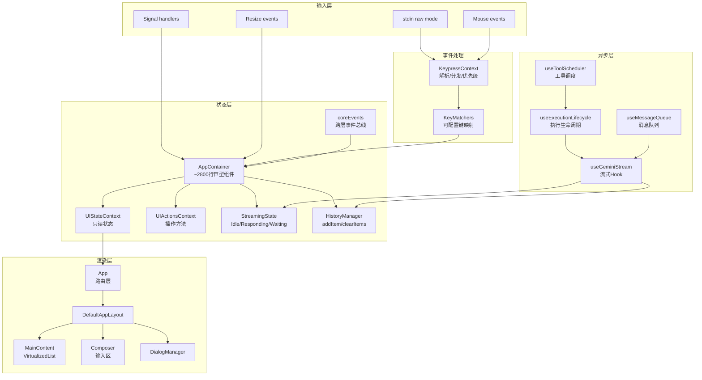
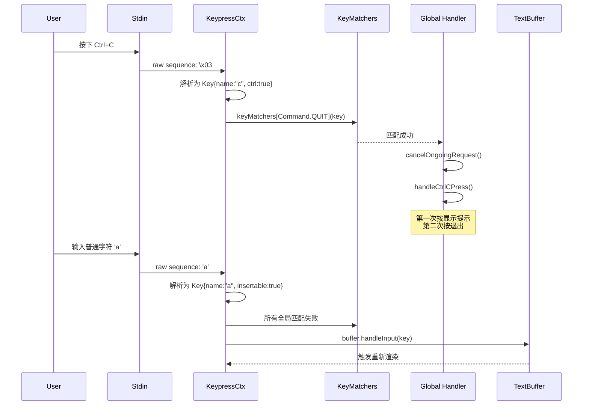
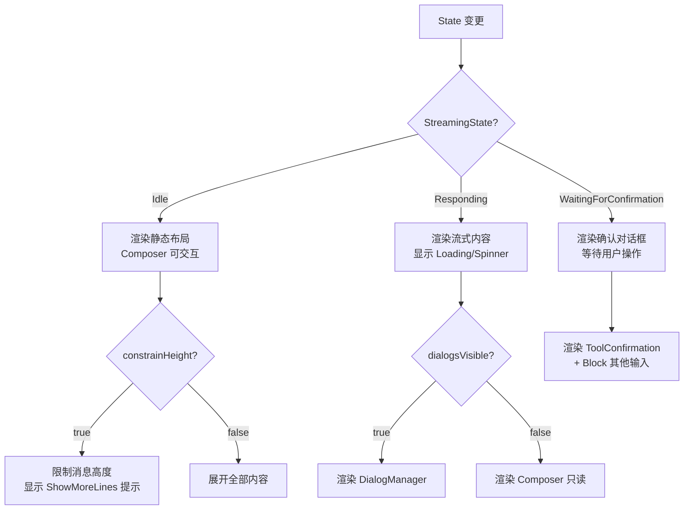
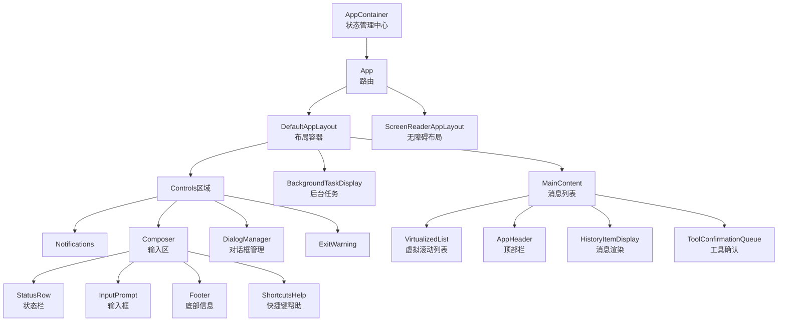
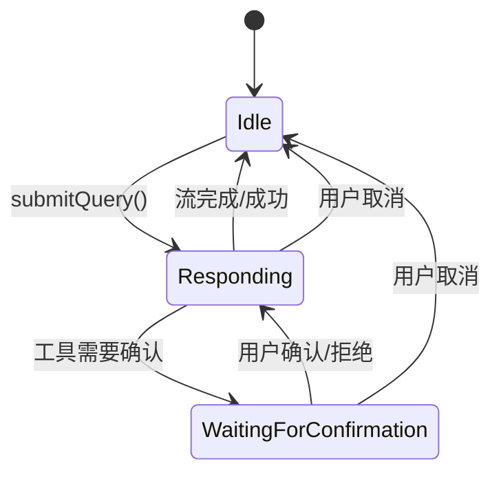
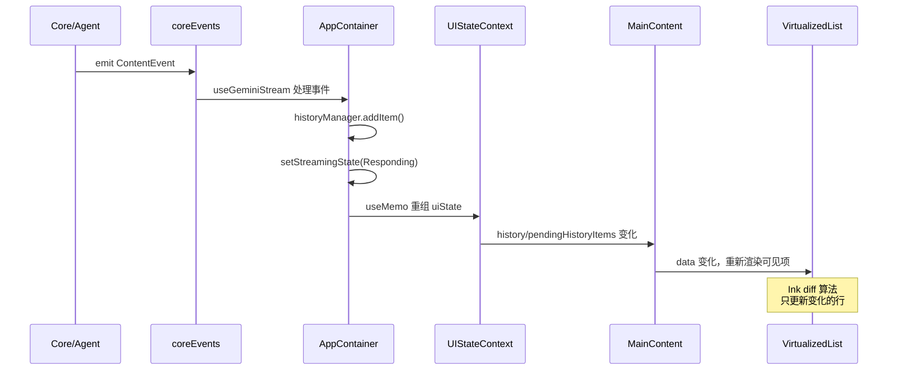
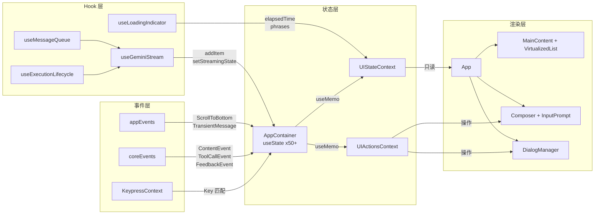

# tui-expert-of-gemini-cli

> 基于 Google Gemini CLI (v0.45.0) 源码分析，技术栈为 **React + Ink 6.x**（声明式终端 UI 框架），TypeScript，运行于 Node.js >=20。

---

## 1. 总体架构

### 1.1 技术栈与整体风格

Gemini CLI 的 TUI 层采用 **声明式 React/Ink 架构**，核心思路是：

- **React 组件树** 驱动渲染，Ink 负责 React 树到终端 ANSI 序列的转换
- **Ink 6.x 增强模式**：支持 alternate buffer、terminal buffer、incremental rendering、render process 等高级终端特性
- **多 Provider 上下文注入**：约 15 个 React Context 提供全局状态和操作
- **自定义事件总线** (`coreEvents` / `appEvents`) 桥接核心逻辑与 UI
- **Hook 密集型设计**：约 60+ 个自定义 Hook 处理流式数据、按键、命令、历史等

入口文件通过动态 `import()` 懒加载 UI 模块（`packages/cli/src/gemini.tsx#L338-L341`），避免在非交互模式下加载 React/Ink。

### 1.2 顶层数据流



---

## 2. 事件循环与输入处理

### 2.1 stdin 原始模式与事件循环

Gemini CLI 在 `gemini.tsx#L710-L719` 中手动设置 stdin 为 raw mode：

```typescript
// packages/cli/src/gemini.tsx#L710-L719
const wasRaw = process.stdin.isRaw;
if (config.isInteractive() && !wasRaw && process.stdin.isTTY) {
  process.stdin.setRawMode(true);
  registerSyncCleanup(() => {
    process.stdin.setRawMode(wasRaw);
  });
}
```

在进入 Ink 之前，还需要确保 stdin 恢复流动（`gemini.tsx#L791-L793`）：

```typescript
if (process.stdin.isTTY) {
  process.stdin.resume();
}
```

**原因**：之前的认证阶段可能添加/移除了 stdin 的 `data` 监听器，当监听器数量降至 0 时 Node.js 会隐式暂停流缓冲。

### 2.2 KeypressContext：按键解析与优先级分发

按键处理的核心是 `KeypressContext.tsx`，它实现了：

1. **原始序列解析**：从 stdin 读取原始转义序列，映射到结构化的 `Key` 对象
2. **优先级系统**（`KeypressPriority`）：`Critical(200)` > `High/priority:true(100)` > `Normal(0)` > `Low(-100)`
3. **粘贴模式检测**：通过 bracketed paste (`[200~` / `[201~`) 和超时机制
4. **Kitty Keyboard Protocol**：CSI u 编码支持（`KeypressContext.tsx#L131-L168`）
5. **多键序列缓冲**：ESC 超时（50ms）、反斜杠-回车缓冲（5ms）、快速回车检测（30ms）

```typescript
// packages/cli/src/ui/contexts/KeypressContext.tsx#L27-L30
export const BACKSLASH_ENTER_TIMEOUT = 5;
export const ESC_TIMEOUT = 50;
export const PASTE_TIMEOUT = 30_000;
export const FAST_RETURN_TIMEOUT = 30;
```

**粘贴模式处理流程**：
- 检测到 `[200~` 开始粘贴模式
- 所有后续字符被视为粘贴内容
- 检测到 `[201~` 结束粘贴
- 超时 30 秒自动取消并警告用户



### 2.3 可配置键映射系统

`keyBindings.ts` 定义了约 80+ 个 `Command` 枚举值（`keyBindings.ts#L17-L122`），每个命令都有默认绑定和用户可覆盖的配置机制。`keyMatchers.ts` 负责从 JSON 配置加载匹配器。

### 2.4 信号处理

`cleanup.ts` 中的 `setupSignalHandlers()` 注册了 SIGINT/SIGTERM 等信号处理，确保优雅退出时执行所有注册的清理函数。

---

## 3. 渲染管线

### 3.1 渲染策略：声明式 React + Ink 增强模式

Gemini CLI 利用 Ink 6.x 的高级特性（`interactiveCli.tsx#L138-L171`）：

```typescript
const instance = render(<AppWrapper />, {
  stdout: inkStdout,
  stdin: process.stdin,
  exitOnCtrlC: false,
  alternateBuffer: useAlternateBuffer,        // 备用屏幕缓冲区
  terminalBuffer: config.getUseTerminalBuffer(), // 终端缓冲区模式
  renderProcess: config.getUseRenderProcess() && config.getUseTerminalBuffer(),
  incrementalRendering: settings.merged.ui.incrementalRendering !== false && useAlternateBuffer,
  onRender: ({ renderTime }) => {
    if (renderTime > SLOW_RENDER_MS) {
      recordSlowRender(config, Math.round(renderTime));
    }
  },
});
```

**关键渲染特性**：
- **Alternate Buffer**：进入独立屏幕缓冲区，退出时恢复原内容
- **Terminal Buffer**：利用终端原生滚动缓冲区处理历史内容
- **Incremental Rendering**：增量渲染，只更新变化部分
- **Render Process**：子进程渲染，避免主线程阻塞
- **Static Render**：Ink 的 `<Static>` 组件将已完成的内容"固化"到滚动缓冲区

### 3.2 静态区域 + 活动区域的分离

`MainContent.tsx` 将内容分为三部分：

1. **静态历史**（用户消息之前的内容）：使用 `Static` 渲染到滚动缓冲区
2. **当前响应区域**：使用 `VirtualizedList` 动态渲染
3. **Pending 项目**：流式生成中的工具调用、思考过程等

```typescript
// packages/cli/src/ui/components/MainContent.tsx#L144-L152
const staticHistoryItems = useMemo(
  () => historyItems.slice(0, lastUserPromptIndex + 1),
  [historyItems, lastUserPromptIndex],
);
const lastResponseHistoryItems = useMemo(
  () => historyItems.slice(lastUserPromptIndex + 1),
  [historyItems, lastUserPromptIndex],
);
```

### 3.3 一帧渲染决策流程



### 3.4 终端能力检测与降级

`terminalCapabilityManager.ts` 检测终端支持的特性，根据能力启用/禁用：
- Kitty Keyboard Protocol
- Bracketed Paste
- Mouse events（SGR 编码）
- True color

在 `interactiveCli.tsx#L103` 通过 `useKittyKeyboardProtocol()` hook 在运行时协商。

### 3.5 Resize 自适应

`useTerminalSize.ts` 监听 `process.stdout` 的 `resize` 事件：

```typescript
// packages/cli/src/ui/hooks/useTerminalSize.ts#L9-L30
export function useTerminalSize() {
  const [size, setSize] = useState({
    columns: process.stdout.columns || 60,
    rows: process.stdout.rows || 20,
  });
  useEffect(() => {
    function updateSize() {
      setSize({
        columns: process.stdout.columns || 60,
        rows: process.stdout.rows || 20,
      });
    }
    process.stdout.on('resize', updateSize);
    return () => { process.stdout.off('resize', updateSize); };
  }, []);
  return size;
}
```

`AppContainer` 使用 ResizeObserver 监测控件区域高度变化（`AppContainer.tsx#L1533-L1552`），动态计算可用终端高度。

### 3.6 Flicker 检测

`useFlickerDetector.ts` hook 通过比较前后帧的 DOM 高度来检测闪烁，用于调试渲染问题。

---

## 4. 组件/视图系统

### 4.1 组件层级



### 4.2 AppContainer：巨型状态管理组件

`AppContainer.tsx`（约 2867 行）是整个 TUI 的神经中枢：

- 管理 50+ 个 `useState`
- 通过 `useMemo` 组装只读的 `UIState` 和 `UIActions` 对象
- 注册 10+ 个 `useEffect` 监听核心事件
- 通过 React Context 向下分发

这种设计实质上是一个 **手写 Redux store + dispatch 集合** 的模式，但直接利用 React 的 `useState` 和 `useMemo`。

### 4.3 聚焦管理

聚焦管理分多层：
- **Shell 聚焦**（`ShellFocusContext`）：控制嵌入式 shell 是否获得键盘焦点
- **嵌入 Shell 切换**（`embeddedShellFocused` 状态）：Tab/Shift+Tab 在主输入和 shell 间切换
- **Tab 聚焦超时**：150ms 延迟判断 shell 是否在活跃输出（`AppContainer.tsx#L1940-L1955`）

### 4.4 虚拟滚动

`VirtualizedList.tsx`（约 764 行）实现了完整的虚拟滚动：

- **动态高度测量**：使用 Ink 的 `ResizeObserver` 测量每个项目实际高度
- **固定高度优化**：`fixedItemHeight` 属性跳过测量
- **静态/活动区域分离**：已完成的项目通过 `StaticRender` 写入滚动缓冲区
- **滚动条动画**：`useAnimatedScrollbar` 实现平滑滚动条
- **批量滚动**：`useBatchedScroll` 合并连续滚动事件

```typescript
// packages/cli/src/ui/components/shared/VirtualizedList.tsx#L47-L67
export type VirtualizedListRef<T> = {
  scrollBy: (delta: number) => void;
  scrollTo: (offset: number) => void;
  scrollToEnd: () => void;
  scrollToIndex: (params: { index: number; viewOffset?: number; viewPosition?: number }) => void;
  scrollToItem: (params: { item: T; viewOffset?: number; viewPosition?: number }) => void;
  getScrollIndex: () => number;
  getScrollState: () => { scrollTop: number; scrollHeight: number; innerHeight: number };
};
```

### 4.5 布局系统

布局由以下因素动态决定：
- **终端宽度**：`SHELL_WIDTH_FRACTION = 0.89`（`AppContainer.tsx#L215`），留出右边距
- **终端高度**：减去 `SHELL_HEIGHT_PADDING = 10` 行（`AppContainer.tsx#L221`）
- **控件高度**：通过 `ResizeObserver` 实时测量 controls 区域高度
- **后台任务高度**：动态分配给嵌入式 shell

---

## 5. 状态管理与数据流

### 5.1 全局状态组织

状态分为两大 Context：

| Context | 角色 | 性质 |
|---------|------|------|
| `UIStateContext` | 只读快照 | 50+ 字段的 `useMemo` 结果 |
| `UIActionsContext` | 操作方法 | 所有 `useCallback` 的集合 |

`UIState` 包含（`UIStateContext.tsx`）：
- `streamingState`：`Idle` / `Responding` / `WaitingForConfirmation`
- `history`：消息历史数组
- 各种对话框开关状态（20+ 个布尔值）
- 终端尺寸、主题、配置相关状态

### 5.2 StreamingState 状态机



### 5.3 History 管理器

`useHistoryManager` hook 提供了：
- `addItem(item, timestamp?)`：添加历史项目
- `clearItems()`：清空历史
- `loadHistory(items)`：加载历史（用于恢复会话）
- 使用递增 `id` 作为 key

### 5.4 消息队列

`useMessageQueue` 实现了 **请求排队**机制：
- 当 `streamingState !== Idle` 或 MCP 未就绪时，新消息进入队列
- 状态变为 Idle 时自动出队提交
- 提供用户反馈（"Prompts will be queued"）

### 5.5 状态更新到渲染



---

## 6. 异步任务与 UI 反馈

### 6.1 流式处理架构

`useGeminiStream`（约 2158 行）是流式处理的核心 hook：

1. **发起请求**：`submitQuery()` 创建 AbortController，开始流式调用
2. **处理事件**：迭代 `GeminiClient.sendMessageStream()` 的 AsyncIterable
3. **状态追踪**：每个工具调用都有完整的状态机（Pending → Confirming → Executing → Success/Error）
4. **UI 更新**：通过 `addItem` 将流式内容追加到历史

```typescript
// 简化的流处理循环
for await (const event of stream) {
  if (event.type === 'content') {
    // 追加文本到当前响应
    appendContent(event.text);
  } else if (event.type === 'tool_call_request') {
    // 创建工具调用追踪
    trackToolCall(event);
    if (needsConfirmation) {
      setStreamingState(WaitingForConfirmation);
    }
  } else if (event.type === 'finished') {
    setStreamingState(Idle);
  }
}
```

### 6.2 工具调度器

`useToolScheduler` 管理并行的工具执行：
- **追踪**：每个工具调用的状态（`TrackedToolCall` 联合类型）
- **并行**：支持多个工具同时执行
- **取消**：用户 ESC 取消等待中的工具
- **后台化**：shell 命令可以后台运行

### 6.3 Loading 指示器

`useLoadingIndicator` 提供丰富的等待反馈：
- **计时器**：`useTimer` 精确到秒的经过时间
- **短语循环**：`usePhraseCycler` 轮换提示/幽默短语
- **状态感知**：区分 Responding 和 WaitingForConfirmation

### 6.4 思考过程展示

`thought` 对象（`ThoughtSummary` 类型）在流式生成时实时展示 LLM 的思考过程，包含 `subject` 字段用于状态栏和窗口标题。

### 6.5 后台任务管理

`useBackgroundTaskManager` 管理嵌入式 shell：
- **后台执行**：`backgroundCurrentExecution()` 将 shell 移到后台
- **任务列表**：支持多个后台 shell 并显示列表
- **焦点切换**：Tab/Shift+Tab 在主输入和 shell 间切换
- **PTY 管理**：通过 `@lydell/node-pty` 实现真实终端模拟

### 6.6 任务取消

取消机制通过 `AbortController` 实现：
- 用户按 ESC → `cancelOngoingRequest()` → `abortController.abort()`
- 流式循环检测 abort 信号，停止迭代
- 恢复用户输入到文本缓冲区

---

## 7. 样式与主题

### 7.1 主题系统架构

`theme.ts` 定义了 `Theme` 类，核心概念：

- **ColorsTheme**：基础颜色映射（Background, Foreground, Accent* 等）
- **SemanticColors**：语义化颜色（text.primary, status.error, ui.gradient 等）
- **highlight.js 映射**：将 hljs 类名映射到 Ink 颜色
- **四种主题类型**：`light` / `dark` / `ansi` / `custom`

```typescript
// packages/cli/src/ui/themes/theme.ts#L161-L184
export interface ColorsTheme {
  type: ThemeType;
  Background: string;
  Foreground: string;
  LightBlue: string;
  AccentBlue: string;
  AccentPurple: string;
  // ... 更多语义颜色
  GradientColors?: string[];
}
```

### 7.2 自动主题检测

`useTerminalTheme` hook 轮询终端背景色变化：
- `getThemeTypeFromBackgroundColor()` 通过亮度判断亮/暗
- `pickDefaultThemeName()` 精确匹配或回退到默认主题
- 使用 `tinygradient` 实现颜色插值（输入框背景、焦点高亮等）

### 7.3 颜色解析管线

`resolveColor()` 函数处理多源颜色输入：
1. 直接 hex 代码（`#ff0000`）
2. Ink 内置名称（`red`, `blue` 等 20 个）
3. CSS 颜色名称（通过 `tinycolor` 解析）
4. ANSI bright 颜色（`redbright` 等）

### 7.4 终端兼容性降级

- **ANSI 主题**：当终端不支持 true color 时回退到标准 ANSI 颜色
- **Screen Reader 模式**：禁用 alternate buffer，使用行包裹模式
- **Shpool 兼容**：检测 `SHPOOL_SESSION_NAME` 环境变量，延迟 100ms 等待稳定

---

## 8. 关键技巧与避坑指南

### 8.1 实现技巧

**技巧 1：懒加载 UI 模块**
`gemini.tsx#L338-L341` 使用动态 `import('./interactiveCli.js')` 避免在非交互模式下加载 React/Ink，减少启动时间。

**技巧 2：stdin 手动恢复**
`gemini.tsx#L791-L793` 在进入 Ink 前调用 `process.stdin.resume()`，防止认证阶段的监听器移除导致 stdin 暂停。

**技巧 3：Generator 协程实现多键序列缓冲**
`KeypressContext.tsx#L257-L298` 使用 JavaScript Generator 函数实现反斜杠-回车的序列缓冲，避免了复杂的回调/状态机代码。

**技巧 4：快速回车检测（防误提交）**
`KeypressContext.tsx#L230-L250` 的 `bufferFastReturn` 将快速连续的可插入字符+回车转换为 Shift+Enter（换行），兼容不支持 bracketed paste 的老终端。

**技巧 5：ResizeObserver 测量控件高度**
`AppContainer.tsx#L1533-L1552` 使用 Ink 的 `ResizeObserver` 精确测量底部控件区高度，动态计算消息列表可用高度。

**技巧 6：Static + VirtualizedList 双缓冲渲染**
已完成的消息通过 `<Static>` 写入终端滚动缓冲区，当前响应使用 `VirtualizedList` 动态渲染，兼顾性能和体验。

**技巧 7：消息队列防止输入丢失**
`useMessageQueue` 在 LLM 响应中排队用户输入，响应完成后自动提交，防止用户需要等待。

**技巧 8：双击 Ctrl+C 退出保护**
`useRepeatedKeyPress` hook（`AppContainer.tsx#L1650-L1660`）实现 2 秒窗口内的重复按键检测，第一次显示警告，第二次执行退出。

**技巧 9：窗口标题动态更新**
`AppContainer.tsx#L2076-L2108` 根据流式状态、思考主题、确认状态等动态设置终端窗口标题，通过 ANSI 转义 `\x1b]0;...\x07`。

**技巧 10：Terminal Capability 渐进增强**
`terminalCapabilityManager` 运行时检测终端能力，逐级启用 Kitty Protocol → Bracketed Paste → Mouse Events → True Color。

**技巧 11：Copy Mode 临时禁用鼠标**
`AppContainer.tsx#L1806-L1810` 在 copy mode 下禁用鼠标事件，允许用户选择文本复制，退出时恢复。

**技巧 12：Flicker Detector 调试工具**
`useFlickerDetector` 对比前后帧高度差异，帮助定位渲染抖动问题。

### 8.2 常见陷阱及解决方案

**陷阱 1：stdin 隐式暂停**
- **问题**：认证流程中添加/移除 stdin `data` 监听器，当监听器数为 0 时 Node.js 暂停流，导致 Ink 的 `useInput` 无法接收按键
- **解决**：`gemini.tsx#L791-L793` 在 render 前显式调用 `process.stdin.resume()`
- **证据**：注释明确指出此问题 "React Ink's useInput hooks will silently fail to receive keystrokes if the stream remains paused"

**陷阱 2：Shpool 环境下终端尺寸不稳定**
- **问题**：shpool 会话中终端尺寸初始报告不正确
- **解决**：`interactiveCli.tsx#L134-L137` 检测 `SHPOOL_SESSION_NAME` 环境变量，等待 100ms
- **证据**：`interactiveCli.tsx#L99` `const isShpool = !!process.env['SHPOOL_SESSION_NAME']`

**陷阱 3：外部编辑器退出后终端状态损坏**
- **问题**：外部编辑器可能修改终端模式（退出 alternate buffer、改变 line wrapping）
- **解决**：`AppContainer.tsx#L658-L669` 在 `handleEditorClose` 中重新进入 alternate buffer、启用鼠标、禁用 line wrapping
- **证据**：`coreEvents.on(CoreEvent.ExternalEditorClosed, handleEditorClose)`

**陷阱 4：流式中 AbortError 被误报为未处理拒绝**
- **问题**：用户取消流式请求时 `AbortError` 可能因异步时序成为 unhandled rejection
- **解决**：`gemini.tsx#L175-L181` 在全局 rejection handler 中特殊处理 AbortError
- **证据**：注释说明 "It may surface as an unhandled rejection due to async timing in the streaming pipeline"

**陷阱 5：非交互模式下 ConsolePatcher 干扰输出**
- **问题**：console.log/warn/error 可能污染 JSON 输出
- **解决**：`ConsolePatcher` 重定向 console 输出到 stderr，通过 `coreEvents.emitConsoleLog` 传递给 UI
- **证据**：`gemini.tsx#L89-L96` 和 `interactiveCli.tsx#L89-L95`

**陷阱 6：大型组件的 React.memo 优化**
- **问题**：`HistoryItemDisplay` 频繁重新渲染导致性能问题
- **解决**：`MainContent.tsx#L27` 使用 `memo(HistoryItemDisplay)` 和 `memo(AppHeader)` 包装

---

## 9. 可复用实现蓝图

### 9.1 推荐目录结构

```
src/ui/
├── App.tsx                  # 顶层路由（ScreenReader vs Default）
├── AppContainer.tsx         # 状态管理中心（巨型组件模式）
├── layouts/
│   ├── DefaultAppLayout.tsx # 标准布局
│   └── ScreenReaderAppLayout.tsx
├── components/
│   ├── MainContent.tsx      # 消息列表 + 虚拟滚动
│   ├── Composer.tsx         # 输入区组合器
│   ├── DialogManager.tsx    # 对话框调度
│   ├── InputPrompt.tsx      # 输入框
│   ├── shared/
│   │   ├── VirtualizedList.tsx  # 虚拟滚动
│   │   ├── text-buffer.ts       # 文本缓冲区（带 undo/redo）
│   │   └── vim-buffer-actions.ts
│   └── messages/            # 各类消息渲染组件
├── contexts/                # React Context 定义
│   ├── UIStateContext.tsx    # 只读状态
│   ├── UIActionsContext.tsx  # 操作方法
│   ├── KeypressContext.tsx   # 按键分发
│   ├── ScrollProvider.tsx    # 滚动管理
│   └── StreamingContext.tsx
├── hooks/                   # 自定义 Hook
│   ├── useGeminiStream.ts   # 流式处理
│   ├── useExecutionLifecycle.ts
│   ├── useToolScheduler.ts
│   ├── useTerminalSize.ts
│   ├── useLoadingIndicator.ts
│   └── useMessageQueue.ts
├── key/
│   ├── keyBindings.ts       # 命令枚举
│   └── keyMatchers.ts       # 可配置匹配器
├── themes/
│   ├── theme.ts             # Theme 类
│   ├── theme-manager.ts     # 主题管理
│   └── builtin/{dark,light}/
├── types.ts                 # UI 类型定义
├── constants.ts             # UI 常量
└── utils/
    ├── terminalCapabilityManager.ts
    └── ui-sizing.ts
```

### 9.2 核心接口定义（伪代码）

```typescript
// 状态
interface UIState {
  streamingState: StreamingState;  // Idle | Responding | WaitingForConfirmation
  history: HistoryItem[];
  pendingHistoryItems: HistoryItemWithoutId[];
  isInputActive: boolean;
  terminalWidth: number;
  terminalHeight: number;
  dialogsVisible: boolean;
  // ... 50+ 更多字段
}

// 操作
interface UIActions {
  handleFinalSubmit(text: string): void;
  handleClearScreen(): void;
  refreshStatic(): void;
  setShellModeActive(active: boolean): void;
  // ... 对话框控制、主题切换等
}

// 按键
interface Key {
  name: string;
  sequence: string;
  ctrl: boolean;
  shift: boolean;
  alt: boolean;
  insertable: boolean;  // 是否为可插入字符
}

type KeypressHandler = (key: Key) => boolean | void;

// 历史项目联合类型
type HistoryItem =
  | { type: 'user'; text: string }
  | { type: 'gemini'; text: string }
  | { type: 'tool_group'; tools: IndividualToolCallDisplay[] }
  | { type: 'thinking'; thought: ThoughtSummary }
  | { type: 'info' | 'error' | 'warning'; text: string }
  // ... 更多类型

// 主题
interface ColorsTheme {
  type: 'light' | 'dark' | 'ansi' | 'custom';
  Background: string;
  Foreground: string;
  AccentBlue: string;
  AccentRed: string;
  AccentGreen: string;
  // ...
}

interface SemanticColors {
  text: { primary: string; secondary: string; link: string; accent: string };
  background: { primary: string; message: string; input: string; focus: string };
  status: { error: string; success: string; warning: string };
  ui: { comment: string; active: string; gradient?: string[] };
}
```

### 9.3 事件/渲染/状态耦合关系



### 9.4 通用代码骨架：流式 Hook

```typescript
function useStream(client: ApiClient, addItem: AddItem) {
  const [streamingState, setStreamingState] = useState(StreamingState.Idle);
  const abortRef = useRef<AbortController | null>(null);
  const [pendingItems, setPendingItems] = useState<HistoryItemWithoutId[]>([]);

  const submitQuery = useCallback(async (text: string) => {
    setStreamingState(StreamingState.Responding);
    const abort = new AbortController();
    abortRef.current = abort;
    addItem({ type: 'user', text });

    try {
      const stream = client.sendMessageStream(text, { signal: abort.signal });
      for await (const event of stream) {
        if (abort.signal.aborted) break;
        // 处理 content / tool_call / finished 事件
        processEvent(event, setPendingItems, addItem);
      }
    } catch (e) {
      if (e instanceof AbortError) return;
      addItem({ type: 'error', text: String(e) });
    } finally {
      setStreamingState(StreamingState.Idle);
      abortRef.current = null;
    }
  }, [client, addItem]);

  const cancel = useCallback(() => {
    abortRef.current?.abort();
  }, []);

  return { streamingState, submitQuery, cancel, pendingItems };
}
```

### 9.5 通用代码骨架：按键分发器

```typescript
function useKeypress(
  handler: (key: Key) => boolean,
  options: { isActive: boolean; priority: number }
) {
  const { stdin } = useStdin();
  const handlers = useRef(new MultiMap<number, KeypressHandler>());

  useEffect(() => {
    if (!options.isActive || !stdin) return;
    const wrapped = (data: Buffer) => {
      const key = parseKey(data.toString('hex'));
      // 按优先级从高到低调用
      for (const [priority, h] of [...handlers.current.entries()].sort(
        (a, b) => b[0] - a[0]
      )) {
        if (h(key) === true) break; // 消费事件
      }
    };
    // 注册到 stdin data 事件
    stdin.on('data', wrapped);
    return () => { stdin.off('data', wrapped); };
  }, [stdin, options.isActive]);
}
```

---

## 10. 源码引用索引

| 文件路径 | 行号范围 | 章节 | 说明 |
|---------|---------|------|------|
| `packages/cli/src/gemini.tsx` | L330-L348 | 1,2 | UI 懒加载入口 |
| `packages/cli/src/gemini.tsx` | L710-L719 | 2 | stdin raw mode 设置 |
| `packages/cli/src/gemini.tsx` | L791-L793 | 2,8 | stdin resume 修复 |
| `packages/cli/src/gemini.tsx` | L173-L181 | 8 | AbortError 处理 |
| `packages/cli/src/interactiveCli.tsx` | L56-L171 | 1,3 | Ink render 配置 |
| `packages/cli/src/interactiveCli.tsx` | L99-L137 | 3,7 | Shpool/alternate buffer |
| `packages/cli/src/interactiveCli.tsx` | L102-L132 | 4 | Provider 嵌套树 |
| `packages/cli/src/ui/AppContainer.tsx` | L223-L2867 | 4,5 | 巨型状态管理组件 |
| `packages/cli/src/ui/AppContainer.tsx` | L1787-L2045 | 2 | 全局按键处理 |
| `packages/cli/src/ui/AppContainer.tsx` | L2047-L2074 | 2 | Copy mode 按键 |
| `packages/cli/src/ui/AppContainer.tsx` | L1533-L1552 | 3,8 | ResizeObserver 测量 |
| `packages/cli/src/ui/AppContainer.tsx` | L1650-L1660 | 6,8 | 双击退出保护 |
| `packages/cli/src/ui/AppContainer.tsx` | L2076-L2108 | 6,8 | 窗口标题更新 |
| `packages/cli/src/ui/AppContainer.tsx` | L2833-L2867 | 4 | Context Provider 树 |
| `packages/cli/src/ui/App.tsx` | L16-L38 | 4 | 顶层路由 |
| `packages/cli/src/ui/layouts/DefaultAppLayout.tsx` | L22-L87 | 4 | 默认布局 |
| `packages/cli/src/ui/components/MainContent.tsx` | L33-L250 | 3,4 | 消息列表渲染 |
| `packages/cli/src/ui/components/Composer.tsx` | L32-L80 | 4 | 输入区组合 |
| `packages/cli/src/ui/components/shared/VirtualizedList.tsx` | L25-L100 | 4 | 虚拟滚动 |
| `packages/cli/src/ui/contexts/KeypressContext.tsx` | L27-L298 | 2 | 按键解析核心 |
| `packages/cli/src/ui/contexts/KeypressContext.tsx` | L131-L168 | 2 | Kitty Protocol |
| `packages/cli/src/ui/contexts/KeypressContext.tsx` | L230-L298 | 2,8 | 多键序列缓冲 |
| `packages/cli/src/ui/contexts/ScrollProvider.tsx` | L94-L100 | 4 | 滚动管理 |
| `packages/cli/src/ui/contexts/UIStateContext.tsx` | L1-L80 | 5 | UI 状态类型 |
| `packages/cli/src/ui/hooks/useTerminalSize.ts` | L9-L30 | 3 | 终端尺寸监听 |
| `packages/cli/src/ui/hooks/useGeminiStream.ts` | L1-L150 | 5,6 | 流式处理核心 |
| `packages/cli/src/ui/hooks/useLoadingIndicator.ts` | L29-L80 | 6 | Loading 指示器 |
| `packages/cli/src/ui/key/keyBindings.ts` | L17-L122 | 2 | 命令枚举 |
| `packages/cli/src/ui/themes/theme.ts` | L161-L692 | 7 | 主题系统 |
| `packages/cli/src/ui/types.ts` | L36-L583 | 5 | UI 类型定义 |
