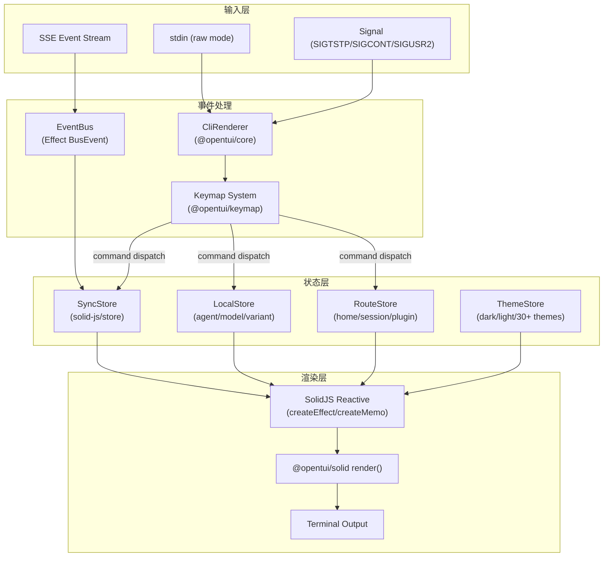

# tui-expert-of-opencode

> 从 OpenCode 项目提炼的 Coding Agent TUI 架构精华。适用于任何需要构建终端交互式 Agent 的场景。

**项目概况**：OpenCode 是一个 AI 驱动的开发工具，TUI 层基于 `@opentui/solid`（SolidJS 终端渲染框架）+ `@opentui/core`（终端渲染引擎）+ `@opentui/keymap`（键映射系统），运行在 Bun 上。整体架构采用声明式组件 + 响应式状态 + SSE 事件流驱动。

## 使用指南

按需加载 `references/` 下的详细文档。SKILL.md 保留架构概览与索引；实现细节、代码示例、mermaid 图均在 references 中。

| 主题 | 何时阅读 |
|------|----------|
| [事件循环与输入处理](references/event-loop-input.md) | 终端 raw mode、键映射、粘贴、按键序列 |
| [渲染系统](references/rendering-system.md) | 差分渲染、resize、流式局部刷新 |
| [组件/视图系统](references/component-view-system.md) | SolidJS 组件、Provider、Dialog、组件树 |
| [状态管理与数据流](references/state-management.md) | SyncStore、Bootstrap、SSE→渲染链路 |
| [异步任务与 UI 反馈](references/async-ui-feedback.md) | Spinner、中断、重试、SSE 重连 |
| [样式与主题](references/styling-theming.md) | 主题解析、System 主题、动画降级 |
| [技巧与避坑](references/tips-pitfalls.md) | 12 条技巧 + 7 个常见陷阱 |
| [实现蓝图](references/implementation-blueprint.md) | 目录结构、接口定义、代码骨架 |
| [源码索引](references/source-index.md) | OpenCode 源码路径与行号对照 |

---

## 1. 总体架构

### 1.1 技术栈

| 层次 | 技术 | 职责 |
|------|------|------|
| 运行时 | Bun | 文件系统、FFI、进程管理 |
| 渲染引擎 | `@opentui/core` (createCliRenderer) | 终端原始模式管理、布局、差分渲染、鼠标/键盘事件 |
| UI 框架 | `@opentui/solid` (render) | SolidJS 响应式组件系统，JSX 声明式 UI |
| 键映射 | `@opentui/keymap` | Leader 键、模式栈、命令注册、多键序列 |
| 状态管理 | `solid-js/store` (createStore) | 响应式 store，支持 reconcile/produce 细粒度更新 |
| 事件总线 | Effect BusEvent + SSE | 服务端事件 → TUI 状态同步 |
| 持久化 | KV (key-value context) | 用户偏好、主题、键绑定等本地状态 |

### 1.2 顶层数据流

**关键源码入口**：
- TUI 初始化：`packages/opencode/src/cli/cmd/tui/app.tsx#L166-L265`
- Renderer 创建：`packages/opencode/src/cli/cmd/tui/app.tsx#L192-L193`
- SolidJS 渲染：`packages/opencode/src/cli/cmd/tui/app.tsx#L200-L263`

---

## 2. 事件循环与输入处理

`createCliRenderer` 统一管理终端 raw mode（Kitty 键盘、手动焦点、可配置鼠标）。键映射采用 **Leader 键 + 模式栈 + 命令注册** 三层架构，模式栈用 symbol 标记 push/pop 防止泄漏。粘贴经 bracketed paste 解码，长文本自动折叠。

See [事件循环与输入处理详解](references/event-loop-input.md) for details.

---

## 3. 渲染管线

SolidJS 声明式组件 + `@opentui/core` 差分渲染的双层架构：SolidJS 追踪依赖细粒度更新，CliRenderer 按 targetFps=60 输出差分转义序列。流式 token 通过 SSE `message.part.delta` + `produce` 增量追加。

See [渲染系统详解](references/rendering-system.md) for details.

---

## 4. 组件/视图系统

SolidJS 函数组件 + JSX，`createSimpleContext` 工厂统一 Provider 模式。手动焦点管理（`autoFocus: false`），Dialog 栈式管理并自动 push modal 模式。路由分为 home/session/plugin，Provider 嵌套 15+ 层。

See [组件/视图系统详解](references/component-view-system.md) for details.

---

## 5. 状态管理与数据流

`SyncStore` 单一大树结构，变更方式：`reconcile`（完整替换）、`produce`（有序数组）、路径更新、delta 追加。有序数组用二分查找 O(log n) 定位。Bootstrap 分阶段加载（blocking → partial → complete），SDK 16ms 事件批处理。

See [状态管理与数据流详解](references/state-management.md) for details.

---

## 6. 异步任务与 UI 反馈

Spinner 用 opentui-spinner 原生组件，KV 控制动画降级。会话状态追踪 working/idle/compacting。三次 Esc 中断策略，SSE 指数退避重连（1s–30s）。

See [异步任务与 UI 反馈详解](references/async-ui-feedback.md) for details.

---

## 7. 样式与主题

30+ 内置主题 JSON + 自定义主题 + System 主题（终端 16 色调色板自动生成）。支持 dark/light 变体、颜色引用链、循环引用检测。SIGUSR2 触发主题刷新。

See [样式与主题详解](references/styling-theming.md) for details.

---

## 8. 关键技巧与避坑指南

12 条生产技巧（二分查找、事件批处理、Bootstrap 分阶段、Mode Stack、Dialog 焦点等）和 7 个常见陷阱（IME 时序、Store 直接赋值、ConPTY 空粘贴、session 竞态等）。

See [技巧与避坑详解](references/tips-pitfalls.md) for details.

---

## 9. 可复用实现蓝图

推荐 `src/tui/` 目录结构、核心 TypeScript 接口（RendererConfig、ModeStack、SyncStore、DialogAPI、RouteAPI、ThemeAPI、EventAPI）、事件/渲染/状态耦合 mermaid 图、TUI 初始化与 SyncStore 代码骨架。

See [实现蓝图详解](references/implementation-blueprint.md) for details.

---

## 10. 源码引用索引

OpenCode TUI 全部关键源码路径与行号对照表，覆盖 app、keymap、sync、theme、prompt、dialog 等模块。

See [源码引用索引](references/source-index.md) for details.
