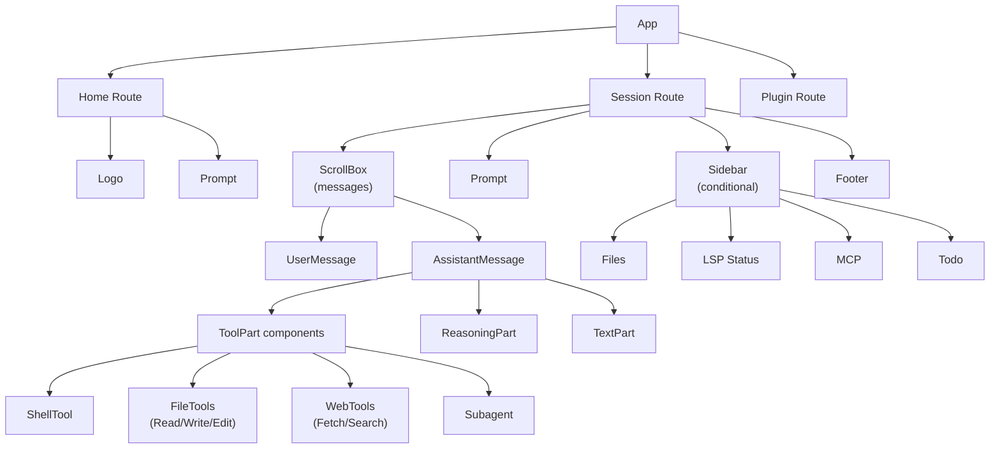

# 组件/视图系统

## 4.1 组件定义方式

所有组件使用 SolidJS 函数组件 + JSX：

```typescript
// packages/opencode/src/cli/cmd/tui/component/spinner.tsx#L10-L24
export function Spinner(props: { children?: JSX.Element; color?: RGBA }) {
  const { theme } = useTheme()
  const color = () => props.color ?? theme.textMuted
  return (
    <Show when={animationsEnabled()} fallback={<text>⋯ {props.children}</text>}>
      <box flexDirection="row" gap={1}>
        <spinner frames={SPINNER_FRAMES} interval={80} color={color()} />
        <Show when={props.children}>
          <text fg={color()}>{props.children}</text>
        </Show>
      </box>
    </Show>
  )
}
```

## 4.2 Context Provider 模式

使用自定义 `createSimpleContext` 工厂（`context/helper.tsx#L1-L25`）创建 Provider + use hook 对：

```typescript
export const { use: useSync, provider: SyncProvider } = createSimpleContext({
  name: "Sync",
  init: () => {
    // 初始化逻辑，返回 public API
    const [store, setStore] = createStore(initialState)
    return { data: store, set: setStore, /* ... */ }
  },
})
```

## 4.3 聚焦管理

- **手动焦点管理**：`autoFocus: false` 配置（`app.tsx#L136`），组件通过 `input.focus()`/`input.blur()` 显式控制
- **Dialog 焦点保存/恢复**：`ui/dialog.tsx#L84-L99` — 打开 dialog 时保存当前焦点元素，关闭时恢复
- **焦点跟随路由**：`prompt/index.tsx#L698-L708` — 根据 visible 和 dialog 状态决定是否聚焦输入框

## 4.4 组件树



**Provider 嵌套顺序**（`app.tsx#L207-L261`）：
```
OpencodeKeymapProvider > ArgsProvider > ExitProvider > KVProvider > ToastProvider
> RouteProvider > TuiConfigProvider > SDKProvider > ProjectProvider > SyncProvider
> SyncProviderV2 > ThemeProvider > LocalProvider > PromptStashProvider > DialogProvider
> FrecencyProvider > PromptHistoryProvider > PromptRefProvider > EditorContextProvider > App
```

## 4.5 Dialog 系统

Dialog 基于 **栈式管理**（`ui/dialog.tsx#L66-L173`）：
- `replace()` — 替换栈顶（最常用）
- `clear()` — 清空全部
- 打开 dialog 自动 push "modal" 模式到 modeStack
- Esc/Ctrl+C 关闭当前 dialog 并恢复焦点
- 半透明遮罩层 + 居中定位
