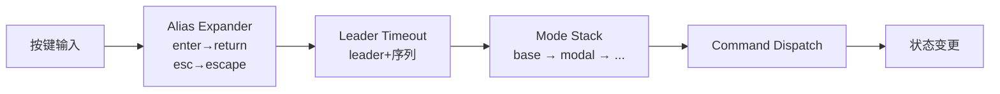
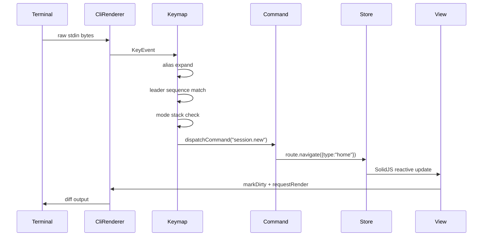

# 事件循环与输入处理

## 2.1 终端初始化与原始模式

OpenCode 通过 `@opentui/core` 的 `createCliRenderer` 统一管理终端状态，配置包括：

```typescript
// packages/opencode/src/cli/cmd/tui/app.tsx#L126-L147
const rendererConfig = {
  externalOutputMode: "passthrough",
  targetFps: 60,
  exitOnCtrlC: false,       // 自行处理 Ctrl+C
  useKittyKeyboard: {},     // 启用 Kitty 键盘协议
  autoFocus: false,          // 手动焦点管理
  useMouse: mouseEnabled,    // 可配置鼠标支持
}
```

**Windows 特殊处理**：通过 FFI 调用 kernel32 禁用 `ENABLE_PROCESSED_INPUT`，拦截 Ctrl+C 在 Windows 上的特殊行为：
- `packages/opencode/src/cli/cmd/tui/win32.ts#L30-L42` — 禁用 processed input
- `packages/opencode/src/cli/cmd/tui/win32.ts#L69-L130` — Ctrl+C 守卫：hook `setRawMode` + 100ms 轮询确保模式不被覆盖

## 2.2 键映射系统

键映射采用 **Leader 键 + 模式栈 + 命令注册** 三层架构：



**模式栈实现**（栈式状态机）：

```typescript
// packages/opencode/src/cli/cmd/tui/keymap.tsx#L41-L88
// 用 symbol 标记每个 push，pop 时只移除自己的 entry
const stack: { id: symbol; mode: string }[] = []
const push = (mode: string) => {
  const id = Symbol(mode)
  stack.push({ id, mode })
  update() // 设置当前模式到 keymap data
  return () => { /* 只 pop 自己的 entry */ }
}
```

**注册流程**（`registerOpencodeKeymap`）：
- `keymap.tsx#L196-L227` — 一次性注册所有 addon：
  - `registerCommaBindings` — 逗号前缀绑定
  - `registerKeyAliases` — 键别名展开
  - `registerBaseLayoutFallback` — 基础布局兜底
  - `registerTimedLeader` — Leader 键超时
  - `registerEscapeClearsPendingSequence` — Esc 清除挂起序列
  - `registerBackspacePopsPendingSequence` — Backspace 回退序列
  - `registerManagedTextareaLayer` — 焦点 textarea 的输入层托管

## 2.3 粘贴模式处理

粘贴通过 `onPaste` 事件在 textarea 层处理：
- `packages/opencode/src/cli/cmd/tui/component/prompt/index.tsx#L1513-L1537`
- 使用 `decodePasteBytes` 解码 bracketed paste
- 规范化行尾（`\r\n` → `\n`，`\r` → `\n`）
- 长文本（≥3 行或 >150 字符）自动折叠为 `[Pasted ~N lines]` 虚拟文本
- Windows 空粘贴降级为 `prompt.paste` 命令

## 2.4 按键到状态变更序列


