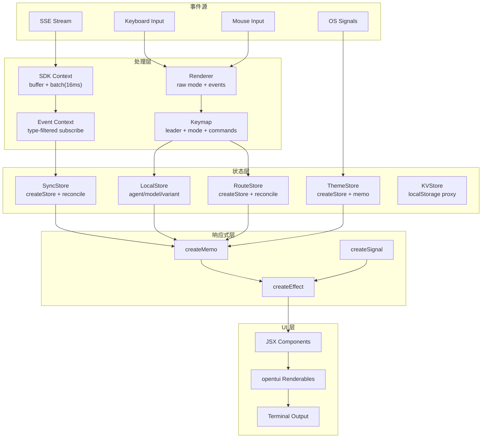

# 可复用实现蓝图

## 9.1 推荐目录结构

```
src/tui/
├── app.tsx                    # 入口：创建 renderer + Provider 树
├── keymap.tsx                 # 键映射注册、模式栈
├── event.ts                   # TUI 内部事件定义
├── win32.ts                   # 平台兼容处理
├── attention.ts               # 通知/声音/焦点管理
├── routes/
│   ├── home.tsx               # 首页路由
│   └── session/
│       ├── index.tsx           # 主会话路由
│       ├── sidebar.tsx         # 侧边栏
│       └── footer.tsx          # 底部状态栏
├── component/                 # 可复用 UI 组件
│   ├── spinner.tsx
│   ├── prompt/
│   │   ├── index.tsx           # 输入框 + 粘贴 + 历史
│   │   ├── autocomplete.tsx
│   │   └── history.tsx
│   ├── dialog-*.tsx           # 各类弹窗
│   └── border.tsx
├── ui/                        # 基础 UI 原语
│   ├── dialog.tsx             # Dialog 框架（栈管理）
│   ├── toast.tsx              # Toast 通知
│   └── dialog-alert.tsx       # Alert/Confirm 基础弹窗
├── context/                   # 状态 Context
│   ├── helper.tsx             # createSimpleContext 工厂
│   ├── sync.tsx               # 全局数据同步 Store
│   ├── local.tsx              # 本地 UI 状态 (agent/model)
│   ├── route.tsx              # 路由状态
│   ├── theme.tsx              # 主题管理
│   ├── sdk.tsx                # SDK 客户端 + SSE
│   ├── event.tsx              # 事件订阅 hook
│   ├── kv.tsx                 # 持久化 KV
│   └── exit.tsx               # 退出管理
├── config/
│   └── tui.ts                 # TUI 配置解析
└── util/
    ├── clipboard.ts           # 剪贴板操作
    ├── selection.ts           # 文本选择
    └── scroll.ts              # 滚动加速
```

## 9.2 核心接口定义

```typescript
// ---- Renderer 配置 ----
interface RendererConfig {
  targetFps: number
  exitOnCtrlC: boolean
  useKittyKeyboard: object | false
  autoFocus: boolean
  useMouse: boolean
}

// ---- 键映射模式栈 ----
interface ModeStack {
  current(): string
  push(mode: string): () => void  // 返回 dispose
  dispose(): void
}

// ---- 全局 Store 接口 ----
interface SyncStore {
  status: "loading" | "partial" | "complete"
  provider: Provider[]
  session: Session[]
  message: Record<string, Message[]>
  part: Record<string, Part[]>
  permission: Record<string, PermissionRequest[]>
  // ...
}

// ---- Dialog 栈 ----
interface DialogAPI {
  replace(element: JSX.Element, onClose?: () => void): void
  clear(): void
  stack: { element: JSX.Element; onClose?: () => void }[]
  size: "medium" | "large" | "xlarge"
}

// ---- 路由 ----
type Route =
  | { type: "home" }
  | { type: "session"; sessionID: string }
  | { type: "plugin"; id: string; data?: Record<string, unknown> }

interface RouteAPI {
  data: Route
  navigate(route: Route): void
}

// ---- 主题 ----
interface ThemeAPI {
  theme: Record<string, RGBA>
  syntax: SyntaxStyle
  mode(): "dark" | "light"
  setMode(mode: "dark" | "light"): void
  set(name: string): boolean
}

// ---- 事件系统 ----
interface EventAPI {
  subscribe(handler: (event: Event, meta: EventMeta) => void): () => void
  on<T extends Event["type"]>(type: T, handler: EventHandler<T>): () => void
}
```

## 9.3 事件/渲染/状态耦合关系



## 9.4 关键代码骨架

### TUI 初始化

```typescript
async function initTUI(config: Config) {
  // 1. 平台兼容
  const unguard = win32InstallCtrlCGuard()
  win32DisableProcessedInput()

  // 2. 创建 renderer
  const renderer = await createCliRenderer({
    targetFps: 60,
    exitOnCtrlC: false,
    useKittyKeyboard: {},
    autoFocus: false,
  })

  // 3. 创建 keymap
  const keymap = createDefaultOpenTuiKeymap(renderer)
  registerKeymap(keymap, renderer, config)

  // 4. 渲染 SolidJS 树
  await render(() => (
    <KeymapProvider keymap={keymap}>
      <SDKProvider>
        <SyncProvider>
          <ThemeProvider>
            <RouteProvider>
              <DialogProvider>
                <App />
              </DialogProvider>
            </RouteProvider>
          </ThemeProvider>
        </SyncProvider>
      </SDKProvider>
    </KeymapProvider>
  ), renderer)
}
```

### 事件同步 Store

```typescript
function createSyncStore(sdk, event) {
  const [store, setStore] = createStore(initialState)

  event.subscribe((evt) => {
    switch (evt.type) {
      case "item.updated": {
        const result = Binary.search(store.items, evt.id, (x) => x.id)
        if (result.found) {
          setStore("items", result.index, reconcile(evt.data))
        } else {
          setStore("items", produce((d) => d.splice(result.index, 0, evt.data)))
        }
        break
      }
      case "item.delta": {
        setStore("items", produce((d) => {
          d[result.index].text += evt.delta
        }))
        break
      }
    }
  })

  return { data: store, set: setStore }
}
```
