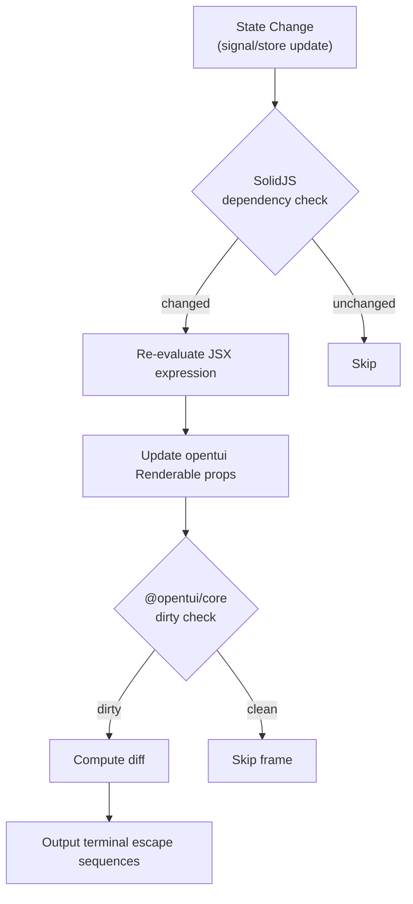

# 渲染管线

## 3.1 渲染策略：声明式 + 响应式差分

OpenCode 采用 **SolidJS 声明式组件** + **@opentui/core 差分渲染** 的双层架构：

1. **SolidJS 层**：JSX 描述 UI 树，`createSignal`/`createMemo`/`createEffect` 追踪依赖，只有变化的部分会重新求值
2. **opentui 层**：`CliRenderer` 维护虚拟 DOM 树，每帧（targetFps=60）计算差分，只输出变化的终端转义序列

关键渲染配置（`app.tsx#L126-L147`）：
- `targetFps: 60` — 目标帧率
- `gatherStats: false` — 生产关闭统计
- `useKittyKeyboard: {}` — Kitty 键盘协议支持

## 3.2 终端尺寸与 resize

通过 `useTerminalDimensions()` hook 获取响应式终端尺寸：

```typescript
// packages/opencode/src/cli/cmd/tui/app.tsx#L269
const dimensions = useTerminalDimensions()
// 在 JSX 中直接绑定
<box width={dimensions().width} height={dimensions().height}>
```

## 3.3 流式内容局部刷新

流式 token 通过 SSE `message.part.delta` 事件增量追加：

```typescript
// packages/opencode/src/cli/cmd/tui/context/sync.tsx#L327-L343
case "message.part.delta": {
  setStore("part", event.properties.messageID, produce((draft) => {
    const part = draft[result.index]
    const field = event.properties.field
    const existing = part[field] as string | undefined
    part[field] = (existing ?? "") + event.properties.delta
  }))
}
```

SolidJS 的细粒度响应式确保只有变化的 text 节点触发重新渲染，而非整个消息列表。

## 3.4 一帧渲染决策


