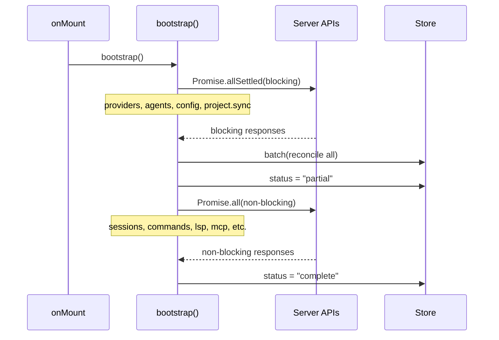
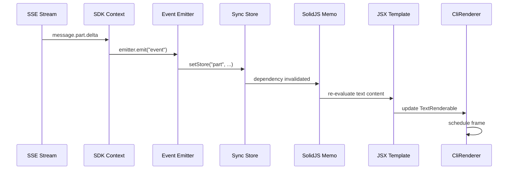

# 状态管理与数据流

## 5.1 全局 Store 组织

核心 store 位于 `context/sync.tsx#L40-L108`，采用单一大树结构：

```typescript
const [store, setStore] = createStore<{
  status: "loading" | "partial" | "complete"
  provider: Provider[]
  agent: Agent[]
  session: Session[]
  message: { [sessionID: string]: Message[] }
  part: { [messageID: string]: Part[] }
  permission: { [sessionID: string]: PermissionRequest[] }
  question: { [sessionID: string]: QuestionRequest[] }
  todo: { [sessionID: string]: Todo[] }
  session_diff: { [sessionID: string]: Snapshot.FileDiff[] }
  // ... 更多
}>()
```

## 5.2 变更方式

1. **reconcile** — 完整替换（服务端数据同步）：`sync.tsx#L434-L441`
2. **produce** — 原地修改（插入/删除有序数组）：`sync.tsx#L146-L149`
3. **路径更新** — `setStore("session_status", sessionID, status)`：`sync.tsx#L249`
4. **delta 追加** — 流式 token 拼接：`sync.tsx#L335-L341`

## 5.3 Binary Search 有序数组操作

所有有序数组（session、message、part、permission、question）使用 **二分查找** 进行定位，保证 O(log n) 查找性能：

```typescript
// sync.tsx#L259
const result = Binary.search(messages, event.properties.info.id, (m) => m.id)
if (result.found) {
  setStore("message", sessionID, result.index, reconcile(event.properties.info))
} else {
  setStore("message", sessionID, produce((draft) => {
    draft.splice(result.index, 0, event.properties.info)
  }))
}
```

## 5.4 消息自动清理

当单个 session 消息超过 100 条时自动清理最旧的（`sync.tsx#L271-L289`），防止内存膨胀。

## 5.5 引导流程 (Bootstrap)



**源码**：`context/sync.tsx#L378-L479`

## 5.6 状态更新到渲染



**SDK 事件批处理**（`context/sdk.tsx#L46-L72`）：16ms 内的事件自动批处理，通过 `batch()` 包裹确保单次渲染。
