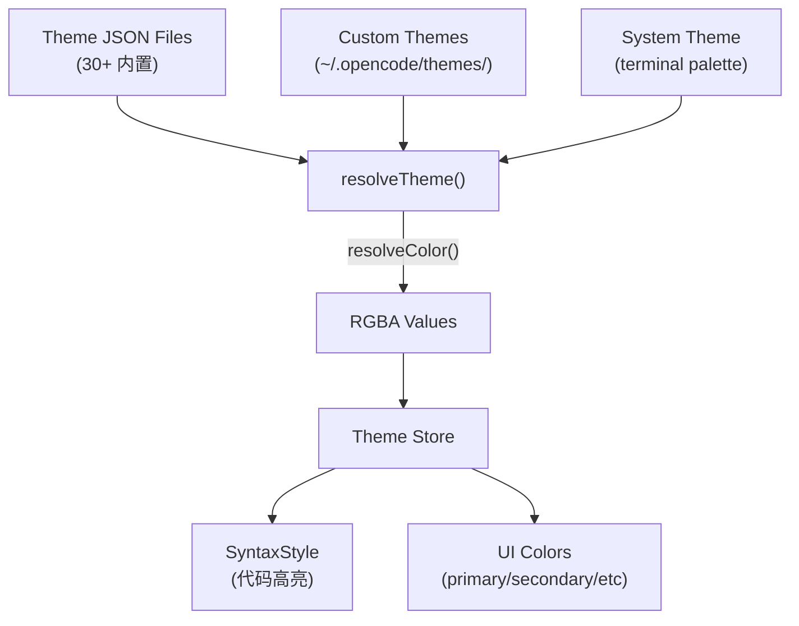

# 样式与主题

## 7.1 主题系统架构



## 7.2 主题解析

主题 JSON 支持颜色引用链和 dark/light 变体（`context/theme.tsx#L199-L257`）：

```json
{
  "defs": { "bg": "#1a1a2e" },
  "theme": {
    "primary": { "dark": "#00d4ff", "light": "#0088cc" },
    "background": "bg"
  }
}
```

解析过程：检测循环引用 → 递归 resolve → 输出 RGBA。

## 7.3 System 主题生成

从终端 16 色调色板自动生成完整主题（`context/theme.tsx#L522-L631`），包括：
- 灰度梯度生成（基于背景亮度）
- Diff 颜色（添加/删除/上下文）通过 `tint()` 混合
- 语法高亮映射到 ANSI 颜色

## 7.4 深色/浅色模式切换

- 跟随系统：监听 `CliRenderEvents.THEME_MODE`（`theme.tsx#L405`）
- 锁定模式：`lock()`/`unlock()` 持久化到 KV
- SIGUSR2 信号触发主题刷新（`theme.tsx#L411`）

## 7.5 动画降级

```typescript
// spinner.tsx#L15
<Show when={kv.get("animations_enabled", true)} fallback={<text>⋯</text>}>
  <spinner ... />
</Show>
```

KV 持久化的 `animations_enabled` 标志控制所有动画降级。
