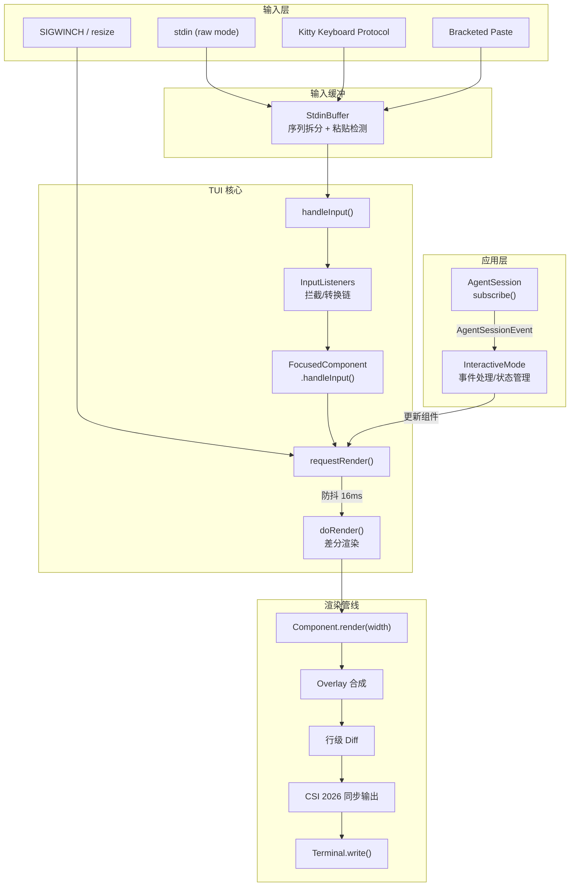

# tui-expert-of-pi-coding-agent

当需要从零构建或重构一个终端用户界面 (TUI / CLI Interactive Layer) 时使用此技能。涵盖：自定义 TUI 框架设计（非依赖 blessed/ink）、差分渲染、Kitty 键盘协议、组件树、状态同步、主题系统、跨平台兼容。适用场景：coding agent、聊天式 CLI、全屏终端应用。

本技能源自对 [pi-coding-agent](https://github.com/earendil-works/pi) 项目的深度源码分析，该项目是一个 TypeScript/Node.js 实现的 AI 编程助手，拥有自研的 `@earendil-works/pi-tui` 框架。

## 使用指引

遇到 TUI 相关设计问题时，按场景查阅 `references/` 下的详细文档：

| 场景 | 查阅 |
|------|------|
| 键盘输入、粘贴、Kitty 协议 | [input-system.md](references/input-system.md) |
| 差分渲染、同步输出、resize | [rendering-pipeline.md](references/rendering-pipeline.md) |
| 组件树、焦点、Overlay | [component-model.md](references/component-model.md) |
| 会话状态、流式消息 | [state-management.md](references/state-management.md) |
| Spinner、stdout 保护、剪贴板 | [async-ui-feedback.md](references/async-ui-feedback.md) |
| 主题 JSON、颜色降级 | [theme-system.md](references/theme-system.md) |
| 避坑与最佳实践 | [tips-and-pitfalls.md](references/tips-and-pitfalls.md) |
| 从零搭建、代码模板 | [implementation-blueprint.md](references/implementation-blueprint.md) |
| 源码行号索引 | [source-index.md](references/source-index.md) |

---

## 1. 总体架构

### 技术栈与整体风格

- **语言**: TypeScript (Node.js)，无原生依赖（Windows VT 输入模式除外）
- **渲染策略**: 声明式组件 + 即时模式差分渲染（retained mode diff）
- **输入系统**: 自研 `StdinBuffer` + Kitty 键盘协议 + xterm modifyOtherKeys 降级
- **组件模型**: 扁平组合（`Container.addChild`），无虚拟 DOM，每次 `requestRender()` 触发全量 `render()` 后做行级 diff
- **主题系统**: JSON 定义 + 51 个语义化色值 + truecolor/256color 自动降级 + 热重载
- **异步/UI 同步**: Observer 模式（`session.subscribe`），事件驱动更新组件后 `requestRender()`

### 顶层数据流

**关键设计**: 渲染请求经 `process.nextTick` + `setTimeout(16ms)` 防抖合并，确保高频事件（流式 token、快速输入）不会每次都触发重绘。`tui.ts#L495-L542`

---

## 2. 事件循环与输入处理

Node.js 事件驱动架构：`stdin data` → `StdinBuffer` 序列拆分 → `handleInput()` → InputListeners 拦截链 → 焦点组件。`StdinBuffer` 解决转义序列不完整、Bracketed Paste 检测、Kitty 重复消除；`ProcessTerminal` 启动时探测 Kitty 协议（`\x1b[?u`），150ms 无响应降级到 xterm modifyOtherKeys。`KeybindingsManager` 提供声明式键绑定与用户覆盖。

See [事件循环与输入处理详解](references/input-system.md) for StdinBuffer 状态机、Kitty 协议降级、键映射与按键到状态变更的完整时序图。

---

## 3. 渲染管线

`doRender()` 实现行级差分：全量 `render(width)` → Overlay 合成 → CURSOR_MARKER 提取 → 逐行 diff → 增量 CSI 写入 → `\x1b[?2026h/l` 同步输出包裹。宽度/高度变化、内容缩小、变化行在视口上方时触发全量重绘；流式 token 自然只更新尾部行。

See [渲染管线详解](references/rendering-pipeline.md) for diff rendering、CSI 2026 synchronized output、overlay composition、终端能力检测与 resize 自适应细节。

---

## 4. 组件/视图系统

所有组件实现 `Component` 接口（`render(width)` / `handleInput?` / `invalidate()`）；可聚焦组件嵌入 `CURSOR_MARKER` 标记硬件光标。`Container` 扁平组合子组件；Overlay 支持 anchor/百分比定位、焦点栈恢复、nonCapturing 模式。Editor 实现虚拟滚动（可见行 = max(5, 30% 终端高度)）。

See [组件模型详解](references/component-model.md) for Component/Focusable 接口、典型界面组件树 mermaid 图与 Overlay Handle API。

---

## 5. 状态管理与数据流

`InteractiveMode` 集中持有 `AgentSession`、流式组件、pendingTools 等状态。通过 `session.subscribe()` 监听 `AgentSessionEvent`，`handleEvent()` 分发后 `requestRender()`。流式生成是最复杂场景：message_start → token chunk → tool execution → message_end 全链路。

See [状态管理详解](references/state-management.md) for 流式状态 sequence diagram 与 Editor UndoStack/Kill Ring。

---

## 6. 异步任务与 UI 反馈

Observer 模式连接后台任务与 UI。`Loader` 用 `setInterval(80ms)` 驱动 Braille spinner；流式 token 经 16ms 防抖合并为批量渲染。Ctrl+C 双击退出、Escape 中断流式、Ctrl+Z suspend/resume 含 keepalive 防护。`output-guard.ts` 劫持 stdout 到 stderr；剪贴板多层降级（native → 平台工具 → OSC 52）。

See [异步 UI 反馈详解](references/async-ui-feedback.md) for Loader 实现、Ctrl+Z 挂起恢复、stdout 重定向与跨平台剪贴板降级链。

---

## 7. 样式与主题

JSON 主题文件定义 51 个语义化色值（Core UI / Markdown / Syntax 等 8 组）；truecolor → 256color 加权欧几里得降级；`fs.watch` 热重载（100ms 防抖）。`detectTerminalBackground()` 通过 COLORFGBG 或 OSC 11 选择 dark/light。Theme 类为 Editor/Markdown/SelectList 提供适配接口；`ExtensionUIContext` 暴露对话框、widget 注入、主题切换等扩展点。

See [主题系统详解](references/theme-system.md) for 色值分组表、变量引用解析、终端背景检测与 Extension UI Context API。

---

## 8. 关键技巧与避坑指南

核心技巧：CSI 2026 同步输出、16ms 渲染防抖、CURSOR_MARKER 零宽度标记、Paste Marker 折叠、Kitty 图片 ID 追踪、行宽溢出保护、Emergency 终端恢复、drainInput 输入排空、stdout 重定向保护。常见陷阱：stdin 批量到达、Kitty 退出序列泄漏、tmux 粘贴重编码、渲染行超宽、Windows Shift+Tab、回滚缓冲区残留、Spinner 与流式竞争。

See [技巧与避坑详解](references/tips-and-pitfalls.md) for 15 条技巧与 7 个陷阱的完整说明与源码引用。

---

## 9. 可复用实现蓝图

10 步实现清单（Terminal → StdinBuffer → Component → Diff → Focus → Overlay → Keybindings → Theme → 业务组件 → 应用层）、渲染/输入协议决策树、推荐目录结构、核心 TypeScript 接口定义、~200 行最小 TUI 骨架，以及 13 个模式目录（流式追加、Spinner、粘贴保护、安全退出、stdout 保护、双击检测、虚拟滚动、Undo/Redo、Kitty 探测、主题热重载、剪贴板降级、Input Listener、Ctrl+Z 挂起）。

See [实现蓝图详解](references/implementation-blueprint.md) for Quick Start 清单、架构决策树、完整代码模板与事件/渲染/状态耦合 mermaid 图。

---

## 10. 源码引用索引

按文件路径与行号范围索引全部关键实现，覆盖 `packages/tui/src/` 与 `packages/coding-agent/` 下的 tui.ts、terminal.ts、stdin-buffer.ts、editor.ts、theme.ts、interactive-mode.ts 等。

See [源码引用索引](references/source-index.md) for 完整表格（70+ 条目，含章节编号与说明）。

---

## Guardrails

- 不要照搬 pi-tui 源码，提取可复用的设计模式与接口边界
- TUI 框架层不含业务逻辑（AI 会话、文件操作等），业务组件 extend 框架组件
- 终端兼容性检测在启动期完成，退出时必须恢复所有协议模式与 cooked stdin
- 流式渲染依赖 16ms 防抖 + 行级 diff，避免每 token 全屏重绘
- 第三方 stdout 输出必须重定向，否则破坏差分渲染状态追踪
