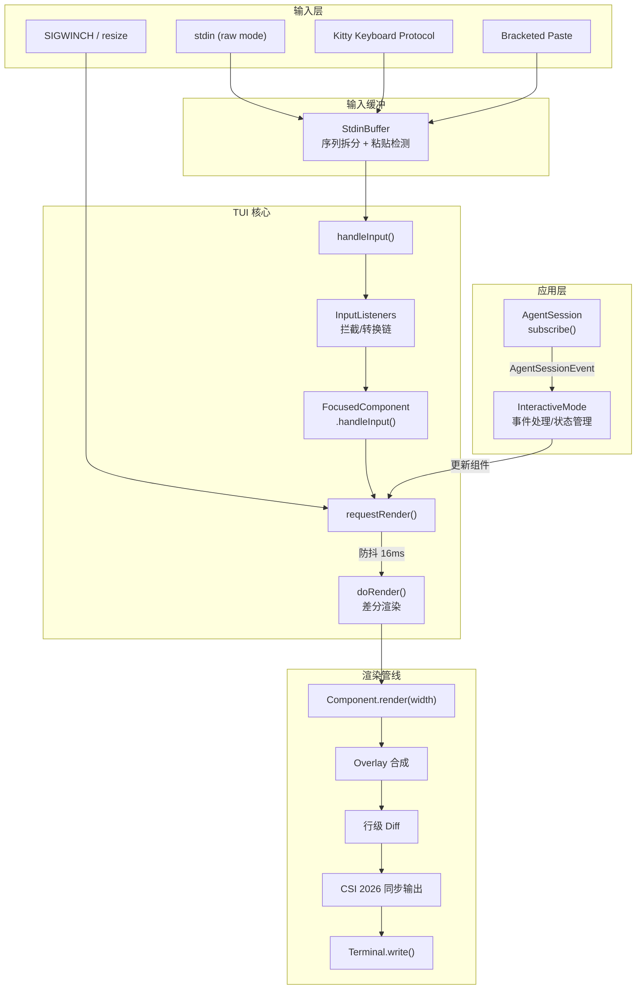
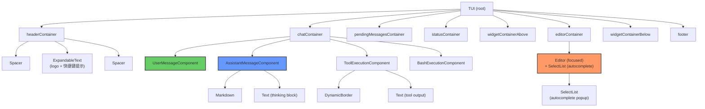
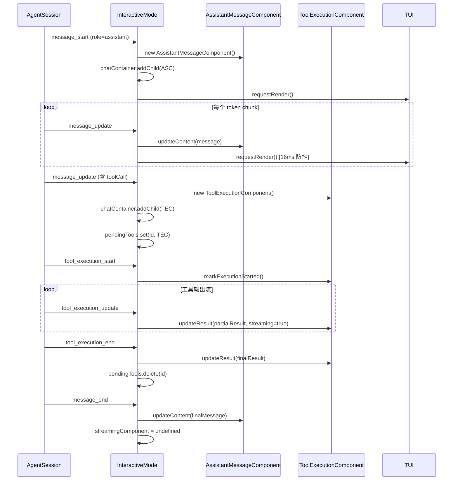
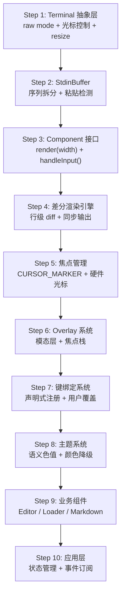
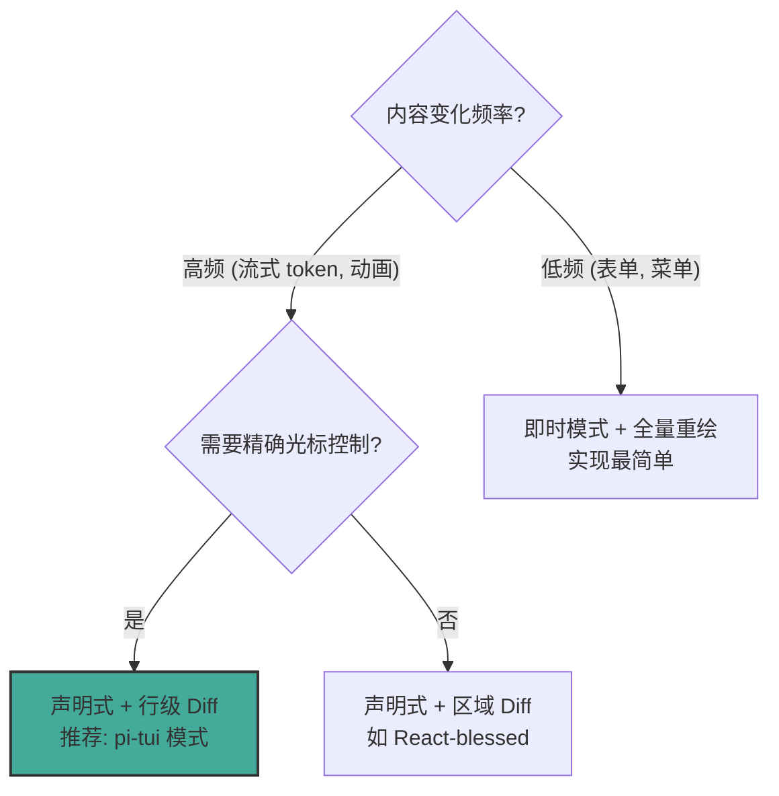
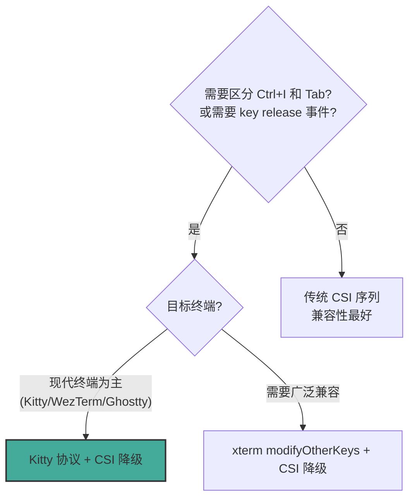
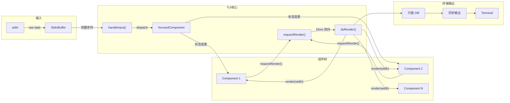

# tui-expert-of-pi-coding-agent

当需要从零构建或重构一个终端用户界面 (TUI / CLI Interactive Layer) 时使用此技能。涵盖：自定义 TUI 框架设计（非依赖 blessed/ink）、差分渲染、Kitty 键盘协议、组件树、状态同步、主题系统、跨平台兼容。适用场景：coding agent、聊天式 CLI、全屏终端应用。关键词：TUI, terminal UI, differential rendering, Kitty protocol, raw mode, bracketed paste, overlay, component tree, spinner, streaming content。

本技能源自对 [pi-coding-agent](https://github.com/earendil-works/pi) 项目的深度源码分析，该项目是一个 TypeScript/Node.js 实现的 AI 编程助手，拥有自研的 `@earendil-works/pi-tui` 框架。

---

## 1. 总体架构

### 技术栈与整体风格

- **语言**: TypeScript (Node.js)，无原生依赖（Windows VT 输入模式除外）
- **渲染策略**: 声明式组件 + 即时模式差分渲染（retained mode diff）
- **输入系统**: 自研 `StdinBuffer` + Kitty 键盘协议 + xterm modifyOtherKeys 降级
- **组件模型**: 扁平组合（`Container.addChild`），无虚拟 DOM，每次 `requestRender()` 触发全量 `render()` 后做行级 diff
- **主题系统**: JSON 定义 + 51 个语义化色值 + truecolor/256color 自动降级 + 热重载
- **异步/UI 同步**: Observer 模式（`session.subscribe`），事件驱动更新组件后 `requestRender()`

### 顶层数据流



**关键设计**: 渲染请求经 `process.nextTick` + `setTimeout(16ms)` 防抖合并，确保高频事件（流式 token、快速输入）不会每次都触发重绘。`tui.ts#L495-L542`

---

## 2. 事件循环与输入处理

### 事件循环实现

TUI 没有显式事件循环。它依赖 Node.js 事件驱动架构：

1. **stdin data 事件** → `StdinBuffer.process(data)` → 拆分为完整序列 → `handleInput(data)` `terminal.ts#L103-L137`
2. **resize 事件** → `stdout.on("resize", handler)` → `requestRender()` `terminal.ts#L119`
3. **定时器** → `Loader` 组件的 `setInterval` 驱动动画，每次 tick 调用 `requestRender()` `loader.ts#L77-L81`

### StdinBuffer: 输入拆分与粘贴检测

核心问题是 stdin data 事件可能包含不完整的转义序列。`StdinBuffer` 通过状态机+超时机制解决：

- **序列完整性检测**: 逐字符判断 CSI/OSC/DCS/APC/SS3 序列是否完整 `stdin-buffer.ts#L29-L78`
- **Bracketed Paste**: 检测 `\x1b[200~` ... `\x1b[201~` 包裹的粘贴内容，作为单一 `paste` 事件发出 `stdin-buffer.ts#L315-L369`
- **超时 flush**: 10ms 内序列未闭合则强制发出，避免 ESC 键等待过长 `stdin-buffer.ts#L378-L386`
- **Kitty 重复消除**: Kitty 协议会同时发送 printable codepoint 和传统序列，buffer 去重以避免双击 `stdin-buffer.ts#L389-L398`

### Kitty 键盘协议与降级

`ProcessTerminal` 在启动时探测 Kitty 协议支持：

1. 发送 `\x1b[?u` 查询当前 flags `terminal.ts#L213`
2. 若终端响应 `\x1b[?<flags>u`，启用 Kitty 协议（flags: disambiguate + report events + alternate keys） `terminal.ts#L156-L168`
3. 150ms 无响应则降级到 xterm `modifyOtherKeys` mode 2 (`\x1b[>4;2m`) `terminal.ts#L214-L219`
4. 退出时正确还原所有模式 `terminal.ts#L296-L341`

### 键映射与命令模式

`KeybindingsManager` 提供声明式键绑定：

- **全局注册表**: 通过 TypeScript 声明合并（`interface Keybindings`）定义所有可用动作 `keybindings.ts#L7-L42`
- **默认映射**: `TUI_KEYBINDINGS` 常量提供默认键位 `keybindings.ts#L54-L80`
- **用户覆盖**: 支持用户自定义键位，冲突检测 `keybindings.ts#L194-L212`
- **多键绑定**: 一个动作可绑定多个键（如 `["left", "ctrl+b"]`） `keybindings.ts#L57-L59`

### 一次按键到状态变更

```mermaid
sequenceDiagram
    participant T as Terminal
    participant SB as StdinBuffer
    participant TUI as TUI.handleInput()
    participant IL as InputListeners
    participant ED as Editor.handleInput()
    participant KB as KeybindingsManager
    participant App as InteractiveMode

    T->>SB: stdin data: "\x1b[1;5C" (Ctrl+Right)
    SB->>TUI: emit "data", "\x1b[1;5C"
    TUI->>IL: 遍历 listeners (可拦截/转换)
    IL-->>TUI: { consume: false }
    TUI->>ED: focusedComponent.handleInput(data)
    ED->>KB: matches(data, "tui.editor.cursorWordRight")
    KB-->>ED: true
    ED->>ED: moveWordForwards()
    ED->>App: onChange(newText)
    ED->>TUI: requestRender() [隐式]
    TUI->>TUI: scheduleRender() [16ms 防抖]
    TUI->>TUI: doRender() [差分渲染]
```

---

## 3. 渲染管线

### 差分渲染策略

TUI 的核心渲染方法是 `doRender()`，它实现了高效的行级差分更新：

1. **全量渲染**: 所有组件调 `render(width)` 生成新行数组 `tui.ts#L970`
2. **Overlay 合成**: 将 overlay 组件渲染到基础内容之上 `tui.ts#L973-L975`
3. **光标位置提取**: 搜索 `CURSOR_MARKER`，计算 IME 光标位置 `tui.ts#L977-L978`
4. **行级 diff**: 逐行比较 `previousLines` 和 `newLines`，找 `firstChanged`/`lastChanged` `tui.ts#L1054-L1067`
5. **增量写入**: 只写入变化的行，用 CSI 序列移动光标 `tui.ts#L1145-L1209`
6. **同步输出**: 整个写操作包裹在 `\x1b[?2026h` / `\x1b[?2026l` 中防止闪烁 `tui.ts#L985-L994`

### 全量重绘触发条件

```mermaid
flowchart TD
    START[doRender] --> FIRST{首次渲染?}
    FIRST -->|是| FULL1["fullRender(false)<br/>不清屏"]
    FIRST -->|否| WCHANGE{宽度变化?}
    WCHANGE -->|是| FULL2["fullRender(true)<br/>清屏+清回滚"]
    WCHANGE -->|否| HCHANGE{高度变化?<br/>(非 Termux)}
    HCHANGE -->|是| FULL3["fullRender(true)"]
    HCHANGE -->|否| SHRINK{内容缩小<br/>&& clearOnShrink?}
    SHRINK -->|是| FULL4["fullRender(true)"]
    SHRINK -->|否| DIFF[行级 Diff]
    DIFF --> ANY{有变化?}
    ANY -->|否| CURSOR[仅更新硬件光标]
    ANY -->|是| ABOVE{变化行<br/>在视口上方?}
    ABOVE -->|是| FULL5["fullRender(true)"]
    ABOVE -->|否| INCR["增量写入<br/>firstChanged..lastChanged"]
```

### 流式内容局部刷新

流式 token 追加时，由于只在最后几行发生变化，diff 算法自然地只更新尾部行。`AssistantMessageComponent` 在每次 `updateContent()` 后调用 `requestRender()`，TUI 的 16ms 防抖确保高频 token 不会每次都渲染。`interactive-mode.ts#L2724-L2756`

### 终端能力检测

- **Kitty 协议**: 启动时探测 `terminal.ts#L193-L203`
- **图片支持**: 通过 `getCapabilities()` 检测 Kitty/iTerm2 图片协议 `tui.ts#L464-L471`
- **Cell 尺寸查询**: `\x1b[16t` 查询像素级 cell 大小（仅图片渲染需要） `tui.ts#L463-L471`
- **Windows VT 输入**: 动态加载 `.node` 原生模块启用 `ENABLE_VIRTUAL_TERMINAL_INPUT` `terminal.ts#L211-L239`

### Resize 自适应

- SIGWINCH 信号触发 `requestRender()`，但 Unix 下 suspend/resume 会丢失信号
- 启动时主动发送 `SIGWINCH` 刷新尺寸 `terminal.ts#L123-L125`
- 宽度变化触发全量重绘（因为自动换行改变） `tui.ts#L1029-L1032`
- 高度变化通常触发全量重绘，但 Termux 环境例外（软键盘导致频繁高度变化） `tui.ts#L1038-L1042`

---

## 4. 组件/视图系统

### 组件定义

所有组件实现 `Component` 接口：

```typescript
// tui.ts#L39-L63
interface Component {
    render(width: number): string[];      // 声明式渲染
    handleInput?(data: string): void;     // 可选输入处理
    wantsKeyRelease?: boolean;            // 是否接收 key release 事件
    invalidate(): void;                   // 失效缓存
}
```

可聚焦组件额外实现 `Focusable` 接口（`focused: boolean`），并在渲染输出中嵌入 `CURSOR_MARKER` 标记硬件光标位置。`tui.ts#L74-L82`

### Container 组合模式

`Container` 是最基础的组合组件，维护 `children: Component[]` 数组：

```typescript
// tui.ts#L200-L234
class Container implements Component {
    children: Component[] = [];
    render(width: number): string[] {
        const lines: string[] = [];
        for (const child of this.children) {
            const childLines = child.render(width);
            lines.push(...childLines);
        }
        return lines;
    }
}
```

### 聚焦管理

- `TUI.setFocus(component)` 设置焦点，自动清除旧组件的 `focused` 标志 `tui.ts#L311-L323`
- Overlay 有独立的焦点恢复链：每个 overlay 记录 `preFocus` 组件，关闭时恢复 `tui.ts#L329-L396`
- 焦点组件不可见时自动转移焦点 `tui.ts#L575-L585`

### 虚拟滚动

Editor 组件实现了虚拟滚动：

- 最大可见行数 = `max(5, floor(terminalRows * 0.3))` `editor.ts#L428`
- `scrollOffset` 自动调整以保持光标可见 `editor.ts#L434-L443`
- 滚动指示器 `─── ↑ N more ──` `editor.ts#L453-L460`

### 典型界面组件树



### Overlay 系统

Overlay 是模态层的核心抽象：

- **定位**: 支持 anchor (center/top-left 等)、百分比、绝对坐标 `tui.ts#L141-L177`
- **尺寸**: 支持绝对值和百分比，有 minWidth/maxHeight 约束 `tui.ts#L640-L663`
- **可见性控制**: `visible(width, height)` 回调，可基于终端尺寸动态隐藏 `tui.ts#L169-L176`
- **非捕获模式**: `nonCapturing` overlay 不抢占焦点（用于状态提示等） `tui.ts#L175`
- **Handle API**: `hide()`/`setHidden()`/`focus()`/`unfocus()` 提供完整的生命周期控制 `tui.ts#L182-L195`

---

## 5. 状态管理与数据流

### 全局状态组织

InteractiveMode 是主要的状态持有者，采用集中式管理：

- `session: AgentSession` — AI 会话状态（消息、流式状态、模型等）
- `streamingComponent` — 当前流式渲染的 assistant 消息组件 `interactive-mode.ts#L2711`
- `pendingTools: Map<string, ToolExecutionComponent>` — 进行中的工具调用 `interactive-mode.ts#L2731`
- `isBashMode`, `toolOutputExpanded`, `hideThinkingBlock` — UI 开关状态

### 状态变更方式

1. **事件订阅**: `session.subscribe(callback)` 监听 `AgentSessionEvent` `interactive-mode.ts#L2645-L2649`
2. **事件分发**: `handleEvent()` 根据事件类型更新对应组件 `interactive-mode.ts#L2651-L2839`
3. **渲染触发**: 每次状态变更后调用 `ui.requestRender()` 请求重绘

### 流式状态管理

流式生成是 TUI 最复杂的状态场景：



### Editor 状态: UndoStack

Editor 使用自定义 `UndoStack` 实现：

- 每次编辑操作前调用 `pushUndoSnapshot()` 保存完整状态快照 `editor.ts#L1089`
- 支持动作合并（连续输入字符合并为一次 undo 操作）
- Kill Ring 实现 Emacs 风格的 yank/yank-pop `editor.ts#L1817-L1826`

---

## 6. 异步任务与 UI 反馈

### 后台任务与 UI 通信

采用 Observer 模式：`AgentSession` 发出事件，`InteractiveMode` 订阅并更新 UI 组件。

### 加载指示器 (Loader)

```typescript
// loader.ts#L17-L92
class Loader extends Text {
    start(): void {           // 开始动画
        this.updateDisplay();
        this.restartAnimation();
    }
    private restartAnimation(): void {
        this.intervalId = setInterval(() => {
            this.currentFrame = (this.currentFrame + 1) % this.frames.length;
            this.updateDisplay(); // 更新文本 → requestRender()
        }, this.intervalMs);     // 默认 80ms
    }
}
```

默认使用 Braille 点阵动画 `["⠋", "⠙", "⠹", "⠸", "⠼", "⠴", "⠦", "⠧", "⠇", "⠏"]`，每 80ms 切换一帧。 `loader.ts#L12-L13`

### Token 打字机效果

流式 token 通过高频 `message_update` 事件实现。每次事件更新 `AssistantMessageComponent` 的 Markdown 渲染，TUI 的 16ms 防抖自动合并高频更新。用户体验为"逐字符显示"，但实际是"每 ~16ms 一次批量渲染"。

### 任务取消

- **Ctrl+C**: 双击 500ms 内执行 `shutdown()`，单击清空编辑器 `interactive-mode.ts#L3229-L3237`
- **Escape**: 流式中断开并恢复排队消息 `interactive-mode.ts#L2380-L2382`
- **Ctrl+Z**: SIGTSTP 信号处理，suspend 进程 `interactive-mode.ts#L2410`

### Ctrl+Z Suspend/Resume 模式

`handleCtrlZ()` 实现了完整的进程挂起与恢复流程，包含多个细节防护：

```typescript
// interactive-mode.ts#L3358-L3393
handleCtrlZ(): void {
    // 1. keepalive 定时器防止 Node 事件循环退出
    //    stop() 后可能没有 ref'ed handles，进程会在 fg 前退出
    const suspendKeepAlive = setInterval(() => {}, 2 ** 30);

    // 2. 挂起期间忽略 SIGINT，防止 Ctrl+C 杀死后台进程
    const ignoreSigint = () => {};
    process.on("SIGINT", ignoreSigint);

    // 3. 注册 SIGCONT 恢复处理器
    process.once("SIGCONT", () => {
        clearInterval(suspendKeepAlive);
        process.removeListener("SIGINT", ignoreSigint);
        this.ui.start();            // 重新进入 raw 模式
        this.ui.requestRender(true); // 强制全量重绘
    });

    this.ui.stop();                  // 恢复 cooked 模式
    process.kill(0, "SIGTSTP");      // 发送 SIGTSTP 到进程组
}
```

### stdout 重定向 (Output Guard)

TUI 运行期间，第三方库的 `console.log()` 会向 stdout 写入文本，破坏差分渲染的状态追踪。`output-guard.ts` 通过替换 `process.stdout.write` 将所有 stdout 输出重定向到 stderr：

```typescript
// output-guard.ts#L9-L34
function takeOverStdout(): void {
    const rawStdoutWrite = process.stdout.write.bind(process.stdout);
    const rawStderrWrite = process.stderr.write.bind(process.stderr);

    // 将所有 stdout.write 调用重定向到 stderr
    process.stdout.write = (chunk, ...) => rawStderrWrite(String(chunk), ...);

    // 保存原始 write 供 TUI 自身使用
    // writeRawStdout() 绕过重定向直接写 stdout
}
```

TUI 使用 `writeRawStdout()` 直接写入 stdout 进行渲染，确保只有受控的 ANSI 序列到达终端。`interactive-mode.ts` 在 `ui.start()` 前调用 `takeOverStdout()`，`shutdown()` 时调用 `restoreStdout()` 恢复。

### 进度指示

`Terminal.setProgress(active)` 使用 OSC 9;4 序列在终端图标/任务栏显示进度动画，带 1s 保活心跳。 `terminal.ts#L398-L412`

### 跨平台剪贴板

`clipboard.ts` 实现了多层降级的剪贴板写入：

1. **Native addon** (`clipboard-rs`): macOS/Windows 直接调用系统 API（Linux 跳过，因 X11-only 且不保持选区所有权）
2. **平台工具**: `pbcopy`(macOS) / `clip`(Windows) / `termux-clipboard-set` / `wl-copy`(Wayland, spawn 异步) / `xclip`/`xsel`(X11)
3. **OSC 52 终端序列**: SSH 远程会话时写入 `\x1b]52;c;<base64>\x07`，利用终端转发到本地剪贴板
4. 远程会话 (`SSH_CONNECTION`) 时同时使用 native + OSC 52，确保双端可用

`clipboard-image.ts` 提供剪贴板图片读取，同样支持 Wayland (`wl-paste --type image/png`) 和 X11 (`xclip -selection clipboard -target image/png`)。

---

## 7. 样式与主题

### 主题定义

主题使用 JSON 文件定义，包含 51 个语义化色值，分为 8 组：

| 分组 | 色值数 | 示例 |
|------|--------|------|
| Core UI | 11 | accent, border, success, error, warning |
| Backgrounds | 6 | selectedBg, userMessageBg, toolSuccessBg |
| Markdown | 10 | mdHeading, mdLink, mdCodeBlock |
| Tool Diffs | 3 | toolDiffAdded, toolDiffRemoved |
| Syntax | 9 | syntaxKeyword, syntaxFunction, syntaxString |
| Thinking Borders | 6 | thinkingOff..thinkingXhigh |
| Bash Mode | 1 | bashMode |
| Export | 3 | pageBg, cardBg, infoBg |

`theme.ts#L29-L100`

### 颜色降级

支持 truecolor → 256color 自动降级：

- Truecolor: `\x1b[38;2;R;G;Bm`
- 256-color: 通过加权欧几里得距离找最近色彩立方体或灰度值 `theme.ts#L221-L252`
- 灰度优先: 当色彩饱和度极低 (spread < 10) 时优先使用灰度 `theme.ts#L247-L249`

### 主题热重载

通过 `fs.watch` 监听主题文件变化，100ms 防抖后重新加载主题并调用 `invalidate()` 刷新所有组件缓存。仅自定义主题（非 dark/light 内置主题）启用热重载。`theme.ts#L829-L900`

### 变量引用

主题支持 `vars` 字段定义变量，颜色值可引用变量名（如 `primary`），解析时递归展开为实际颜色值，检测循环引用。`theme.ts#L289-L305`

### 终端背景检测

`detectTerminalBackground()` 自动检测终端背景色以选择 dark/light 主题：

1. 检查 `COLORFGBG` 环境变量的最后一段（背景色 index），计算亮度 `theme.ts#L714-L733`
2. 运行时可通过 OSC 11 (`\x1b]11;?`) 查询终端背景 RGB 值 `theme.ts#L682-L712`
3. 无法检测时默认 dark 主题

### TUI 框架适配器

Theme 类为各 TUI 框架组件提供适配接口：

- `getEditorTheme()`: Editor 边框/选择列表颜色 `theme.ts#L1212-L1217`
- `getMarkdownTheme()`: Markdown 渲染器的色彩回调集 `theme.ts#L1163-L1200`
- `getSelectListTheme()`: 选择列表的前缀/高亮色 `theme.ts#L1202-L1210`
- `getSettingsListTheme()`: 设置编辑器的标签/值/光标色 `theme.ts#L1219-L1227`

### Extension UI Context 扩展点

`InteractiveMode` 为扩展提供了完整的 UI 操控接口 `ExtensionUIContext`，覆盖对话框、组件注入、主题控制等：

```typescript
// interactive-mode.ts#L1964-L2018 (createExtensionUIContext)
interface ExtensionUIContext {
    select(title, options, opts?): Promise<string | undefined>;  // 选择对话框
    confirm(title, message, opts?): Promise<boolean>;            // 确认对话框
    input(title, placeholder?, opts?): Promise<string | undefined>; // 输入对话框
    editor(title, prefill?): Promise<string | undefined>;        // 多行编辑器
    notify(message, type?): void;                                // 通知消息
    custom<T>(factory, options?): Promise<T>;                    // 自定义组件
    onTerminalInput(handler): () => void;                        // 拦截原始输入
    setWidget(key, component, options?): void;                   // 注入 widget
    setFooter(factory): void;                                    // 替换底栏
    setHeader(factory): void;                                    // 替换顶栏
    setEditorComponent(factory): void;                           // 替换编辑器
    setTheme(themeOrName): { success: boolean; error?: string }; // 切换主题
    pasteToEditor(text): void;                                   // 模拟粘贴到编辑器
    setWorkingMessage(message): void;                            // 自定义工作提示
    setStatus(key, text): void;                                  // 底栏状态文本
}
```

对话框通过 Promise + editorContainer 替换实现：显示时用选择器替换编辑器并转移焦点，关闭时恢复编辑器。支持 `AbortSignal` 和超时取消。`interactive-mode.ts#L2024-L2062`

自定义组件支持两种模式：`overlay` 模式渲染在内容之上（用于游戏、全屏预览等），普通模式替换编辑器区域。

---

## 8. 关键技巧与避坑指南

### 技巧

1. **CSI 2026 同步输出**: 所有写操作包裹在 `\x1b[?2026h`/`\x1b[?2026l` 中，防止差分更新过程中的闪烁。`tui.ts#L985,L1230`

2. **16ms 渲染防抖**: `MIN_RENDER_INTERVAL_MS = 16`，配合 `process.nextTick` + `setTimeout` 实现批处理，避免流式 token 每帧都触发渲染。`tui.ts#L253,L524-L541`

3. **CURSOR_MARKER 零宽度标记**: 使用 APC 序列 `\x1b_pi:c\x07` 作为光标位置标记，终端会忽略该序列，TUI 在渲染后提取并定位真实硬件光标。`tui.ts#L84-L90`

4. **Paste Marker 折叠**: 大段粘贴不直接插入文本，而是替换为 `[paste #N +M lines]` 标记，减少渲染行数。标记在 grapheme 分割时被视为原子单元。`editor.ts#L1127-L1139`

5. **tmux 键盘兼容检测**: 启动时检查 `tmux extended-keys` 和 `extended-keys-format` 设置，若不兼容则提示用户修复。`interactive-mode.ts#L809-L854`

6. **Kitty 图片 ID 追踪**: 维护 `previousKittyImageIds` 集合，在 overlay 隐藏或内容变化时正确发送删除命令释放 GPU 内存。`tui.ts#L242,L1008`

7. **行宽溢出保护**: 渲染后检查每行 `visibleWidth`，若超出终端宽度则写入 crash log 并抛出异常，防止终端状态错乱。`tui.ts#L1180-L1207`

8. **Emergency 终端恢复**: 未捕获异常处理器调用 `ui.stop()` 恢复 cooked 模式、光标和所有协议模式，避免终端进入不可用状态。`interactive-mode.ts#L3285-L3302`

9. **输入排空 (drainInput)**: 退出前等待 stdin 清空（最多 1s），防止 Kitty key release 事件泄漏到父 shell。`terminal.ts#L258-L294`

10. **WezTerm 双 ESC 处理**: WezTerm 发送 ESC key 为原始 `\x1b`，release 为完整 Kitty CSI-u。Buffer 检测 `\x1b\x1b` 后面跟 `[`/`O` 等序列时拆分为两个事件。`stdin-buffer.ts#L217-L230`

11. **Termux 高度变化忽略**: Android Termux 的软键盘切换导致频繁高度变化，特殊处理避免每次都全量重绘。`tui.ts#L1038`

12. **Editor 虚拟滚动**: 限制可见区域为终端高度的 30%（最小 5 行），大幅减少长文本的渲染开销。`editor.ts#L428`

13. **stdout 重定向保护**: TUI 运行时劫持 `process.stdout.write` 到 stderr，第三方库的 `console.log` 不会破坏差分渲染状态。`output-guard.ts#L9-L34`

14. **Apple Terminal Shift+Enter 兼容**: Apple Terminal 不发送标准 Shift+Enter 序列，需通过 native modifier 检测 + 序列重写。`terminal.ts#L20-L23`

15. **外部编辑器集成**: `openExternalEditor()` 执行 stop() → spawn editor → start() 循环，确保外部编辑器获得完整终端控制，返回后 `requestRender(true)` 强制全量重绘。`interactive-mode.ts#L3512-L3565`

### 陷阱与解决方案

1. **陷阱: stdin 批量到达导致按键误判**
   - 问题: 终端可能将多个按键序列合并为一次 data 事件，导致 `matchesKey()` 失败。
   - 解决: `StdinBuffer` 将批量输入拆分为完整序列再逐个发出。`stdin-buffer.ts#L192-L255`

2. **陷阱: Kitty 协议退出后序列泄漏**
   - 问题: 退出 raw 模式后，Kitty key release 序列可能被 shell 解释为输入。
   - 解决: `drainInput()` 在停止前等待并丢弃残留输入。`terminal.ts#L258-L294`

3. **陷阱: tmux 转义序列重编码粘贴内容**
   - 问题: tmux 可能将粘贴内容中的控制字符重编码为 Kitty CSI-u 序列。
   - 解决: `handlePaste()` 中正则解码 `\x1b[(\d+);5u` 回原始字符。`editor.ts#L1096-L1101`

4. **陷阱: 渲染行超出终端宽度导致布局错乱**
   - 问题: 组件未正确截断渲染输出，超出终端宽度后终端自动换行导致错位。
   - 解决: `doRender()` 中检查每行宽度，超出则 crash 并写入诊断日志。`tui.ts#L1180-L1207`

5. **陷阱: Windows 下 Shift+Tab 丢失修饰键信息**
   - 问题: libuv 的 `ReadConsoleInputW` 丢弃修饰键状态，Shift+Tab 到达为普通 `\t`。
   - 解决: 动态加载原生模块启用 `ENABLE_VIRTUAL_TERMINAL_INPUT`。`terminal.ts#L228-L256`

6. **陷阱: 全量重绘时回滚缓冲区内容残留**
   - 问题: `\x1b[2J\x1b[H` 清屏但不清理回滚缓冲区，用户上滚会看到旧内容。
   - 解决: 使用 `\x1b[2J\x1b[H\x1b[3J` 同时清理回滚。`tui.ts#L988`

7. **陷阱: Spinner 动画与流式内容竞争渲染**
   - 问题: Spinner 每 80ms 触发 `requestRender()`，同时流式 token 也在触发。
   - 解决: `requestRender()` 的去重机制确保只有一次 pending render。`tui.ts#L519-L520`

---

## 9. 可复用实现蓝图

### 9.1 Quick Start: 从零搭建 TUI 的实现清单

按以下顺序实现，每一步都可独立测试：



| 步骤 | 产出文件 | 核心验证点 | 可选跳过 |
|------|----------|-----------|---------|
| 1 | `terminal.ts` | 进入 raw mode，接收输入，退出恢复 cooked | 否 |
| 2 | `stdin-buffer.ts` | 粘贴一段文本，确认作为单一事件到达 | 否 |
| 3 | `component.ts` | Text 组件 render 返回行数组 | 否 |
| 4 | `tui.ts` | 修改组件文本，只有变化行被重绘 | 否 |
| 5 | `tui.ts` (扩展) | 光标跟随焦点组件 | 否 |
| 6 | `tui.ts` (扩展) | 弹出 overlay → 关闭 → 焦点恢复 | 无模态需求时可跳过 |
| 7 | `keybindings.ts` | 按 Ctrl+S 触发自定义动作 | 快捷键少时可内联 |
| 8 | `theme.ts` | 切换主题，256色终端正确降级 | 单主题时可跳过 |
| 9 | 各组件文件 | 编辑器输入、Spinner 动画、Markdown 渲染 | 按需选择 |
| 10 | `app.ts` | 完整交互循环 | 否 |

### 9.2 架构决策树

#### 渲染策略选择



- **选 pi-tui 行级 Diff**: 适合聊天式 UI、流式输出、需要精确光标位置的场景
- **选全量重绘**: 适合菜单驱动的简单 TUI，内容变化不频繁
- **选虚拟 DOM**: 适合复杂布局频繁变化，但增加了内存开销和复杂度

#### 输入协议选择



#### Overlay vs 内联组件

| 场景 | 选择 | 原因 |
|------|------|------|
| 确认对话框 | Overlay | 需要抢占焦点，阻止背景交互 |
| 自动补全菜单 | Overlay (nonCapturing) | 浮在编辑器上方但不抢焦点 |
| 状态栏提示 | 内联组件 | 不需要模态，随布局流动 |
| 全屏预览 | Overlay (fullscreen) | 完全覆盖底层内容 |
| 侧边栏 | 内联 (Container 分区) | 与主内容并列，非模态 |

### 9.3 推荐目录结构

```
tui-framework/                   # 独立 TUI 框架（可发 npm 包）
  src/
    terminal.ts                  # 终端抽象接口 + 实现
    stdin-buffer.ts              # 输入缓冲与序列拆分
    keys.ts                      # 按键解析与匹配
    keybindings.ts               # 键绑定管理器
    tui.ts                       # 核心 TUI 类（差分渲染、焦点、overlay）
    utils.ts                     # visibleWidth, truncateToWidth, wrapText
    components/
      container.ts               # 基础组合组件
      text.ts                    # 纯文本组件
      editor.ts                  # 多行编辑器（undo, kill-ring）
      input.ts                   # 单行输入
      select-list.ts             # 列表选择
      loader.ts                  # Spinner 加载动画
      markdown.ts                # Markdown 渲染
    undo-stack.ts                # 撤销栈

app/                             # 业务应用层（依赖 tui-framework）
  src/
    app.ts                       # 主入口：状态管理 + 交互循环
    components/                  # 业务组件
    theme/                       # 主题系统
    keybindings.ts               # 应用级键绑定扩展
    output-guard.ts              # stdout 重定向
    clipboard.ts                 # 跨平台剪贴板
```

**原则**: TUI 框架层不含任何业务逻辑（如 AI 会话、文件操作）。业务组件 extend 框架组件，应用层持有状态并协调。

### 9.4 核心接口定义

```typescript
// === 终端抽象 ===
interface Terminal {
    start(onInput: (data: string) => void, onResize: () => void): void;
    stop(): void;
    drainInput(maxMs?: number, idleMs?: number): Promise<void>;
    write(data: string): void;
    get columns(): number;
    get rows(): number;
    get kittyProtocolActive(): boolean;
    hideCursor(): void;
    showCursor(): void;
    clearScreen(): void;
    setTitle(title: string): void;
    setProgress(active: boolean): void;
}

// === 组件 ===
interface Component {
    render(width: number): string[];
    handleInput?(data: string): void;
    wantsKeyRelease?: boolean;
    invalidate(): void;
}

interface Focusable {
    focused: boolean;
}

// === TUI 核心 ===
class TUI extends Container {
    terminal: Terminal;
    start(): void;
    stop(): void;
    requestRender(force?: boolean): void;
    setFocus(component: Component | null): void;
    showOverlay(component: Component, options?: OverlayOptions): OverlayHandle;
    hideOverlay(): void;
    addInputListener(listener: InputListener): () => void;
}

// === 输入缓冲 ===
class StdinBuffer extends EventEmitter<{
    data: [string];
    paste: [string];
}> {
    process(data: string | Buffer): void;
    destroy(): void;
}

// === 键绑定 ===
interface KeybindingDefinition {
    defaultKeys: KeyId | KeyId[];
    description?: string;
}
class KeybindingsManager {
    matches(data: string, action: string): boolean;
    getKeys(action: string): KeyId[];
    getConflicts(): Map<string, string[]>;
}
```

### 9.5 完整最小 TUI 实现骨架

以下代码可直接复制到一个 TypeScript 文件中运行，展示核心架构的最小可用实现。不依赖 pi-tui 的任何代码。

```typescript
// minimal-tui.ts - 约 200 行的完整最小 TUI
import { EventEmitter } from "node:events";

// ─── Terminal 抽象 ───
class ProcessTerminal {
    private onInput: ((data: string) => void) | null = null;
    private onResize: (() => void) | null = null;
    private rawMode = false;

    get columns(): number { return process.stdout.columns || 80; }
    get rows(): number { return process.stdout.rows || 24; }

    start(onInput: (data: string) => void, onResize: () => void): void {
        this.onInput = onInput;
        this.onResize = onResize;

        process.stdin.setRawMode(true);
        process.stdin.resume();
        process.stdin.setEncoding("utf8");
        this.rawMode = true;

        // Bracketed paste mode
        process.stdout.write("\x1b[?2004h");
        // Hide cursor
        process.stdout.write("\x1b[?25l");

        process.stdin.on("data", (data: string) => this.onInput?.(data));
        process.stdout.on("resize", () => this.onResize?.());
    }

    stop(): void {
        if (this.rawMode) {
            process.stdin.setRawMode(false);
            this.rawMode = false;
        }
        // Restore: show cursor, disable bracketed paste, reset scroll region
        process.stdout.write("\x1b[?25h\x1b[?2004l\x1b[r");
        process.stdin.pause();
    }

    write(data: string): void {
        process.stdout.write(data);
    }

    hideCursor(): void { this.write("\x1b[?25l"); }
    showCursor(): void { this.write("\x1b[?25h"); }
}

// ─── Component 接口 ───
interface Component {
    render(width: number): string[];
    handleInput?(data: string): void;
    invalidate(): void;
}

// ─── Container 组合 ───
class Container implements Component {
    children: Component[] = [];
    addChild(child: Component): void { this.children.push(child); }
    removeChild(child: Component): void {
        const idx = this.children.indexOf(child);
        if (idx !== -1) this.children.splice(idx, 1);
    }
    render(width: number): string[] {
        const lines: string[] = [];
        for (const child of this.children) {
            lines.push(...child.render(width));
        }
        return lines;
    }
    invalidate(): void {
        for (const child of this.children) child.invalidate();
    }
}

// ─── Text 组件 ───
class TextComponent implements Component {
    private text: string;
    private cached: string[] | null = null;

    constructor(text = "") { this.text = text; }

    setText(text: string): void {
        this.text = text;
        this.cached = null;
    }

    render(width: number): string[] {
        if (this.cached) return this.cached;
        this.cached = this.text ? [this.text.slice(0, width)] : [];
        return this.cached;
    }

    invalidate(): void { this.cached = null; }
}

// ─── TUI 核心 (差分渲染) ───
const MIN_RENDER_INTERVAL_MS = 16;

class TUI extends Container {
    private terminal: ProcessTerminal;
    private previousLines: string[] = [];
    private renderPending = false;
    private renderTimer: ReturnType<typeof setTimeout> | null = null;
    private focusedComponent: (Component & { focused?: boolean }) | null = null;
    private started = false;

    constructor(terminal: ProcessTerminal) {
        super();
        this.terminal = terminal;
    }

    start(): void {
        this.terminal.start(
            (data) => this.handleInput(data),
            () => this.requestRender(true),
        );
        this.started = true;
        this.requestRender(true);
    }

    stop(): void {
        this.started = false;
        if (this.renderTimer) clearTimeout(this.renderTimer);
        this.terminal.stop();
    }

    requestRender(force = false): void {
        if (!this.started) return;
        if (force) {
            this.previousLines = [];
        }
        if (this.renderPending) return;
        this.renderPending = true;
        // nextTick 合并同一 tick 内的多次请求
        process.nextTick(() => {
            this.renderTimer = setTimeout(() => this.doRender(), MIN_RENDER_INTERVAL_MS);
        });
    }

    private doRender(): void {
        this.renderPending = false;
        const width = this.terminal.columns;
        const height = this.terminal.rows;

        // 全量渲染组件树
        this.invalidate();
        let newLines = this.render(width);

        // 截断到终端高度
        if (newLines.length > height) {
            newLines = newLines.slice(newLines.length - height);
        }
        // 补齐到终端高度
        while (newLines.length < height) {
            newLines.push("");
        }

        // 行级 diff
        let firstChanged = -1;
        let lastChanged = -1;
        const maxLines = Math.max(newLines.length, this.previousLines.length);
        for (let i = 0; i < maxLines; i++) {
            const oldLine = this.previousLines[i] ?? "";
            const newLine = newLines[i] ?? "";
            if (oldLine !== newLine) {
                if (firstChanged === -1) firstChanged = i;
                lastChanged = i;
            }
        }

        if (firstChanged === -1) return; // 无变化

        // 增量写入，用同步输出包裹
        let buf = "\x1b[?2026h"; // 开始同步输出
        buf += `\x1b[${firstChanged + 1};1H`; // 移动到 firstChanged 行
        for (let i = firstChanged; i <= lastChanged; i++) {
            buf += "\x1b[2K" + (newLines[i] ?? ""); // 清行 + 写入
            if (i < lastChanged) buf += "\r\n";
        }
        buf += "\x1b[?2026l"; // 结束同步输出
        this.terminal.write(buf);

        this.previousLines = newLines;
    }

    private handleInput(data: string): void {
        // Ctrl+C 退出
        if (data === "\x03") {
            this.stop();
            process.exit(0);
        }
        // 分发到焦点组件
        this.focusedComponent?.handleInput?.(data);
        this.requestRender();
    }

    setFocus(component: (Component & { focused?: boolean }) | null): void {
        if (this.focusedComponent) {
            this.focusedComponent.focused = false;
        }
        this.focusedComponent = component;
        if (component) {
            component.focused = true;
        }
    }
}

// ─── 使用示例 ───
const terminal = new ProcessTerminal();
const tui = new TUI(terminal);

const header = new TextComponent("=== My TUI App === (Ctrl+C to exit)");
const content = new TextComponent("Type something...");
const status = new TextComponent("");

tui.addChild(header);
tui.addChild(content);
tui.addChild(status);

// 简易输入处理：累积输入并显示
let inputBuffer = "";
const inputHandler: Component & { focused: boolean } = {
    focused: true,
    render: () => [],
    invalidate: () => {},
    handleInput(data: string) {
        if (data === "\x7f" || data === "\b") { // Backspace
            inputBuffer = inputBuffer.slice(0, -1);
        } else if (data === "\r") { // Enter
            content.setText(`You said: ${inputBuffer}`);
            inputBuffer = "";
        } else if (data.length === 1 && data >= " ") {
            inputBuffer += data;
        }
        status.setText(`> ${inputBuffer}_`);
        tui.requestRender();
    },
};
tui.setFocus(inputHandler);
tui.start();
```

**运行方式**: `npx tsx minimal-tui.ts`。这个骨架展示了 Terminal 抽象、Component 接口、Container 组合、行级 diff 渲染、焦点管理、同步输出包裹的完整工作流。

### 9.6 模式目录: 常见问题 → 方案 → 代码模板

#### 模式 A: 流式内容追加

**问题**: AI 模型逐 token 返回，需要在终端实时追加显示，不能每个 token 都全屏重绘。

**方案**: 组件内累积内容 → 调用 `requestRender()` → 16ms 防抖自动合并高频更新 → 行级 diff 只更新尾部变化行。

```typescript
class StreamingText implements Component {
    private lines: string[] = [];
    private cache: string[] | null = null;
    private tui: TUI;

    constructor(tui: TUI) { this.tui = tui; }

    appendToken(token: string): void {
        // 追加到最后一行，遇到换行拆分
        const parts = token.split("\n");
        if (this.lines.length === 0) this.lines.push("");
        this.lines[this.lines.length - 1] += parts[0];
        for (let i = 1; i < parts.length; i++) {
            this.lines.push(parts[i]);
        }
        this.cache = null;
        this.tui.requestRender(); // 防抖合并
    }

    render(width: number): string[] {
        if (this.cache) return this.cache;
        this.cache = this.lines.map(l => l.slice(0, width));
        return this.cache;
    }

    invalidate(): void { this.cache = null; }
}
```

#### 模式 B: Spinner 加载动画

**问题**: 后台任务运行时需要显示加载动画，但不能阻塞事件循环。

**方案**: `setInterval` 驱动帧切换 → 更新文本 → `requestRender()`。

```typescript
class Spinner implements Component {
    private frames = ["⠋", "⠙", "⠹", "⠸", "⠼", "⠴", "⠦", "⠧", "⠇", "⠏"];
    private frameIdx = 0;
    private intervalId: ReturnType<typeof setInterval> | null = null;
    private label: string;
    private tui: TUI;

    constructor(label: string, tui: TUI) {
        this.label = label;
        this.tui = tui;
    }

    start(): void {
        this.intervalId = setInterval(() => {
            this.frameIdx = (this.frameIdx + 1) % this.frames.length;
            this.tui.requestRender();
        }, 80);
    }

    stop(): void {
        if (this.intervalId) clearInterval(this.intervalId);
        this.intervalId = null;
    }

    render(): string[] {
        return [`${this.frames[this.frameIdx]} ${this.label}`];
    }

    invalidate(): void {}
}
```

#### 模式 C: 粘贴保护

**问题**: 用户粘贴多行文本时，每行被当作独立输入事件处理，可能触发未预期的操作。

**方案**: 启用 Bracketed Paste Mode → StdinBuffer 检测 `\x1b[200~`...`\x1b[201~` 包裹 → 作为单一 `paste` 事件发出 → 组件按粘贴语义处理。

```typescript
// Terminal.start() 中启用
process.stdout.write("\x1b[?2004h"); // 启用 bracketed paste

// StdinBuffer 中检测
const PASTE_START = "\x1b[200~";
const PASTE_END = "\x1b[201~";

process(data: string): void {
    this.buffer += data;
    const startIdx = this.buffer.indexOf(PASTE_START);
    const endIdx = this.buffer.indexOf(PASTE_END);

    if (startIdx !== -1 && endIdx !== -1) {
        const content = this.buffer.slice(
            startIdx + PASTE_START.length, endIdx
        );
        this.emit("paste", content);
        this.buffer = this.buffer.slice(endIdx + PASTE_END.length);
    }
}
```

#### 模式 D: 安全退出

**问题**: 进程异常退出时终端停留在 raw mode，用户无法正常输入。

**方案**: 注册 `uncaughtException`/`SIGTERM`/`SIGHUP` 处理器 → 恢复 cooked mode → 显示光标 → drain 输入。

```typescript
function setupSafeExit(tui: TUI): void {
    const cleanup = () => {
        try { tui.stop(); } catch {}
    };

    process.on("uncaughtException", (err) => {
        cleanup();
        console.error("Fatal:", err);
        process.exit(1);
    });

    process.on("SIGTERM", () => { cleanup(); process.exit(0); });
    process.on("SIGHUP", () => { cleanup(); process.exit(0); });

    // stdout 管道断裂（如 piped 到 head）
    process.stdout.on("error", (err) => {
        if ((err as NodeJS.ErrnoException).code === "EPIPE") {
            cleanup();
            process.exit(0);
        }
    });
}
```

#### 模式 E: stdout 保护

**问题**: 第三方库的 `console.log()` 破坏 TUI 的差分渲染状态。

**方案**: TUI 启动前劫持 `process.stdout.write` → 重定向到 stderr → TUI 通过专用函数直接写 stdout。

```typescript
let rawStdoutWrite: typeof process.stdout.write;

function takeOverStdout(): void {
    rawStdoutWrite = process.stdout.write.bind(process.stdout);
    const stderrWrite = process.stderr.write.bind(process.stderr);
    process.stdout.write = ((chunk: any, ...args: any[]) =>
        stderrWrite(String(chunk), ...args)) as any;
}

function writeRawStdout(data: string): void {
    rawStdoutWrite(data);
}

function restoreStdout(): void {
    process.stdout.write = rawStdoutWrite;
}
```

#### 模式 F: 双击检测

**问题**: 单次 Ctrl+C 用于清空编辑器，连续两次 Ctrl+C 才退出程序。

**方案**: 记录上次时间戳，500ms 内重复则视为双击。

```typescript
let lastCtrlCTime = 0;

function handleCtrlC(): void {
    const now = Date.now();
    if (now - lastCtrlCTime < 500) {
        shutdown(); // 双击退出
    } else {
        clearEditor(); // 单击清空
    }
    lastCtrlCTime = now;
}
```

#### 模式 G: 虚拟滚动

**问题**: 长文本（几百行）全部渲染到 `string[]` 导致性能下降，且超出终端高度的内容不可见。

**方案**: 只渲染可视窗口范围内的行，维护 `scrollOffset`，光标移动时自动调整偏移。

```typescript
class VirtualScrollView implements Component {
    private allLines: string[] = [];
    private scrollOffset = 0;
    private cursorRow = 0;
    private tui: TUI;

    constructor(tui: TUI) { this.tui = tui; }

    get visibleRows(): number {
        return Math.max(5, Math.floor(this.tui.terminal.rows * 0.3));
    }

    setContent(lines: string[]): void {
        this.allLines = lines;
        this.ensureCursorVisible();
    }

    moveCursor(delta: number): void {
        this.cursorRow = Math.max(0,
            Math.min(this.allLines.length - 1, this.cursorRow + delta));
        this.ensureCursorVisible();
        this.tui.requestRender();
    }

    private ensureCursorVisible(): void {
        if (this.cursorRow < this.scrollOffset) {
            this.scrollOffset = this.cursorRow;
        } else if (this.cursorRow >= this.scrollOffset + this.visibleRows) {
            this.scrollOffset = this.cursorRow - this.visibleRows + 1;
        }
    }

    render(width: number): string[] {
        const lines: string[] = [];
        const end = Math.min(
            this.scrollOffset + this.visibleRows,
            this.allLines.length
        );

        // 顶部滚动指示器
        if (this.scrollOffset > 0) {
            const above = this.scrollOffset;
            lines.push(`─── ↑ ${above} more ──`);
        }

        // 可视行
        for (let i = this.scrollOffset; i < end; i++) {
            const prefix = i === this.cursorRow ? "▸ " : "  ";
            lines.push((prefix + this.allLines[i]).slice(0, width));
        }

        // 底部滚动指示器
        const below = this.allLines.length - end;
        if (below > 0) {
            lines.push(`─── ↓ ${below} more ──`);
        }

        return lines;
    }

    invalidate(): void {}
}
```

pi-tui 中 Editor 的虚拟滚动实现参见 `editor.ts#L409-L532`，采用类似策略。

#### 模式 H: Undo/Redo 栈

**问题**: 编辑器需要支持撤销/重做，且连续输入字符应合并为一次撤销操作。

**方案**: 保存完整状态快照 + 动作合并策略。

```typescript
interface EditorSnapshot {
    text: string;
    cursorRow: number;
    cursorCol: number;
}

class UndoStack {
    private stack: EditorSnapshot[] = [];
    private redoStack: EditorSnapshot[] = [];
    private maxSize: number;

    constructor(maxSize = 100) { this.maxSize = maxSize; }

    push(snapshot: EditorSnapshot): void {
        this.stack.push(snapshot);
        if (this.stack.length > this.maxSize) this.stack.shift();
        this.redoStack = []; // 新操作清空 redo
    }

    undo(current: EditorSnapshot): EditorSnapshot | null {
        if (this.stack.length === 0) return null;
        this.redoStack.push(current);
        return this.stack.pop()!;
    }

    redo(current: EditorSnapshot): EditorSnapshot | null {
        if (this.redoStack.length === 0) return null;
        this.stack.push(current);
        return this.redoStack.pop()!;
    }

    clear(): void {
        this.stack = [];
        this.redoStack = [];
    }
}

// 动作合并：连续字符输入只 push 一次
let lastPushTime = 0;
const MERGE_THRESHOLD_MS = 500;

function pushUndoIfNeeded(stack: UndoStack, snapshot: EditorSnapshot): void {
    const now = Date.now();
    if (now - lastPushTime > MERGE_THRESHOLD_MS) {
        stack.push(snapshot);
    }
    lastPushTime = now;
}
```

pi-tui 的 UndoStack 实现参见 `undo-stack.ts`，Editor 在 `pushUndoSnapshot()` (`editor.ts#L1089`) 中调用。

#### 模式 I: Kitty 键盘协议探测与降级

**问题**: 不同终端对键盘协议的支持差异巨大，需要运行时探测并优雅降级。

**方案**: 发送探测序列 → 等待响应 → 超时降级。

```typescript
async function negotiateKeyboardProtocol(
    terminal: ProcessTerminal
): Promise<"kitty" | "modifyOtherKeys" | "legacy"> {
    return new Promise((resolve) => {
        let resolved = false;

        // 拦截终端响应
        const onData = (data: string) => {
            if (resolved) return;

            // Kitty 响应: \x1b[?<flags>u
            if (/\x1b\[\?\d+u/.test(data)) {
                resolved = true;
                // 启用 Kitty: disambiguate + report events + alternate keys
                terminal.write("\x1b[>1|3u");
                resolve("kitty");
            }
        };

        // 发送 Kitty 查询
        terminal.write("\x1b[?u");

        // 150ms 超时降级到 modifyOtherKeys
        setTimeout(() => {
            if (resolved) return;
            resolved = true;
            // xterm modifyOtherKeys mode 2
            terminal.write("\x1b[>4;2m");
            resolve("modifyOtherKeys");
        }, 150);
    });
}
```

pi-tui 的实现参见 `terminal.ts#L156-L219`。关键细节：退出时必须恢复所有启用的协议模式 (`terminal.ts#L296-L341`)。

#### 模式 J: 主题热重载

**问题**: 用户修改主题文件后，TUI 应自动应用新主题而不重启。

**方案**: `fs.watch` + 防抖 + 全组件 `invalidate()`。

```typescript
import { watch, type FSWatcher } from "node:fs";
import { readFile } from "node:fs/promises";

class ThemeWatcher {
    private watcher: FSWatcher | null = null;
    private debounceTimer: ReturnType<typeof setTimeout> | null = null;

    start(
        themePath: string,
        onThemeChange: (theme: Record<string, string>) => void
    ): void {
        this.watcher = watch(themePath, () => {
            if (this.debounceTimer) clearTimeout(this.debounceTimer);
            this.debounceTimer = setTimeout(async () => {
                try {
                    const content = await readFile(themePath, "utf8");
                    const theme = JSON.parse(content);
                    onThemeChange(theme);
                } catch {
                    // 文件可能正在被写入，忽略解析错误
                }
            }, 100); // 100ms 防抖
        });
    }

    stop(): void {
        this.watcher?.close();
        if (this.debounceTimer) clearTimeout(this.debounceTimer);
    }
}

// 使用
const watcher = new ThemeWatcher();
watcher.start("/path/to/theme.json", (newTheme) => {
    applyTheme(newTheme);
    tui.invalidate();       // 清除所有组件缓存
    tui.requestRender(true); // 强制全量重绘
});
```

pi-tui 的主题热重载实现参见 `theme.ts#L829-L900`，仅对自定义主题启用。

#### 模式 K: 跨平台剪贴板降级链

**问题**: 不同 OS/终端/远程会话下剪贴板工具各不相同，需要逐级降级。

**方案**: 按优先级尝试多种方式，第一个成功的就返回。

```typescript
import { execSync, spawn } from "node:child_process";

async function copyToClipboard(text: string): Promise<boolean> {
    const isRemote = !!process.env.SSH_CONNECTION;

    // 1. 平台原生工具
    if (process.platform === "darwin") {
        return tryExec("pbcopy", text);
    }
    if (process.platform === "win32") {
        return tryExec("clip", text);
    }

    // 2. Linux: Wayland → X11
    if (process.env.WAYLAND_DISPLAY) {
        if (await trySpawn("wl-copy", [], text)) return true;
    }
    if (process.env.DISPLAY) {
        if (await tryExec("xclip", text, ["-selection", "clipboard"])) return true;
        if (await tryExec("xsel", text, ["--clipboard", "--input"])) return true;
    }

    // 3. OSC 52 终端序列（尤其适合 SSH 远程会话）
    const b64 = Buffer.from(text).toString("base64");
    process.stdout.write(`\x1b]52;c;${b64}\x07`);
    return true;
}

function tryExec(cmd: string, input: string, args: string[] = []): boolean {
    try {
        execSync(`${cmd} ${args.join(" ")}`, {
            input,
            stdio: ["pipe", "ignore", "ignore"],
            timeout: 3000,
        });
        return true;
    } catch { return false; }
}

async function trySpawn(
    cmd: string, args: string[], input: string
): Promise<boolean> {
    return new Promise((resolve) => {
        const proc = spawn(cmd, args, { stdio: ["pipe", "ignore", "ignore"] });
        proc.stdin.write(input);
        proc.stdin.end();
        proc.on("close", (code) => resolve(code === 0));
        proc.on("error", () => resolve(false));
    });
}
```

pi-tui 的完整实现参见 `clipboard.ts#L35-L127`，还包含 native addon 和远程会话 dual-write。

#### 模式 L: 输入拦截链 (Input Listener)

**问题**: 某些按键需要在到达焦点组件前被全局处理（如全局快捷键、输入过滤）。

**方案**: 维护一个 listener 数组，按注册顺序遍历，任一 listener 返回 `{ consume: true }` 则停止传播。

```typescript
type InputListenerResult = { consume: boolean; data?: string };
type InputListener = (data: string) => InputListenerResult;

class InputDispatcher {
    private listeners: InputListener[] = [];

    addListener(listener: InputListener): () => void {
        this.listeners.push(listener);
        return () => {
            const idx = this.listeners.indexOf(listener);
            if (idx !== -1) this.listeners.splice(idx, 1);
        };
    }

    dispatch(
        data: string,
        focusedComponent: Component | null
    ): void {
        let currentData = data;

        // 遍历拦截链
        for (const listener of this.listeners) {
            const result = listener(currentData);
            if (result.consume) return; // 已消费，不再传播
            if (result.data !== undefined) {
                currentData = result.data; // 转换后继续
            }
        }

        // 到达焦点组件
        focusedComponent?.handleInput?.(currentData);
    }
}

// 使用: 全局 Ctrl+Q 退出，不管焦点在哪
const dispatcher = new InputDispatcher();
dispatcher.addListener((data) => {
    if (data === "\x11") { // Ctrl+Q
        shutdown();
        return { consume: true };
    }
    return { consume: false };
});
```

pi-tui 的实现参见 `tui.ts#L544-L590`，通过 `addInputListener()` 注册。

#### 模式 M: 进程挂起与恢复 (Ctrl+Z)

**问题**: 用户按 Ctrl+Z 挂起 TUI 进程，`fg` 恢复后终端状态需正确还原。

**方案**: 注册 SIGCONT 恢复处理器 → 挂起前恢复 cooked mode → 恢复后重入 raw mode + 全量重绘。

```typescript
function setupSuspend(tui: { stop(): void; start(): void; requestRender(f: boolean): void }): void {
    if (process.platform === "win32") return; // Windows 不支持 SIGTSTP

    process.on("SIGTSTP", () => {
        // keepalive: stop() 后可能没有 ref'ed handles，
        // Node 事件循环会在 fg 前退出
        const keepAlive = setInterval(() => {}, 2 ** 30);

        // 挂起期间忽略 Ctrl+C
        const ignoreSigint = () => {};
        process.on("SIGINT", ignoreSigint);

        process.once("SIGCONT", () => {
            clearInterval(keepAlive);
            process.removeListener("SIGINT", ignoreSigint);
            tui.start();            // 重新进入 raw mode
            tui.requestRender(true); // 强制全量重绘
        });

        tui.stop();                  // 恢复 cooked mode
        process.kill(process.pid, "SIGTSTP"); // 真正挂起
    });
}
```

pi-tui 的实现参见 `interactive-mode.ts#L3358-L3393`。关键细节：`setInterval(2^30)` 防止事件循环退出。

### 9.7 事件/渲染/状态耦合关系总览



---

## 10. 源码引用索引

| 文件路径 | 行号范围 | 章节 | 说明 |
|----------|----------|------|------|
| `packages/tui/src/tui.ts` | L39-L63 | 4 | Component 接口定义 |
| `packages/tui/src/tui.ts` | L74-L82 | 4 | Focusable 接口 |
| `packages/tui/src/tui.ts` | L84-L90 | 3 | CURSOR_MARKER 定义 |
| `packages/tui/src/tui.ts` | L97-L195 | 4 | Overlay 系统 (Options + Handle) |
| `packages/tui/src/tui.ts` | L200-L234 | 4 | Container 组合组件 |
| `packages/tui/src/tui.ts` | L239-L280 | 3 | TUI 类构造器与状态 |
| `packages/tui/src/tui.ts` | L253 | 3 | MIN_RENDER_INTERVAL_MS = 16 |
| `packages/tui/src/tui.ts` | L311-L323 | 4 | setFocus 焦点管理 |
| `packages/tui/src/tui.ts` | L329-L396 | 4 | showOverlay 实现 |
| `packages/tui/src/tui.ts` | L441-L449 | 3 | TUI.start() 启动流程 |
| `packages/tui/src/tui.ts` | L463-L471 | 3 | 终端能力查询 (cell size) |
| `packages/tui/src/tui.ts` | L495-L542 | 3 | requestRender + scheduleRender 防抖 |
| `packages/tui/src/tui.ts` | L544-L590 | 2 | handleInput 输入分发 |
| `packages/tui/src/tui.ts` | L933-L951 | 3 | extractCursorPosition |
| `packages/tui/src/tui.ts` | L953-L1280 | 3 | doRender 差分渲染核心 |
| `packages/tui/src/tui.ts` | L985-L994 | 3 | 同步输出包装 |
| `packages/tui/src/tui.ts` | L1029-L1032 | 3 | 宽度变化全量重绘 |
| `packages/tui/src/tui.ts` | L1038-L1042 | 3 | Termux 高度变化特殊处理 |
| `packages/tui/src/tui.ts` | L1054-L1067 | 3 | 行级 diff 算法 |
| `packages/tui/src/tui.ts` | L1145-L1209 | 3 | 增量写入 |
| `packages/tui/src/tui.ts` | L1180-L1207 | 8 | 行宽溢出保护 |
| `packages/tui/src/tui.ts` | L1287-L1318 | 3 | positionHardwareCursor IME 光标 |
| `packages/tui/src/terminal.ts` | L28-L70 | 2 | Terminal 接口定义 |
| `packages/tui/src/terminal.ts` | L75-L420 | 2 | ProcessTerminal 实现 |
| `packages/tui/src/terminal.ts` | L103-L137 | 2 | start() raw 模式 + 协议探测 |
| `packages/tui/src/terminal.ts` | L147-L194 | 2 | setupStdinBuffer |
| `packages/tui/src/terminal.ts` | L210-L220 | 2 | Kitty 协议探测与启用 |
| `packages/tui/src/terminal.ts` | L228-L256 | 2 | Windows VT 输入启用 |
| `packages/tui/src/terminal.ts` | L258-L294 | 8 | drainInput 退出前输入排空 |
| `packages/tui/src/terminal.ts` | L296-L341 | 2 | stop() 终端恢复 |
| `packages/tui/src/terminal.ts` | L398-L412 | 6 | setProgress 进度指示 |
| `packages/tui/src/stdin-buffer.ts` | L29-L78 | 2 | isCompleteSequence 状态机 |
| `packages/tui/src/stdin-buffer.ts` | L84-L126 | 2 | CSI 序列完整性检测 |
| `packages/tui/src/stdin-buffer.ts` | L192-L255 | 2 | extractCompleteSequences 拆分 |
| `packages/tui/src/stdin-buffer.ts` | L274-L434 | 2 | StdinBuffer 类 |
| `packages/tui/src/stdin-buffer.ts` | L315-L369 | 2 | Bracketed Paste 检测 |
| `packages/tui/src/stdin-buffer.ts` | L389-L398 | 2 | Kitty 重复消除 |
| `packages/tui/src/keys.ts` | L1-L80 | 2 | 按键解析 API |
| `packages/tui/src/keybindings.ts` | L7-L42 | 2 | Keybindings 声明式注册表 |
| `packages/tui/src/keybindings.ts` | L54-L80 | 2 | TUI_KEYBINDINGS 默认键位 |
| `packages/tui/src/components/editor.ts` | L1-L80 | 4 | Editor 组件 (imports + paste marker) |
| `packages/tui/src/components/editor.ts` | L101-L160 | 4 | wordWrapLine 智能换行 |
| `packages/tui/src/components/editor.ts` | L409-L532 | 4 | Editor.render() 含虚拟滚动 |
| `packages/tui/src/components/editor.ts` | L534-L650 | 4 | Editor.handleInput() 输入处理 |
| `packages/tui/src/components/editor.ts` | L1084-L1150 | 8 | handlePaste + tmux 重编码修复 |
| `packages/tui/src/components/editor.ts` | L1152-L1175 | 4 | addNewLine |
| `packages/tui/src/components/loader.ts` | L17-L92 | 6 | Loader spinner 动画 |
| `packages/coding-agent/.../interactive-mode.ts` | L568-L679 | 5 | init() UI 布局构建 |
| `packages/coding-agent/.../interactive-mode.ts` | L716-L789 | 5 | run() 主交互循环 |
| `packages/coding-agent/.../interactive-mode.ts` | L2376-L2440 | 2 | setupKeyHandlers 键绑定 |
| `packages/coding-agent/.../interactive-mode.ts` | L2645-L2839 | 5 | handleEvent 事件处理 |
| `packages/coding-agent/.../interactive-mode.ts` | L3025-L3115 | 4 | addMessageToChat |
| `packages/coding-agent/.../interactive-mode.ts` | L1964-L2018 | 7 | createExtensionUIContext |
| `packages/coding-agent/.../interactive-mode.ts` | L2024-L2062 | 7 | showExtensionSelector 对话框模式 |
| `packages/coding-agent/.../interactive-mode.ts` | L3229-L3237 | 6 | handleCtrlC 双击检测 |
| `packages/coding-agent/.../interactive-mode.ts` | L3285-L3302 | 8 | uncaughtCrash 终端恢复 |
| `packages/coding-agent/.../interactive-mode.ts` | L3358-L3393 | 6 | handleCtrlZ suspend/resume |
| `packages/coding-agent/.../interactive-mode.ts` | L3512-L3565 | 8 | openExternalEditor TUI 中断 |
| `packages/coding-agent/.../theme/theme.ts` | L29-L100 | 7 | 主题 JSON Schema (51 色值) |
| `packages/coding-agent/.../theme/theme.ts` | L167-L252 | 7 | 颜色降级 (truecolor → 256) |
| `packages/coding-agent/.../theme/theme.ts` | L289-L305 | 7 | 变量引用递归解析 |
| `packages/coding-agent/.../theme/theme.ts` | L714-L733 | 7 | detectTerminalBackground |
| `packages/coding-agent/.../theme/theme.ts` | L829-L900 | 7 | 主题热重载 (fs.watch) |
| `packages/coding-agent/.../theme/theme.ts` | L1163-L1227 | 7 | TUI 框架适配器接口 |
| `packages/coding-agent/src/core/output-guard.ts` | L9-L34 | 6 | takeOverStdout 重定向 |
| `packages/coding-agent/src/utils/clipboard.ts` | L35-L127 | 6 | 跨平台剪贴板降级链 |
| `packages/coding-agent/.../custom-editor.ts` | L7-L80 | 2 | CustomEditor 键绑定拦截 |
| `packages/coding-agent/.../assistant-message.ts` | L12-L147 | 5 | AssistantMessageComponent 流式渲染 |

> 所有文件路径相对于 monorepo 根目录 `pi-mono/`。`...` 是 `packages/coding-agent/src/modes/interactive/` 的缩写。
