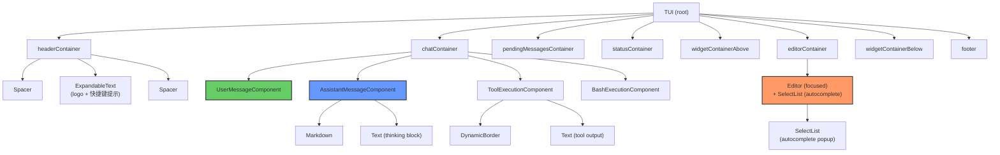

# 4. 组件/视图系统

### 组件定义

所有组件实现 `Component` 接口：

```typescript
// tui.ts#L39-L63
interface Component {
    render(width: number): string[];      // 声明式渲染
    handleInput?(data: string): void;     // 可选输入处理
    wantsKeyRelease?: boolean;            // 是否接收 key release 事件
    invalidate(): void;                   // 失效缓存
}
```

可聚焦组件额外实现 `Focusable` 接口（`focused: boolean`），并在渲染输出中嵌入 `CURSOR_MARKER` 标记硬件光标位置。`tui.ts#L74-L82`

### Container 组合模式

`Container` 是最基础的组合组件，维护 `children: Component[]` 数组：

```typescript
// tui.ts#L200-L234
class Container implements Component {
    children: Component[] = [];
    render(width: number): string[] {
        const lines: string[] = [];
        for (const child of this.children) {
            const childLines = child.render(width);
            lines.push(...childLines);
        }
        return lines;
    }
}
```

### 聚焦管理

- `TUI.setFocus(component)` 设置焦点，自动清除旧组件的 `focused` 标志 `tui.ts#L311-L323`
- Overlay 有独立的焦点恢复链：每个 overlay 记录 `preFocus` 组件，关闭时恢复 `tui.ts#L329-L396`
- 焦点组件不可见时自动转移焦点 `tui.ts#L575-L585`

### 虚拟滚动

Editor 组件实现了虚拟滚动：

- 最大可见行数 = `max(5, floor(terminalRows * 0.3))` `editor.ts#L428`
- `scrollOffset` 自动调整以保持光标可见 `editor.ts#L434-L443`
- 滚动指示器 `─── ↑ N more ──` `editor.ts#L453-L460`

### 典型界面组件树



### Overlay 系统

Overlay 是模态层的核心抽象：

- **定位**: 支持 anchor (center/top-left 等)、百分比、绝对坐标 `tui.ts#L141-L177`
- **尺寸**: 支持绝对值和百分比，有 minWidth/maxHeight 约束 `tui.ts#L640-L663`
- **可见性控制**: `visible(width, height)` 回调，可基于终端尺寸动态隐藏 `tui.ts#L169-L176`
- **非捕获模式**: `nonCapturing` overlay 不抢占焦点（用于状态提示等） `tui.ts#L175`
- **Handle API**: `hide()`/`setHidden()`/`focus()`/`unfocus()` 提供完整的生命周期控制 `tui.ts#L182-L195`

---
