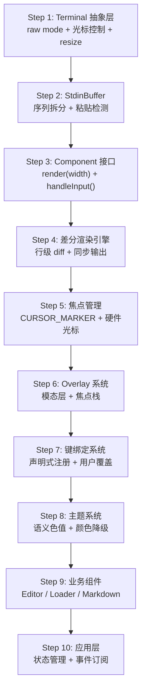
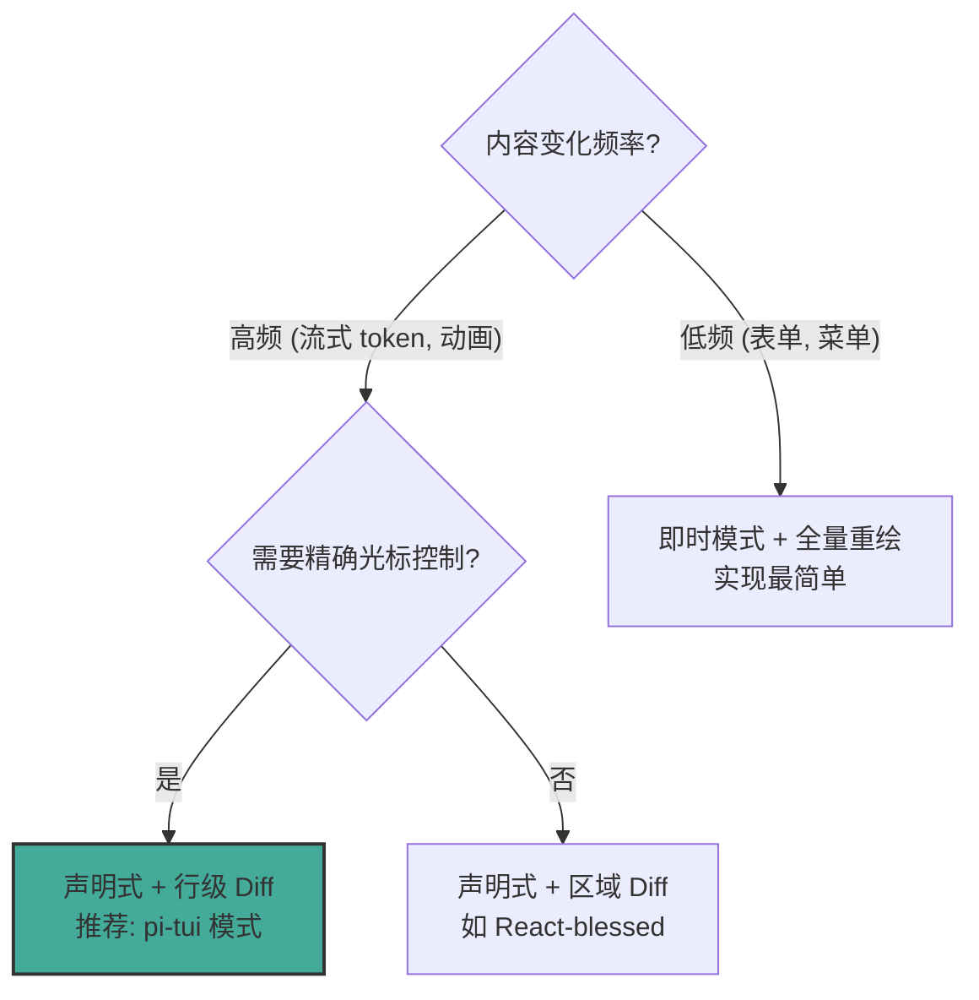
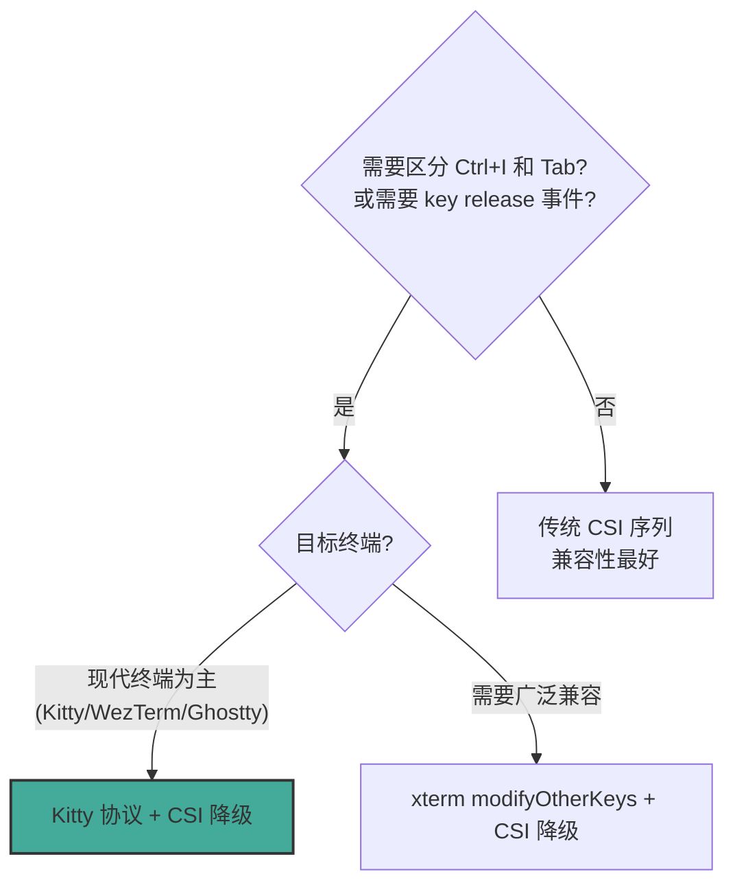
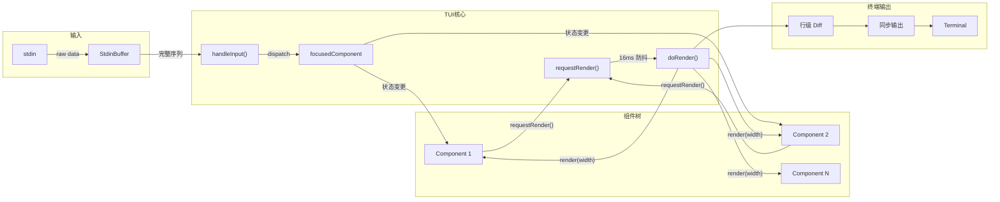

### 9.1 Quick Start: 从零搭建 TUI 的实现清单

按以下顺序实现，每一步都可独立测试：



| 步骤 | 产出文件 | 核心验证点 | 可选跳过 |
|------|----------|-----------|---------|
| 1 | `terminal.ts` | 进入 raw mode，接收输入，退出恢复 cooked | 否 |
| 2 | `stdin-buffer.ts` | 粘贴一段文本，确认作为单一事件到达 | 否 |
| 3 | `component.ts` | Text 组件 render 返回行数组 | 否 |
| 4 | `tui.ts` | 修改组件文本，只有变化行被重绘 | 否 |
| 5 | `tui.ts` (扩展) | 光标跟随焦点组件 | 否 |
| 6 | `tui.ts` (扩展) | 弹出 overlay → 关闭 → 焦点恢复 | 无模态需求时可跳过 |
| 7 | `keybindings.ts` | 按 Ctrl+S 触发自定义动作 | 快捷键少时可内联 |
| 8 | `theme.ts` | 切换主题，256色终端正确降级 | 单主题时可跳过 |
| 9 | 各组件文件 | 编辑器输入、Spinner 动画、Markdown 渲染 | 按需选择 |
| 10 | `app.ts` | 完整交互循环 | 否 |

### 9.2 架构决策树

#### 渲染策略选择



- **选 pi-tui 行级 Diff**: 适合聊天式 UI、流式输出、需要精确光标位置的场景
- **选全量重绘**: 适合菜单驱动的简单 TUI，内容变化不频繁
- **选虚拟 DOM**: 适合复杂布局频繁变化，但增加了内存开销和复杂度

#### 输入协议选择



#### Overlay vs 内联组件

| 场景 | 选择 | 原因 |
|------|------|------|
| 确认对话框 | Overlay | 需要抢占焦点，阻止背景交互 |
| 自动补全菜单 | Overlay (nonCapturing) | 浮在编辑器上方但不抢焦点 |
| 状态栏提示 | 内联组件 | 不需要模态，随布局流动 |
| 全屏预览 | Overlay (fullscreen) | 完全覆盖底层内容 |
| 侧边栏 | 内联 (Container 分区) | 与主内容并列，非模态 |

### 9.3 推荐目录结构

```
tui-framework/                   # 独立 TUI 框架（可发 npm 包）
  src/
    terminal.ts                  # 终端抽象接口 + 实现
    stdin-buffer.ts              # 输入缓冲与序列拆分
    keys.ts                      # 按键解析与匹配
    keybindings.ts               # 键绑定管理器
    tui.ts                       # 核心 TUI 类（差分渲染、焦点、overlay）
    utils.ts                     # visibleWidth, truncateToWidth, wrapText
    components/
      container.ts               # 基础组合组件
      text.ts                    # 纯文本组件
      editor.ts                  # 多行编辑器（undo, kill-ring）
      input.ts                   # 单行输入
      select-list.ts             # 列表选择
      loader.ts                  # Spinner 加载动画
      markdown.ts                # Markdown 渲染
    undo-stack.ts                # 撤销栈

app/                             # 业务应用层（依赖 tui-framework）
  src/
    app.ts                       # 主入口：状态管理 + 交互循环
    components/                  # 业务组件
    theme/                       # 主题系统
    keybindings.ts               # 应用级键绑定扩展
    output-guard.ts              # stdout 重定向
    clipboard.ts                 # 跨平台剪贴板
```

**原则**: TUI 框架层不含任何业务逻辑（如 AI 会话、文件操作）。业务组件 extend 框架组件，应用层持有状态并协调。

### 9.4 核心接口定义

```typescript
// === 终端抽象 ===
interface Terminal {
    start(onInput: (data: string) => void, onResize: () => void): void;
    stop(): void;
    drainInput(maxMs?: number, idleMs?: number): Promise<void>;
    write(data: string): void;
    get columns(): number;
    get rows(): number;
    get kittyProtocolActive(): boolean;
    hideCursor(): void;
    showCursor(): void;
    clearScreen(): void;
    setTitle(title: string): void;
    setProgress(active: boolean): void;
}

// === 组件 ===
interface Component {
    render(width: number): string[];
    handleInput?(data: string): void;
    wantsKeyRelease?: boolean;
    invalidate(): void;
}

interface Focusable {
    focused: boolean;
}

// === TUI 核心 ===
class TUI extends Container {
    terminal: Terminal;
    start(): void;
    stop(): void;
    requestRender(force?: boolean): void;
    setFocus(component: Component | null): void;
    showOverlay(component: Component, options?: OverlayOptions): OverlayHandle;
    hideOverlay(): void;
    addInputListener(listener: InputListener): () => void;
}

// === 输入缓冲 ===
class StdinBuffer extends EventEmitter<{
    data: [string];
    paste: [string];
}> {
    process(data: string | Buffer): void;
    destroy(): void;
}

// === 键绑定 ===
interface KeybindingDefinition {
    defaultKeys: KeyId | KeyId[];
    description?: string;
}
class KeybindingsManager {
    matches(data: string, action: string): boolean;
    getKeys(action: string): KeyId[];
    getConflicts(): Map<string, string[]>;
}
```

### 9.5 完整最小 TUI 实现骨架

以下代码可直接复制到一个 TypeScript 文件中运行，展示核心架构的最小可用实现。不依赖 pi-tui 的任何代码。

```typescript
// minimal-tui.ts - 约 200 行的完整最小 TUI
import { EventEmitter } from "node:events";

// ─── Terminal 抽象 ───
class ProcessTerminal {
    private onInput: ((data: string) => void) | null = null;
    private onResize: (() => void) | null = null;
    private rawMode = false;

    get columns(): number { return process.stdout.columns || 80; }
    get rows(): number { return process.stdout.rows || 24; }

    start(onInput: (data: string) => void, onResize: () => void): void {
        this.onInput = onInput;
        this.onResize = onResize;

        process.stdin.setRawMode(true);
        process.stdin.resume();
        process.stdin.setEncoding("utf8");
        this.rawMode = true;

        // Bracketed paste mode
        process.stdout.write("\x1b[?2004h");
        // Hide cursor
        process.stdout.write("\x1b[?25l");

        process.stdin.on("data", (data: string) => this.onInput?.(data));
        process.stdout.on("resize", () => this.onResize?.());
    }

    stop(): void {
        if (this.rawMode) {
            process.stdin.setRawMode(false);
            this.rawMode = false;
        }
        // Restore: show cursor, disable bracketed paste, reset scroll region
        process.stdout.write("\x1b[?25h\x1b[?2004l\x1b[r");
        process.stdin.pause();
    }

    write(data: string): void {
        process.stdout.write(data);
    }

    hideCursor(): void { this.write("\x1b[?25l"); }
    showCursor(): void { this.write("\x1b[?25h"); }
}

// ─── Component 接口 ───
interface Component {
    render(width: number): string[];
    handleInput?(data: string): void;
    invalidate(): void;
}

// ─── Container 组合 ───
class Container implements Component {
    children: Component[] = [];
    addChild(child: Component): void { this.children.push(child); }
    removeChild(child: Component): void {
        const idx = this.children.indexOf(child);
        if (idx !== -1) this.children.splice(idx, 1);
    }
    render(width: number): string[] {
        const lines: string[] = [];
        for (const child of this.children) {
            lines.push(...child.render(width));
        }
        return lines;
    }
    invalidate(): void {
        for (const child of this.children) child.invalidate();
    }
}

// ─── Text 组件 ───
class TextComponent implements Component {
    private text: string;
    private cached: string[] | null = null;

    constructor(text = "") { this.text = text; }

    setText(text: string): void {
        this.text = text;
        this.cached = null;
    }

    render(width: number): string[] {
        if (this.cached) return this.cached;
        this.cached = this.text ? [this.text.slice(0, width)] : [];
        return this.cached;
    }

    invalidate(): void { this.cached = null; }
}

// ─── TUI 核心 (差分渲染) ───
const MIN_RENDER_INTERVAL_MS = 16;

class TUI extends Container {
    private terminal: ProcessTerminal;
    private previousLines: string[] = [];
    private renderPending = false;
    private renderTimer: ReturnType<typeof setTimeout> | null = null;
    private focusedComponent: (Component & { focused?: boolean }) | null = null;
    private started = false;

    constructor(terminal: ProcessTerminal) {
        super();
        this.terminal = terminal;
    }

    start(): void {
        this.terminal.start(
            (data) => this.handleInput(data),
            () => this.requestRender(true),
        );
        this.started = true;
        this.requestRender(true);
    }

    stop(): void {
        this.started = false;
        if (this.renderTimer) clearTimeout(this.renderTimer);
        this.terminal.stop();
    }

    requestRender(force = false): void {
        if (!this.started) return;
        if (force) {
            this.previousLines = [];
        }
        if (this.renderPending) return;
        this.renderPending = true;
        // nextTick 合并同一 tick 内的多次请求
        process.nextTick(() => {
            this.renderTimer = setTimeout(() => this.doRender(), MIN_RENDER_INTERVAL_MS);
        });
    }

    private doRender(): void {
        this.renderPending = false;
        const width = this.terminal.columns;
        const height = this.terminal.rows;

        // 全量渲染组件树
        this.invalidate();
        let newLines = this.render(width);

        // 截断到终端高度
        if (newLines.length > height) {
            newLines = newLines.slice(newLines.length - height);
        }
        // 补齐到终端高度
        while (newLines.length < height) {
            newLines.push("");
        }

        // 行级 diff
        let firstChanged = -1;
        let lastChanged = -1;
        const maxLines = Math.max(newLines.length, this.previousLines.length);
        for (let i = 0; i < maxLines; i++) {
            const oldLine = this.previousLines[i] ?? "";
            const newLine = newLines[i] ?? "";
            if (oldLine !== newLine) {
                if (firstChanged === -1) firstChanged = i;
                lastChanged = i;
            }
        }

        if (firstChanged === -1) return; // 无变化

        // 增量写入，用同步输出包裹
        let buf = "\x1b[?2026h"; // 开始同步输出
        buf += `\x1b[${firstChanged + 1};1H`; // 移动到 firstChanged 行
        for (let i = firstChanged; i <= lastChanged; i++) {
            buf += "\x1b[2K" + (newLines[i] ?? ""); // 清行 + 写入
            if (i < lastChanged) buf += "\r\n";
        }
        buf += "\x1b[?2026l"; // 结束同步输出
        this.terminal.write(buf);

        this.previousLines = newLines;
    }

    private handleInput(data: string): void {
        // Ctrl+C 退出
        if (data === "\x03") {
            this.stop();
            process.exit(0);
        }
        // 分发到焦点组件
        this.focusedComponent?.handleInput?.(data);
        this.requestRender();
    }

    setFocus(component: (Component & { focused?: boolean }) | null): void {
        if (this.focusedComponent) {
            this.focusedComponent.focused = false;
        }
        this.focusedComponent = component;
        if (component) {
            component.focused = true;
        }
    }
}

// ─── 使用示例 ───
const terminal = new ProcessTerminal();
const tui = new TUI(terminal);

const header = new TextComponent("=== My TUI App === (Ctrl+C to exit)");
const content = new TextComponent("Type something...");
const status = new TextComponent("");

tui.addChild(header);
tui.addChild(content);
tui.addChild(status);

// 简易输入处理：累积输入并显示
let inputBuffer = "";
const inputHandler: Component & { focused: boolean } = {
    focused: true,
    render: () => [],
    invalidate: () => {},
    handleInput(data: string) {
        if (data === "\x7f" || data === "\b") { // Backspace
            inputBuffer = inputBuffer.slice(0, -1);
        } else if (data === "\r") { // Enter
            content.setText(`You said: ${inputBuffer}`);
            inputBuffer = "";
        } else if (data.length === 1 && data >= " ") {
            inputBuffer += data;
        }
        status.setText(`> ${inputBuffer}_`);
        tui.requestRender();
    },
};
tui.setFocus(inputHandler);
tui.start();
```

**运行方式**: `npx tsx minimal-tui.ts`。这个骨架展示了 Terminal 抽象、Component 接口、Container 组合、行级 diff 渲染、焦点管理、同步输出包裹的完整工作流。

### 9.6 模式目录: 常见问题 → 方案 → 代码模板

#### 模式 A: 流式内容追加

**问题**: AI 模型逐 token 返回，需要在终端实时追加显示，不能每个 token 都全屏重绘。

**方案**: 组件内累积内容 → 调用 `requestRender()` → 16ms 防抖自动合并高频更新 → 行级 diff 只更新尾部变化行。

```typescript
class StreamingText implements Component {
    private lines: string[] = [];
    private cache: string[] | null = null;
    private tui: TUI;

    constructor(tui: TUI) { this.tui = tui; }

    appendToken(token: string): void {
        // 追加到最后一行，遇到换行拆分
        const parts = token.split("\n");
        if (this.lines.length === 0) this.lines.push("");
        this.lines[this.lines.length - 1] += parts[0];
        for (let i = 1; i < parts.length; i++) {
            this.lines.push(parts[i]);
        }
        this.cache = null;
        this.tui.requestRender(); // 防抖合并
    }

    render(width: number): string[] {
        if (this.cache) return this.cache;
        this.cache = this.lines.map(l => l.slice(0, width));
        return this.cache;
    }

    invalidate(): void { this.cache = null; }
}
```

#### 模式 B: Spinner 加载动画

**问题**: 后台任务运行时需要显示加载动画，但不能阻塞事件循环。

**方案**: `setInterval` 驱动帧切换 → 更新文本 → `requestRender()`。

```typescript
class Spinner implements Component {
    private frames = ["⠋", "⠙", "⠹", "⠸", "⠼", "⠴", "⠦", "⠧", "⠇", "⠏"];
    private frameIdx = 0;
    private intervalId: ReturnType<typeof setInterval> | null = null;
    private label: string;
    private tui: TUI;

    constructor(label: string, tui: TUI) {
        this.label = label;
        this.tui = tui;
    }

    start(): void {
        this.intervalId = setInterval(() => {
            this.frameIdx = (this.frameIdx + 1) % this.frames.length;
            this.tui.requestRender();
        }, 80);
    }

    stop(): void {
        if (this.intervalId) clearInterval(this.intervalId);
        this.intervalId = null;
    }

    render(): string[] {
        return [`${this.frames[this.frameIdx]} ${this.label}`];
    }

    invalidate(): void {}
}
```

#### 模式 C: 粘贴保护

**问题**: 用户粘贴多行文本时，每行被当作独立输入事件处理，可能触发未预期的操作。

**方案**: 启用 Bracketed Paste Mode → StdinBuffer 检测 `\x1b[200~`...`\x1b[201~` 包裹 → 作为单一 `paste` 事件发出 → 组件按粘贴语义处理。

```typescript
// Terminal.start() 中启用
process.stdout.write("\x1b[?2004h"); // 启用 bracketed paste

// StdinBuffer 中检测
const PASTE_START = "\x1b[200~";
const PASTE_END = "\x1b[201~";

process(data: string): void {
    this.buffer += data;
    const startIdx = this.buffer.indexOf(PASTE_START);
    const endIdx = this.buffer.indexOf(PASTE_END);

    if (startIdx !== -1 && endIdx !== -1) {
        const content = this.buffer.slice(
            startIdx + PASTE_START.length, endIdx
        );
        this.emit("paste", content);
        this.buffer = this.buffer.slice(endIdx + PASTE_END.length);
    }
}
```

#### 模式 D: 安全退出

**问题**: 进程异常退出时终端停留在 raw mode，用户无法正常输入。

**方案**: 注册 `uncaughtException`/`SIGTERM`/`SIGHUP` 处理器 → 恢复 cooked mode → 显示光标 → drain 输入。

```typescript
function setupSafeExit(tui: TUI): void {
    const cleanup = () => {
        try { tui.stop(); } catch {}
    };

    process.on("uncaughtException", (err) => {
        cleanup();
        console.error("Fatal:", err);
        process.exit(1);
    });

    process.on("SIGTERM", () => { cleanup(); process.exit(0); });
    process.on("SIGHUP", () => { cleanup(); process.exit(0); });

    // stdout 管道断裂（如 piped 到 head）
    process.stdout.on("error", (err) => {
        if ((err as NodeJS.ErrnoException).code === "EPIPE") {
            cleanup();
            process.exit(0);
        }
    });
}
```

#### 模式 E: stdout 保护

**问题**: 第三方库的 `console.log()` 破坏 TUI 的差分渲染状态。

**方案**: TUI 启动前劫持 `process.stdout.write` → 重定向到 stderr → TUI 通过专用函数直接写 stdout。

```typescript
let rawStdoutWrite: typeof process.stdout.write;

function takeOverStdout(): void {
    rawStdoutWrite = process.stdout.write.bind(process.stdout);
    const stderrWrite = process.stderr.write.bind(process.stderr);
    process.stdout.write = ((chunk: any, ...args: any[]) =>
        stderrWrite(String(chunk), ...args)) as any;
}

function writeRawStdout(data: string): void {
    rawStdoutWrite(data);
}

function restoreStdout(): void {
    process.stdout.write = rawStdoutWrite;
}
```

#### 模式 F: 双击检测

**问题**: 单次 Ctrl+C 用于清空编辑器，连续两次 Ctrl+C 才退出程序。

**方案**: 记录上次时间戳，500ms 内重复则视为双击。

```typescript
let lastCtrlCTime = 0;

function handleCtrlC(): void {
    const now = Date.now();
    if (now - lastCtrlCTime < 500) {
        shutdown(); // 双击退出
    } else {
        clearEditor(); // 单击清空
    }
    lastCtrlCTime = now;
}
```

#### 模式 G: 虚拟滚动

**问题**: 长文本（几百行）全部渲染到 `string[]` 导致性能下降，且超出终端高度的内容不可见。

**方案**: 只渲染可视窗口范围内的行，维护 `scrollOffset`，光标移动时自动调整偏移。

```typescript
class VirtualScrollView implements Component {
    private allLines: string[] = [];
    private scrollOffset = 0;
    private cursorRow = 0;
    private tui: TUI;

    constructor(tui: TUI) { this.tui = tui; }

    get visibleRows(): number {
        return Math.max(5, Math.floor(this.tui.terminal.rows * 0.3));
    }

    setContent(lines: string[]): void {
        this.allLines = lines;
        this.ensureCursorVisible();
    }

    moveCursor(delta: number): void {
        this.cursorRow = Math.max(0,
            Math.min(this.allLines.length - 1, this.cursorRow + delta));
        this.ensureCursorVisible();
        this.tui.requestRender();
    }

    private ensureCursorVisible(): void {
        if (this.cursorRow < this.scrollOffset) {
            this.scrollOffset = this.cursorRow;
        } else if (this.cursorRow >= this.scrollOffset + this.visibleRows) {
            this.scrollOffset = this.cursorRow - this.visibleRows + 1;
        }
    }

    render(width: number): string[] {
        const lines: string[] = [];
        const end = Math.min(
            this.scrollOffset + this.visibleRows,
            this.allLines.length
        );

        // 顶部滚动指示器
        if (this.scrollOffset > 0) {
            const above = this.scrollOffset;
            lines.push(`─── ↑ ${above} more ──`);
        }

        // 可视行
        for (let i = this.scrollOffset; i < end; i++) {
            const prefix = i === this.cursorRow ? "▸ " : "  ";
            lines.push((prefix + this.allLines[i]).slice(0, width));
        }

        // 底部滚动指示器
        const below = this.allLines.length - end;
        if (below > 0) {
            lines.push(`─── ↓ ${below} more ──`);
        }

        return lines;
    }

    invalidate(): void {}
}
```

pi-tui 中 Editor 的虚拟滚动实现参见 `editor.ts#L409-L532`，采用类似策略。

#### 模式 H: Undo/Redo 栈

**问题**: 编辑器需要支持撤销/重做，且连续输入字符应合并为一次撤销操作。

**方案**: 保存完整状态快照 + 动作合并策略。

```typescript
interface EditorSnapshot {
    text: string;
    cursorRow: number;
    cursorCol: number;
}

class UndoStack {
    private stack: EditorSnapshot[] = [];
    private redoStack: EditorSnapshot[] = [];
    private maxSize: number;

    constructor(maxSize = 100) { this.maxSize = maxSize; }

    push(snapshot: EditorSnapshot): void {
        this.stack.push(snapshot);
        if (this.stack.length > this.maxSize) this.stack.shift();
        this.redoStack = []; // 新操作清空 redo
    }

    undo(current: EditorSnapshot): EditorSnapshot | null {
        if (this.stack.length === 0) return null;
        this.redoStack.push(current);
        return this.stack.pop()!;
    }

    redo(current: EditorSnapshot): EditorSnapshot | null {
        if (this.redoStack.length === 0) return null;
        this.stack.push(current);
        return this.redoStack.pop()!;
    }

    clear(): void {
        this.stack = [];
        this.redoStack = [];
    }
}

// 动作合并：连续字符输入只 push 一次
let lastPushTime = 0;
const MERGE_THRESHOLD_MS = 500;

function pushUndoIfNeeded(stack: UndoStack, snapshot: EditorSnapshot): void {
    const now = Date.now();
    if (now - lastPushTime > MERGE_THRESHOLD_MS) {
        stack.push(snapshot);
    }
    lastPushTime = now;
}
```

pi-tui 的 UndoStack 实现参见 `undo-stack.ts`，Editor 在 `pushUndoSnapshot()` (`editor.ts#L1089`) 中调用。

#### 模式 I: Kitty 键盘协议探测与降级

**问题**: 不同终端对键盘协议的支持差异巨大，需要运行时探测并优雅降级。

**方案**: 发送探测序列 → 等待响应 → 超时降级。

```typescript
async function negotiateKeyboardProtocol(
    terminal: ProcessTerminal
): Promise<"kitty" | "modifyOtherKeys" | "legacy"> {
    return new Promise((resolve) => {
        let resolved = false;

        // 拦截终端响应
        const onData = (data: string) => {
            if (resolved) return;

            // Kitty 响应: \x1b[?<flags>u
            if (/\x1b\[\?\d+u/.test(data)) {
                resolved = true;
                // 启用 Kitty: disambiguate + report events + alternate keys
                terminal.write("\x1b[>1|3u");
                resolve("kitty");
            }
        };

        // 发送 Kitty 查询
        terminal.write("\x1b[?u");

        // 150ms 超时降级到 modifyOtherKeys
        setTimeout(() => {
            if (resolved) return;
            resolved = true;
            // xterm modifyOtherKeys mode 2
            terminal.write("\x1b[>4;2m");
            resolve("modifyOtherKeys");
        }, 150);
    });
}
```

pi-tui 的实现参见 `terminal.ts#L156-L219`。关键细节：退出时必须恢复所有启用的协议模式 (`terminal.ts#L296-L341`)。

#### 模式 J: 主题热重载

**问题**: 用户修改主题文件后，TUI 应自动应用新主题而不重启。

**方案**: `fs.watch` + 防抖 + 全组件 `invalidate()`。

```typescript
import { watch, type FSWatcher } from "node:fs";
import { readFile } from "node:fs/promises";

class ThemeWatcher {
    private watcher: FSWatcher | null = null;
    private debounceTimer: ReturnType<typeof setTimeout> | null = null;

    start(
        themePath: string,
        onThemeChange: (theme: Record<string, string>) => void
    ): void {
        this.watcher = watch(themePath, () => {
            if (this.debounceTimer) clearTimeout(this.debounceTimer);
            this.debounceTimer = setTimeout(async () => {
                try {
                    const content = await readFile(themePath, "utf8");
                    const theme = JSON.parse(content);
                    onThemeChange(theme);
                } catch {
                    // 文件可能正在被写入，忽略解析错误
                }
            }, 100); // 100ms 防抖
        });
    }

    stop(): void {
        this.watcher?.close();
        if (this.debounceTimer) clearTimeout(this.debounceTimer);
    }
}

// 使用
const watcher = new ThemeWatcher();
watcher.start("/path/to/theme.json", (newTheme) => {
    applyTheme(newTheme);
    tui.invalidate();       // 清除所有组件缓存
    tui.requestRender(true); // 强制全量重绘
});
```

pi-tui 的主题热重载实现参见 `theme.ts#L829-L900`，仅对自定义主题启用。

#### 模式 K: 跨平台剪贴板降级链

**问题**: 不同 OS/终端/远程会话下剪贴板工具各不相同，需要逐级降级。

**方案**: 按优先级尝试多种方式，第一个成功的就返回。

```typescript
import { execSync, spawn } from "node:child_process";

async function copyToClipboard(text: string): Promise<boolean> {
    const isRemote = !!process.env.SSH_CONNECTION;

    // 1. 平台原生工具
    if (process.platform === "darwin") {
        return tryExec("pbcopy", text);
    }
    if (process.platform === "win32") {
        return tryExec("clip", text);
    }

    // 2. Linux: Wayland → X11
    if (process.env.WAYLAND_DISPLAY) {
        if (await trySpawn("wl-copy", [], text)) return true;
    }
    if (process.env.DISPLAY) {
        if (await tryExec("xclip", text, ["-selection", "clipboard"])) return true;
        if (await tryExec("xsel", text, ["--clipboard", "--input"])) return true;
    }

    // 3. OSC 52 终端序列（尤其适合 SSH 远程会话）
    const b64 = Buffer.from(text).toString("base64");
    process.stdout.write(`\x1b]52;c;${b64}\x07`);
    return true;
}

function tryExec(cmd: string, input: string, args: string[] = []): boolean {
    try {
        execSync(`${cmd} ${args.join(" ")}`, {
            input,
            stdio: ["pipe", "ignore", "ignore"],
            timeout: 3000,
        });
        return true;
    } catch { return false; }
}

async function trySpawn(
    cmd: string, args: string[], input: string
): Promise<boolean> {
    return new Promise((resolve) => {
        const proc = spawn(cmd, args, { stdio: ["pipe", "ignore", "ignore"] });
        proc.stdin.write(input);
        proc.stdin.end();
        proc.on("close", (code) => resolve(code === 0));
        proc.on("error", () => resolve(false));
    });
}
```

pi-tui 的完整实现参见 `clipboard.ts#L35-L127`，还包含 native addon 和远程会话 dual-write。

#### 模式 L: 输入拦截链 (Input Listener)

**问题**: 某些按键需要在到达焦点组件前被全局处理（如全局快捷键、输入过滤）。

**方案**: 维护一个 listener 数组，按注册顺序遍历，任一 listener 返回 `{ consume: true }` 则停止传播。

```typescript
type InputListenerResult = { consume: boolean; data?: string };
type InputListener = (data: string) => InputListenerResult;

class InputDispatcher {
    private listeners: InputListener[] = [];

    addListener(listener: InputListener): () => void {
        this.listeners.push(listener);
        return () => {
            const idx = this.listeners.indexOf(listener);
            if (idx !== -1) this.listeners.splice(idx, 1);
        };
    }

    dispatch(
        data: string,
        focusedComponent: Component | null
    ): void {
        let currentData = data;

        // 遍历拦截链
        for (const listener of this.listeners) {
            const result = listener(currentData);
            if (result.consume) return; // 已消费，不再传播
            if (result.data !== undefined) {
                currentData = result.data; // 转换后继续
            }
        }

        // 到达焦点组件
        focusedComponent?.handleInput?.(currentData);
    }
}

// 使用: 全局 Ctrl+Q 退出，不管焦点在哪
const dispatcher = new InputDispatcher();
dispatcher.addListener((data) => {
    if (data === "\x11") { // Ctrl+Q
        shutdown();
        return { consume: true };
    }
    return { consume: false };
});
```

pi-tui 的实现参见 `tui.ts#L544-L590`，通过 `addInputListener()` 注册。

#### 模式 M: 进程挂起与恢复 (Ctrl+Z)

**问题**: 用户按 Ctrl+Z 挂起 TUI 进程，`fg` 恢复后终端状态需正确还原。

**方案**: 注册 SIGCONT 恢复处理器 → 挂起前恢复 cooked mode → 恢复后重入 raw mode + 全量重绘。

```typescript
function setupSuspend(tui: { stop(): void; start(): void; requestRender(f: boolean): void }): void {
    if (process.platform === "win32") return; // Windows 不支持 SIGTSTP

    process.on("SIGTSTP", () => {
        // keepalive: stop() 后可能没有 ref'ed handles，
        // Node 事件循环会在 fg 前退出
        const keepAlive = setInterval(() => {}, 2 ** 30);

        // 挂起期间忽略 Ctrl+C
        const ignoreSigint = () => {};
        process.on("SIGINT", ignoreSigint);

        process.once("SIGCONT", () => {
            clearInterval(keepAlive);
            process.removeListener("SIGINT", ignoreSigint);
            tui.start();            // 重新进入 raw mode
            tui.requestRender(true); // 强制全量重绘
        });

        tui.stop();                  // 恢复 cooked mode
        process.kill(process.pid, "SIGTSTP"); // 真正挂起
    });
}
```

pi-tui 的实现参见 `interactive-mode.ts#L3358-L3393`。关键细节：`setInterval(2^30)` 防止事件循环退出。

### 9.7 事件/渲染/状态耦合关系总览



---
