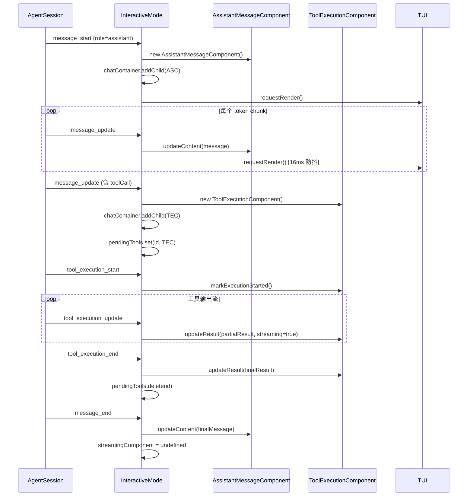

### 全局状态组织

InteractiveMode 是主要的状态持有者，采用集中式管理：

- `session: AgentSession` — AI 会话状态（消息、流式状态、模型等）
- `streamingComponent` — 当前流式渲染的 assistant 消息组件 `interactive-mode.ts#L2711`
- `pendingTools: Map<string, ToolExecutionComponent>` — 进行中的工具调用 `interactive-mode.ts#L2731`
- `isBashMode`, `toolOutputExpanded`, `hideThinkingBlock` — UI 开关状态

### 状态变更方式

1. **事件订阅**: `session.subscribe(callback)` 监听 `AgentSessionEvent` `interactive-mode.ts#L2645-L2649`
2. **事件分发**: `handleEvent()` 根据事件类型更新对应组件 `interactive-mode.ts#L2651-L2839`
3. **渲染触发**: 每次状态变更后调用 `ui.requestRender()` 请求重绘

### 流式状态管理

流式生成是 TUI 最复杂的状态场景：

### Editor 状态: UndoStack

Editor 使用自定义 `UndoStack` 实现：

- 每次编辑操作前调用 `pushUndoSnapshot()` 保存完整状态快照 `editor.ts#L1089`
- 支持动作合并（连续输入字符合并为一次 undo 操作）
- Kill Ring 实现 Emacs 风格的 yank/yank-pop `editor.ts#L1817-L1826`

---
