## 0. 技术调研与生态分析

### 0.1 重写范围与目标

**重写范围**：仅 `pi-coding-agent`（`pi-mono` monorepo 中的主 CLI 二进制），不单独重写 `pi-ai`、`pi-agent-core`、`pi-tui` 等内部包——它们的能力由 Rust 生态对标方案替代。

**目标**：基于 `adk-rust`、`lspz`、`rtk` 等已有 Rust 项目构建单静态二进制，实现规划-执行分离、多代理委托、LSP 深度集成与会话级模型路由。

**重写动机**：
- 单静态二进制部署，消除 Node.js 运行时依赖
- 零拷贝流式处理，降低内存占用
- 通过 Rust async/tokio 运行时实现更快启动
- 对 LSP/DAP 子进程生命周期的确定性控制

### 0.2 源项目架构分析

**pi-mono** 是一个 npm workspace monorepo，包含 4 个包：

| 包                       | npm 名称                          | 核心职责                                                                                                 |
| ----------------------- | ------------------------------- | ---------------------------------------------------------------------------------------------------- |
| `packages/ai`           | `@mariozechner/pi-ai`           | 统一 LLM API，10 个 Provider（Anthropic、OpenAI、Azure、Google、Bedrock、Mistral、Cloudflare 等），流式传输、OAuth、模型注册 |
| `packages/agent`        | `@mariozechner/pi-agent-core`   | Agent 执行循环、工具调用分派、状态管理、事件系统                                                                          |
| `packages/tui`          | `@mariozechner/pi-tui`          | 终端 UI 框架，差分渲染、组件系统（Editor/Markdown/Image 等）、Kitty/iTerm2/Sixel 图片协议                                  |
| `packages/coding-agent` | `@mariozechner/pi-coding-agent` | 主 CLI（`pi` 命令），三种模式（Interactive TUI / Print / JSON-RPC），7 个内置工具，扩展系统，会话管理                            |
|                         |                                 |                                                                                                      |

**依赖链**：

```
pi-coding-agent
  ├── pi-agent-core ──→ pi-ai
  ├── pi-tui
  └── 外部依赖（chalk, diff, glob, yaml 等）
```

**pi-coding-agent 模块结构**（~137 个 TS 文件）：
- `core/tools/` — 7 个内置工具（read, bash, edit, write, grep, find, ls）
- `core/extensions/` — JS 扩展加载器（通过 jiti 动态加载）
- `core/compaction/` — 上下文窗口压缩、分支摘要
- `core/export-html/` — 会话导出为 HTML
- `core/` — 会话管理器、系统提示词构建器、模型注册/解析、认证、技能加载器、事件总线
- `modes/interactive/` — ~40 个 TUI 组件（助手消息、Diff 展示、工具执行、会话/模型/主题选择器等）
- `modes/print-mode.ts` — 非交互打印输出
- `modes/rpc/` — JSON-RPC over stdio（IDE 集成）

### 0.3 内部包 → Rust 生态对标

| pi-mono 包                       | Rust 对标方案                                        | 匹配质量       | 说明                                                                                                                                                                                                                                                                                                                                 |
| ------------------------------- | ------------------------------------------------ | ---------- | ---------------------------------------------------------------------------------------------------------------------------------------------------------------------------------------------------------------------------------------------------------------------------------------------------------------------------------- |
| `pi-ai`（10 Provider LLM 客户端）    | `adk-model` v0.8                               | ✅ **良好匹配** | 通过 feature flag 支持 17 个 Provider（Gemini、OpenAI、Anthropic、DeepSeek、Ollama、Groq、OpenRouter、Bedrock、Azure AI、xAI、Fireworks、Together、Mistral、Perplexity、Cerebras、SambaNova 等），覆盖范围超出 pi-ai。缺口：pi-ai 有 Cloudflare Workers AI Provider，adk-model 暂无（可用 OpenRouter 或原始 HTTP 弥补）。pi-ai 的 OAuth 流程（Anthropic、GitHub Copilot）需在 adk-auth 层验证 |
| `pi-agent-core`（Agent 循环、状态、事件） | `adk-core` + `adk-agent` + `adk-runner`          | ✅ **直接等效** | adk-core 提供 Agent trait、InvocationContext、事件流、Tool trait；adk-agent 提供 LlmAgent、SequentialAgent、ParallelAgent、LoopAgent 实现；adk-runner 提供执行引擎。直接映射 pi-agent-core 的 Agent class、agent loop 和状态管理                                                                                                                                      |
| `pi-tui`（终端 UI 框架，~25 组件）       | `ratatui` + `crossterm` + `termimad` + `syntect` | ✅ **良好匹配** | OpenAI Codex CLI（`codex-rs`）已验证此栈的可行性——其 `codex-tui` crate 用 ratatui 实现了完整的 coding agent TUI（会话视图、流式输出、Diff 预览、命令审批流、快捷键），架构可直接参考。pi-tui 的差分渲染、Editor、SelectList、Markdown、Image 协议等组件需基于 ratatui widget 体系重建，但有 Codex 的现成实现作为蓝图。termimad 处理 Markdown 渲染，syntect 处理语法高亮                                                             |

### 0.4 外部依赖 → Rust crate 对标

pi-coding-agent 的 18 个生产依赖 + 1 个可选依赖映射：

| Node.js 依赖 | 用途 | Rust crate | 匹配质量 |
|---|---|---|---|
| `@anthropic-ai/sdk`, `openai`, `@google/genai`, `@mistralai/mistralai`, `@aws-sdk/client-bedrock-runtime` | LLM Provider 客户端 | `adk-model`（统一 API，通过 feature flag 按需启用） | ✅ 直接等效 |
| `commander` | CLI 参数解析 | `clap` v4.6 (derive) | ✅ 直接等效 |
| `chalk` | 终端颜色/样式 | `console` + `owo-colors` | ✅ 直接等效 |
| `diff` | Diff 计算 | `similar` v3 + `fudiff`（AI 补丁应用） | ✅ 良好匹配 |
| `glob` | 文件通配符 | `glob` crate | ✅ 直接等效 |
| `marked` | Markdown 解析 | `comrak` | ✅ 直接等效 |
| `yaml` | YAML 配置解析 | `serde_yaml` | ✅ 直接等效 |
| `typebox` | JSON Schema 构建 | `schemars` + `jsonschema` | ✅ 良好匹配 |
| `undici` | HTTP 客户端 | `reqwest` + `tokio` | ✅ 直接等效 |
| `proper-lockfile` | 文件锁 | `fs4`（advisory lock） | ✅ 良好匹配 |
| `chokidar` | 文件系统监视 | `notify` v9 | ✅ 直接等效 |
| `express`（Diff 审查服务） | HTTP 服务器 | `axum` v0.8 | ✅ 直接等效 |
| `extract-zip` | ZIP 解压 | `zip` v8.6 | ✅ 直接等效 |
| `uuid` | UUID 生成 | `uuid` v1.23 | ✅ 直接等效 |
| `ignore` | .gitignore 匹配 | `ignore` crate | ✅ 直接等效 |
| `cli-highlight` | 语法高亮 | `syntect` | ✅ 直接等效 |
| `minimatch` | 最小匹配 | `globset` | ✅ 直接等效 |
| `strip-ansi` | ANSI 转义剥离 | `strip-ansi-escapes` | ✅ 直接等效 |
| `file-type` | 文件类型检测 | `infer` | ✅ 直接等效 |
| `@silvia-odwyer/photon-node` | 图像处理（WASM） | `image` crate | ✅ 直接等效 |
| `hosted-git-info` | Git URL 解析 | `url` crate + 自定义 | ⚠️ 部分覆盖 |
| `jiti` | JS/TS 动态加载（扩展系统） | 无直接等效 | ❌ **架构变更** — PRD 第 8 章用声明式 YAML Hook + MCP 工具扩展替代动态 JS 加载 |

**额外能力**（pi-mono 没有但 PRD 新增的）：

| 能力 | Rust crate | 状态 |
|---|---|---|
| LSP Token 优化 | `lspz` v0.9.2 (agent-sdk feature) | 生产就绪 |
| DAP Token 优化 | `dapz` v0.0 (agent-sdk feature) | 暂不集成，后期独立阶段 |
| 命令输出压缩 | `rtk` v0.37 | 生产就绪 |
| MCP 协议 | `rmcp` v1.7（通过 adk-tool 集成） | 生产就绪 |
| 会话持久化 | `adk-session` v0.8 (SQLite backend) | 生产就绪 |
| 技能系统 | `adk-skill` v0.8 | 生产就绪 |

### 0.5 已有 Rust 项目评估

#### adk-rust v0.8

**位置**：`../adk-rust/` | **成熟度**：高 | **许可证**：Apache 2.0

30+ workspace crate 的全功能 AI Agent SDK，涵盖 core、model、agent、runner、tool、session、memory、RAG、security、auth、plugin、skill、telemetry 等。是本项目的**核心框架层**。

| 关键 crate | 对标 pi-mono | 用途 |
|---|---|---|
| `adk-model` | pi-ai | 17 个 LLM Provider，统一 trait，feature flag 按需启用 |
| `adk-core` | pi-agent-core | Agent trait、InvocationContext、事件流、Tool trait |
| `adk-agent` | pi-agent-core | LlmAgent、SequentialAgent、ParallelAgent、LoopAgent |
| `adk-runner` | pi-agent-core | 执行引擎、状态持久化 |
| `adk-tool` | coding-agent tools | FunctionTool trait + MCP 集成（via rmcp） |
| `adk-session` | session-manager.ts | SQLite/Postgres/Redis/MongoDB 等后端 |
| `adk-skill` | skills.ts | 技能加载与注册 |
| `adk-memory` | 新能力 | Agent 记忆系统 |

**参考实现**：`zirvox`（`../zirvox/`，27 crate workspace）展示了 adk-rust 在完整 coding agent 平台中的实际使用方式，其 agent 运行时（`zirvox-ai-agent`）、模型路由、编排器和工具执行器可直接参考。

#### lspz v0.9.2

**位置**：`../lspz/` | **成熟度**：高 | **许可证**：MIT

LSP 压缩代理，实现 PRD 第 3 节的 LSP Token 优化层。通过 `agent-sdk` feature 以内嵌 client 库方式集成，无需额外 proxy 进程。

- 8 个压缩拦截器，3 种输出格式（Raw JSON / Compact JSON / TOON）
- `AgentHandle`（单语言）和 `AgentPool`（多语言委托路由，内部持有 `HashMap<String, AgentHandle>`）
- 返回压缩后的 TOON 文本，直接拼入 LLM prompt

**v0.9.2 已解决的关键问题**：
- **文件同步**：`notify_change(uri, content)` / `notify_close(uri)` / `notify_save(uri)` — 全量文档同步，自动版本追踪
- **Workspace Root**：`AgentBuilder::workspace_root(path)` / `AgentPoolBuilder::workspace_root(path)` — `initialize` 接受完整 `InitializeParams`
- **逃生舱口**：`send_raw(method, params)` — 发送任意 LSP 请求，绕过 interceptor chain

**v0.9.2 新增 API**：`rename` / `code_action` / `formatting` 重构操作，同时支持 `AgentHandle` 和 `AgentPool`。

**测试**：210 tests passing，0 clippy warnings。

#### dapz v0.0

**位置**：`../dapz/` | **成熟度**：极早期 | **许可证**：MIT

DAP 压缩代理，架构设计对标 lspz（4 个压缩拦截器：OutputCompressor、VariablesCompressor、StackTraceCompressor、CappingInterceptor）。

**状态**：仅完成 crate 名称锁定和架构搭建，实质功能未实现。

**决定**：暂不集成。DAP 调试器集成作为后期独立阶段推进，不影响 MVP 交付。

#### rtk v0.37

**位置**：`../rtk/` | **成熟度**：高 | **许可证**：MIT

命令输出压缩代理，100+ 命令过滤器（git、cargo、npm、go、python、docker、kubectl 等），声称节省 60-90% token。

**集成方式**：rtk 当前为外部代理二进制（非库）。可考虑：① 在 bash 工具中通过 rtk 管道压缩输出；② 为 rtk 贡献 `library` feature flag 直接嵌入。

#### 其他参考项目

| 项目 | 位置 | 成熟度 | 参考价值 |
|---|---|---|---|
| **llman** | `../llman/` | 早期 | 提示词/Agent 管理 CLI，tree-sitter 集成，prompt 模板（minijinja）参考 |
| **rivu** | `../rivu/` | 早期 | AG-UI runtime kernel，event compactor / snapshot store 概念与 PRD 第 11 节会话快照系统相关 |
| **claude-code-rebuilt** | `../claude-code-rebuilt/` | 功能性 | TypeScript 参考架构，工具系统、会话管理、agent loop 设计的参考蓝图 |

### 0.6 技术风险与缺口

#### 阻塞性风险

当前无阻塞性风险。lspz v0.9.2 已解决文件同步、workspace root、逃生舱口三大历史阻塞问题。

#### 高影响缺口

| 缺口 | 等级 | 影响 | 缓解措施 |
|---|---|---|---|
| **TUI 组件重建** | 🟡 中等 | pi-tui 有 ~25 个定制组件 + ~40 个交互模式组件，但有 Codex CLI（`codex-tui`）作为 ratatui 实现蓝图，大幅降低工作量 | 分阶段：MVP 仅 Print mode → Phase 2 参考 codex-tui 实现基础 TUI → Phase 3 完整 TUI |
| **扩展系统架构变更** | 🟠 设计决策 | 原有 JS/TS 动态扩展无法迁移，向后不兼容 | PRD 已用声明式 YAML Hook + MCP 工具扩展替代，属于有意架构转变 |
| **上下文压缩** | 🟡 中等 | pi-mono 有成熟的 compaction 逻辑，需从头实现或适配 | 参考	adk-core 的 intra_compaction，PRD 第 11 节快照系统远超当前实现，作为后期阶段 |

#### 中等影响缺口

| 缺口 | 说明 |
|---|---|
| **OAuth 流程** | pi-ai 有 Anthropic、GitHub Copilot 的内置 OAuth。adk-auth 有 OAuth 框架，但需验证 CLI 场景适配 |
| **图片协议支持** | pi-tui 支持 Kitty、iTerm2、Sixel 图片协议。ratatui 有限支持，需自定义实现 |
| **HTML 导出** | pi-mono 有 export-html 模块，Rust 生态无直接等效。非核心功能，可后期补充 |

### 0.7 多源设计融合

本项目虽以 pi-coding-agent 为基础，但融合多个开源 coding agent 的设计精华。以下梳理各项目的可借鉴模式：

#### OpenAI Codex CLI（`codex-rs`）— Rust 原生实现，直接参考

| 借鉴点 | 说明 |
|---|---|
| **TUI 架构** | `codex-tui` crate 用 ratatui 实现完整的 coding agent TUI（会话视图、流式输出、Diff 预览、命令审批流、快捷键），是我们 TUI 层的最直接参考 |
| **沙箱执行** | `codex-exec` 实现 suggest / auto-edit / full-auto 三种执行策略，对应 PRD 的权限门控设计 |
| **Apply Patch 系统** | 模型返回 unified diff patch，CLI 直接 apply 到本地文件。比 pi-coding-agent 的 old_string/new_string 替换模式更健壮 |
| **Workspace 结构** | `codex-core` / `codex-tui` / `codex-exec` 的分层可直接映射到我们的 `pi-core` / `pi-tui` / `pi-tools` |
| **协议设计** | JSON-RPC 2.0 双向通信 + PTY 支持，可作为 RPC mode 的参考 |

#### Claude Code — 扩展系统与会话管理

| 借鉴点 | 说明 |
|---|---|
| **Hook 系统** | PreToolUse / PostToolUse 事件钩子，通过 shell 脚本扩展。PRD 第 8 章的 Hook 机制直接借鉴此模式 |
| **MCP 集成** | 通过 MCP 协议动态加载外部工具服务器。PRD 第 9 章的 MCP 支持参考此设计 |
| **会话持久化** | JSONL 文件存储对话历史，支持 fork / continue。PRD 第 11 章的快照系统在此基础上扩展 |
| **上下文压缩** | 对话过长时自动摘要旧上下文。pi-mono 的 compaction 模块已实现此能力，Rust 版需适配 |
| **权限模型** | 读/写/执行三级权限控制，用户可配置自动批准策略 |

#### Aider — 双模型架构与编辑格式

| 借鉴点 | 说明 |
|---|---|
| **Architect / Editor 分离** | 用强模型做规划（Architect），快速模型做执行（Editor）。直接映射到 PRD 第 5 节的规划-执行分离 |
| **多种编辑格式** | 支持 whole-file、diff、search-replace 等多种 LLM 输出格式，根据模型能力自动选择。可适配不同模型强弱 |
| **Repo Map** | 自动生成仓库结构摘要（tree-sitter），帮助模型理解项目全局。与 LSP 的 codebase_graph 互补 |
| **Token 预算** | 根据模型上下文窗口动态计算可用 token，自动管理上下文截断 |

#### oh-my-openagent（OpenCode 增强版）— 多模型编排

| 借鉴点 | 说明 |
|---|---|
| **多模型路由** | 按任务类型路由到不同模型（视觉任务→Gemini，推理→GPT-5.4，快速→Mini）。与 PRD 的模型抢占锁和配置驱动路由一致 |
| **后台 Agent** | 支持 tmux 中的后台并行执行。与 PRD 的蜂群协作模式（第 11 节）理念相同 |
| **意图门控** | 先分类用户意图再执行，减少误操作。可作为调度器的优化策略 |

#### 融合策略总结

```
核心架构: pi-coding-agent (基础) + codex-rs (Rust TUI/执行/沙箱)
Agent 框架: adk-rust (Agent trait/工具/会话/MCP)
执行策略: codex-rs (suggest/auto-edit/full-auto) + Claude Code (权限模型)
编辑方式: Aider (多格式适配) + codex-rs (unified patch apply)
规划分离: Aider (Architect/Editor) + PRD 第 5 节 (YAML 配置驱动)
LSP/DAP: lspz + dapz (本项目独有，其他 agent 均无此能力)
扩展: Claude Code (Hook + MCP) + PRD 第 8/9 节 (声明式 YAML Hook)
会话: Claude Code (JSONL 持久化) + PRD 第 11 节 (快照派生/合并)
```

### 0.8 推荐技术栈

基于 crates.io 下载量、社区活跃度、API 质量和项目适配度的综合评估。每个类别列出**推荐方案**和**备选方案**。

> 版本号和下载量为 2026-05-14 的 crates.io 快照。

#### 0.8.1 核心框架层 — adk-rust v0.8

adk-rust 作为 Agent 框架的选型在 0.3 节已论证（直接等效 pi-agent-core，覆盖 pi-ai）。此节不再重复，仅列出使用的子 crate：

| Crate | 用途 | 备注 |
|---|---|---|
| `adk-core` | Agent trait、事件系统、Tool trait | |
| `adk-model` | 17 个 LLM Provider（feature flag 按需启用） | 备选：`genai` v0.6（19 万 dl，13+ provider，API 更轻量）、`rig-core` v0.37（79 万 dl，20+ provider，内置 agent 抽象） |
| `adk-agent` | LlmAgent、WorkflowAgent 实现 | |
| `adk-runner` | 执行引擎 | |
| `adk-tool` | FunctionTool + MCP 集成 | |
| `adk-session` | 会话持久化（SQLite 后端） | 备选：直接用 `sqlx` v0.9 自建 |
| `adk-skill` | 技能系统 | |
| `adk-memory` | Agent 记忆 | |
| `adk-model` (扩展) | **ModelRegistry**：模型实例生命周期管理、Provider 注册、fallback_chain 解析 | 基于 `adk-model` 的 Provider 注册扩展；`ModelRegistry` 为项目自建组件，管理模型抢占锁（§6）和备用链（§5/§10） |

#### 0.8.2 协议优化层

| 类别 | 推荐 | 版本 | 备选 | 说明 |
|---|---|---|---|---|
| LSP 压缩 | `lspz` | v0.9.2 (agent-sdk) | 无竞品 | 项目独有能力，无其他 crate 提供类似功能 |
| DAP 压缩 | 暂不集成 | — | — | 后期独立阶段 |
| MCP 协议 | `rmcp` | **v1.7**（978 万 dl） | `rust-mcp-sdk` v0.9（13 万 dl） | rmcp 是官方 Rust SDK，下载量 77 倍于竞品，通过 adk-tool 集成 |
| 命令输出压缩 | `rtk` | v0.37（外部二进制） | 内嵌管道 | 作为 bash 工具的可选压缩层 |

#### 0.8.3 CLI 与 TUI 层

| 类别 | 推荐 | 版本 | 下载量 | 备选 | 选型理由 |
|---|---|---|---|---|---|
| TUI 框架 | `ratatui` | **v0.30** | 2,724 万 | `cursive`（不同范式） | codex-tui 已验证可行性；widget 体系成熟；社区最大 |
| 终端后端 | `crossterm` | **v0.29** | 1.31 亿 | `termion`（更轻量但功能少） | ratatui 标准后端，跨平台键盘/鼠标/样式支持 |
| Markdown 渲染 | `termimad` | **v0.34** | 501 万 | `comrak` + 自定义渲染 | 专为终端 Markdown 设计，skin/theme 丰富，开箱即用 |
| Markdown 解析 | `comrak` | **v0.52** | 500 万 | `pulldown-cmark` | GFM 兼容，AST 遍历，用于 skill/prompt 模板解析 |
| 语法高亮 | `syntect` | **v5.3** | 1,586 万 | `tree-sitter-highlight`（更重） | TextMate 语法定义覆盖广，轻量，codex 也用此方案 |
| CLI 解析 | `clap` | **v4.6** | 8.23 亿 | `lexopt`（极简场景） | Rust CLI 标配，derive API，自动补全生成 |
| 交互提示 | `inquire` | **v0.9** | 1,305 万 | `dialoguer` v0.12（5,947 万 dl） | 类型更丰富（autocomplete、history、validator），API 更现代 |
| 进度指示 | `indicatif` | **v0.18** | 1.52 亿 | — | 标准 progress bar + spinner |
| 终端样式 | `owo-colors` | **v4.3** | 1.18 亿 | `console` v0.16（2.40 亿 dl） | 零开销 const-time 颜色，更符合 Rust 惯用风格 |

#### 0.8.4 Web 服务层（Diff 审查）

| 类别 | 推荐 | 版本 | 下载量 | 备选 | 选型理由 |
|---|---|---|---|---|---|
| HTTP 服务器 | `axum` | **v0.8** | 3.15 亿 | `actix-web` v4（性能更高但非 tokio 原生） | tokio 生态原生集成，tower 中间件，WebSocket 支持 |
| 异步运行时 | `tokio` | v1 (full) | — | — | 全栈标配 |

#### 0.8.5 基础设施层

| 类别 | 推荐 | 版本 | 下载量 | 备选 | 选型理由 |
|---|---|---|---|---|---|
| 序列化 | `serde` + `serde_json` | — | 6.75 亿 / — | `simd-json`（性能优先场景） | Rust 序列化标准，所有 crate 依赖 |
| YAML | `serde_yaml` | **v0.9** | 2.79 亿 | `serde_yml` v0.0.12（社区 fork）、`saphyr` v0.0.6 | 原作者已标记 deprecated 但仍是使用最广的方案；zirvox 也用此 crate。社区尚未收敛到单一替代品 |
| JSON Schema 生成 | `schemars` | **v1.2** | 2.51 亿 | — | 从 Rust 类型自动生成 JSON Schema，供配置补全使用 |
| JSON Schema 校验 | `jsonschema` | **v0.46** | 6,319 万 | — | 配置文件运行时校验 |
| HTTP 客户端 | `reqwest` | **v0.13** | 4.76 亿 | `ureq`（同步场景） | 标准 async HTTP 客户端 |
| Diff 生成 | `similar` | **v3** | 1.29 亿 | `dissimilar` v1.0（4,307 万 dl，rust-analyzer 使用） | 多算法（Myers/Patience），unified diff 输出 |
| AI 补丁应用 | `fudiff` | 极早期 | — | `patch` v0.7（精确匹配兜底） | **模糊匹配首选**：专为 AI 生成补丁的行号偏移场景设计；**精确匹配兜底**：fudiff 匹配失败时退回 patch crate 精确模式。详见 §7.5 |
| 文件监视 | `notify` | **v9** | 1.02 亿 | — | 标准文件系统监视，跨平台 |
| .gitignore | `ignore` | **v0.4** | 1.22 亿 | — | ripgrep 同源 crate，性能最优 |
| 文件通配 | `glob` | **v0.3.3** | 4.37 亿 | `globset`（ripgrep 同源，更多功能） | 标准 glob 匹配 |
| 文件锁 | `fs4` | **v1.1** | 4,211 万 | — | fs2 的现代继任者，async 支持 |
| UUID | `uuid` | **v1.23** | 5.56 亿 | — | 标准 UUID 生成 |
| 错误处理 | `anyhow` + `thiserror` | v1.0 / v2.0 | 6.75 亿 / 9.82 亿 | `eyre` + `color-eyre`（更好的 CLI 错误展示） | 应用层 anyhow + 库层 thiserror 的经典组合 |
| 日志 | `tracing` + `tracing-subscriber` | v0.1 / v0.3 | 5.92 亿 | — | 结构化日志标准，async 友好 |
| 图片处理 | `image` | **v0.25** | 1.25 亿 | — | 全功能图片处理 |
| 文件类型检测 | `infer` | **v0.19** | 8,690 万 | — | 基于文件头 magic bytes 检测 |
| ANSI 剥离 | `strip-ansi-escapes` | **v0.2** | 4,134 万 | — | 工具输出清洗 |

### 0.9 依赖关系总图

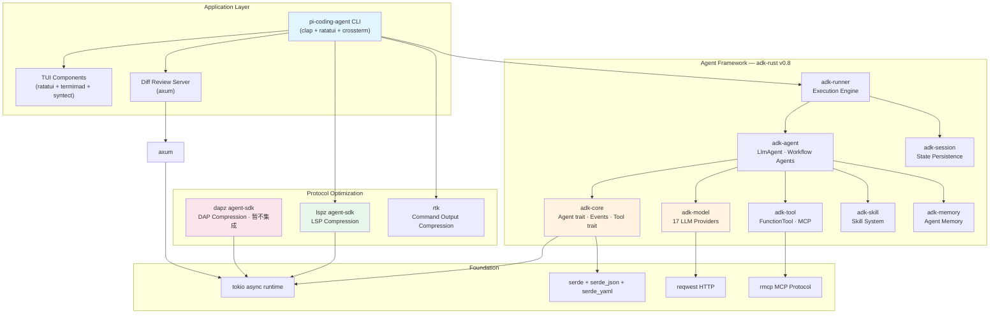

**推荐 workspace 结构**：

```
pi-coding-agent/
├── Cargo.toml              # workspace root
├── crates/
│   ├── pi-cli/             # 主二进制，CLI 入口，模式分派
│   ├── pi-core/            # Agent session runtime，Hook 调度器，配置管理
│   ├── pi-tools/           # 内置工具 (read, bash, edit, write, grep, find, ls)
│   ├── pi-tui/             # ratatui 组件库
│   ├── pi-lsp/             # LSP 集成层（封装 lspz）
│   ├── pi-dap/             # DAP 集成层（后期独立阶段）
│   ├── pi-session/         # Session snapshot system
│   ├── pi-config/          # YAML 配置解析、JSON Schema、校验
│   └── pi-test-support/    # 共享测试工具 crate（dev-dependency，见 §13.10）
└── configs/
    └── config.schema.json  # 配置 JSON Schema（供 IDE 补全）
```


### 1. 项目定位

一个**模型供应完全插件化**的 Rust 编码代理 CLI。所有模型后端、系统提示词、能力门控均通过 YAML 配置动态加载，不内建任何特定模型行为。
原生支持 llama.cpp 作为本地推理后端之一，同时允许接入任意远程 API，真正实现“模型中立”。
融合 pi coding agent、 pi agent (rust reimpl)、Codex、OpenCode、Claude Code 的设计精华，在单静态二进制中实现**规划-执行分离**、**多代理委托**、**深度 LSP/调试器集成**与**会话级模型路由**。

### 2. 核心架构

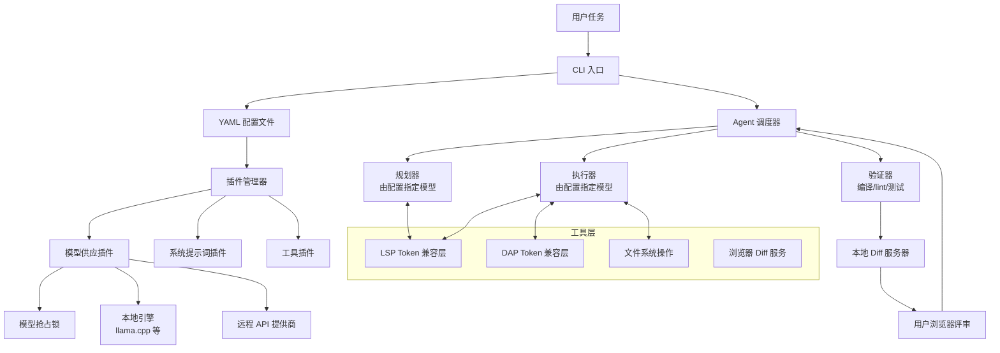

**配置示例 (config.yaml)** 需要同时提供 jsonschema 供用户配置回显描述和补全

### 3. LSP Token 节省兼容层

基于 [lspz](https://github.com/straydragon/lspz) 的 `agent-sdk` feature，以 **内嵌 client 库** 的方式集成，不需要单独启动 proxy 进程。

#### 3.1 运行模型

Agent 二进制本身直接 spawn 并管理 LSP server 子进程（通过 `AgentHandle` / `AgentPool`），无需外部 proxy。LSP server 的生命周期完全由 agent 控制。

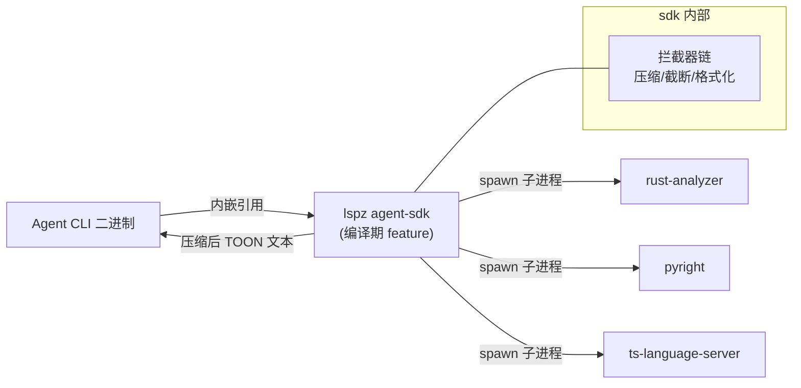

**三种集成模式对比**（lspz 支持全部三种，本 Agent 使用第一种）：

| 模式                  | 集成方式                                         | 是否需要额外进程             | 适用场景                     |
| ------------------- | -------------------------------------------- | -------------------- | ------------------------ |
| **Client（本 Agent）** | `lspz` 作为 crate 依赖，agent 自己 spawn LSP server | 否                    | 自研 Agent CLI             |
| Proxy               | `lspz --backend gopls` 作为独立进程                | 是（lspz + LSP server） | Claude Code / Continue 等 |
| MCP                 | `lspz mcp` 作为 MCP server                     | 是（lspz 进程）           | 快速实验 / 多工具协同             |

#### 3.2 初始化时机

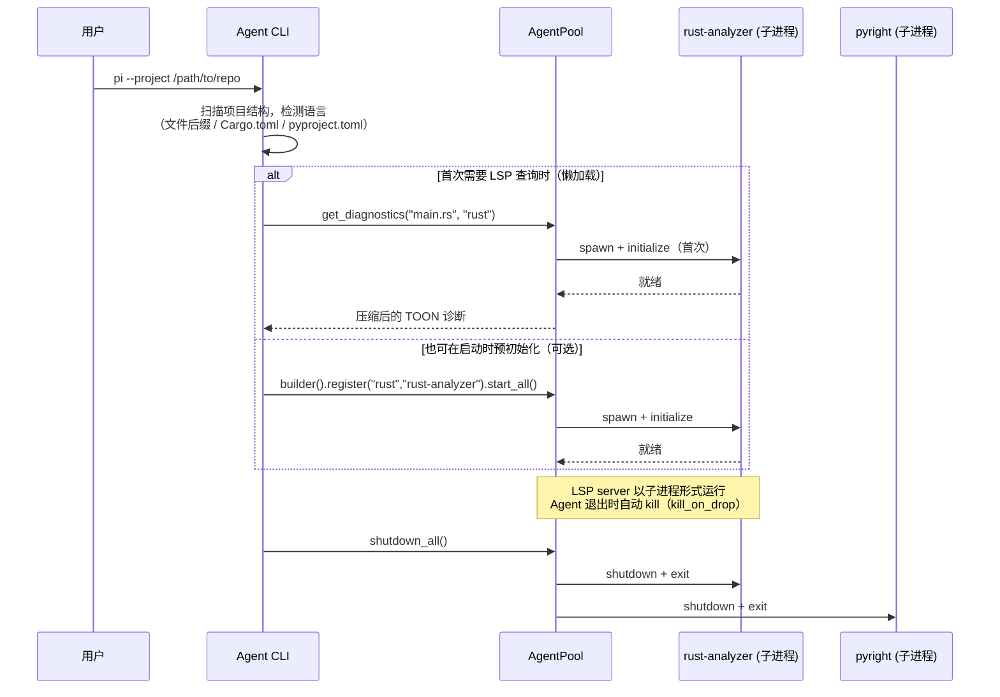

**初始化策略**（可配置）：

| 策略          | 说明                               | 适用场景                               |
| ----------- | -------------------------------- | ---------------------------------- |
| **懒加载**（推荐） | 首次 `get_diagnostics` 等查询时才 spawn | 节省启动时间，可能首次查询慢（rust-analyzer 需要索引） |
| **预初始化**    | CLI 启动时立即 spawn 所有检测到的语言 LSP     | 需要立即响应，但增加启动延迟                     |
| **按需预热**    | 启动时 spawn，但不等 initialize 完成      | 折中方案                               |

**关键注意**：rust-analyzer 等重型 LSP server 首次 initialize 需要几秒到十几秒建立索引。懒加载模式下首次查询会有延迟。

#### 3.3 返回格式

查询结果直接返回压缩后的 **TOON 文本**（`String`），作为 agent 下一轮对话的上下文直接喂给 LLM，无需下游再做 JSON 反序列化。

```rust
// Agent 内部使用示例
let pool = AgentPool::builder()
    .workspace_root("/path/to/project")
    .register("rust", "rust-analyzer")
    .register("python", "basedpyright")
    .start_all()
    .await?;

// 返回值是 TOON 文本，直接拼入 prompt（默认压缩关闭，按需启用）
let diags = pool.get_diagnostics("file:///path/src/main.rs", "rust").await?;
// diags = "E[1:0] unused variable `x`\nW[5:10] ..."

// Agent 编辑文件后同步 LSP 状态
pool.notify_change("file:///path/src/main.rs", updated_content).await?;

// 逃生舱口：发送任意 LSP 请求
let custom_result = pool.send_raw("textDocument/signatureHelp", params).await?;

// 重构操作
pool.rename("file:///path/src/main.rs", 42, 8, "new_name").await?;
pool.code_action("file:///path/src/main.rs", 42, 8, diagnostics, Some(["quickfix"])).await?;
pool.formatting("file:///path/src/main.rs", FormattingOptions { tab_size: 4, .. }).await?;
```

#### 3.4 当前能力与缺口

**已支持**（10 个查询方法 + 3 个文件同步方法 + 3 个重构操作，均带压缩）：

| 方法 | LSP 方法 |
|------|----------|
| `get_diagnostics` | `textDocument/publishDiagnostics` |
| `get_completions` | `textDocument/completion` |
| `get_symbols` | `textDocument/documentSymbol` |
| `get_hover` | `textDocument/hover` |
| `get_references` | `textDocument/references` |
| `get_definition` | `textDocument/definition` |
| `get_implementation` | `textDocument/implementation` |
| `get_type_definition` | `textDocument/typeDefinition` |
| `get_workspace_symbols` | `workspace/symbol` |
| `get_workspace_diagnostics` | `workspace/diagnostic` |
| `notify_change` | `textDocument/didChange`（全量同步，自动版本追踪） |
| `notify_close` | `textDocument/didClose` |
| `notify_save` | `textDocument/didSave` |
| `rename` | `textDocument/rename` |
| `code_action` | `textDocument/codeAction` |
| `formatting` | `textDocument/formatting` |
| `send_raw` | 任意方法（绕过 interceptor chain） |
| `summarize_symbols` | 自定义 — 按文件返回结构化符号摘要（函数签名、类型、依赖关系） |

> **`summarize_symbols` 说明**：用于 Session 快照的 `code_summaries` 生成。由 LSP 兼容层内部聚合 `get_symbols`、`get_definition`、`get_references` 等查询结果，返回精简的结构化 JSON，避免快照中存储完整代码。详见 §11.6 集成说明。

**后续优先支持**：`codeLens`、`foldingRange`、`selectionRange` 等导航操作。

**优先级**：Python > Rust > TypeScript/JavaScript

### 4. 调试器集成 (DAP Token 节省)

> **⚠️ 实现状态**：当前阶段仅做**架构预留**，不实际集成。对应 `dapz` crate 处于极早期（v0.0），DAP 能力延后至独立阶段交付。

基于 Debug Adapter Protocol，构建同样的兼容层，让代理能自主运行调试并获取精简后的运行时信息。

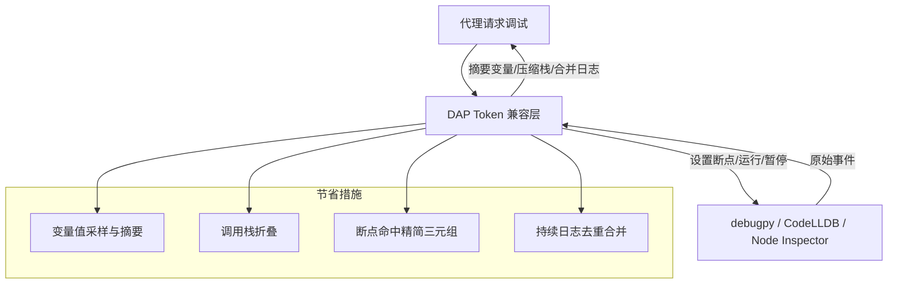

**后端选择**：
- Python: `debugpy`
- Rust: `CodeLLDB` (DAP)
- TS/JS: `vscode-js-debug` (DAP)

### 5. 规划-执行分离 (OpusPlan)

YAML 中为规划器、执行器分别绑定不同模型和系统提示词，完全由配置驱动。规划阶段可选用强推理模型（本地或远程），执行阶段选用快速/便宜的模型。

**YAML 配置示例**：

```yaml
# 规划器：使用强推理模型（Claude Opus / GPT-5）
planning:
  model: "anthropic/claude-opus-4"       # 模型 ID，指向 ModelRegistry 中的注册名
  system_prompt: "architect"             # 使用 "architect" 系统提示词模板
  max_steps: 10                          # 规划器最大生成分解步骤数
  reasoning_depth: deep                  # deep / standard / quick

# 执行器：使用快速/便宜模型
execution:
  model: "qwen-7b-local"                 # 引用 models 注册表中的实例名
  system_prompt: "editor"                # 使用 "editor" 系统提示词模板
  max_retries: 2                         # 单步最大重试次数
  # fallback_chain 从 models 注册表中自动继承（见 §10.5 全局模型备用链配置）

# 验证器：编译/lint/测试
validator:
  model: null                            # null 表示仅运行静态检查，不调用模型
  commands:
    - "cargo check --workspace"
    - "cargo clippy -- -D warnings"
    - "cargo test --workspace"
```

**模型 ID 解析规则**：

- `provider/model-name` 格式（如 `anthropic/claude-opus-4`）：从全局 `models` 注册表查找已注册的模型实例
- `local/model-path` 格式（如 `local/./models/qwen-7b.Q4_K_M.gguf`）：通过 llama.cpp 等本地引擎加载
- `fallback_chain`：由 `models` 注册表中该实例的 `fallback_chain` 字段定义（§10.5），执行器绑定模型时自动继承

**系统提示词模板**：

- `"architect"`：侧重任务分解、依赖分析、风险识别，输出结构化 JSON 计划
- `"editor"`：侧重代码变更执行，遵循 Architect 提供的计划，最小化自由发挥

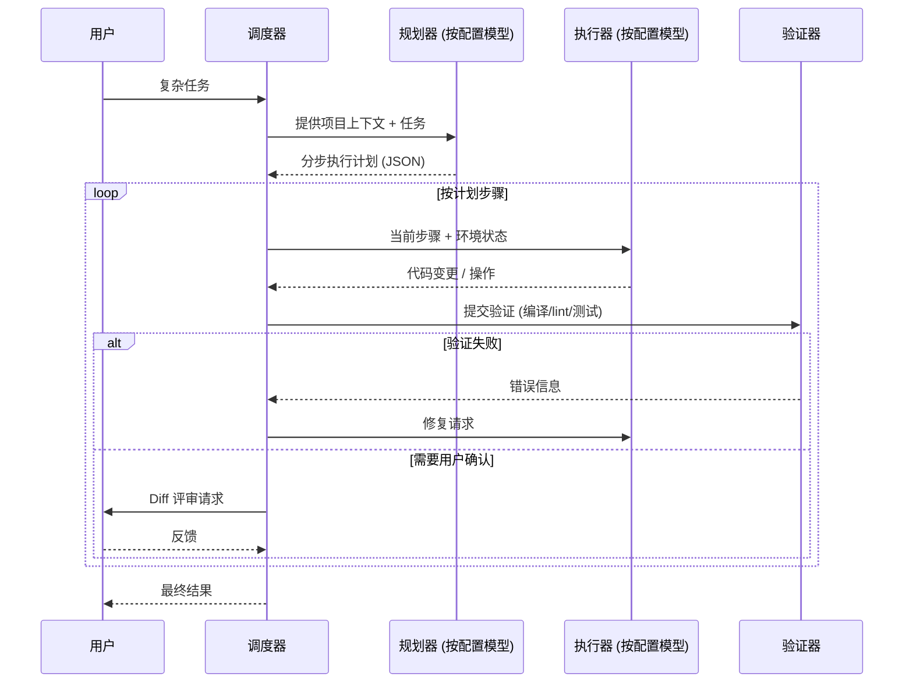

### 6. 模型抢占锁定

由于不同模型后端可能串行（如本地 GGUF 模型），需要对每个模型实例实施抢占锁，支持优先级排队和检查点恢复。

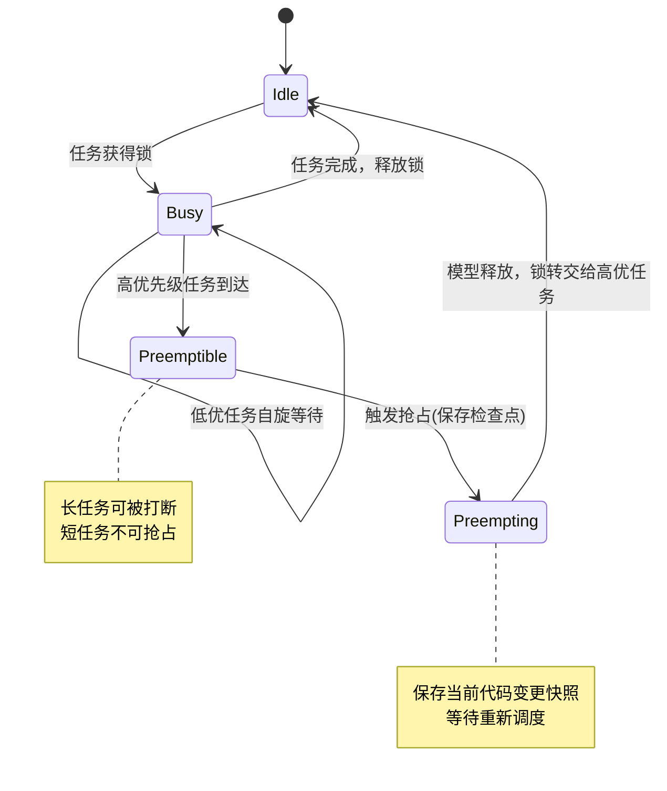

**组件**：
- `ModelRegistry`：管理模型插件实例的生命周期
- `LockManager`：锁状态机、等待队列、基于优先级+截止时间的抢占决策
- `CheckpointManager`：保存/恢复被中断任务的上下文
- `SchedulerHint`：任务向调度器声明预期资源占用

### 7. 交互式 Diff 评审（可配置审查点）

默认行为是全自动执行（类似 `--yolo` 模式），代理连续完成计划步骤，不需人工介入。用户可以在 YAML 配置中开启**阶段性审查点**，代理在指定步骤（或所有步骤）完成后暂停，进入 diff 评审模式。

评审界面提供 **两种后端**：CLI 终端内评审（默认）和 Web 浏览器评审（可选增强）。两种后端共享相同的评论数据结构和审查流程，仅在 UI 渲染层不同。

#### 7.1 审查流程

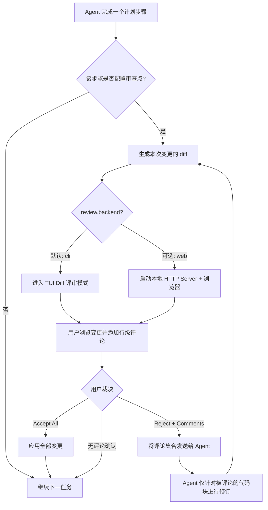

#### 7.2 CLI 终端内评审（默认）

在终端内直接完成 diff 查看和行级评论，无需启动浏览器或 HTTP 服务。基于 ratatui 实现，参考 codex-rs 的 diff 渲染（`tui/src/diff_render.rs`）和审批覆盖层（`tui/src/bottom_pane/approval_overlay.rs`）模式。

**界面布局**：

```
┌─ Code Review: Step 2/5 ─── src/main.rs ─── [+12 -3] ──────────────────┐
│                                                                         │
│  38 │ fn process(input: &str) -> Result<Output> {                      │
│  39 │     let parsed = parse(input)?;                                   │
│  40 │ -   let result = old_logic(parsed);                               │
│  41 │ +   let result = new_logic(parsed)?;  ◄ 光标                     │
│  42 │     Ok(result)                                                    │
│  43 │ }                                                                 │
│  44 │                                                                   │
│  45 │ -   for item in items.iter() {                                    │
│  46 │ +   for item in items.iter().filter(|i| i.valid()) {              │
│  47 │       process_one(item);                                          │
│                                                                         │
│  💬 L41: "Missing error handling for None case"            [must-fix]   │
│  💬 L46: "Consider using unwrap_or_default here"           [suggest]    │
│                                                                         │
│ ─── Hunk 2/4 ─── [j/k]nav [c]comment [x]del [n]ext [p]rev ────────── │
│ ─── [a]ccept all  [r]eject+send  [e]open $EDITOR ──────────────────── │
└─────────────────────────────────────────────────────────────────────────┘
```

按 `c` 后弹出评论编辑器（基于 `ratatui-textarea`，支持多行编辑、undo/redo、Vim 键位）：

```
┌─ 💬 Comment on src/main.rs:41 ───────────────────────────────┐
│                                                                │
│ Missing error handling for None case                           │
│                                                                │
│                                                                │
│ Severity: (1) must-fix  (2) suggest  (3) nit                   │
│                                                                │
│ [Ctrl+S] submit   [Esc] cancel                                 │
└────────────────────────────────────────────────────────────────┘
```

**交互键位**：

| 键 | 功能 |
|----|------|
| `j` / `k` / 方向键 | 上下导航 diff 行 |
| `n` / `p` | 跳转到下一个 / 上一个 hunk |
| `c` | 在当前行添加评论（弹出 textarea） |
| `x` | 删除当前行的已有评论 |
| `e` | 用 `$EDITOR` 打开当前文件（完整编辑上下文） |
| `a` | 接受全部变更，继续执行 |
| `r` | 拒绝并发送所有评论给 Agent |
| `q` / `Esc` | 无评论直接确认，继续执行 |

**技术实现**：

| 组件 | Crate / 来源 | 说明 |
|------|-------------|------|
| Diff 渲染 | `similar` + ratatui `Paragraph` | 参考 codex-rs `diff_render.rs`，支持 unified/insert/delete 三种类型 |
| 语法高亮 | `syntect` | PRD 0.8.3 已选型 |
| 评论编辑 | `ratatui-textarea` | 多行文本编辑，支持 Vim/Emacs 键位，undo/redo |
| 评论弹窗 | ratatui `Clear` widget | 标准弹窗模式：渲染 base UI → Clear 居中区域 → 渲染弹窗 |
| Gutter 标记 | 自定义 ratatui widget | 已评论行显示 `💬` 图标 + 侧边摘要 |

**优势**：
- 零外部依赖：不需要浏览器、HTTP server、CDN
- 即时响应：无需等待 server 启动和浏览器加载
- SSH/远程友好：在无 GUI 环境中完全可用
- 与 TUI 主界面无缝切换：review 模式是 TUI 的一个子状态，无需上下文切换

#### 7.3 Web 浏览器评审（可选增强）

启动本地 HTTP 服务，在浏览器中提供类 GitHub PR 的代码审阅体验，适用于大变更或需要 Monaco 全功能编辑器的场景。

**技术实现**：
- 后端：`axum` 轻量服务器（PRD 0.8.4 已选型）
- 前端：Monaco Editor Diff（CDN），配合 `tree-sitter` 服务端语法高亮
- 评论格式与 CLI 模式完全一致

#### 7.4 共享数据结构

两种评审后端共享相同的评论数据结构和审查结果格式：

```rust
/// 行级评论
struct ReviewComment {
    file: PathBuf,
    line_start: u32,
    line_end: u32,
    content: String,
    severity: CommentSeverity,
}

enum CommentSeverity {
    MustFix,   // 阻塞性问题，必须修复
    Suggest,   // 建议性改进
    Nit,       // 代码风格、命名等小问题
}

/// 审查裁决
enum ReviewVerdict {
    /// 接受全部变更，继续执行
    AcceptAll,
    /// 拒绝并发送评论，Agent 仅修订被标记的代码块
    RejectWithComments(Vec<ReviewComment>),
}
```

**YAML 配置**：

```yaml
review:
  enabled: true
  mode: "on-step"           # on-step | on-error | manual
  steps_require_review: []  # 留空则审查所有步骤；可指定步骤索引 [0, 2]
  backend: "cli"            # cli（默认）| web
  editor: null              # 覆盖 $EDITOR，用于 [e] 命令
```

代理收到 `RejectWithComments` 后，仅对被评论的代码块进行上下文补全和修订，避免全文件重写，从而节省 token 并保持已有成果。修订完成后重新进入审查流程，直到用户 Accept 或无评论确认。

#### 7.5 AI Patch Apply 策略

代理（或规划器）生成的代码变更以 **unified diff** 格式输出，需通过文件系统层应用。本节描述补丁应用的完整策略。

**核心决策**：使用 `fudiff`（模糊行号匹配）作为首选补丁应用引擎，`patch` crate 作为兜底方案。

| 阶段 | 工具 | 说明 |
|------|------|------|
| Diff 生成 | `similar` v3 | 基于代理提供的原始内容 + 新内容生成 unified diff，供审查展示 |
| Patch 应用 | `fudiff` | 对 AI 生成的 unified diff 进行模糊匹配应用，容忍行号偏移（AI 模型的行号偏移是常见问题） |
| 兜底应用 | `patch` v0.7 | 当 `fudiff` 匹配失败时，退回精确匹配模式 |

**应用流程**：

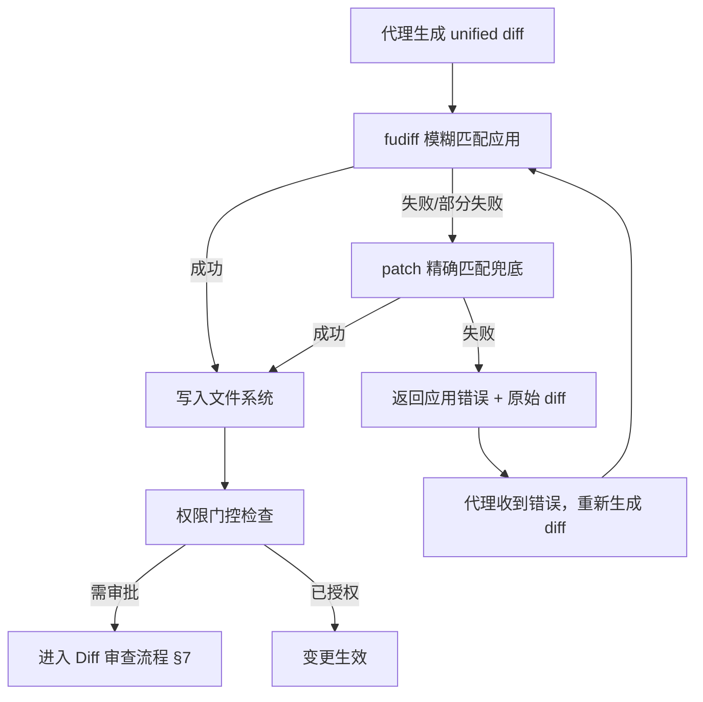

**权限门控联动**（与 §7.1 审查流程的时序关系）：

- 所有 patch 应用在写入前必须经过权限检查（`pi-config` 中的 `review` 配置）
- 写操作（`file_write`）触发 `pre.tool_call.file_write` hook
- **轻量确认**：若 hook 返回 `requires_approval: true`，则进入轻量确认弹窗（仅确认/拒绝当前文件变更，非完整 diff 审查）
- **完整 diff 审查**：仍按 §7.1 在**步骤完成后**执行，此时代理已生成该步骤的全部 patch 变更，用户一次性审查整个步骤的 diff
- 轻量确认与完整审查的关系：轻量确认用于单文件高风险操作（如 `file_write` 覆盖关键配置），完整审查用于步骤级变更集。两者可叠加，也可单独启用

**YAML 配置**：

```yaml
patch_apply:
  strategy: "fudiff"          # fudiff（推荐）| patch（精确）| hybrid（模糊优先+精确兜底）
  max_line_offset: 50          # fudiff 允许的最大行号偏移
  retry_on_failure: true       # 应用失败时是否自动让代理重新生成
  max_retries: 2               # 最大重试次数
  before_apply_hook: "pre.tool_call.file_write"  # 应用前触发的 hook 事件
```


### 8. Hook 机制（事件驱动扩展）

代理在工具调用、任务阶段变更、模型交互等关键节点抛出标准化事件，用户可注册异步钩子（pre/post）实现自定义逻辑。这些钩子按**全局、项目、用户会话**三级配置，后者优先级更高，支持覆盖和叠加。设计类似 Claude Code 的 `PreToolUse`/`PostToolUse` 和 Codex 的钩子系统。

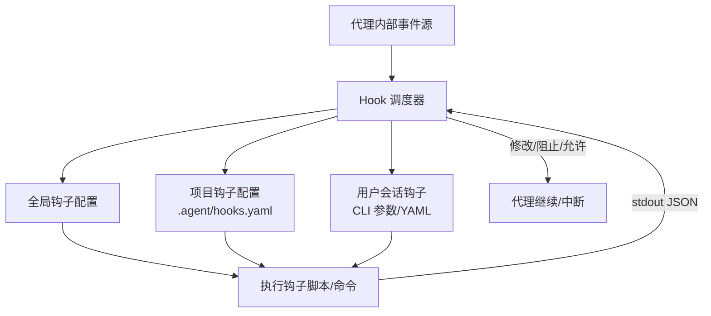

#### 支持的事件

| 事件                            | 触发时机        | pre/post  |
| ----------------------------- | ----------- | --------- |
| `tool_call`                   | 任意工具执行前后    | ✓         |
| `tool_call.lsp_query`         | LSP 查询      | ✓         |
| `tool_call.dap_command`       | 调试器命令       | ✓         |
| `tool_call.file_write`        | 文件写入        | ✓         |
| `model_query`                 | 调用任何模型前     | ✓ (仅 pre) |
| `step_complete`               | Agent 单步执行完 | ✓         |
| `plan_generated`              | 规划器生成计划后    | ✓         |
| `review_start` / `review_end` | 审查阶段前后      | ✓         |
| `repeat_detected` | 检测到模型重复循环时 | pre/post  | pre: 中断前通知钩子；post: 恢复动作执行后。传递上下文含 `loop_fragment`（循环片段）、`generated_tokens`（已生成 token 数）、`detection_method`（检测方式） |
| `step_retry` | 步骤失败后重试前    | pre       | 恢复管理器触发重试时，传递重试次数和失败原因 |
| `tool_call_blocked` | 安全策略拦截工具调用时 | post      | 传递 `tool_name`、`blocked_reason`、`triggered_rule`（如 `bash_forbidden_pattern`、`filesystem_outside_workspace`） |

#### 配置示例 (YAML)

```yaml
hooks:
  # 全局钩子，所有项目生效
  global:
    - event: pre.tool_call
      command: ["python", "/usr/local/bin/audit_tool_use.py"]
      timeout: 5s
    - event: post.file_write
      command: ["rustfmt", "--edition", "2024", "{{file}}"]

  # 项目级钩子，存放在项目根 .agent/hooks.yaml 中，会与全局合并且可覆盖同名事件
  project:
    - event: pre.model_query
      command: ["bash", "-c", "echo 'About to call model with prompt length: ${PROMPT_LEN}'"]
      env:
        PROMPT_LEN: "{{prompt_length}}"
    - event: post.step_complete
      command: ["notify-send", "Agent step completed"]

  # 用户级钩子，在 CLI 中通过 --hooks 指定临时文件，或由用户个人配置加载
  user:
    - event: pre.tool_call.file_write
      command: ["echo", "User approved file write"]
      requires_approval: true   # 可在 pre 钩子中索要用户确认
```

钩子脚本通过 stdin 接收上下文 JSON（事件类型、参数、文件列表等），通过 stdout 返回可选控制指令（如 `{"action": "block", "reason": "..."}`），支持超时和阻断。若未实现脚本，则直接放行。

### 9. Skills 与 MCP 支持

#### Skills（技能包）

Skill 是封装好的**可复用能力单元**，包含一组相关的工具指令、规范的系统提示词片段和可选的数据资源。用户可在 YAML 中按名称引用，代理自动将其指令注入当前会话，从而扩展领域知识或执行特定工作流（如“Kubernetes 调试”、“React 组件生成”等）。

**YAML 配置**：
```yaml
skills:
  - name: python-testing
    description: "Write and run pytest tests"
    system_prompt_addon: |
      When writing tests, always use pytest and include fixtures.
      Run `pytest -x --tb=short` after writing tests.
    allowed_tools: [shell, file_write, lsp_query]

  - name: k8s-debug
    description: "Debug Kubernetes deployments"
    system_prompt_addon: |
      You have access to kubectl. Use `kubectl get pods`, `logs`, `describe`.
      Prefer `kubectl get -o yaml` for deep inspection.
    tools:
      - name: kubectl
        command: "kubectl"
        args: ["{{args}}"]
        sandbox: deny     # 可限制危险工具
```

默认内置少量 Skills，允许用户创建自定义 Skill 并发布到插件仓库。Session 开始时根据项目类型或用户指令激活相关 Skills。

#### MCP (Model Context Protocol)

实现 MCP 客户端来接入外部工具服务器（如文件系统、数据库、API 网关），以统一协议动态加载工具及其上下文。代理启动时连接配置的 MCP 服务器，并获取工具列表，在规划/执行时作为普通工具调用，无需预注册到代码中。

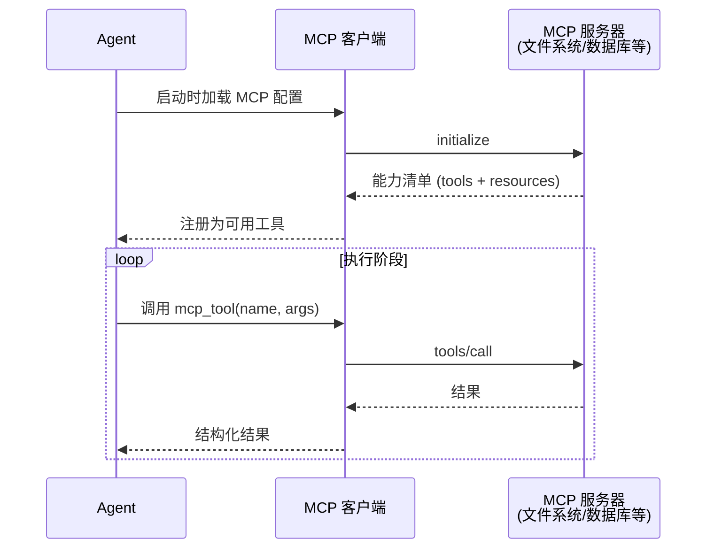

**YAML 配置**：
```yaml
mcp_servers:
  - id: filesystem
    type: stdio
    command: ["npx", "@modelcontextprotocol/server-filesystem", "/home/user/projects"]
  - id: sqlite
    type: stdio
    command: ["uvx", "mcp-server-sqlite", "--db-path", "data.db"]
  - id: remote-tool
    type: sse
    url: "https://mcp.example.com/sse"
```

MCP 服务器返回的工具自动受 Hook 系统监控，也可在 Skill 中赋予权限限制。通过这一机制，代理可轻松扩展外部分析、数据查询、网络访问等能力，同时保持核心二进制精简。


针对你的项目，自动检测并阻断模型重复输出完全可行。核心思路是在 **模型供应插件与 Agent 核心之间** 插入一个轻量级的流式过滤器，实时分析 token 流，一旦判定陷入循环立即中断推理，并触发可配置的恢复策略（重试、换模型、插入反重复提示等）。

以下是专门为你的 **Rust 插件化 Coding Agent CLI** 设计的集成方案，可以直接作为新章节加入 PRD。


## 10. 自动重复检测与中断恢复

### 10.1 动机

在“模型中立”的架构中，本地小模型（如通过 llama.cpp 加载的 7B/13B 模型）经常会陷入无意义的 token 循环，不仅浪费计算资源，还会产出无效代码。
远程大模型虽然重复概率较低，但在惩罚参数不足或 prompt 设计不当时同样可能出现。
因此，在代理软件层建立一套 **与模型无关**、**配置驱动** 的重复检测与自动恢复机制，是保障代理可靠性和体验的关键。

### 10.2 设计原则

- **零信任**：不对任何模型后端假设其内置防重复能力。
- **非侵入**：以流式中间件的形式挂载，不改动模型供应插件接口。
- **轻量高效**：使用滑动窗口 + 哈希集/布隆过滤器进行 n-gram 跟踪，额外 CPU 和内存开销可忽略。
- **配置灵活**：通过 YAML 定义检测规则、中断条件和恢复策略。
- **与调度器协同**：重复中断可作为步骤失败事件，触发验证器重试或切换模型，避免整个计划崩溃。

### 10.3 流式重复检测算法

检测器在模型开始流式输出时初始化，接收每一个新 token，并维护以下数据结构：

- 一个固定大小的 **滑动窗口**（长度为 `W` 个 token），记录最近生成的 token 序列。
- 一个 **n-gram 集合**（如 `ngram_set`），存储已出现的所有连续 token 片段，长度范围在 `min_n` 到 `max_n` 之间（例如 3～10），用作快速查重。
- 一个 **重复计数器**，记录连续检测到的重复片段长度或次数。

**判定规则：**

1. 每新增一个 token，将滑动窗口的 `(min_n..=max_n)` 长度后缀（即新产生的所有 n-gram）与集合比对。
2. 若某个 n-gram 命中，说明当前生成的内容与之前某处完全一致，记一次“重复命中”。
3. 若 **连续命中次数** 超过阈值 `consecutive_hit_threshold`（例如 3 次），或 **滑动窗口内重复 token 占比** 超过阈值 `window_repeat_ratio`（例如 0.7），判定为循环。
4. 一旦判定，立即中断模型推理（详见 10.4），收集已生成的输出作为错误现场。

**参数举例（YAML 配置）：**

```yaml
repeat_detection:
  enabled: true
  min_n: 3                   # 最小检查的 n-gram 长度
  max_n: 10                  # 最大检查的 n-gram 长度
  window_size: 50            # 滑动窗口 token 数
  consecutive_hit_threshold: 5  # 连续命中多少次视为循环
  window_repeat_ratio: 0.8      # 窗口内重复 token 占比阈值
  early_stop_tokens: 100        # 如果输出超过此长度未检测到重复则停止监控（优化性能）
```

**Rust 实现提示：**

- `token_id` 可直接用模型词表的 `u32` 索引，滑动窗口可用 `VecDeque` 实现。
- n-gram 集合可使用 `HashSet<(u32, u32, u32)>` 等多元组，或使用 `Vec<u32>` 的哈希（如 `FxHash`）。动态长度 n-gram 可用 `HashMap<usize, HashSet<Vec<u32>>>`。
- 为防止内存无限增长，可按窗口大小定期清理过期 n-gram（LRU），或者仅保留最近 `window_size * 2` 个 token 范围内的 n-gram。

### 10.4 中断推理机制

检测到循环后，检测器需要立即通知模型供应层停止生成。根据后端不同，中断手段分为两类：

| 后端类型                   | 中断方式                                                 |
| ---------------------- | ---------------------------------------------------- |
| **本地引擎**（llama.cpp）    | 调用 `llama_cancel()` 或对应的 Rust 包装方法，终止当前 `decode` 循环。 |
| **远程 API**（HTTP/SSE 流） | 关闭底层 HTTP 流（`Stream::abort()`），不再接收后续数据。             |
| **通用**                 | 模型供应插件提供统一的 `cancel_generation()` 方法，由检测器调用。         |

**架构集成：**

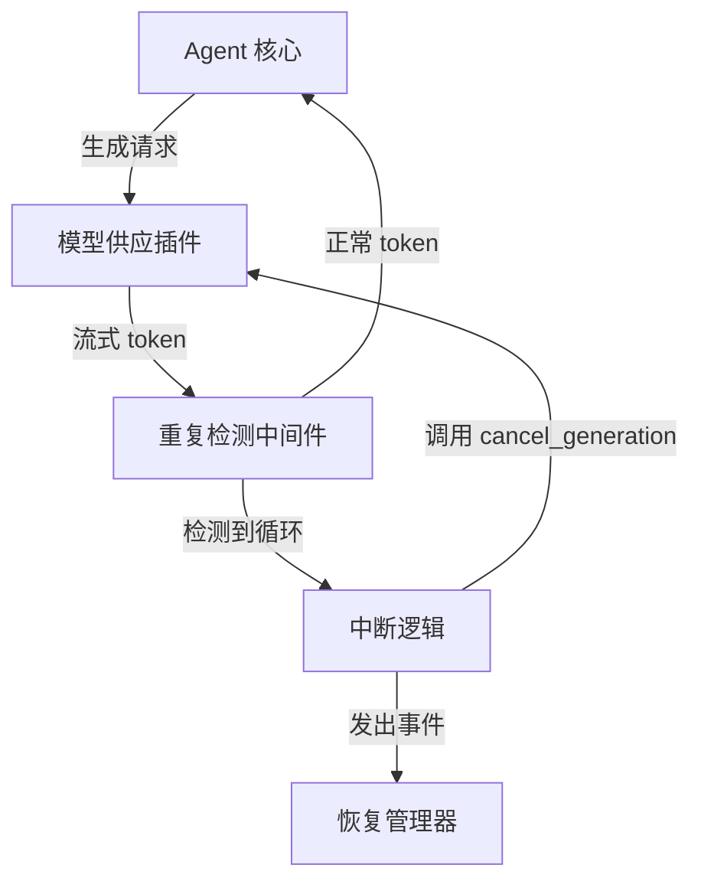

- 检测器作为插件内部的装饰器（或独立组件，通过 channel 连接），对上层透明。
- 重复中断时，检测器同时保留已输出的全部 token（或部分），作为错误上下文传递给恢复管理器。

### 10.5 恢复策略

中断后，代理不应直接报错退出，而是按照可配置的恢复策略尝试自动修复，将“重复输出”视为一种可恢复的执行错误。

**可选策略：**

1. **重试并强制反重复提示（Fallback Prompt）**
   将原始 prompt 加上一段强硬的指令片段（如 `"You MUST NOT repeat any previous output. Be concise and original."`）后重新请求同模型。这是最简单有效的方法。

2. **切换模型实例（Model Failover）**
   若 YAML 中为该任务定义了备用模型（如远程更强的模型），则切换到该模型重试当前步骤。例如本地 7B 模型反复循环，可自动 fallback 到远程 GPT-4 执行。

3. **重置惩罚参数并重试**
   自动将 `repetition_penalty` 调高（如从 1.1 升到 1.3），或开启 `no_repeat_ngram_size`，再请求一次。

4. **向规划器报告失败，请求重新规划**
   如果上述简单恢复均失败，将错误上下文（循环片段 + 原始任务）发回规划器，由规划器拆分任务或更换策略。

**YAML 配置结构：**

```yaml
repeat_detection:
  enabled: true
  min_n: 3
  max_n: 10
  window_size: 50
  consecutive_hit_threshold: 5
  window_repeat_ratio: 0.8
  early_stop_tokens: 100

  recovery:
    strategy: "sequential"   # sequential: 按顺序尝试，直到成功；parallel: 同时尝试最快返回
    max_attempts: 3
    actions:
      - type: "alter_prompt"
        prepend: "WARNING: Your previous response contained repetitive loops. Avoid any repetition and be highly varied."
      - type: "switch_model"
        model_id: "openai/gpt-4o"        # 显式指定模型 ID（优先级最高）；留空则按当前模型的 fallback_chain 顺序尝试
      - type: "adjust_params"
        params:
          repetition_penalty: 1.4
          no_repeat_ngram_size: 4
      - type: "delegate_to_planner"  # 最终兜底
```

**全局模型备用链配置**（与 §5 规划-执行分离联动）：

模型备用关系通过全局 `models` 注册表定义，`switch_model` 恢复动作引用其中的 `fallback_chain`：

```yaml
# 全局模型注册表（所有模型实例的定义与备用关系）
models:
  qwen-7b-local:
    provider: "local"
    path: "./models/qwen-7b.Q4_K_M.gguf"
    fallback_chain:
      - "openai/gpt-4o-mini"
      - "anthropic/claude-haiku-4"

  gpt-4o-mini:
    provider: "openai"
    model: "gpt-4o-mini"
    fallback_chain:
      - "anthropic/claude-haiku-4"

# 执行器绑定模型，自动继承 fallback_chain
execution:
  model: "qwen-7b-local"   # 本地模型，循环时自动 fallback 到 gpt-4o-mini
```

**`switch_model` 动作优先级**：

| 配置方式 | 行为 |
|---------|------|
| `model_id: "xxx"` 显式指定 | 直接切换到指定模型，**跳过 fallback_chain** |
| `model_id` 留空/省略 | 按当前模型的 `fallback_chain` 顺序尝试，第一个成功响应的即为切换目标 |
| chain 中所有模型均失败 | 退化为 `delegate_to_planner` |

此设计允许恢复策略在两种粒度间切换：粗粒度（直接切换到指定强模型）和细粒度（沿 fallback_chain 逐步降级）。

**恢复过程与调度器的交互：**

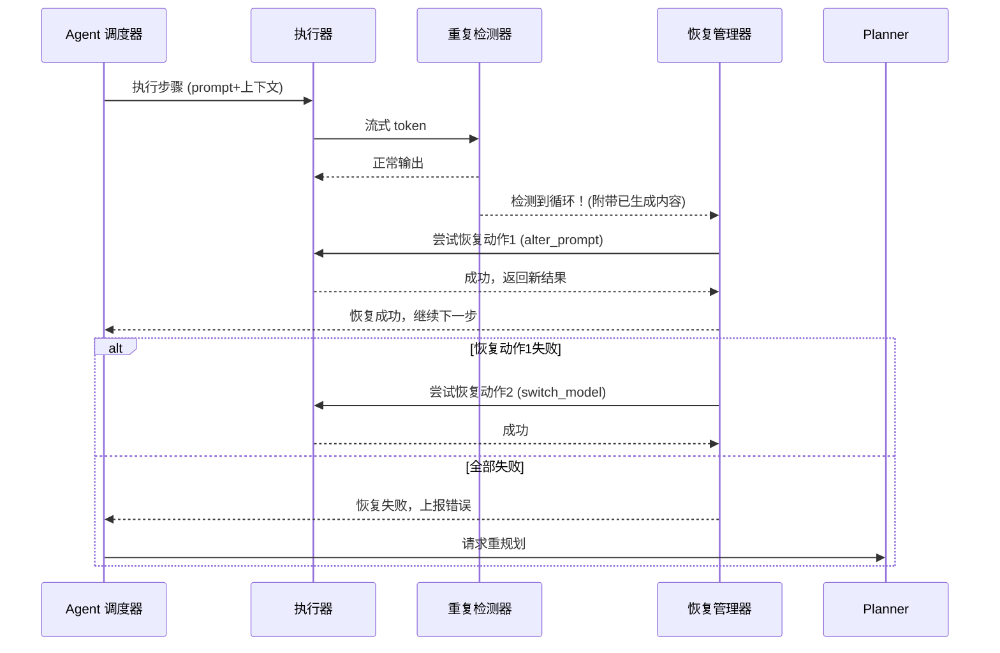

### 10.6 与 Hook 系统的联动

重复中断本身是一个关键事件，可接入第 8 章的 Hook 机制，允许用户自定义行为：

**新增事件：`repeat_detected`**
在检测器判定循环后、执行中断前触发 `pre.repeat_detected`，中断并执行恢复动作前触发 `post.repeat_detected`。钩子可以获取原始循环片段、已生成文本等，用户可通过脚本记录日志、发送通知，甚至动态修改恢复策略。

```yaml
hooks:
  project:
    - event: pre.repeat_detected
      command: ["python", "log_loop.py", "--token-stream", "{{last_50_tokens}}"]
    - event: post.repeat_detected
      command: ["notify-send", "Agent loop detected and recovered"]
```

### 10.7 与现有组件的整合要点

- **ModelProvider 层**：需要在“向 Agent 返回 token 流”的通道上嵌入 `RepeatDetector`。由于不同后端实现 token 流的方式不同，可以定义一个统一的 `TokenStream` trait，其 poll 方法由检测器包装。
- **Agent 调度器**：将重复错误归为 `StepError::ModelLoop`，在 Executor 的循环中捕获，然后调用 `RecoveryManager::handle`。
- **抢占锁机制**：如果中断发生且需要切换模型，需先释放当前模型的锁，再获取新模型的锁；检测器应在锁管理器的监控之下，避免死锁。
- **配置合并**：`repeat_detection` 配置应遵循全局/项目/用户三层覆盖逻辑，优先级同 hooks。

### 10.8 性能考量与安全边界

- 检测器的 n-gram 查找可采用 `AHashMap` 配合 `xxHash`，单次 token 插入耗时在纳秒级，对流式速度无影响。
- 若 `early_stop_tokens` 设为合理值（如 200），超长输出将自动关闭检测，避免无谓消耗。
- 恢复重试次数一定要有上限，防止无限循环消耗资源；建议 `max_attempts` 默认 2～3 次。
- 对于远程 API，中断流可能产生部分计费 token，但损失远小于任其无限生成。


### 11. Session 管理与“有记忆 Agent”快照系统

#### 11.1 设计动机与核心概念

在“Agent 蜂群”协作模式中，不同 Agent 实例（规划器、执行器、审查器、专项 Skill 代理）需要共享和继承上下文。然而，当前主流 Coding Agent 的对话历史是线性且脆弱的——一旦上下文窗口溢出或任务切换，所有中间推理状态即丢失。为此，本系统引入**Session 快照**作为一等公民，提供以下能力：

- **状态持久化**：将 Agent 在某一时刻的完整心智状态（对话历史、工具调用结果、LSP 缓存、代码理解摘要、调试器变量快照）保存为不可变快照。
- **上下文派生**：基于任一历史快照派生新 Agent 实例，使其“继承”快照时刻的完整上下文，实现有记忆的、可追溯的多分支协作。
- **选择性微调上下文**：在派生时或会话进行中，允许用户/调度器对上下文进行裁剪、标注、覆盖（例如标记某段对话为“过时”），确保 Agent 的“记忆”始终准确且与当前代码 SSOT（单一事实来源）对齐。
- **蜂群协作基础**：快照可作为 Agent 间传递任务的“上下文包”，使得代码分析后产生的理解能被多个下游代理直接复用（例如从“代码审计”快照派生出“重构代理”和“测试生成代理”，两者共享同一份代码理解）。

#### 11.2 Session 快照数据结构

一个 Session 快照包含以下组成，全部序列化为标准化格式（如 MessagePack 或 JSON Lines），便于存储、传输和跨模型后端加载：

```yaml
snapshot:
  id: "snap_20260513_a1b2c3"
  created: "2026-05-13T14:30:00Z"
  parent_snapshot_id: "snap_20260513_a1b2c2"  # 派生来源（可为空）
  meta:
    project_root: "/home/user/projects/myapp"
    project_hash: "sha256:abc123..."           # 项目状态哈希，用于快照失效检测
    model_id: "anthropic/claude-opus-4"        # 生成快照时的主模型
    tags: ["code-review", "backend", "rust"]

  # 对话与推理上下文
  conversation:
    - role: "user"
      content: "分析 src/auth 模块的权限逻辑"
      timestamp: "..."
    - role: "assistant"
      content: "已完成分析。发现 3 个潜在问题..."
      tool_calls: [...]
      timestamp: "..."
    # ...完整多轮对话及工具交互

  # 项目认知状态（Source of Truth）
  project_cognition:
    code_summaries:                # 由 LSP 兼容层提炼的模块/类摘要
      "src/auth/mod.rs":
        summary: "处理 JWT 验证与刷新..."
        symbols: ["AuthService", "validate_token", "refresh_token"]
        last_indexed: "2026-05-13T14:20:00Z"

    codebase_graph:                # 依赖关系摘要（精简版）
      nodes: ["src/auth", "src/db", "src/api"]
      edges: [["src/api", "src/auth"], ["src/auth", "src/db"]]

    debugger_state:                # 最近一次调试的变量/断点摘要（DAP兼容层产物）
      last_session:
        breakpoints: ["src/auth/mod.rs:42"]
        variable_snapshots:
          - name: "token_payload"
            type: "HashMap"
            summary: "包含 user_id, exp, roles 字段"
            captured_at: "2026-05-13T14:28:00Z"

  # 工具调用追踪
  tool_call_log:
    - tool: "lsp_query"
      params: {"file": "src/auth/mod.rs", "symbol": "validate_token"}
      result_summary: "fn validate_token(token: &str) -> Result<Claims>"
      tokens_consumed: 45
    # ...（仅保留摘要，非完整响应）

  # 当前会话的配置指纹
  config_fingerprint:
    hooks_active: ["pre.tool_call"]
    skills_active: ["rust-security-audit"]
    review_mode: "on-step"
```

**关键设计选择**：
- **项目状态哈希**：通过对关键源文件计算 Merkle Tree 哈希，快照可快速判定当前代码是否已变更，用于提醒用户快照可能“过时”。
- **工具调用摘要而非完整响应**：避免快照体积膨胀，同时保留足够上下文让后续 Agent 理解工具执行结果。
- **代码认知摘要而非完整代码**：Agent 依赖的是对代码的**理解摘要**（通过 LSP/调试器提炼），而非代码全文，这使快照在代码演进时仍有参考价值，且体积可控。
- **不可变且可派生**：快照一旦创建即只读。派生操作会生成新快照并记录 `parent_snapshot_id`，形成可追溯的上下文演进树。

#### 11.3 核心操作 API

调度器和 CLI 暴露以下 session 管理命令：

| 命令 | 说明 |
|------|------|
| `session snapshot [--tag "review-rust"]` | 保存当前代理完整状态为快照 |
| `session restore <snapshot_id>` | 将当前会话回滚到指定快照状态 |
| `session spawn <snapshot_id> --prompt "基于此分析生成测试" --model "local/qwen-7b"` | 从快照派生新 Agent 实例，可指定不同的模型和任务 |
| `session list` | 列出所有快照，支持按标签、时间、项目筛选 |
| `session prune --keep 10 --before 2026-05-01` | 清理旧快照，支持策略化清理 |
| `session fine-tune <snapshot_id>` | 打开交互式上下文编辑器（见 11.5 节） |
| `session diff <snap1> <snap2>` | 对比两个快照的认知差异和对话分歧 |
| `session merge <source_snap> --into <target_snap>` | 将源快照的部分认知合并到目标（如将“测试结果摘要”合并回“代码分析”快照） |

**派生操作示意图**：

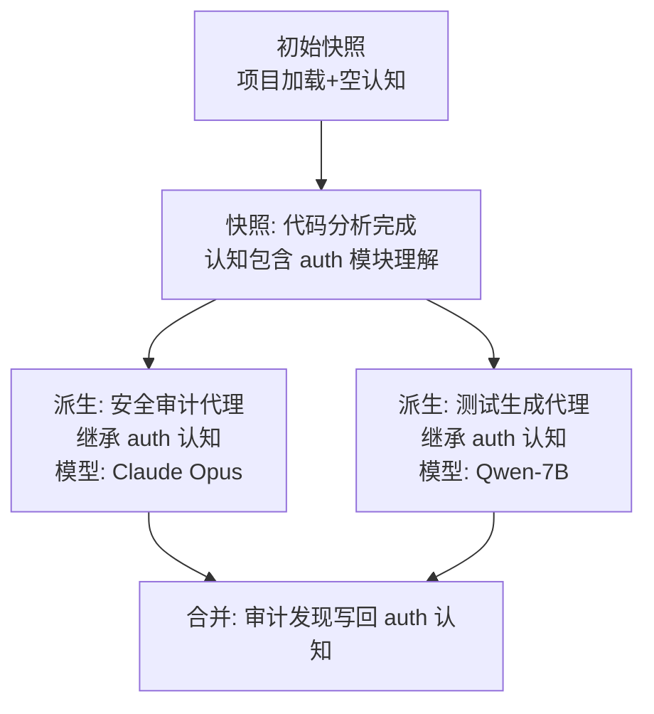

#### 11.4 微调上下文的生命周期管理

“有记忆的 Agent”核心挑战不是存储记忆，而是让记忆保持**可信、可解释、可调整**。系统提供三层上下文管理：

**A. 自动过期标记**

当项目文件发生变更（通过文件哈希监控），快照中与之相关的 `code_summaries`、`debugger_state` 条目自动被标记为 `stale: true`，并在 Agent 引用时附加警告前缀（如 `[STALE CONTEXT - file changed since snapshot]`）。调度器可配置为自动触发重新索引，或提示用户选择。

**B. 选择性遗忘与覆盖**

在派生快照时，用户可通过 YAML 或 CLI 指定上下文裁剪规则：

```yaml
snapshot_spawn:
  base: "snap_20260513_a1b2c3"
  context_filter:
    # 仅保留特定文件的认知
    files_include: ["src/auth/**"]
    # 移除特定工具调用日志
    exclude_tool_patterns: ["shell.exec", "file_write"]
    # 将部分对话替换为新的系统指令
    prepend_message:
      role: "system"
      content: "之前的 auth 分析基于旧数据库 schema，当前已升级到 v2。请优先检查 schema 变更影响。"
    # 标记指定范围的对话为“已过时，勿参考”
    deprecate_conversation_range: [5, 12]  # 第 5 到 12 轮对话
```

**C. 交互式上下文编辑器**

通过 `session fine-tune` 命令启动一个本地 Web 界面（复用 Diff 审查的基础设施），以树形可折叠方式展示快照的全部上下文组件。用户可以：

- 逐条审查 `code_summaries`，修改或删除过时的理解
- 删除某轮对话或隐藏特定工具调用
- 为上下文条目添加“存活期限”（如“此摘要仅在 24 小时内有效”）
- 保存编辑后的快照为新版本（`parent` 指向原快照）

编辑操作被记录为 `context_mutation_log`，使修改可审计、可逆。

#### 11.5 蜂群协作场景实例

**典型工作流**：

1. **上下文建立**：用户启动 Agent 并请求“全面分析 `src/auth` 模块”。Agent 使用强模型（如远程 Claude Opus）进行深度分析，消耗大量 token 生成详细代码认知。
2. **快照固化**：分析完成后，Agent 自动（或用户手动）创建快照 `auth-analysis-v1`，快照中不包含完整代码，但包含对每个函数的理解摘要、依赖关系和潜在问题列表。
3. **蜂群派生**：用户基于 `auth-analysis-v1` 同时启动多个 Agent：
   - Agent A：执行安全审计，模型使用专门微调的安全模型
   - Agent B：生成单元测试，模型使用本地快速模型
   - Agent C：根据分析结果更新 API 文档
   - 每个 Agent 的初始上下文完全继承快照，无需重新分析代码。
4. **裁剪优化**：Agent B 在派生时通过 `context_filter` 仅保留函数签名和接口摘要，丢弃详细分析文本，节省 token 并聚焦测试生成。
5. **结果合并**：Agent A 发现安全问题后，通过 `session merge` 将其发现写回 `auth-analysis-v1` 的 `project_cognition`，标记为“安全发现-已确认”。
6. **持续演进**：当 `src/auth` 代码变更时，用户可对 `auth-analysis-v1` 执行 `session fine-tune`，手动检查哪些认知仍然有效，或让调度器自动触发差异化重新分析（仅针对变更部分）。

#### 11.6 与现有组件的集成

- **调度器**：调度器在派生新 Agent 时，将快照的 `conversation`、`project_cognition` 以系统提示词片段的形式注入新 Agent 的初始上下文。快照中的 `tool_call_log` 摘要允许 Agent 了解“之前已有工具执行过什么”，避免重复工作。
- **LSP/DAP 兼容层**：快照中的 `code_summaries` 和 `codebase_graph` 由 LSP 兼容层生成。兼容层新增 `summarize_symbols(file)` 方法，返回结构化的精简摘要，专为快照设计。当快照派生时，Agent 可调用 `lsp_query` 并声明 `snapshot_background: true`，LSP 兼容层会优先返回快照缓存结果，仅在 `stale` 标记存在时穿透到实时查询。
- **重复检测与恢复**：快照派生时可携带 `recovery_context`，记录父快照是否曾触发重复循环。若父快照的特定 prompt 模式导致了循环，该模式会被标记为“高风险”，在派生代理中自动插入反重复提示。
- **Hook 机制**：新增以下事件：
  - `post.session_snapshot`：快照创建后触发，可用于自动备份到远程存储
  - `pre.session_spawn`：派生前触发，钩子可修改 `context_filter` 或注入额外上下文
  - `post.session_merge`：合并完成后触发，通知外部系统认知已更新
- **Diff 审查**：快照对比视图（`session diff`）复用第 7 章的 Monaco Diff 基础设施，以可视化方式展示两个快照间对话和认知的差异，帮助用户理解不同 Agent 执行路径的分歧。

#### 11.7 实时上下文压缩（Compaction）

> **⚠️ 与快照系统的区别**：§11 的快照系统解决的是会话间/派生间的**持久化与继承**，而实时 compaction 解决的是会话进行中对话窗口过长时的**自动摘要与折叠**。这是两种不同能力，此处补充说明。

**策略设计**：

基于 adk-core 的 `intra_compaction` 机制，在以下时机触发上下文压缩：

| 触发条件 | 策略 | 说明 |
|---------|------|------|
| 对话 token 数 > 窗口容量的 75% | `intra_compaction` | 自动将最近的 N 轮对话摘要为一段 system message |
| 用户显式请求 | `manual_compaction` | 通过 CLI 命令 `session compact` 触发 |
| 快照派生时 | `derive_compaction` | 派生新 Agent 时自动裁剪过时上下文，仅保留关键认知 |

**压缩方式**：

1. **对话摘要**：将最近 N 轮 user/assistant 对话（不含工具调用细节）发送给一个轻量模型，生成一段结构化摘要，替换原始对话片段
2. **工具调用折叠**：将连续的工具调用结果合并为 `executed N tools, results summarized` 摘要
3. **代码认知保留**：`project_cognition` 中的 `code_summaries` 不受压缩影响，始终保留

**配置**：

```yaml
compaction:
  strategy: "intra"              # intra（对话内压缩）| derive（派生裁剪）| manual（手动）
  token_threshold: 0.75          # 窗口容量占比阈值
  summary_model: null            # null 表示使用当前模型的轻量变体；可指定如 "local/qwen-7b"
  keep_tool_summaries: true      # 保留工具调用摘要而非完全丢弃
  max_conversation_rounds: 50    # 压缩前保留的最大对话轮数
```

**与快照系统的关系**：

- 实时 compaction 是**会话内**的上下文管理，不创建持久化快照
- 快照系统中的 `conversation` 字段存储的是 compaction 处理后的结果（如果启用了压缩）
- 派生操作（`session spawn`）自动对 `derive_compaction` 生效，无需用户干预

#### 11.8 性能与存储考量

- **增量快照**：快照采用写时复制（CoW）策略，仅存储与父快照的差异部分。派生操作仅创建轻量引用，直到上下文实际被修改时才复制数据。
- **压缩与分块**：`conversation` 和 `code_summaries` 使用 Zstandard 压缩。单个快照目标体积：< 5MB（不含项目文件），使得存储和传输开销可控。
- **GC 策略**：可配置的垃圾回收规则，包括按年龄（> 30 天）、按派生深度（最大保留 3 代）、按标签白名单等。
- **跨实例共享**：快照存储于项目根 `.agent/snapshots/` 目录下，可通过配置指向共享存储（如团队 NFS 或 S3），实现协作场景下“一人分析，全队继承”。

#### 11.9 配置集成

```yaml
session:
  auto_snapshot: true           # 每个计划步骤完成后自动创建快照
  max_snapshots: 50             # 最大快照数量，超过触发 GC
  snapshot_on_loop_detected: true  # 检测到重复循环时自动保存现场快照（用于事后分析）
  context_freshness_ttl: 3600   # 认知摘要的默认存活时间（秒），超时标记为 stale

  # 快照存储后端
  storage:
    backend: "local"            # local | s3 | nfs
    path: ".agent/snapshots"
    compression: "zstd"
    encryption_key: null        # 可选，用于加密快照中的敏感数据
```
### 风险与缓解

| 风险              | 缓解措施                           |
| --------------- | ------------------------------ |
| LSP/DAP 兼容层性能开销 | 纯透传无额外解析；利用缓存避免重复请求            |
| 规划器模型能力不足       | 可在 YAML 中灵活切换为远程强模型            |
| 多模型抢占死锁         | 严格超时与死锁检测，支持强制释放锁              |
| 调试器与 LSP 集成复杂   | 采用标准协议插件化，初期仅支持 Python/Rust/TS |
| Diff 浏览器体验不一致   | 提供 CLI/TUI 降级方案，浏览器作为推荐模式      |
| 插件系统引入复杂        | 明确接口规范，内置少量参考插件；社区贡献机制         |

## 12. 工具调用安全策略

原生内置的工具调用严格限制层，不依赖外部 Hook 脚本即可对每一次工具执行实施**声明式硬约束**。Hook 机制（第 8 章）可在内置限制之上叠加额外逻辑，但无法放宽内置限制。

### 12.1 设计原则

- **零信任**：默认禁止所有未显式允许的操作（尤其 bash 命令）。
- **配置驱动**：通过 YAML 声明规则，无需修改代码。
- **早拦截**：在工具调用解析阶段即过滤，避免进入执行上下文。
- **可观测**：所有拦截事件自动记录并触发 `tool_call_blocked` 事件（可被 Hook 捕获）。

### 12.2 配置结构

```yaml
security:
  # 全局生效，可被项目级/用户级覆盖（仅限收紧，不可放宽）

  # 工具白名单：仅允许列表中的工具执行
  tool_allowlist: ["read", "write", "edit", "grep", "find", "ls", "lsp_query"]

  # 工具黑名单：禁止列表中的工具（白名单存在时黑名单失效）
  tool_blocklist: []

  # Bash 命令限制
  bash:
    # 允许的命令模式（正则）
    allowed_patterns:
      - "^cargo (check|build|test|clippy|fmt)"
      - "^python -m pytest"
      - "^git (status|diff|log|add|commit|push|pull)"
      - "^npm (run|test|install|ci)"
    # 禁止的命令模式（优先级高于 allowed_patterns）
    forbidden_patterns:
      - "rm -rf /"
      - "sudo"
      - "curl.*|.*sh"
      - "> /dev/"
      - "mkfs"
    # 命令超时
    timeout_seconds: 120
    # 最大输出字节数（防止 token 洪流）
    max_output_bytes: 1048576  # 1 MB
    # 是否允许交互式命令（如 vim, top）
    allow_interactive: false
    # 环境变量白名单
    env_allowlist: ["PATH", "HOME", "USER", "CARGO_HOME", "RUSTUP_HOME"]

  # 文件系统访问控制
  filesystem:
    # 允许读写的路径白名单（基于 glob，以项目根为基准）
    path_allowlist:
      - "src/**"
      - "tests/**"
      - "Cargo.*"
      - "package.json"
      - "pyproject.toml"
    # 禁止读写的路径
    path_blocklist:
      - "**/target/**"
      - "node_modules/**"
      - ".env"
      - "*.key"
      - "*.pem"
    # 是否允许访问项目根以外的文件
    allow_outside_workspace: false

  # 网络访问控制（适用于 bash 和其他需要网络的工具）
  network:
    # 允许的出站域名/IP 模式
    allowed_hosts:
      - "crates.io"
      - "pypi.org"
      - "registry.npmjs.org"
      - "github.com"
    # 禁止的出站域名/IP
    blocked_hosts: []
    # 默认策略：deny（禁止所有未列出的）| allow（允许所有）
    default_policy: "deny"

  # 资源配额
  resource_limits:
    max_subprocesses: 16          # 同时运行的最大子进程数
    max_memory_mb: 2048           # 子进程最大内存
    max_cpu_time_seconds: 300     # 总 CPU 时间限制
```

### 12.3 规则优先级与合并

内置安全规则沿用全局/项目/用户三级配置覆盖模型（同 Hook 机制），**后者只能收紧不能放宽**，确保用户级配置不会意外提升危险权限。

### 12.4 与 Hook 系统的交互

1. 内置限制**先于** Hook 执行：若工具调用被内置层拒绝，则不会触发 `pre.tool_call` Hook。
2. Hook 可通过返回值进一步阻止工具调用（例如动态判断参数），但无法让已被内置层禁止的工具执行。
3. 拦截事件 `tool_call_blocked` 可作为 Hook 事件被监听（配置结构同 §8 三级覆盖模型）：
   ```yaml
   hooks:
     project:
       - event: tool_call_blocked
         command: ["echo", "Blocked attempt: {{tool_name}}"]
   ```

### 12.5 与权限门控的联动

- 文件写入操作（`write`, `edit`）在通过内置文件系统限制后，仍需按 §7.5 触发 `pre.tool_call.file_write` 及后续审查流程。
- `bash` 工具的命令匹配逻辑在内置层进行，通过后进入正常的工具执行生命周期。

### 12.6 沙箱集成（可选，Phase 2）

未来可与 codex-rs 的 `suggest/auto-edit/full-auto` 策略深度结合，当用户配置为 `full-auto` 时自动应用更严格的沙箱（如 Docker/nsjail），该部分作为 Phase 2 交付，当前仅预留配置入口：

```yaml
security:
  sandbox:
    enabled: false
    engine: "docker"  # docker | nsjail | none
    image: "pi-agent-sandbox:latest"
```

---

**实施说明**：上述内容在 `Cargo workspace` 中由 `pi-config` crate 解析，`pi-core` 的执行器在调用任何工具前查询 `SecurityPolicy` 进行准入判定。`pi-test-support` 需提供 `SecurityPolicy::permissive()` 构造器用于测试。

## 13. 测试与验证

### 13.1 测试哲学与原则

本项目是一个 **终端交互型 Coding Agent CLI**，其测试面临三重挑战：

1. **TUI 渲染正确性**：ratatui/crossterm 的终端输出难以用常规断言验证
2. **Agent Loop 异步交互**：LLM 流式响应 + 工具调用 + 状态流转的端到端正确性
3. **终端环境差异**：不同终端模拟器、平台、Unicode 宽度处理可能产生渲染差异

基于对 pi-mono（TypeScript 源项目）和 codex-rs（OpenAI Codex CLI，Rust 原生）测试基础设施的深度调研，确立以下原则：

**四层测试金字塔**：

```
        ┌─────────┐
        │  E2E    │  PTY 进程级黑盒测试（启动/关闭/stdout 清洁度）
        └────┬────┘
       ┌─────┴─────┐
       │ 跨 Crate  │  TestHarness 全连线集成（FauxProvider + 事件断言）
       └─────┬─────┘
      ┌──────┴──────┐
      │   集成测试   │  各 Crate 带 mock 依赖的集成测试
      └──────┬──────┘
     ┌───────┴───────┐
     │    单元测试    │  纯函数、数据结构、协议解析
     └───────────────┘
```

**核心原则**：

- **确定性优先**：默认测试无网络调用、无随机性、可重复执行（参考 pi-mono suite README："CI-safe and deterministic"）
- **Mock 不越层**：`pi-tui` 不 mock LLM provider，`pi-core` 不 mock terminal。每层只 mock 自己的直接依赖
- **快照驱动 UI 验证**：TUI 组件输出用 `insta` 快照而非手工字符串断言，降低维护成本
- **回归锁定**：每个修复的 bug 必须有对应的回归测试，按 issue 编号命名（参考 pi-mono `test/suite/regressions/` 和 codex-rs `core/tests/suite/`）

### 13.2 测试技术栈

| Crate | 版本 | 用途 | 使用范围 |
|-------|------|------|---------|
| `insta` | 1.47+ | 快照测试，TUI 渲染输出和 API 响应结构验证 | `pi-tui`, `pi-core` |
| `cargo-nextest` | 0.9+ | 测试运行器（比 `cargo test` 快 3x，per-test 隔离） | Workspace 全局 |
| `wiremock` | 0.6+ | HTTP mock server，模拟 LLM API SSE 响应 | `pi-core` |
| `assert_cmd` | 2.2+ | CLI 进程断言，测试二进制行为 | `pi-cli` |
| `vt100` | 0.15+ | VT100 终端模拟器，进程内渲染验证 | `pi-tui`（feature-gated） |
| `tempfile` | 3.x | 隔离的临时目录管理 | 所有 crate |
| `tokio` (test) | 1.x | 异步测试运行时 | 所有异步 crate |
| `ctor` | 0.2+ | 测试全局初始化（确定性 PID、snapshot 路径） | 共享测试 crate |
| `assert_matches` | 1.5+ | 模式匹配断言 | `pi-core`, `pi-tools` |
| `serial_test` | 3.x | 顺序执行标记（共享全局状态的测试） | `pi-config` |
| `test-case` | 3.x | 参数化测试用例 | `pi-config`, `pi-tools` |

**额外说明**：

- ratatui 自带 `TestBackend`（`ratatui::backend::TestBackend`），无需额外依赖，用于 widget 级别渲染到 buffer
- codex-rs 验证了 `vt100` crate 可以正确处理 crossterm 生成的所有 ANSI 转义序列，包括颜色、光标移动、滚动区域

### 13.3 测试 Harness 架构

#### 13.3.1 FauxProvider（Mock LLM）

参考 pi-mono 的 `packages/ai/src/providers/faux.ts` 和 codex-rs 的 `core/tests/common/responses.rs`，设计一个 **无网络、确定性** 的 mock LLM provider。

```rust
/// 预配置的响应步骤（静态消息 或 基于上下文的工厂函数）
pub enum FauxResponseStep {
    Message(AssistantMessage),
    Factory(Box<dyn Fn(&Context, usize) -> AssistantMessage + Send + Sync>),
}

/// Mock LLM Provider 状态
pub struct FauxProviderState {
    pub call_count: AtomicUsize,
    pub captured_contexts: Mutex<Vec<Context>>,
}

pub struct FauxProvider {
    pending: Mutex<VecDeque<FauxResponseStep>>,
    state: Arc<FauxProviderState>,
    token_size_range: (usize, usize),  // 每个 "token" chunk 的字符范围（3-5）
    tokens_per_second: Option<f64>,    // 可选速率限制
}

impl FauxProvider {
    /// 设置响应序列（先进先出）
    pub fn set_responses(&self, responses: Vec<FauxResponseStep>) {
        let mut pending = self.pending.lock().unwrap();
        *pending = responses.into();
    }

    /// 追加响应到队列尾部
    pub fn append_responses(&self, responses: Vec<FauxResponseStep>) {
        let mut pending = self.pending.lock().unwrap();
        pending.extend(responses);
    }

    /// 流式模拟：将消息文本按 3-5 字符分块，逐块发送 StreamEvent
    pub fn stream(&self, model: &Model, context: Context) -> impl Stream<Item = StreamEvent> {
        // 从 pending 队列弹出下一步
        // 将 AssistantMessage 内容分割为 3-5 字符的 chunks
        // 按顺序发送: start → text_delta*N → text_end → toolcall_delta*N → done
        // 记录 context 到 captured_contexts
        // 递增 call_count
    }
}

/// 快捷构造函数
pub fn faux_text(text: &str) -> FauxResponseStep { ... }
pub fn faux_tool_call(name: &str, args: Value) -> FauxResponseStep { ... }
pub fn faux_thinking(text: &str) -> FauxResponseStep { ... }
pub fn faux_error(code: &str, message: &str) -> FauxResponseStep { ... }
```

**关键设计**（来自 pi-mono 的验证经验）：
- `FauxResponseStep::Factory` 允许根据运行时上下文动态生成响应（如根据工具调用结果生成后续回复）
- `token_size_range` 模拟真实的流式分块行为，确保 TUI 逐字符渲染逻辑被测试覆盖
- `FauxProviderState` 线程安全，可在异步环境中共享

#### 13.3.2 TestHarness Builder

参考 pi-mono 的 `test/suite/harness.ts` 和 codex-rs 的 `TestCodexBuilder`，设计 Builder 模式的全连线测试 harness。

```rust
/// 全连线测试 Session，所有依赖均为 mock 或内存实现
pub struct TestHarness {
    pub session: AgentSession,
    pub faux_provider: Arc<FauxProvider>,
    pub faux_state: Arc<FauxProviderState>,
    pub events: Arc<Mutex<Vec<AgentEvent>>>,
    pub temp_dir: TempDir,
}

impl TestHarness {
    pub fn builder() -> HarnessBuilder { HarnessBuilder::default() }

    /// 按类型过滤已捕获的事件
    pub fn events_of_type<T: AgentEvent + Clone>(&self) -> Vec<T> { ... }

    /// 提取所有用户文本
    pub fn user_texts(&self) -> Vec<String> { ... }

    /// 提取所有助手文本
    pub fn assistant_texts(&self) -> Vec<String> { ... }
}

#[derive(Default)]
pub struct HarnessBuilder {
    responses: Vec<FauxResponseStep>,
    model: Option<Model>,
    context_window: Option<usize>,
    settings_overrides: HashMap<String, Value>,
    system_prompt: Option<String>,
    tools: Vec<Box<dyn AgentTool>>,
}

impl HarnessBuilder {
    pub fn with_responses(mut self, responses: Vec<FauxResponseStep>) -> Self { ... }
    pub fn with_model(mut self, model: Model) -> Self { ... }
    pub fn with_system_prompt(mut self, prompt: &str) -> Self { ... }
    pub fn with_tool(mut self, tool: Box<dyn AgentTool>) -> Self { ... }

    pub fn build(self) -> TestHarness {
        let temp_dir = tempfile::tempdir().unwrap();
        let faux = Arc::new(FauxProvider::new(self.responses));
        let state = faux.state.clone();

        // 内存管理器（无文件 I/O）
        let session_mgr = SessionManager::in_memory();
        let settings_mgr = SettingsManager::in_memory(self.settings_overrides);
        let auth_storage = AuthStorage::in_memory();

        // 事件捕获
        let events = Arc::new(Mutex::new(Vec::new()));
        let event_collector = events.clone();

        // 全连线 AgentSession
        let session = AgentSession::new(AgentSessionConfig {
            provider: faux.clone(),
            session_manager: session_mgr,
            settings_manager: settings_mgr,
            auth_storage,
            tools: self.tools,
            event_handler: Box::new(move |evt| {
                event_collector.lock().unwrap().push(evt);
            }),
            temp_dir: temp_dir.path().to_path_buf(),
        });

        TestHarness { session, faux_provider: faux, faux_state: state, events, temp_dir }
    }
}
```

**使用示例**：

```rust
#[tokio::test]
async fn multi_tool_concurrent_execution() {
    let harness = TestHarness::builder()
        .with_responses(vec![
            faux_text("Let me check the files"),
            faux_tool_call("read", json!({"path": "src/main.rs"})),
            faux_tool_call("read", json!({"path": "src/lib.rs"})),
            faux_text("I found the issue"),
        ])
        .build();

    harness.session.prompt("Fix the bug").await.unwrap();

    let texts = harness.assistant_texts();
    assert_eq!(texts.len(), 2);
    assert!(texts[0].contains("check the files"));
}
```

#### 13.3.3 内存管理器模式

每个管理器类型提供 `in_memory()` 构造函数，消除文件 I/O 依赖：

```rust
impl SessionManager {
    pub fn in_memory() -> Self { /* 仅内存 HashMap，无 JSONL 文件 */ }
}

impl SettingsManager {
    pub fn in_memory(overrides: HashMap<String, Value>) -> Self { /* 无 YAML 文件 */ }
}

impl AuthStorage {
    pub fn in_memory() -> Self { /* 无 ~/.pi/agent/auth.json */ }
}

impl ConfigManager {
    pub fn in_memory() -> Self { /* 无 config 目录 */ }
}
```

### 13.4 TUI 组件测试

本节是测试架构的核心。基于 codex-rs 的验证经验（244+ TUI 快照文件），采用 **双轨测试策略**。

#### 13.4.1 轨道 A：TestBackend + insta 快照（Widget 级单元测试）

使用 ratatui 内置的 `TestBackend` 将 widget 渲染到 buffer，然后用 `insta` 快照断言。这是 ratatui 官方推荐的测试方式。

```rust
#[cfg(test)]
mod tests {
    use ratatui::{backend::TestBackend, Terminal};
    use insta::assert_snapshot;

    #[test]
    fn render_chat_message() {
        let component = ChatComponent::new("Hello, world!", Style::default());
        let backend = TestBackend::new(80, 24);
        let mut terminal = Terminal::new(backend).unwrap();

        terminal.draw(|frame| {
            frame.render_widget(component, frame.area());
        }).unwrap();

        assert_snapshot!(terminal.backend());
    }

    #[test]
    fn render_tool_output_expanded() {
        let tool = ToolOutputComponent::new(
            "read",
            json!({"path": "src/main.rs"}),
            "fn main() { println!(\"hello\"); }",
            ExpansionState::Expanded,
        );
        let backend = TestBackend::new(120, 40);
        let mut terminal = Terminal::new(backend).unwrap();

        terminal.draw(|frame| {
            frame.render_widget(tool, frame.area());
        }).unwrap();

        assert_snapshot!(terminal.backend());
    }
}
```

**适用场景**：单个 widget 渲染验证、布局计算、样式断言。快速、无重量级依赖。

#### 13.4.2 轨道 B：VT100Backend（完整渲染管线集成测试）

直接复用 codex-rs 的 `VT100Backend` 架构。核心思想：将 crossterm 的 ANSI 输出送入 VT100 终端模拟器，得到像素级准确的屏幕内容。

```rust
// Feature-gated 在 pi-tui 或 pi-test-support 中
#[cfg(feature = "vt100-tests")]
pub struct VT100Backend {
    crossterm_backend: CrosstermBackend<vt100::Parser>,
}

#[cfg(feature = "vt100-tests")]
impl VT100Backend {
    pub fn new(width: u16, height: u16) -> Self {
        crossterm::style::force_color_output(true);
        Self {
            crossterm_backend: CrosstermBackend::new(
                vt100::Parser::new(height, width, 0)
            ),
        }
    }

    pub fn vt100(&self) -> &vt100::Parser {
        self.crossterm_backend.writer()
    }

    /// 获取屏幕纯文本内容（不含 ANSI 转义）
    pub fn screen_contents(&self) -> String {
        self.vt100().screen().contents()
    }

    /// 访问指定坐标的 cell
    pub fn cell(&self, row: usize, col: usize) -> &vt100::Cell {
        self.vt100().screen().cell(row, col)
    }
}

// 实现 ratatui Backend trait（委托给 crossterm_backend）
#[cfg(feature = "vt100-tests")]
impl Backend for VT100Backend {
    // draw, hide_cursor, show_cursor, clear, flush, scroll_region_* 等
    // 全部委托给 self.crossterm_backend
    // 唯独 get_cursor_position 和 size 从 vt100 parser 读取
    // （避免调用会写 stdout 的 crossterm 方法）
    fn get_cursor_position(&mut self) -> io::Result<Position> {
        Ok(self.vt100().screen().cursor_position().into())
    }
    fn size(&self) -> io::Result<Size> {
        let (rows, cols) = self.vt100().screen().size();
        Ok(Size::new(cols, rows))
    }
}

// Display trait 用于 insta 快照
#[cfg(feature = "vt100-tests")]
impl fmt::Display for VT100Backend {
    fn fmt(&self, f: &mut fmt::Formatter<'_>) -> fmt::Result {
        write!(f, "{}", self.screen_contents())
    }
}
```

**使用示例**（测试完整渲染管线，包括 crossterm ANSI 转义处理）：

```rust
#[test]
#[cfg(feature = "vt100-tests")]
fn chat_with_tool_output_renders_correctly() {
    let backend = VT100Backend::new(80, 24);
    let mut terminal = Terminal::new(backend).unwrap();

    let app = TestApp::with_responses(vec![
        faux_text("Reading file..."),
        faux_tool_call("read", json!({"path": "main.rs"})),
        faux_text("Here's the content"),
    ]);
    app.process_responses();
    app.render_to(&mut terminal);

    // 快照断言整个屏幕
    assert_snapshot!(terminal.backend());

    // 也可精确断言某个 cell
    let cell = terminal.backend().cell(0, 0);
    assert!(cell.has_widechar());  // Unicode 宽度验证
}
```

**Feature Gate 设计**：

```toml
# pi-tui/Cargo.toml
[features]
vt100-tests = ["vt100"]

[dev-dependencies]
vt100 = { version = "0.15", optional = true }
```

```bash
# 日常开发（快速，不含 VT100 测试）
cargo nextest run -p pi-tui

# CI / PR 审查（含完整渲染管线测试）
cargo nextest run -p pi-tui --features vt100-tests
```

**双轨策略对照**：

| 维度 | TestBackend + insta | VT100Backend |
|------|---------------------|--------------|
| 测试粒度 | 单个 widget | 完整渲染管线 |
| 覆盖范围 | 布局、样式、内容 | crossterm ANSI 转义、滚动、光标、Unicode 宽度 |
| 构建依赖 | 无额外依赖 | `vt100` crate |
| 执行速度 | 快（~µs） | 稍慢（~ms） |
| Feature Gate | 默认启用 | `vt100-tests` 可选 |
| 适用场景 | 开发时快速迭代 | PR 审查、CI、回归测试 |

**平台特定快照**：`insta` 支持 `snapshot_suffix!` 宏设置平台后缀（如 `@linux.snap`、`@macos.snap`），应对终端渲染的平台差异。

### 13.5 Agent Loop 集成测试

#### 13.5.1 wiremock SSE 模拟

使用 `wiremock` 创建 mock HTTP server，模拟 LLM API 的 Server-Sent Events 流式响应。

```rust
use wiremock::{MockServer, Mock, ResponseTemplate};
use wiremock::matchers::{method, path};

/// SSE 响应事件构建器
pub fn sse_event(event_type: &str, data: &str) -> String {
    format!("event: {}\ndata: {}\n\n", event_type, data)
}

pub fn sse_text_delta(index: usize, text: &str) -> String {
    sse_event("response.output_text.delta",
        &json!({"content_index": index, "delta": text}).to_string())
}

pub fn sse_tool_call(id: &str, name: &str, args: &Value) -> String {
    sse_event("response.function_call_arguments.delta",
        &json!({"id": id, "name": name, "arguments": args}).to_string())
}

pub fn sse_done(usage: &Value) -> String {
    sse_event("response.completed", &usage.to_string())
}

/// 构建 SSE 流响应体
pub fn build_sse_response(events: Vec<String>) -> String {
    events.into_iter().collect()
}
```

**使用示例**：

```rust
#[tokio::test]
async fn agent_calls_tool_then_responds() {
    let server = MockServer::start().await;

    // 第一轮：助手请求读取文件
    server.register(Mock::given(method("POST"))
        .and(path("/v1/messages"))
        .respond_with(ResponseTemplate::new(200)
            .set_body_raw(
                build_sse_response(vec![
                    sse_text_delta(0, "Let me read that"),
                    sse_tool_call("call_1", "read", &json!({"path": "main.rs"})),
                    sse_done(&json!({"usage": {"input": 100, "output": 50}})),
                ]),
                "text/event-stream"
            )
        )
    ).await;

    let harness = TestHarness::builder()
        .with_base_url(server.uri())
        .build();

    harness.session.prompt("Read main.rs").await.unwrap();

    let events = harness.events_of_type::<ToolCallEvent>();
    assert_eq!(events.len(), 1);
    assert_eq!(events[0].tool_name, "read");
}
```

#### 13.5.2 流式时序控制（StreamingSseServer）

对于需要精确控制 SSE chunk 到达时机的测试（如渐进式渲染、中途取消、超时），参考 codex-rs 的 `core/tests/common/streaming_sse.rs`，使用基于 TCP 的自定义 SSE server：

```rust
/// 可门控的 SSE chunk
pub struct GatedSseChunk {
    pub event: String,
    pub gate: Option<tokio::sync::oneshot::Sender<()>>,  // 阻塞直到测试就绪
}

/// TCP 级 SSE 服务器，精确控制每个 chunk 的发送时机
pub struct StreamingSseServer {
    chunks: Vec<GatedSseChunk>,
    listener: TcpListener,
}

impl StreamingSseServer {
    pub async fn start() -> (Self, String) {
        let listener = TcpListener::bind("127.0.0.1:0").await.unwrap();
        let addr = listener.local_addr().unwrap();
        let url = format!("http://{}", addr);
        (Self { chunks: vec![], listener }, url)
    }

    /// 发送下一个 chunk，阻塞直到测试通过 gate 信号
    pub async fn send_next(&self) { ... }
}
```

#### 13.5.3 TestAgentBuilder（Builder 模式）

```rust
pub struct TestAgentBuilder {
    mock_server: Option<MockServer>,
    responses: Vec<Vec<String>>,  // 多轮响应序列
    model: Option<Model>,
    tools: Vec<Box<dyn AgentTool>>,
    settings: Option<Settings>,
}

impl TestAgentBuilder {
    pub fn new() -> Self { ... }
    pub fn with_mock_server(mut self, server: MockServer) -> Self { ... }
    pub fn with_response_sequence(mut self, events: Vec<String>) -> Self { ... }
    pub fn with_tool(mut self, tool: Box<dyn AgentTool>) -> Self { ... }

    pub async fn build(self) -> (AgentSession, MockServer) {
        let server = self.mock_server.unwrap_or_else(|| {
            // 同步启动 MockServer
        });
        // 将 server.uri() 作为 LLM API base_url 注入
        // 返回全配置的 AgentSession
    }
}
```

### 13.6 E2E PTY 测试

测试完整 CLI 二进制的启动、关闭和 I/O 行为。参考 codex-rs 的 `utils/pty/` crate。

#### 13.6.1 PTY 进程启动

```rust
use portable_pty::{native_pty_system, PtySize, CommandBuilder};

pub fn spawn_pty_process(
    bin_path: &str,
    args: &[&str],
    env: HashMap<String, String>,
) -> (Box<dyn MasterPty + Send>, Reader, Child) {
    let pty_system = native_pty_system();
    let pair = pty_system.openpty(PtySize {
        rows: 24, cols: 80,
        pixel_width: 0, pixel_height: 0,
    }).unwrap();

    let mut cmd = CommandBuilder::new(bin_path);
    cmd.args(args);
    cmd.env(env);

    let child = pair.slave.spawn_command(cmd).unwrap();
    let reader = pair.master.try_clone_reader().unwrap();

    (pair.master, reader, child)
}
```

#### 13.6.2 stdout 清洁度测试

参考 pi-mono 的 `test/stdout-cleanliness.test.ts`：

```rust
#[test]
fn json_mode_stdout_contains_only_json() {
    let output = std::process::Command::new("cargo")
        .args(["run", "--bin", "pi-cli", "--", "--mode", "json", "--help"])
        .output()
        .unwrap();

    // JSON 模式下 stdout 只应有 JSON，闲聊应到 stderr
    let stdout = String::from_utf8_lossy(&output.stdout);
    assert!(stdout.starts_with('{') || stdout.is_empty(),
        "stdout should be JSON or empty, got: {}", stdout);
}
```

#### 13.6.3 启动/关闭生命周期

参考 codex-rs 的 `no_panic_on_startup.rs`：

```rust
#[test]
fn no_panic_on_malformed_config() {
    let dir = tempfile::tempdir().unwrap();
    // 写入无效配置
    fs::write(dir.path().join("config.yaml"), "{{invalid yaml").unwrap();

    let (master, mut reader, mut child) = spawn_pty_process(
        "target/debug/pi-cli",
        &["--config", dir.path().join("config.yaml").to_str().unwrap()],
        HashMap::new(),
    );

    // 读取 PTY 输出，不应有 panic 信息
    let mut output = String::new();
    reader.read_to_string(&mut output).unwrap();
    assert!(!output.contains("panic"));
}
```

### 13.7 回归测试工作流

参考 pi-mono 的 `test/suite/regressions/` 和 codex-rs 的 `core/tests/suite/`：

**命名规范**：`{issue_number}-{short-description}.rs`

```
pi-core/tests/regressions/
    0001-network-retry.rs
    0042-compaction-branch-corruption.rs
    0137-tool-arg-validation.rs

pi-tui/tests/regressions/
    0089-widechar-wrap.rs
    0201-scroll-region-reset.rs

pi-tools/tests/regressions/
    0055-edit-unicode-path.rs
```

**每个回归测试的模板**：

```rust
/// Regression test for issue #0042
/// Bug: compaction corrupts branch parent pointers when session tree has depth > 3
/// Fixed: 2026-05-XX

#[tokio::test]
async fn compaction_preserves_branch_parent_pointers() {
    let harness = TestHarness::builder()
        .with_responses(vec![
            // 最小复现数据
        ])
        .build();

    // 触发 bug 场景
    harness.session.prompt("...").await.unwrap();

    // 断言修复后的行为
    let tree = harness.session.tree();
    assert_eq!(tree.depth(), 4);
    assert!(tree.branches().all(|b| b.parent().is_some()));
}
```

### 13.8 各 Crate 测试矩阵

| Crate | 测试类型 | 关键模式 | Mock 策略 |
|-------|---------|---------|----------|
| `pi-config` | 单元：YAML 解析、校验、默认值 | `test-case` 参数化、`serial_test`、fixture 文件 | 无外部依赖 |
| `pi-test-support` | 无自身测试 | 提供 `FauxProvider` / `TestHarness` / `VT100Backend` 等共享 mock，供其他 crate 引用 | 依赖 `vt100`（feature-gated）|
| `pi-session` | 单元：序列化、分支、树遍历 | 内存 `SessionManager`、temp dir | 无网络 |
| `pi-lsp` | 单元：协议消息解析、文档同步 | Mock transport、fixture LSP 消息 | Mock LSP server 进程 |
| `pi-tools` | 单元：每个工具隔离、边界情况 | temp dir（文件工具）、mock 进程（bash 工具） | Mock `Command` |
| `pi-tui` | 单元：widget 渲染；集成：完整渲染管线 | `TestBackend` + `insta` 快照；VT100 feature-gated 测试 | 无外部依赖 |
| `pi-core` | 集成：agent loop、重试、压缩 | `TestHarness` Builder、`wiremock` SSE、事件捕获 | `FauxProvider` + `wiremock` |
| `pi-cli` | 集成：CLI 参数、模式选择；E2E：PTY | `assert_cmd`、`portable-pty`、stdout 清洁度 | 全栈 mock |

### 13.9 CI 管道设计

#### nextest 配置

```toml
# .config/nextest.toml
[profile.default]
slow-timeout = { period = "15s", terminate-after = 3 }

[profile.ci]
fail-fast = false
retries = 1
junit = { path = "target/nextest/junit.xml" }
```

#### CI 分层

| Tier | 范围 | 触发时机 | 命令 |
|------|------|---------|------|
| Tier 1 | 快速单元测试（所有 crate，无 feature） | 每个 PR | `cargo nextest run` |
| Tier 2 | 集成测试（wiremock SSE mock） | 每个 PR | `cargo nextest run -p pi-core` |
| Tier 3 | VT100 快照测试 | 每个 PR | `cargo nextest run -p pi-tui --features vt100-tests` |
| Tier 4 | E2E PTY 测试 | 合并到 main | `cargo nextest run -p pi-cli --features e2e` |

#### 快照审批流程

```bash
# 本地开发：快照变更后交互式审批
cargo insta review

# CI：检查是否有未审批的快照变更
cargo insta test --check
```

#### 真实 API 条件测试

```rust
#[cfg(feature = "real-api")]
mod real_api_tests {
    fn api_key() -> Option<String> {
        std::env::var("ANTHROPIC_API_KEY")
            .or_else(|_| std::env::var("OPENAI_API_KEY"))
            .ok()
    }

    #[tokio::test]
    async fn real_anthropic_streaming() {
        let key = api_key().expect("API key not set, skip with: --no-default-features");
        // 仅在 CI 设置了 secret 时运行
    }
}
```

### 13.10 目录结构规范

```
pi-coding-agent/
├── Cargo.toml                      # workspace root
├── .config/nextest.toml            # 测试运行器配置
├── crates/
│   ├── pi-cli/
│   │   └── tests/
│   │       ├── cli_args.rs
│   │       ├── stdout_cleanliness.rs
│   │       └── e2e/                # PTY E2E 测试
│   │           ├── pty_startup.rs
│   │           └── pty_shutdown.rs
│   ├── pi-core/
│   │   └── tests/
│   │       ├── support/            # 共享测试支持模块
│   │       │   ├── mod.rs
│   │       │   ├── faux_provider.rs
│   │       │   ├── harness.rs
│   │       │   └── sse_mocks.rs
│   │       ├── agent_loop.rs
│   │       ├── retry.rs
│   │       ├── compaction.rs
│   │       └── regressions/
│   │           ├── 0001-network-retry.rs
│   │           └── 0042-compaction-branch-corruption.rs
│   ├── pi-tui/
│   │   ├── src/
│   │   │   ├── test_backend.rs     # VT100Backend 实现
│   │   │   └── snapshots/          # insta 快照文件
│   │   └── tests/
│   │       ├── widgets/
│   │       │   ├── chat.rs
│   │       │   ├── editor.rs
│   │       │   └── tool_output.rs
│   │       ├── integration/
│   │       │   └── full_render.rs  # VT100 feature-gated 测试
│   │       └── regressions/
│   ├── pi-tools/
│   │   └── tests/
│   │       ├── fixtures/
│   │       │   ├── sample.rs
│   │       │   └── sample.json
│   │       ├── read_tool.rs
│   │       ├── bash_tool.rs
│   │       ├── edit_tool.rs
│   │       └── regressions/
│   ├── pi-session/
│   │   └── tests/
│   │       ├── fixtures/
│   │       │   └── session.jsonl
│   │       ├── serialization.rs
│   │       └── branching.rs
│   ├── pi-config/
│   │   └── tests/
│   │       ├── fixtures/
│   │       │   ├── valid.yaml
│   │       │   └── invalid.yaml
│   │       ├── parsing.rs
│   │       └── validation.rs
│   └── pi-test-support/            # 共享测试工具 crate
│       ├── Cargo.toml
│       └── src/
│           ├── lib.rs
│           ├── faux_provider.rs     # FauxProvider + FauxResponseStep
│           ├── harness.rs           # TestHarness + HarnessBuilder
│           ├── vt100_backend.rs     # VT100Backend（feature-gated）
│           ├── sse_mocks.rs         # SSE 事件构建器
│           └── temp_dir.rs          # 临时目录工具
```

**共享测试 crate `pi-test-support`**：

作为 `dev-dependency` 被其他 crate 引用，包含：
- `FauxProvider` / `FauxResponseStep`：mock LLM 实现
- `TestHarness` / `HarnessBuilder`：全连线测试 session
- `VT100Backend`：VT100 终端模拟 backend（feature-gated）
- SSE mock 构建器
- 临时目录管理工具
- 全局测试初始化（`#[ctor]` 设置确定性 PID、`INSTA_WORKSPACE_ROOT`）

### 13.11 风险与缓解

| 风险 | 缓解措施 |
|------|---------|
| `vt100` crate 不支持某些 crossterm 转义序列 | Feature gate 隔离；TestBackend 作为主要路径，VT100 作为补充；可 fork 维护 |
| 异步测试复杂度高 | 统一使用 `#[tokio::test]`，不混用 sync/async；事件捕获用 `tokio::sync::mpsc` channel |
| TUI 快照频繁变化 | `cargo insta review` 工作流；按组件分目录；锁定 ratatui 版本 |
| 快照漂移掩盖真实 bug | 快照审批需人工确认；CI 中 `cargo insta test --check` 拦截未审批变更 |
| workspace 构建时间过长 | `cargo-nextest` 一次构建并行运行；feature gate 减少编译范围 |
| PTY 测试跨平台差异 | `portable-pty` 提供跨平台抽象；平台特定快照后缀 |
