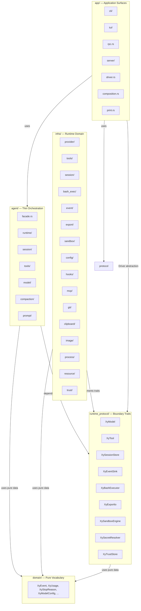
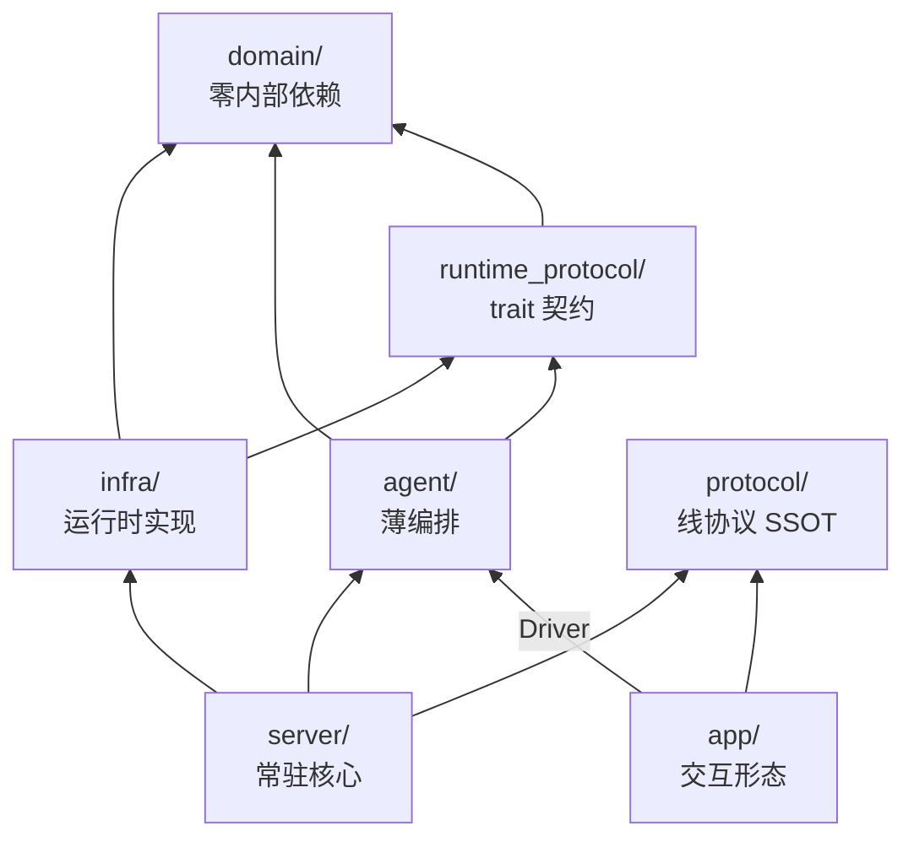
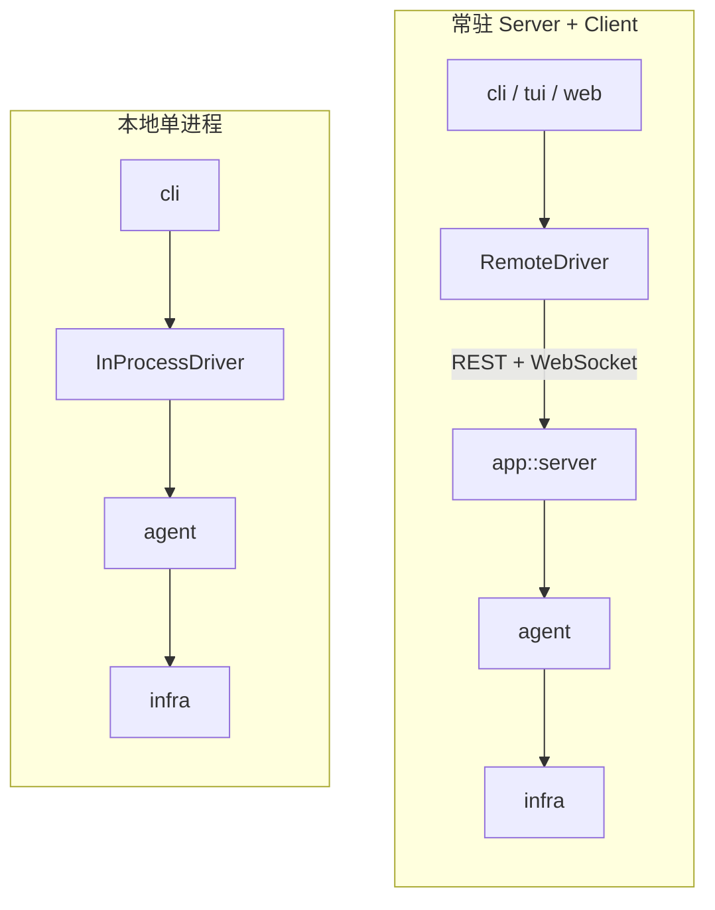
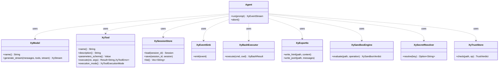
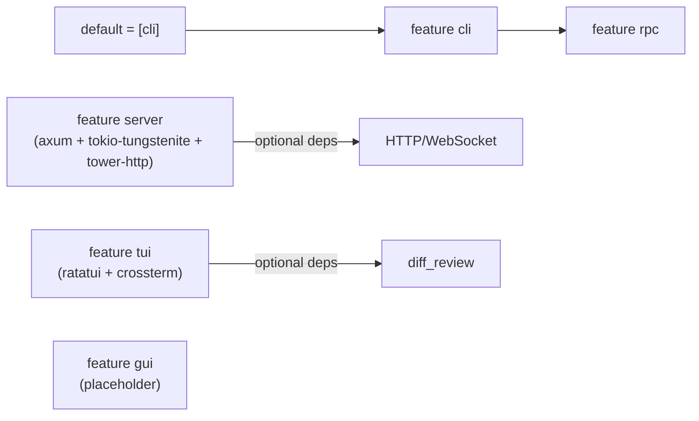

# xylitol 架构文档

> 本文档描述 `xylitol` 的静态代码结构、分层原则、依赖方向与关键交互流程。
> 生成日期：2026-06-29。

---

## 1. 项目本质

`xylitol` 是一个 **LLM 增强型开发工具包**，其本质可以概括为：

> 为各服务商的 model 装配一系列运行时（runtime），用最小编排循环（agent）+ hook 驱动它们。

所有设计服从这一句话：

- `infra/` 负责“为 model 提供运行时能力”（provider、tool、session、exec-env 等）。
- `agent/` 负责“薄编排”——ReAct 循环、hook 切入面、编排状态。
- `app/` 负责“交互形态”——cli / tui / rpc / server 等可替换的表面。
- `protocol/` 负责“统一交互契约”——命令 + 事件 + 信封，本地与远程共用同一套线协议。

---

## 2. 分层架构

### 2.1 五层结构



### 2.2 依赖方向（严格单向）



> **硬规则**：箭头不可反向。
> - `infra/` 不依赖 `agent/`。
> - `agent/` 生产代码不直接 import `infra/` 具体类型。
> - `app/`（除 composition root / driver / 文档 seams 外）不依赖 `agent/` 或 `infra/`。

---

## 3. 各层职责

| 模块 | 一句话职责 | 内部主要子模块 |
|---|---|---|
| `domain/` | 纯领域词汇、错误、serde 类型。零 crate 内部依赖。 | `error`, `message`, `model`, `session_types`, `resource_types`, `types`, `lifecycle`, ... |
| `runtime_protocol/` | agent↔infra 边界 trait（port）+ 签名-only 类型。 | `XyModel`, `XyTool`, `XySessionStore`, `XyEventSink`, `XyBashExecutor`, `XyExportIo`, `XySandboxEngine`, `XySecretResolver`, `XyTrustStore`, `XyResourceLoader` |
| `infra/` | **运行时域**：为 model 提供的全部能力实现。 | `provider/`, `tools/`, `session/`, `sandbox/`, `bash_exec/`, `event/`, `export/`, `config/`, `hooks/`, `mcp/`, `git/`, `clipboard/`, `image/`, `process/`, `resource/`, `trust/` |
| `agent/` | **薄编排**：ReAct 循环 + facade + 注册表 + 压缩 + prompt。 | `facade.rs`, `runtime/`, `session/`, `tools/`, `model/`, `compaction/`, `prompt/` |
| `protocol/` | 客户端↔核心统一交互契约（SSOT）。 | `Command`, `Event`, `Envelope`, `ErrorCode` |
| `app/` | **应用表面**：客户端与入口点。 | `cli/`, `tui/`, `server/`, `rpc.rs`, `composition.rs`, `driver.rs`, `print.rs` |
| `tests/` | 集成与行为测试、BDD feature、快照、回归。 | `features/`, `support/`, `snapshots/`, `regression/` |

---

## 4. 关键交互流程

### 4.1 一次 Prompt 的完整数据流

```mermaid
sequenceDiagram
    autonumber
    participant CLI as app::cli
    participant Driver as app::driver::InProcessDriver
    participant Facade as agent::facade::Agent
    participant Loop as agent::runtime::AgentLoop
    participant Session as agent::session::AgentSession
    participant Model as infra::provider::XyModel impl
    participant Tool as infra::tools::XyTool impl
    participant Store as infra::session::XySessionStore impl
    participant Sink as infra::event::XyEventSink impl

    CLI->>Driver: run(prompt)
    Driver->>Facade: run(prompt)
    Facade->>Loop: run(prompt, session_id)
    Loop->>Session: load/store messages
    Session->>Store: XySessionStore::load/save
    Loop->>Model: generate_stream(messages, tools)
    Model-->>Loop: XyStream chunks
    Loop-->>Facade: XyEventStream
    Facade-->>Driver: EventStream
    Driver-->>CLI: EventStream

    alt LLM requests tool call
        Loop->>Tool: execute(ctx, args)
        Tool-->>Loop: result
        Loop->>Session: append tool result
        Session->>Store: save
        Loop->>Model: generate_stream(updated messages)
    end

    Loop->>Sink: emit lifecycle / stream events
    Loop-->>CLI: XyEvent::AgentEnd
```

### 4.2 本地单进程 vs Server + Client 部署



> 关键不变量：两种形态下 `app/` 中交互代码**完全相同**，只认 `protocol` + `Driver`；本地/远程切换只是换 Driver 实现。

---

## 5. 关键端口（Ports）类图



---

## 6. 架构约束（HC-1 … HC-6）

| 约束 | 内容 | 验证位置 |
|---|---|---|
| **HC-1 层方向不可逆** | `domain` 零内部依赖；`infra` 不依赖 `agent`；`agent` 不直接 import `infra` 具体类型；`app` 只依赖 `protocol` + `Driver` | `src/tests.rs::arch_guard` |
| **HC-2 agent 可独立使用** | `Agent::with_ports` 不强制 Session、不持有 session_id、不依赖 Session 生命周期 | `agent::facade::Agent::with_ports` |
| **HC-3 交互必经 protocol** | 所有 client↔核心交互走 `protocol/`；线类型在 protocol 定义 | `protocol/command.rs`, `protocol/event.rs` |
| **HC-4 开闭原则** | 新增 provider/tool/后端/交互形态 = 新文件 impl port / Driver，零改既有编排 | 设计原则 |
| **HC-5 trait 只在真接缝** | trait 立项需 ≥2 实现或承重解耦；单实现内联 | 设计原则 |
| **HC-6 NOTE 标注** | 有意简化用 `// NOTE: <做了什么>. 天花板: <>. 升级: <>.` | 代码注释约定 |

---

## 7. 目录结构速览

```text
src/
├── agent/           # 薄编排层
│   ├── facade.rs    # 对外唯一入口 Agent
│   ├── runtime/     # ReAct 循环、事件、hook、队列、重试
│   ├── session/     # 会话状态与 I/O
│   ├── tools/       # XyToolDefinition, ToolRegistry
│   ├── model/       # ModelRegistry / manager / resolver
│   ├── compaction/  # 上下文压缩
│   └── prompt/      # system / commands / templates / skills
├── infra/           # 运行时域
│   ├── provider/    # LLM 适配器（OpenAI / Anthropic / fake / mock）
│   ├── tools/       # 内置工具实现
│   ├── session/     # XySessionStore 实现
│   ├── bash_exec/   # XyBashExecutor 实现
│   ├── event/       # XyEventSink 实现
│   ├── export/      # XyExportIo 实现
│   ├── sandbox/     # XySandboxEngine 实现
│   ├── config/      # 配置加载与 secret 解析
│   ├── hooks/       # hook 分发
│   ├── mcp/         # MCP 适配
│   ├── git/         # Git 操作
│   ├── clipboard/   # 剪贴板
│   ├── image/       # 图片处理
│   ├── process/     # 进程管理
│   ├── resource/    # 资源加载
│   ├── trust/       # 信任存储
│   └── ...
├── runtime_protocol/# agent↔infra 边界 trait（全部 Xy 前缀）
├── protocol/        # client↔core 线协议（Command/Event/Envelope）
├── domain/          # 纯领域词汇 + 错误 + serde 类型
├── app/             # 应用表面
│   ├── cli/         # CLI composition root
│   ├── server/      # HTTP/WebSocket 常驻核心
│   ├── tui/         # 终端 UI
│   ├── rpc.rs       # stdio RPC transport
│   ├── composition.rs# 共享 Agent 装配
│   ├── driver.rs    # Driver trait + InProcessDriver + RemoteDriver
│   └── print.rs     # 事件渲染
├── lib.rs
├── main.rs
└── tests.rs         # 架构守卫 arch_guard

tests/
├── features/        # BDD Gherkin 场景
├── support/         # 测试共享基础设施
├── snapshots/       # insta 快照
├── regression/      # 回归测试
└── bdd.rs           # BDD 测试入口
```

---

## 8. Feature Flag 矩阵



---

## 9. 构建与测试

```bash
# 格式化
just fmt

# Lint
just lint

# 测试
just test

# 完整 QA
just qa / just ci

# 本地运行 CLI
cargo run -- --help

# 构建文档
cargo doc --no-deps --all-features
```

---

## 10. 参考

- `AGENTS.md` — 项目级开发与提交规范
- `llmanspec/changes/archive/2026-06-29-c285-refactor-domain-runtime-protocol-boundary/design.md` — c285 架构重构设计原文
- `src/tests.rs` — 架构守卫（arch_guard）实现
- `Cargo.toml` — feature 与依赖声明

---

*本文档中的 Mermaid 图表遵循 Mermaid v11.12.1 语法。*
