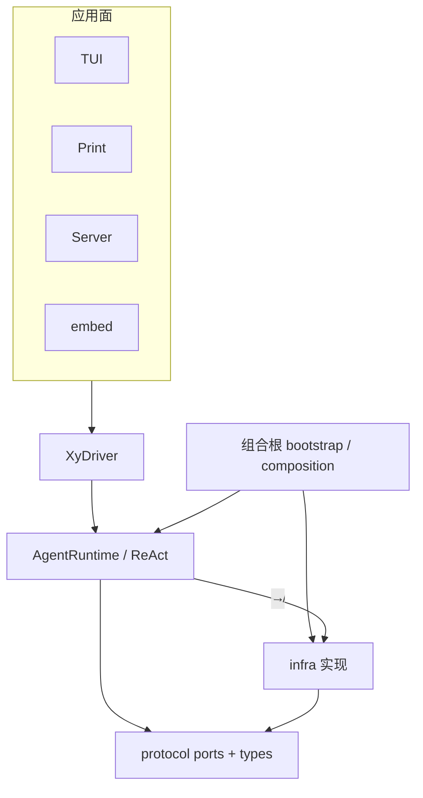
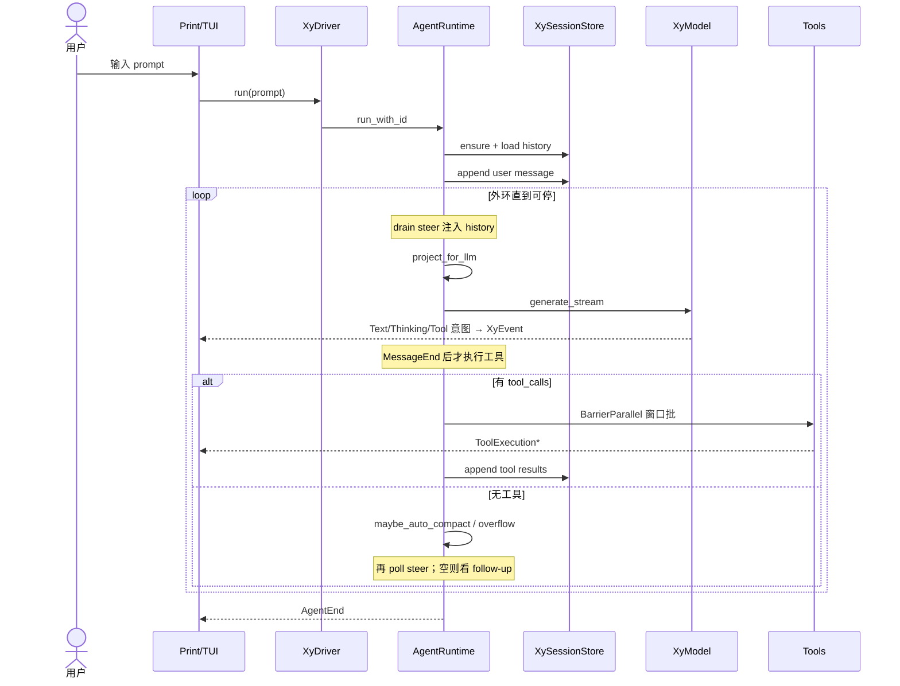

> TEMP / 非规范。人生回顾临时构件。勿升格 AGENTS / architecture / llmanspec。
> 过期可删。生成：codebase-life-review · 2026-07-30 · 范围：整仓鸟瞰 + Vein A（一轮对话主循环）· 地图级 · 学习向 onboarding

# Life Review · onboarding

学习入口（产品心智，不钉实现）：

- [产品分层总览](../docs/architecture/产品分层总览.md)
- [库与多客户端](../docs/architecture/库与多客户端.md)
- [一轮对话](../docs/architecture/一轮对话.md)
- [插话续跑与中止](../docs/architecture/插话续跑与中止.md)
- [用户可见事件](../docs/architecture/用户可见事件.md)
- 代码分层 SSOT：[src/AGENTS.md](../src/AGENTS.md)

---

## Macro

### 定调（仍成立）

| 是 | 不是 |
|---|---|
| 个人默认就能用的 coding harness | 扩展市场 / Extension 平台 |
| Print + TUI 走同一驱动主线 | 某面私自改 ReAct 内部 |
| Trust 闸**项目本地资源**；工具开箱 allow-all | 每个工具弹窗审批 |
| MCP / Server **配置才装配** | 未配置也背负运行时成本 |

产品一句话：**用户说话 → 模型 →（意图收齐后）工具批 → 写回会话 → 面渲染事件**。

### 分层（代码事实）

```text
app → agent → protocol/{wire, ports, root types}
  ↓     ↑
  └──── infra ───────────────────┘
```

| 层 | 角色 | 入口 |
|---|---|---|
| [`src/protocol/`](../src/protocol/) | 共享类型、ports、`XyEvent` | 例：[lifecycle.rs](../src/protocol/lifecycle.rs)、[ports/](../src/protocol/ports/) |
| [`src/agent/`](../src/agent/) | ReAct / session / 投影 | [runtime/react.rs](../src/agent/runtime/react.rs)、[session/](../src/agent/session/) |
| [`src/infra/`](../src/infra/) | ports 实现（provider / tools / store / config） | 组合根才装配 |
| [`src/app/`](../src/app/) | 面 + [`core`](../src/app/core/) seam | [`XyDriver`](../src/app/core/driver/proto.rs) |
| [`packages/xylitol-tui/`](../packages/xylitol-tui/) | 通用 TUI 引擎 | **零引用**主 crate |
| [`packages/xylitol-ai-bridge/`](../packages/xylitol-ai-bridge/) | 厂商 HTTP/SSE 方言 | 经 infra adapter 接到 `XyModel` |

三圈契约（库入口见 [`src/lib.rs`](../src/lib.rs)）：

1. 线协议 `wire` Command / Event
2. 应用协议 **`XyDriver` + `XyEvent` 流**
3. 可替换口 `XyModel` / `XyTool` / `XySessionStore` / …



### 分层抽检

| 检查 | 结果 |
|---|---|
| 生产 `agent` → `infra` | **未见反例**（`agent` 内 `use crate::infra` 落在 `#[cfg(test)]`） |
| `infra` → `agent` | **未见反例** |
| 产品 TUI → `infra` | **未见**（经 `XyDriver`） |
| 组合根同时碰 agent+infra | **设计如此**：[bootstrap.rs](../src/app/core/bootstrap.rs)、[composition.rs](../src/app/core/composition.rs) |

### 张力点

| # | 宣称 / 理想 | 代码现状 |
|---|---|---|
| T1 | 远程薄端客户端 | 线协议 / [`XyRemoteDriver`](../src/app/core/driver/remote.rs) 预留；**独立薄端应用未接线**（文档已标 🔴） |
| T2 | `agent` ↛ `infra` | 生产遵守；**单测**可直连 `SessionManager` / `FakeProvider`（测试便利，非分层破窗） |
| T3 | turn 总线 vs 侧路 | turn UX = `XyDriver::run` 的 `EventStream`；compaction 等可走 [`XyEventSink`](../src/protocol/)（[composition 注释](../src/app/core/composition.rs)）——易混成「第二套 turn 总线」 |
| T4 | bang `!命令` | 经 `XyDriver::execute_bash`，**不走** ReAct 主循环——旁路，勿当成对话主线 |

**建议回写**（本回顾不改文档）：无强制；T3 若产品文要再强调「侧路 ≠ turn 总线」可在 [用户可见事件](../docs/architecture/用户可见事件.md) 加一句指针（可选）。

---

## Vein · 一轮对话主循环

### 三行摘要

- **用户碰到什么**：在 Print / TUI 输入一问（或 busy 时插话 / 中止）；看到文字增量、工具进度，直到本轮结束。
- **入口 seam**：面 → [`XyDriver::run`](../src/app/core/driver/proto.rs) / `steer` / `follow_up` / `abort`；进程内实现 [`XyInProcessDriver`](../src/app/core/driver/in_process.rs)。
- **成功结束在哪**：ReAct 发出 [`XyEvent::AgentEnd`](../src/protocol/lifecycle.rs)；面消费流后 idle（follow-up 非空则会再进外环）。

### 入口索引

| 角色 | 路径 · 符号 |
|---|---|
| 装配 | [bootstrap.rs](../src/app/core/bootstrap.rs) `bootstrap` → [composition.rs](../src/app/core/composition.rs) `build_agent` |
| Driver trait | [proto.rs](../src/app/core/driver/proto.rs) `XyDriver` |
| 进程内 Driver | [in_process.rs](../src/app/core/driver/in_process.rs) `XyInProcessDriver::run` → `AgentRuntime::run_with_id` |
| Print | [print.rs](../src/app/cli/print.rs) `run_print` → `driver.run` → 渲染 `XyEvent` |
| TUI 事件进 UI | [bridge/mod.rs](../src/app/tui/bridge/mod.rs) `apply_xy_event` |
| Runtime | [react.rs](../src/agent/runtime/react.rs) `AgentRuntime` / `run_react_loop` |
| 会话能力袋 | [session/mod.rs](../src/agent/session/mod.rs) `AgentCapabilities`（队列 / store / model / tools） |
| LLM 投影 | [llm_project.rs](../src/agent/llm_project.rs) `project_for_llm` |
| 工具批规划 | [tool_batch.rs](../src/agent/runtime/tool_batch.rs) `classify` / `plan_windows` |
| 工具执行 | [tool_exec.rs](../src/agent/runtime/tool_exec.rs) |
| 事件词汇 | [lifecycle.rs](../src/protocol/lifecycle.rs) `XyEvent` |
| 批模式默认 | [ports/tool.rs](../src/protocol/ports/tool.rs) `XyBatchMode::BarrierParallel`（default） |
| 配置接线 | bootstrap 读 `AppConfig.tool_batch.mode` → `BuildAgentOptions.batch_mode` |
| 合约锁 | [agent-runtime.feature](../llmanspec/specs/agent-runtime/agent-runtime.feature)（含 `@req:ar21` 意图收齐后再执行） |

### 主干时序



**主干步骤（地图级）**

1. **装配**：[`bootstrap`](../src/app/core/bootstrap.rs) 加载配置 / trust / 资源 → [`build_agent`](../src/app/core/composition.rs) 注入 ports。
2. **开跑**：面 `XyDriver::run` → [`XyInProcessDriver::run`](../src/app/core/driver/in_process.rs) → [`AgentRuntime::run_parts_with_id`](../src/agent/runtime/react.rs)。
3. **种子**：`ensure_session` + `load_conversation_history`；用户消息 `persist` 进 store。
4. **外环**：drain **steer** → 注入 → `TurnStart`。
5. **模型拍**：[`project_for_llm`](../src/agent/llm_project.rs) → `XyModel::generate_stream`；chunk 映射为 `TextDelta` / `ThinkingDelta` / 流式工具意图（**不执行**）。
6. **MessageEnd**：拼完整 assistant（含 ToolCall parts）并 persist。
7. **工具拍**（有调用时）：[`tool_batch`](../src/agent/runtime/tool_batch.rs) 切 Parallel/Barrier 窗口 → [`tool_exec`](../src/agent/runtime/tool_exec.rs)；结果写 history + store；再问模型。
8. **无工具收束**：turn-end compaction 探针 → poll steer → 否则 drain **follow-up**；仍空则 `AgentEnd`。
9. **改道**：`steer` / `follow_up` / `abort` **只经** Driver（→ Runtime 队列 / cancel token）。

### 配置与持久化要点

| 主题 | 落点 |
|---|---|
| 工具批模式 | 默认 `BarrierParallel`；配置 `tool_batch.mode` 经 bootstrap → capabilities |
| 并行提示片段 | [prompt/fragments.rs](../src/agent/prompt/fragments.rs) 按 mode 注入 system |
| 会话写入 | ReAct 内 `persist_agent_message` → `XySessionStore::append_session_entry` |
| 投影规则 | Env（bash / compaction summary 等）折叠为 LLM user 行；`is_error` assistant **不回放** |
| MCP 工具 | 名 `mcp:*` 在 classify 中**强制** Barrier（串行） |
| 取消 | 每轮新 `CancellationToken`；abort 清 steer、保留 follow-up、掐 bash / 丢弃模型流 |
| 侧路事件 | `XyEventSink`（compaction 等）≠ turn `EventStream` |

### 易迷路点

1. **意图收齐再批**：流式阶段只 `upsert_streaming_tool`；执行在 `MessageEnd` 之后（合约 `ar21`）。不要脑补「边流边把结果塞回同一次请求」。
2. **steer vs follow-up**：steer = 本轮还在跑时下一拍注入；follow-up = 本轮本要结束时再开一问。abort **清 steer、留 follow-up**。
3. **bang ≠ 对话**：`!` 走 `execute_bash`，事件模型不同。
4. **Driver 注释「唯一 import agent」**：指**应用面**不 reach；`app/core` 组合根本身就是装配处。
5. **God 文件**：`react.rs` 体量大是已知策略（见 src AGENTS「默认不为行数大拆」）；读时按 `run_parts_with_id` → `run_react_loop` → 外环/`'outer` 搜，勿整文件灌。
6. **两套「事件」**：`XyChunk`（provider 流）→ ReAct 再发 `XyEvent`（面只认后者）。

### 建议下一步

| 方向 | 何时 |
|---|---|
| 第 2 轮回顾 **C+D**（Session 树 + JSONL） | 要搞懂续跑 / fork / 磁盘 |
| 第 3 轮 **B Compact** 或 TUI host 环 | 压缩公式或键盘→effect 链 |
| `llman-sdd-arch-review` | 想加深薄模块（非本回顾范围） |
| 代码旁 merfolk / rustdoc 图 | **须另开确认**；本 skill 默认不落 |

---

## Open questions（留给人类）

1. 下一轮优先 **Session/JSONL** 还是 **Compact** 还是 **TUI host 怎么订 run**？
2. 地图级是否够用，还是要把 Vein A 加深到游记级（`run_react_loop` 关键函数级）？
3. 是否需要把本文件里的图拆成旁路 `*.mmd`？
4. 是否讨论「代码旁沉锚」（默认不做）？
