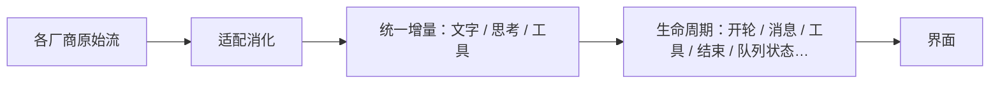

# 用户可见事件（产品视角）

> 界面只依赖「对话生命周期」语言；不学习各家模型的私有事件名。

## 产品规则

1. **生命周期是闭集**：开/停一轮、消息起止、工具起止、压缩、队列状态等——只为**跨界面有意义**的事增加种类。
2. **厂商细节不进界面词汇**：某家多了一种 SSE，默认不出现新的「界面事件种类」。
3. **未知则降级**：将来若有实验性扩展，界面忽略并记日志，不崩。

细则与禁止项 → `llmanspec/changes/c520-update-xy-event-extensibility/design.md`。
