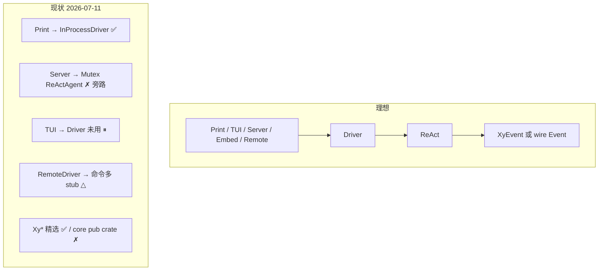

# 库嵌入与多 Client 后端

> 产品/架构心智：xylitol **内核**既可被嵌入为库，也可作为多种 client 的共享后端。
> 不写具体类型路径以外的实现细节；落地见 llmanspec（嵌入 API / Server-on-Driver / 线协议）。

## 一条主线

所有 client 应共享同一条运行时主线：

```text
装配（bootstrap / composition）
  → Driver（进程内或远程）
  → ReAct
  → XyEvent 流（进程内）/ 线协议 Event（远程）
  → 该面渲染
```

用户改道（插话 / 续跑 / 中止）只经 Driver 队列 API，不直达 ReAct 内部。

## Client 矩阵（产品）

| Client | 角色 | 期望 seam | 今日状态 |
|---|---|---|---|
| **Print** | 本地一次性对话 | `bootstrap` → `InProcessDriver` → `XyEvent` | ✅ 已走主线 |
| **Server** | 远程托管同一内核 | 同上，经 REST/WS 暴露 `Driver` 能力 | 🟡 仍直接持有 `ReActAgent` |
| **TUI** | 本地交互 | `Driver` + `dispatch(Command)` | ⏸ 冻结；Driver 传入未真正驱动 |
| **Remote client** | 连 Server 的薄端 | `RemoteDriver` ↔ 线协议 | △ `run`/`abort` 可用；多数命令 stub |
| **嵌入库** | 外部 crate 自建面 | 公开的装配 + `Driver` + `Xy*` 契约 | △ 有精选 `Xy*`；装配缝仍 `pub(crate)` |
| **GUI（未来）** | 桌面/其它 | 同 Print/TUI：只依赖 Driver | 🔴 未开 |

## 两层对外契约

| 层 | 给谁 | 内容 |
|---|---|---|
| **库契约 `Xy*`** | 替换端口、跨面事件、配置元数据 | `lib.rs` 精选 `pub use`（`XyModel` / `XyEvent` / …） |
| **应用缝** | 多 client / 嵌入方 | `bootstrap`、`Driver`、`dispatch`、（可选）线协议 `Command`/`Event` |

`Xy*` ≠ 品牌前缀；应用缝类型不必加 `Xy`（`Driver`、`BootstrapInput`）。

## 理想 vs 现状



| 缺口 | 影响 | 后续变更意向 |
|---|---|---|
| 装配缝未出库 | 外部无法正规嵌入 | 公开嵌入 API |
| Server 旁路 Driver | 双后端，远程难对称 | Server 统一到 Driver |
| 线协议丢生命周期事件 | 远程看不到队列等 | 线协议 / Remote 对齐 |
| `dispatch` 无消费方 | Command 路径纸面存在 | TUI 开闸或 Server 接线时启用 |
| 组合小债 | `agent_mut`、MCP 保活、EventBus 角色不清 | 小步清债（实现） |

## 嵌入方应依赖什么（产品规则）

1. **优先**精选 `Xy*` + 文档化的应用缝（Driver / bootstrap）。
2. **不要**把 `infra::*` 具体类型或 `agent::session::*` 当稳定 API。
3. 需要新能力时：**扩缝**，不要 reach-in。
4. 未配置的能力（如 MCP）必须 **zero-cost**（不装配则无运行时负担）。

## 与其它文档

- 产品分层总览：[overview.md](./overview.md)
- 一轮对话：[turn-flow.md](./turn-flow.md)
- 事件闭集：[events.md](./events.md)
- 插话/中止：[queue-and-interrupt.md](./queue-and-interrupt.md)
- 代码边界 SSOT：`src/AGENTS.md`
