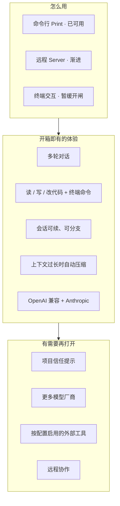

# 产品架构总览

> 我们在做什么、边界在哪。不涉及怎么写代码。

## 用户怎么碰到系统

## 产品心智：一条主线

用户说话 → 模型思考/回复 → 需要时用工具改仓库 → 结果写回会话 → 界面看到进度。

所有使用方式（Print / 将来的 TUI / Server）走**同一条主线**，只是「怎么看、怎么点」不同。

## 能力取舍（个人开箱）

| 要 | 不要 |
|---|---|
| 默认就能聊、能改代码 | 插件市场 / 扩展平台 |
| 配置了才启用的能力（如 MCP） | 未配置也背负的运行时成本 |
| 项目信任（是否加载本仓库配置） | 每个工具弹窗审批 |
| 合理分层，方便自己改 | 为「未来插件」堆抽象 |

## 与实现文档的分界

- **这里**：产品故事与流程图。
- **llmanspec + 代码**：端口名、模块路径、并发原语、测试。
