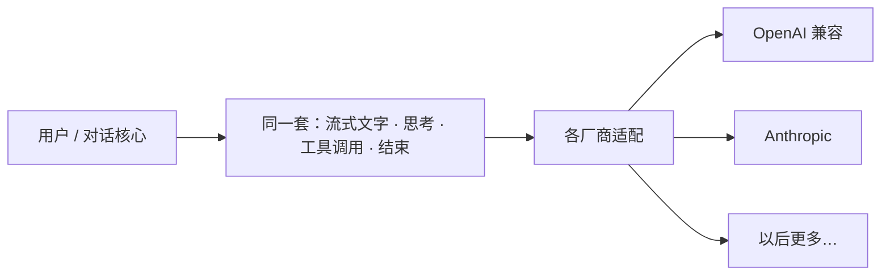

# 模型厂商（产品视角）

> 用户只感到「换了一个模型」；不应感到「换了一套事件和界面」。

## 产品规则

1. **对外一种说话方式**：流式增量、工具请求、结束原因，对界面都一样。
2. **厂商差异关在门后**：某家 API 大改，优先在适配层消化；不要让界面学会「OpenAI 专用事件」。
3. **先交付两家**：OpenAI 兼容与 Anthropic；抽象上为以后留位，但不为未交付厂商堆产品概念。

实现与装配路径 → `llmanspec/changes/c505-*`。
