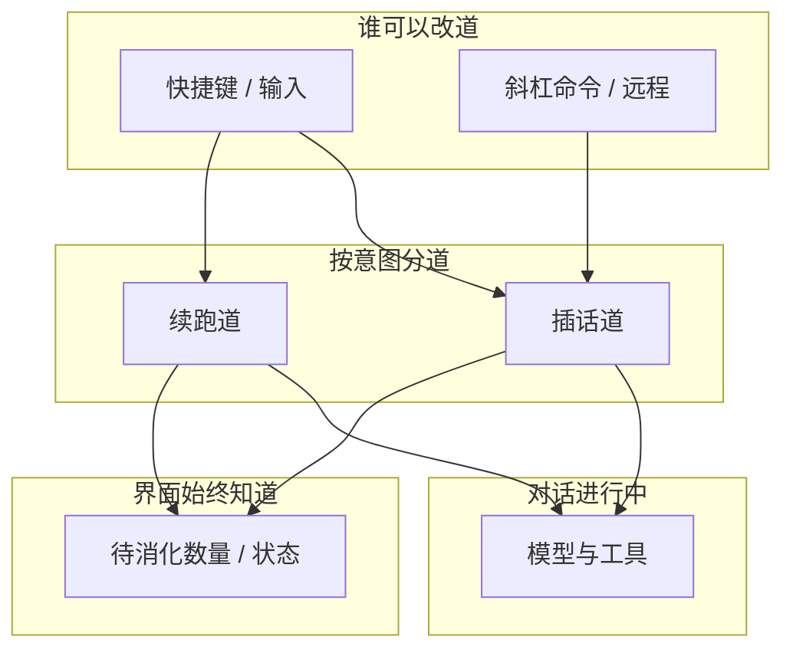

# 插话 · 续跑 · 中止（产品语义）

> 灵活改道、体验连贯、行为可预期。不写实现。

## 用户故事

| 场景 | 期望体验 |
|---|---|
| 模型还在跑，我想加一句 | **插话**进队；界面立刻能看到「还有待消化的插话」；当前工具尽量做完再听新话 |
| 这轮结束后还想追问 | **续跑**进队；本轮真正结束后自动开下一问 |
| 我后悔了 / 跑飞了 | **中止**：停手；未消化的插话丢掉；未发出的续跑回到输入框，方便改完再发 |
| 同时从快捷键和命令插话 | 都可以；顺序可预期；不要丢、不要卡死界面 |

## 业务流



```mermaid
sequenceDiagram
  actor U as 用户
  participant UI as 界面
  participant Loop as 对话中
  participant Tools as 工具

  U->>UI: 插话
  UI-->>U: 立刻看到队列状态更新
  Note over Loop,Tools: 当前工具继续
  Loop->>Loop: 下一拍消化插话
  U->>UI: 中止
  UI->>Tools: 停手
  UI->>UI: 清插话 · 续跑文案回输入框
  UI-->>U: 状态复位，可再编辑
```

## 产品原则（均衡目标）

| 目标 | 产品含义 |
|---|---|
| **灵活** | 插话 / 续跑分道；以后同类「改道」可再开道，不必另发明一套交互 |
| **体验** | 改道后界面**马上**有反馈；中止后输入框可恢复，不丢用户打的字 |
| **可预期** | 消化时机固定：插话在下一拍前；续跑在本轮彻底结束后 |
| **克制** | 不是通用后台任务系统；不做用户级「多 agent 并行产品」 |

## 已知体验坑（业务层）

若「队列变了」和「对话事件」走两条互不相通的通知路径，界面会以为没插进去——**改道状态必须和本轮进度同一条用户可见事件流**。

实现选型与运行时 → `llmanspec/changes/c525-add-async-queue-runtime/design.md`。
