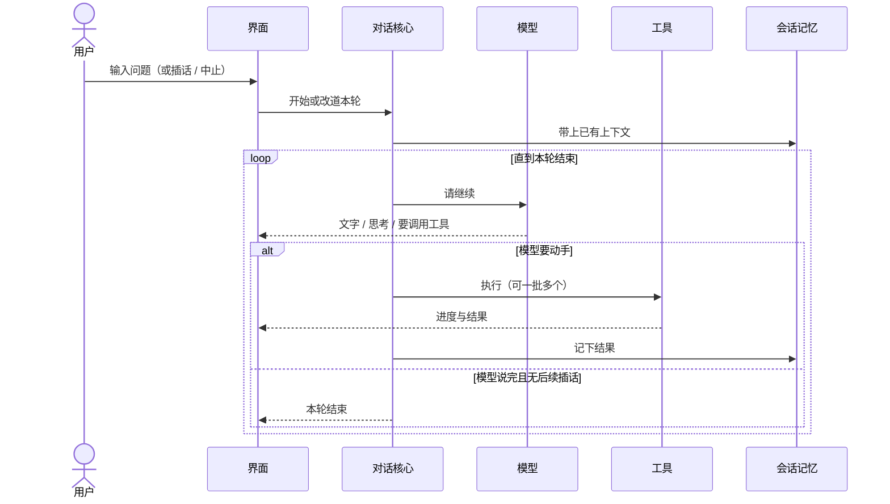

# 一轮对话（产品时序）

> 用户视角：从输入到结束发生了什么。

## 插话与中止（产品语义）

详见 [queue-and-interrupt.md](./queue-and-interrupt.md)。

- **插话（steer）**：本轮还在跑时补充指令，下一拍再听，不粗暴掐断正在做的工具（除非用户中止）。
- **续跑（follow-up）**：本轮全部结束后再开一问；中止时仍可把未发出的续跑文案还给输入框。
- **中止（abort）**：停掉进行中的工作；清掉未消化的插话；保留未发出的续跑以便恢复。
