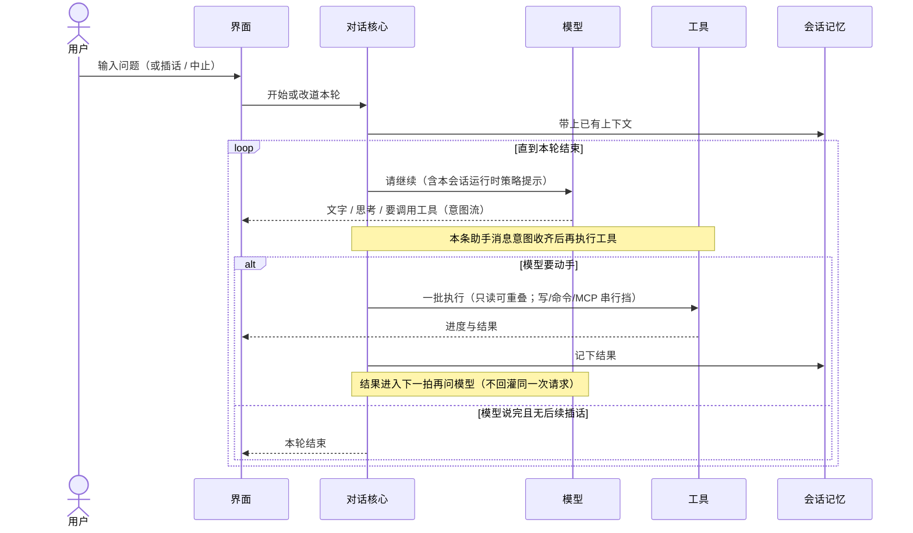

# 一轮对话

> 用户/产品视角：从输入到本轮结束发生了什么。不写实现。
> 现状对齐：2026-08-21。

## 用户怎么碰到

用户在任一界面输入问题（或插话 / 中止）。系统带上已有会话上下文，反复「问模型 → 可能调工具 → 写回记忆」，直到本轮结束或被中止。

TTY 下默认入口是产品 TUI；Print 仍可走完整主线。TUI 另有 **bang**（`!命令`）旁路执行终端命令，不替代本轮对话主线。

## 产品规则（MUST / 禁止）

| MUST | 禁止 |
|---|---|
| 所有 client 走同一条「装配 → 驱动 → 对话 → 事件 → 渲染」主线 | 某面私自绕过驱动直改对话内部 |
| **同一会话同一时刻至多一轮根对话在跑**（单飞）；界面忙碌时改道走插话/续跑/中止，不另开并行根轮 | 用户级「多 agent 并行写同一会话」；把第二次根提交伪装成插话 |
| 改道（插话 / 续跑 / 中止）经统一入口 | 界面各自发明一套打断语义 |
| 工具进度与文字增量对用户可见 | 把厂商私有流事件名暴露给界面 |
| 同一条助手消息里的多个工具调用：意图收齐后再批执行 | 把「还在流式生成」当成异步流水线、把部分结果塞回同一次模型请求 |
| 开箱引导模型：多个独立只读工具应同消息发出 | 默认要求用户手贴系统提示才能并行读 |

## 主线 vs 后置

- **主线**：一轮对话、内置工具、会话写入、压缩触发、Print、产品 TUI attach（含 bang / slash）；开箱工具批并行与运行时策略提示。
- **未收口**：长会话冷恢复等 attach 对拍（见 [远程体验与线协议.md](./远程体验与线协议.md)）。

## 插话与中止（摘要）

详见 [插话续跑与中止.md](./插话续跑与中止.md)。

- **根提交**：Idle 时开一轮；忙碌时默认**拒绝**第二次根提交（核心防御），界面应改走插话/续跑。
- **插话**：本轮还在跑时补充指令，下一拍再听；不粗暴掐断正在做的工具（除非中止）。
- **续跑**：本轮全部结束后再开一问；中止后未发出的续跑留在队列条，可用 Alt+Up 还原到编辑器。
- **中止**：停掉进行中的工作；清掉未消化的插话；保留未发出的续跑（不自动灌回输入框）。

**换模 / thinking（摘要）**：busy 时改选不打断当前流；**下一 turn** 模型调用起用新值；footer=生效中，**下轮预告**=待生效接替。详见 [运行时即时设置.md](./运行时即时设置.md)；词表 [TUI信息面与chrome词汇.md](./TUI信息面与chrome词汇.md)。

## 理想 vs 现状

| | 状态 |
|---|---|
| Print 走完整主线 | ✅ |
| TUI 默认入口 + 同一事件流 | ✅ attach 本机 Host |
| 会话绑定 + 根回合单飞（忙碌时拒绝二次根提交） | ✅ |
| Host 经同一驱动 | ✅ |
| 意图收齐后批工具 + 开箱并行读 | ✅ |

## 与其它文档

- [产品分层总览.md](./产品分层总览.md)
- [插话续跑与中止.md](./插话续跑与中止.md)
- [运行时即时设置.md](./运行时即时设置.md)
- [用户可见事件.md](./用户可见事件.md)
- [压缩与上下文.md](./压缩与上下文.md)
- [工具与权限.md](./工具与权限.md)
