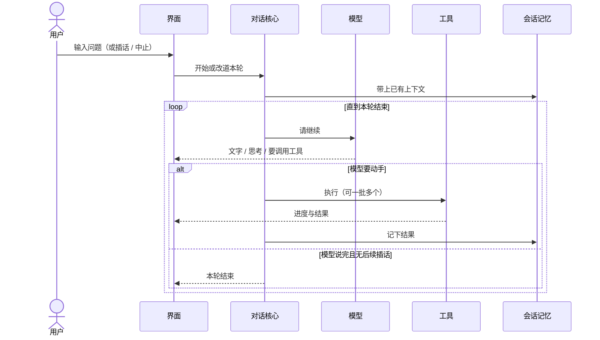

# 一轮对话

> 用户/产品视角：从输入到本轮结束发生了什么。不写实现。
> 现状对齐：2026-07-18。

## 用户怎么碰到

用户在任一界面输入问题（或插话 / 中止）。系统带上已有会话上下文，反复「问模型 → 可能调工具 → 写回记忆」，直到本轮结束或被中止。

TTY 下默认入口是产品 TUI；Print 仍可走完整主线。TUI 另有 **bang**（`!命令`）旁路执行终端命令，不替代本轮对话主线。

## 产品规则（MUST / 禁止）

| MUST | 禁止 |
|---|---|
| 所有 client 走同一条「装配 → 驱动 → 对话 → 事件 → 渲染」主线 | 某面私自绕过驱动直改对话内部 |
| 改道（插话 / 续跑 / 中止）经统一入口 | 界面各自发明一套打断语义 |
| 工具进度与文字增量对用户可见 | 把厂商私有流事件名暴露给界面 |

## 主线 vs 后置

- **主线**：一轮对话、内置工具、会话写入、压缩触发、Print、产品 TUI（含 bang / slash）。
- **后置**：独立远程薄端客户端、Web / 编排等周边（见 [roadmaps](../roadmaps/README.md)）。

## 插话与中止（摘要）

详见 [插话续跑与中止.md](./插话续跑与中止.md)。

- **插话**：本轮还在跑时补充指令，下一拍再听；不粗暴掐断正在做的工具（除非中止）。
- **续跑**：本轮全部结束后再开一问；中止时仍可把未发出的续跑文案还给输入框。
- **中止**：停掉进行中的工作；清掉未消化的插话；保留未发出的续跑以便恢复。

## 理想 vs 现状

| | 状态 |
|---|---|
| Print 走完整主线 | ✅ |
| TUI 默认入口 + 同一事件流 | ✅ |
| Server 经同一驱动 | ✅（体验 parity 见远程篇） |
| 独立远程薄端应用 | 🔴 |

## 与其它文档

- [产品分层总览.md](./产品分层总览.md)
- [插话续跑与中止.md](./插话续跑与中止.md)
- [用户可见事件.md](./用户可见事件.md)
- [压缩与上下文.md](./压缩与上下文.md)
- [工具与权限.md](./工具与权限.md)
