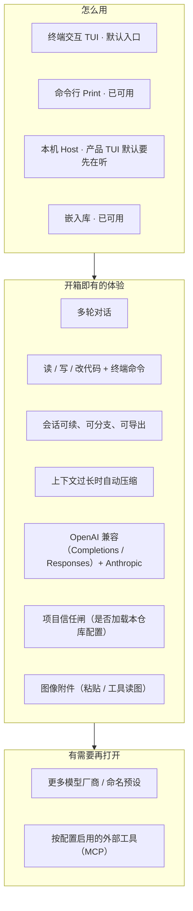

# 产品分层总览

> 用户/产品视角：我们在做什么、开箱有什么、后置什么。不写实现。
> 现状对齐：2026-08-22。

## 用户怎么碰到系统

## 产品心智：一条主线

用户说话 → 模型思考/回复 → 需要时用工具改仓库 → 结果写回会话 → 界面看到进度。

所有使用方式（Print / TUI / Host / 嵌入库）走**同一条主线**，只是「怎么看、怎么点」不同。多 client 与库嵌入矩阵见 [库与多客户端.md](./库与多客户端.md)。

## 能力取舍（个人开箱）

| 要 | 不要 |
|---|---|
| 默认就能聊、能改代码 | 插件市场 / 扩展平台 |
| 配置了才启用的能力（如 MCP） | 未配置也背负的运行时成本 |
| 项目信任（是否加载本仓库配置） | 每个工具弹窗审批 |
| 合理分层，方便自己改 | 为「未来插件」堆抽象 |

## 主线 vs 后置

| | 内容 |
|---|---|
| **主线** | 对话循环 · 内置工具 · 会话持久化 / 导出 · 压缩 · 用量 provenance · 两家模型 API · 项目 Trust · 工具侧 allow-all · 图像附件 |
| **默认入口** | 产品 TUI（TTY 下 CLI 默认 attach 本机 Host；未在听失败。Print / 嵌入仍可同进程） |
| **已开闸主路径** | TUI attach：会话 / slash / bang / `$skill` / `/reload` / `/trust` / `/model` / 工具固定区 / 队列条 / MCP 头卡（冷恢复走快照投影，已闭合） |
| **后置 / 配置启用** | MCP（有配置才装配）· 更多厂商 |

## 与实现文档的分界

- **这里**：产品故事与流程图。
- **代码架构 SSOT**：`src/AGENTS.md`。
- **行为合约 / 变更**：`llmanspec/`。

## 与其它文档

- [库与多客户端.md](./库与多客户端.md) — 多 client 怎么共享体验
- [一轮对话.md](./一轮对话.md) — 用户一轮怎么走
- [终端交互底座.md](./终端交互底座.md) — TUI 引擎可预期性
- [信任与项目闸.md](./信任与项目闸.md) — Trust 产品规则
- [扩展能力-MCP.md](./扩展能力-MCP.md) — MCP 开箱边界
- [扩展与开闭.md](./扩展与开闭.md) — 可插拔心智（非插件市场）与后置接缝
- [运行时即时设置.md](./运行时即时设置.md) — 会话内换模 / thinking
- [压缩与上下文.md](./压缩与上下文.md) — 压缩与用量
- [进程内观测.md](./进程内观测.md) — 排障对照底座
