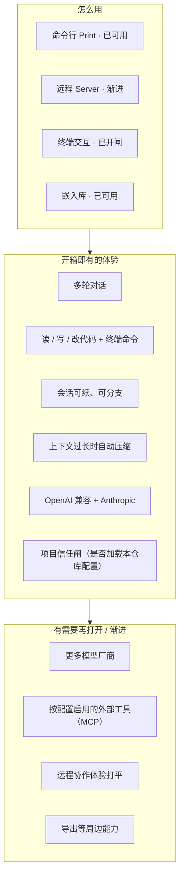

# 产品分层总览

> 用户/产品视角：我们在做什么、开箱有什么、后置什么。不写实现。
> 现状对齐：2026-07-11。

## 用户怎么碰到系统

## 产品心智：一条主线

用户说话 → 模型思考/回复 → 需要时用工具改仓库 → 结果写回会话 → 界面看到进度。

所有使用方式（Print / TUI / Server / 嵌入库）走**同一条主线**，只是「怎么看、怎么点」不同。多 client 与库嵌入矩阵见 [库与多客户端.md](./库与多客户端.md)。

## 能力取舍（个人开箱）

| 要 | 不要 |
|---|---|
| 默认就能聊、能改代码 | 插件市场 / 扩展平台 |
| 配置了才启用的能力（如 MCP） | 未配置也背负的运行时成本 |
| 项目信任（是否加载本仓库配置） | 每个工具弹窗审批 |
| 合理分层，方便自己改 | 为「未来插件」堆抽象 |

## 主线 vs 后置

| | 内容 |
|---|---|
| **主线** | 对话循环 · 内置工具 · 会话持久化 · 压缩 · Print · 两家模型 API · 项目 Trust · 工具侧 allow-all |
| **后置 / 配置启用** | Server · MCP · 更多厂商 · 导出等周边；未配置则不装配 |
| **开闸但未打通** | 产品 TUI（已开闸；与 Driver 的桥接仍渐进） |

## 与实现文档的分界

- **这里**：产品故事与流程图。
- **代码架构 SSOT**：`src/AGENTS.md`。
- **行为合约 / 变更**：`llmanspec/`。

## 与其它文档

- [库与多客户端.md](./库与多客户端.md) — 多 client 怎么共享体验
- [一轮对话.md](./一轮对话.md) — 用户一轮怎么走
- [信任与项目闸.md](./信任与项目闸.md) — Trust 产品规则
- [扩展能力-MCP.md](./扩展能力-MCP.md) — MCP 开箱边界
