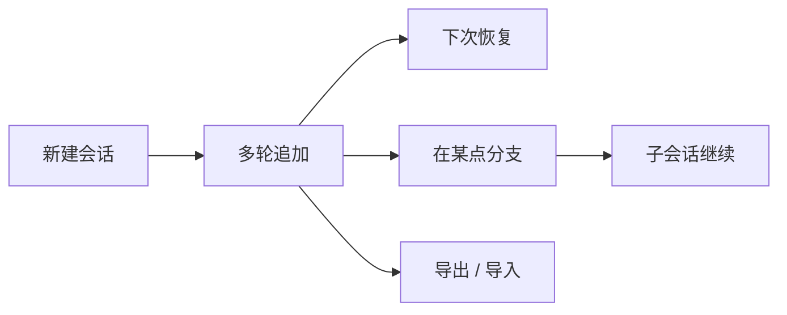

# 会话与持久化

> 用户/产品视角：对话怎么续、怎么分支、怎么带走。不写文件格式与 API。
> 现状对齐：2026-07-18。

## 用户怎么碰到

- **续跑 / 恢复**：下次启动可选已有会话，接着聊。
- **分支（fork）**：从历史某一点开出子会话；旧路径保留，新路径可改写后再问。
- **切换**：在多个会话之间切换当前工作上下文。
- **导出 / 导入**：把会话带走或迁入（产品命令：`/session-export` / `/session-import`）。
- **工作目录校验**：恢复会话时，若记录的项目目录已不存在，应给出可行动的错误，而不是静默坏掉。

## 产品规则（MUST / 禁止）

| MUST | 禁止 |
|---|---|
| 会话可创建、追加、加载、列出；多轮结果可持久 | 把会话当成仅内存草稿且无法恢复 |
| fork 在切点复制历史并留下分支摘要线索 | fork 后丢掉父会话或让用户无法理解「跳过了什么」 |
| 父/子会话关系可导航（会话树心智） | 用 Codex 式整页 Transcript 作为历史主 UX（产品已决议走会话树） |
| 恢复时校验工作目录可用性 | 目录消失仍假装一切正常 |
| 导出 / 导入有明确产品命令面 | 依赖已废弃的短名当作主路径 |

## 主线 vs 后置

| | 内容 |
|---|---|
| **主线** | 持久化 · 恢复 · fork / 分支 · 会话树 travel · 导出/导入 · 与对话循环一体 |
| **后置** | 快照 spawn 等高级运维（底层可有、产品命令面未开） |

## 理想 vs 现状

| | 状态 |
|---|---|
| 会话持久化与 fork 合约 | ✅ |
| Print / CLI 恢复路径 | ✅ |
| TUI 会话树 travel / fork / resume / export·import | ✅ |
| 快照 spawn 产品命令面 | 🔴 后置 |

行为合约指针：`llmanspec/specs/agent-session-store/`；刻意差异见 `src/app/tui/PI_DELTAS.md`。

## 与其它文档

- [一轮对话.md](./一轮对话.md)
- [压缩与上下文.md](./压缩与上下文.md)
- [库与多客户端.md](./库与多客户端.md)
- [远程体验与线协议.md](./远程体验与线协议.md)
