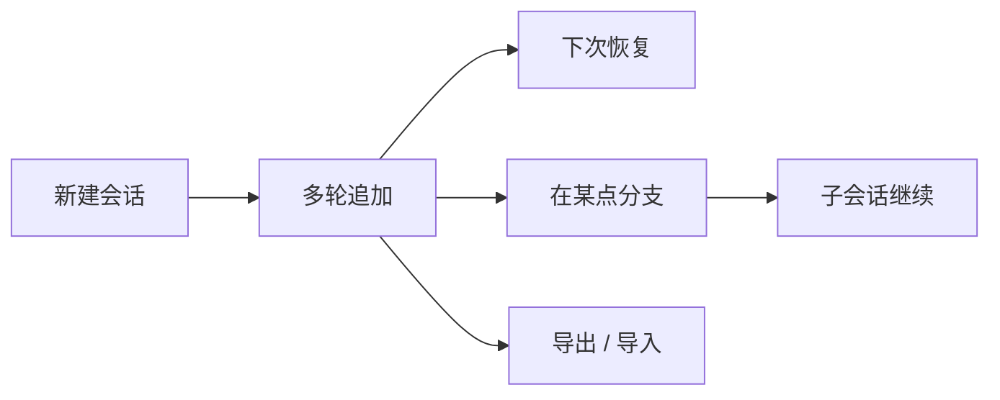

# 会话与持久化

> 用户/产品视角：对话怎么续、怎么分支、怎么带走。不写文件格式与 API。
> 现状对齐：2026-08-17。

## 用户怎么碰到

- **续跑 / 恢复**：下次启动可选已有会话，接着聊。
- **分支（fork）**：从历史某一点开出子会话；旧路径保留，新路径可改写后再问。
- **切换**：在多个会话之间切换当前工作上下文。
- **导出 / 导入**：把会话带走或迁入（产品命令：`/session-export` / `/session-import`）。
- **工作目录校验**：恢复会话时，若记录的项目目录已不存在，应给出可行动的错误，而不是静默坏掉。

## 产品规则（MUST / 禁止）

| MUST | 禁止 |
|---|---|
| 会话可创建、追加、加载、列出；多轮结果可持久 | 把会话当成仅内存草稿且无法恢复 |
| fork 在切点复制历史并留下分支摘要线索 | fork 后丢掉父会话或让用户无法理解「跳过了什么」 |
| 父/子会话关系可导航（会话树心智） | 用 Codex 式整页 Transcript 作为历史主 UX（产品已决议走会话树） |
| 恢复时校验工作目录可用性 | 目录消失仍假装一切正常 |
| 导出 / 导入有明确产品命令面 | 依赖已废弃的短名当作主路径 |

## 主线 vs 后置

| | 内容 |
|---|---|
| **主线** | 持久化 · 恢复 · fork / 分支 · 会话树 travel · 导出/导入 · 与对话循环一体 |
| **后置** | 快照 spawn 等高级运维（底层可有、产品命令面未开） |

## 理想 vs 现状

| | 状态 |
|---|---|
| 会话持久化与 fork 合约 | ✅ |
| Print / CLI 恢复路径 | ✅ |
| TUI 会话树 travel / fork / resume / export·import | ✅ |
| 快照 spawn 产品命令面 | 🔴 后置 |

行为合约指针：`llmanspec/specs/agent-session-store/`；刻意差异见 `src/app/tui/PI_DELTAS.md`。

## 盘面格式与数据卫生

> 盘面（session JSONL）是「存储层 SSOT」，与产品功能正交：用户感知不到格式版本，但格式决定旧数据能否继续使用。

### 一句话

会话写盘满足**崩溃原子性**（crash-atomic）：进程任何时候被杀，盘上文件要么是旧完整内容、要么是新完整内容，绝不出现截断或半行混合。会话以**单进程单写者**为并发假设（同一会话至多一个进程写入，不提供跨进程文件锁）。

### 写入安全（c2250）

- 全量重写（deferred flush / flush merge / header repair）一律走 **temp 写入 + fsync + rename 原子替换**，失败清理 `*.tmp`；崩溃窗口内既有文件不可能被截断。
- 模型切换 / 思考级别变更的落盘从 fire-and-forget 改为 **await 后顺序写**：`/model`、`/thinking` 后立即退出也能恢复出正确状态，且变更行一定排在后续消息之前。
- 落盘失败不再静默吞掉：进入日志（`xylitol::session` warn）。

带来的用户可见行为：

| 之前 | 现在 |
|---|---|
| 崩溃可能留下半截或坏掉的会话文件 | 崩溃后文件要么旧要么新，绝不会坏 |
| `/model` 后立刻退出，恢复时模型/思考级别可能是旧的 | 变更已落盘，恢复一致 |
| 磁盘满/权限错误时写入失败无声无息 | 日志可见，便于诊断 |

### 盘面 v6 时间戳（c2260）

- 会话 header 与条目壳的 `timestamp` 统一为 **u64 unix 毫秒**，与消息内时间戳同基准；人类可读时间只在**展示边**格式化为 RFC3339（HTML 导出等）。
- 删除全部 serde snake alias（`exit_code`、`tool_use_id`、`cache_read` 等 20 处）——盘面只认一套 camelCase 拼写，不提供「读旧格式」的兼容后门。

### 旧数据如何处理（重要）

**盘面格式 v6 是破坏性升级**：旧 v5 会话文件（及更早）不再可读，也不会再出现在任何入口：

| 入口 | 行为 |
|---|---|
| `session list` / TUI resume 面板 | 旧版本文件被跳过，不显示（s21 用它容错：坏/旧文件仅跳过，不影响其它会话列出） |
| 恢复 / 续跑 | `require 6` 可操作错误，明确告知需要新版本，不静默迁移 |
| 导入 `/session-import` | 旧版本文件在版本校验处被拒，不导入 |

需要留存旧会话时：升级前用 `/session-export` 导出 JSONL 留档（导出内容与盘面同构，未来可作迁移源）。

版本史：v3（无树）→ v4（树 + id/parentId，蛇形/裸 AgentPart 时代）→ v5（camelCase 壳 + 标注 AgentPart）→ **v6（unix-ms 时间戳 + 零 alias）**。

## 与其它文档

- [一轮对话.md](./一轮对话.md)
- [压缩与上下文.md](./压缩与上下文.md)
- [库与多客户端.md](./库与多客户端.md)
- [远程体验与线协议.md](./远程体验与线协议.md)
