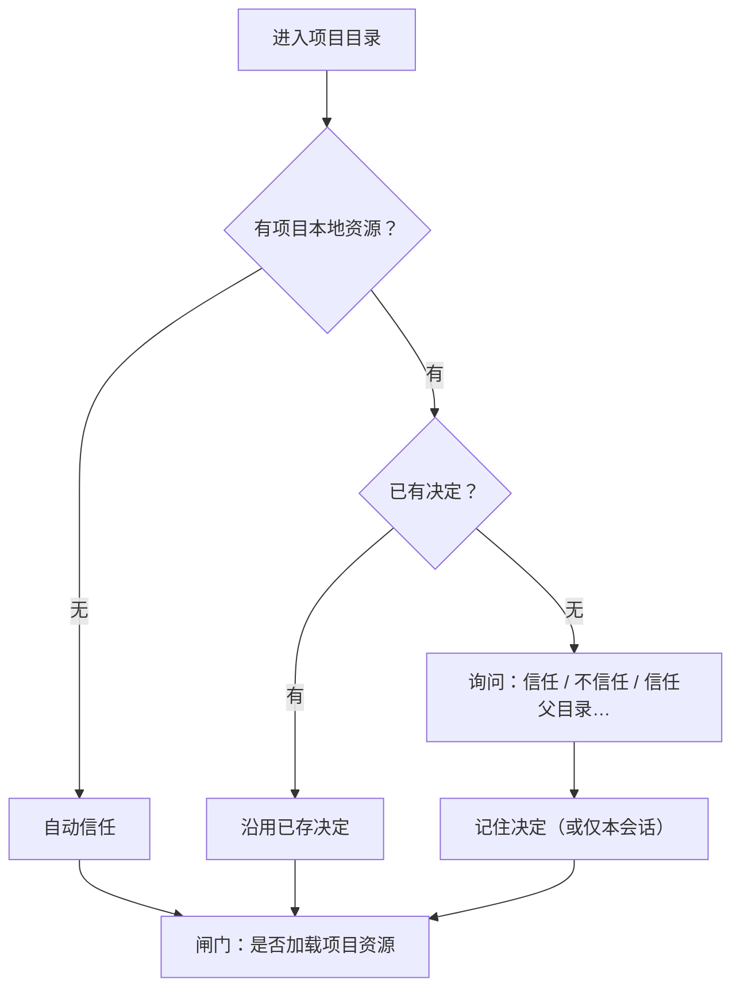

# 信任与项目闸

> 用户/产品视角：本仓库的本地配置能不能加载。不写存储格式与解析管线。
> 现状对齐：2026-07-16。

## 用户怎么碰到

第一次在某个项目目录跑 xylitol，若目录里有「需要信任才加载」的本地资源（项目配置、prompts、skills、themes、追加 system 等），系统会问：**是否信任此项目文件夹？**

- **信任**：加载项目侧资源，行为可被本仓库定制。
- **不信任**：忽略项目侧配置，只用用户/全局侧；工具仍可按开箱策略工作。
- **无本地信任输入**：可自动视为信任（不必每次打扰）。
- **命令行覆盖**：可强制信任 / 不信任，跳过提问。

## 产品规则（MUST / 禁止）

| MUST | 禁止 |
|---|---|
| Trust **只闸项目本地资源是否加载** | 把 Trust 做成「每个工具弹窗审批」平台 |
| 未信任则忽略项目侧 settings / prompts / skills / themes / append system 等 | 未信任仍静默执行项目侧注入 |
| 决定可持久化；支持父目录继承与「仅本会话」选项 | 与工具权限 popup 混为一谈 |
| 工具侧开箱 **allow-all**（见 [工具与权限.md](./工具与权限.md)） | 用 Trust 对话框代替权限产品 |

## 主线 vs 后置

| | 内容 |
|---|---|
| **主线** | 项目信任闸 + 首次提示 + 持久化决定 |
| **后置 / 可选** | 更细的权限策略（GlobPolicy 等）——不是默认交互路径 |

## 理想 vs 现状

| | 状态 |
|---|---|
| 信任解析与持久化 | ✅ 已落地 |
| CLI 首次提示 | ✅ 合约存在（见 cli-entry spec） |
| TUI 信任 UX | 🟢 启动 ChoicePrompt 已有；`/trust` slash → draft `c1105` |

代码边界指针：`src/AGENTS.md`（Trust / Permission / MCP）。

## 与其它文档

- [产品分层总览.md](./产品分层总览.md)
- [工具与权限.md](./工具与权限.md)
- [配置与档案.md](./配置与档案.md)
- [扩展能力-MCP.md](./扩展能力-MCP.md)
