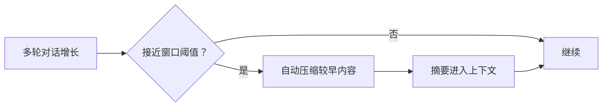

# 压缩与上下文

> 用户/产品视角：聊太长时系统如何保住可用上下文。不写算法与阈值公式。
> 现状对齐：2026-07-11。

## 用户怎么碰到

对话变长、接近模型上下文窗口时，系统**自动压缩**较早轮次：用摘要替换细账，继续聊而不必用户手动「清空重来」。

界面可感知「正在压缩 / 压缩完成」（生命周期事件），而不必理解内部怎么切条目。

## 产品规则（MUST / 禁止）

| MUST | 禁止 |
|---|---|
| 超过配置阈值时自动压缩 | 默默撑爆上下文导致含糊失败且无压缩路径 |
| 压缩对用户是可感知的生命周期（可展示进度） | 把压缩做成厂商私有事件名 |
| 阈值等可配置（见配置篇） | 要求用户每次手动挑选删除哪些消息才继续 |

## 主线 vs 后置

| | 内容 |
|---|---|
| **主线** | 自动压缩 · 与会话持久化一体 · 事件可观察 |
| **后置 / 渐进** | TUI 压缩重试等专用 UX；远程对压缩事件的展示打磨 |

## 理想 vs 现状

| | 状态 |
|---|---|
| 阈值触发自动压缩 | ✅ 主线合约（常见叙述：约 75% 窗口） |
| 压缩进用户可见生命周期 | ✅ 事件闭集包含压缩 |
| TUI 压缩重试 UI | 🟢 Track B 意向，非本波 |

指针：会话规格中的 compaction 要求；事件见 [用户可见事件.md](./用户可见事件.md)。

## 与其它文档

- [一轮对话.md](./一轮对话.md)
- [会话与持久化.md](./会话与持久化.md)
- [配置与档案.md](./配置与档案.md)
- [用户可见事件.md](./用户可见事件.md)
