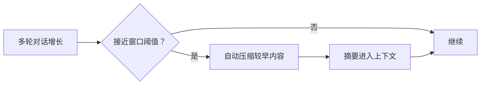

# 压缩与上下文 · 用量 provenance

> 用户/产品视角：聊太长时如何保住可用上下文；用量数字从哪来。不写算法与词表格式。
> 现状对齐：2026-07-20。

## 用户怎么碰到

对话变长、接近模型上下文窗口时，系统**自动压缩**较早轮次：用摘要替换细账，继续聊而不必用户手动「清空重来」。

界面可感知「正在压缩 / 压缩完成」（生命周期事件），而不必理解内部怎么切条目。

Footer / 用量提示应诚实标明数字**从哪来**（接口返回 / 远端计数 / 本地词表 / 启发式 / 未知），不把启发式伪装成官方用量。

需要更准的本地词表时：**配置** `tokenizers:` / `models.*.tokenizer`，并经 **CLI** `xylitol tokenizer download` 显式同意拉取（可用 `HF_ENDPOINT` 镜像）。估计路径**不**静默联网；未就绪则降级计量并诚实标注。

本地精确计数默认**关闭**：`token_estimate.local_tokenizer: off`（仅 `on`|`off`）。开 `on` 后估计才走 LocalTokenizer 档。

排障时：`provider-trace.jsonl` 会出现 `token.estimate` span（属性 `backend`/`provenance` = Api|RemoteCount|LocalTokenizer|Heuristic）；`xylitol.log` 在 debug 下有 `xylitol::token_estimate` 行。窄读仍走 `just obs-*`。

**Footer 与 auto-compact 阈值同源**：都走 `estimate_from_session_entries`（Api → RemoteCount → LocalTokenizer → Heuristic）。流式回合结束时 ReAct **落盘** `Done.usage`，否则 Api 锚点不可用。切点 / `tokens_before` 仍可用 entry 级 heuristic（与阈值尺子可并存）。

**TUI 不做词表下载确认 UI**——会话面只消费 provenance；下载与清理留在配置 + CLI（个人 coding harness 开箱路径）。

## 产品规则（MUST / 禁止）

| MUST | 禁止 |
|---|---|
| 超过配置阈值时自动压缩 | 默默撑爆上下文导致含糊失败且无压缩路径 |
| 压缩对用户是可感知的生命周期（可展示进度） | 把压缩做成厂商私有事件名 |
| 阈值等可配置（见配置篇）；**默认约 80% 窗口** | 要求用户每次手动挑选删除哪些消息才继续 |
| 用量来源可区分（精确 / 约 / 未知等叙事） | 把启发式标成「官方用量」 |
| 未配置 / 未缓存本地词表时优雅降级 | 无词表就崩溃或伪造 Api 返回 |
| 词表下载仅配置声明或 CLI 显式同意 | 估计热路径静默拉大文件；TUI 内强塞下载确认墙 |
| LocalTokenizer 仅显式 `on`（默认 `off`） | 默认每轮 HF encode；every-N / idle 策略 |
| auto-compact 阈值与 footer 同一估计入口 | 阈值另算独立 `len/4` 总和 |

## 主线 vs 后置

| | 内容 |
|---|---|
| **主线** | 自动压缩 · 诚实 provenance · **配置 + CLI 词表**（status / download / clean） |
| **后置** | 远程对压缩事件的展示打磨；Web 控制台若开则可管理缓存（非 TUI 职责） |

## 理想 vs 现状

| | 状态 |
|---|---|
| 阈值触发自动压缩（默认约 80%） | ✅ |
| 压缩进用户可见生命周期 | ✅ |
| TUI 压缩状态与重试 | ✅；远程展示打磨仍后置 |
| Footer / 用量 provenance 诚实标注 | ✅ |
| Footer ↔ auto-compact 阈值同源估计 | ✅（c1420） |
| 流式 `Done.usage` 落盘（Api 锚点） | ✅（c1420） |
| `token_estimate.local_tokenizer` 默认 off | ✅（c1420） |
| 词表：配置映射 + CLI 同意流（含 HF 镜像基址） | ✅ |
| TUI 内下载确认 | ❌ 不做（配置化；见上） |
| Web 管理词表缓存 | 🔴 可选后置（控制台面） |

## 与其它文档

- [一轮对话.md](./一轮对话.md)
- [会话与持久化.md](./会话与持久化.md)
- [配置与档案.md](./配置与档案.md)
- [用户可见事件.md](./用户可见事件.md)
- Web 控制台候补：[../roadmaps/Cloud-Agent与Web控制台.md](../roadmaps/Cloud-Agent与Web控制台.md)
