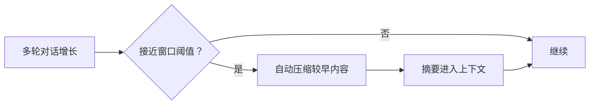

# 压缩与上下文 · 用量 provenance

> 用户/产品视角：聊太长时如何保住可用上下文；用量数字从哪来。不写算法与词表格式。
> 现状对齐：2026-07-18。

## 用户怎么碰到

对话变长、接近模型上下文窗口时，系统**自动压缩**较早轮次：用摘要替换细账，继续聊而不必用户手动「清空重来」。

界面可感知「正在压缩 / 压缩完成」（生命周期事件），而不必理解内部怎么切条目。

Footer / 用量提示应诚实标明数字**从哪来**（接口返回 / 远端计数 / 本地词表 / 启发式 / 未知），不把启发式伪装成官方用量。

## 产品规则（MUST / 禁止）

| MUST | 禁止 |
|---|---|
| 超过配置阈值时自动压缩 | 默默撑爆上下文导致含糊失败且无压缩路径 |
| 压缩对用户是可感知的生命周期（可展示进度） | 把压缩做成厂商私有事件名 |
| 阈值等可配置（见配置篇）；**默认约 80% 窗口** | 要求用户每次手动挑选删除哪些消息才继续 |
| 用量来源可区分（精确 / 约 / 未知等叙事） | 把启发式标成「官方用量」 |
| 未配置本地词表时优雅降级 | 无词表就崩溃或伪造 Api 返回 |

## 主线 vs 后置

| | 内容 |
|---|---|
| **主线** | 自动压缩 · 与会话持久化一体 · 事件可观察 · 诚实 provenance 呈现 |
| **后置** | 远程对压缩事件的展示打磨；词表下载知情同意 CLI/UI；Web 管理缓存 |

## 理想 vs 现状

| | 状态 |
|---|---|
| 阈值触发自动压缩（默认约 80%） | ✅ |
| 压缩进用户可见生命周期 | ✅ |
| TUI 压缩状态与重试 | ✅；远程展示打磨仍后置 |
| Footer / 用量 provenance 诚实标注 | ✅ |
| 词表下载同意流 / CLI 管理 | 🔴 见 roadmaps「Tokenizer 精准计量」 |

## 与其它文档

- [一轮对话.md](./一轮对话.md)
- [会话与持久化.md](./会话与持久化.md)
- [配置与档案.md](./配置与档案.md)
- [用户可见事件.md](./用户可见事件.md)
- 未兑现同意流：[../roadmaps/Tokenizer精准计量.md](../roadmaps/Tokenizer精准计量.md)
