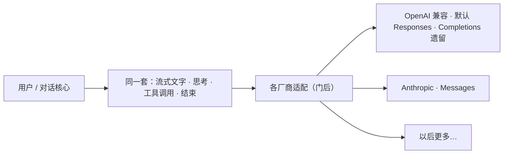

# 多厂商模型

> 用户/产品视角：换模型不应换一套界面语言。不写 HTTP / 适配器细节。
> 现状对齐：2026-08-04（c1880：第一语言 vs 方言；wire 策略 code-first）。

## 用户怎么碰到

用户在配置、命令行或 TUI `/model` 里选一个模型（或换一家兼容端点）。对话里仍是：流式文字、思考、工具调用、结束——**同一套体验**。agent 还在跑时换模 / thinking：**当前流不换**，下一 turn 起用；见 [运行时即时设置.md](./运行时即时设置.md)。

OpenAI 兼容端点：**默认走 `openai-responses`**；只有端点不支持时才在配置里显式写 `api: openai-completions`（遗留逃生）。配置真值用全称，不要简写成 `responses` / `completions`。

**第一语言 vs 方言**：OpenAI / Anthropic / Kimi 等厂商**自己的**原生 API 叫第一语言；他方（DeepSeek、llama.cpp、网关）实现该协议形状叫**方言**。方言形似 ≠ 官方语义。用户面目前主要拧 `api`；未暴露的 wire 保守策略（`compat=generic` 等）在代码默认板，不进 YAML/env。

## 产品规则（MUST / 禁止）

1. **对外一种说话方式**：流式增量、工具请求、结束原因，对界面都一样。
2. **厂商差异关在门后**：某家 API 大改，优先在适配层消化；不要让界面学会「某厂商专用事件」。
3. **Pre-1.0 交付只两家**：OpenAI 兼容（**默认 Responses**；Completions 显式遗留）与 Anthropic（Messages）。用户自定义端点仅当声明为上述兼容 API 时接受。
4. **排障能看见协议族**：观测时间线能对照本次请求用的 `api`（如 `openai-responses`）；日后可附 `compat`。勿把第一语言叫成「方言」。
5. **禁止**：OAuth、专属 attribution header、其它厂商专属逻辑作为 1.0 前交付；禁止「已经是统一模型再包一层」的双路径产品故事；禁止假设凡 `openai-responses` 端点 ≡ OpenAI 官方第一语言语义。

## 主线 vs 后置

| | 内容 |
|---|---|
| **主线** | OpenAI 兼容默认 `openai-responses` + Anthropic；Completions 显式遗留；统一事件与工具调用体验；thinking 经 `/model`（默认支持集最高档）；wire 未暴露策略 code-first（`defaults.rs`） |
| **后置** | 更多厂商适配器与命名预设；把已验证旋钮升 YAML/正式配置；不为未交付厂商堆产品概念 |

## 理想 vs 现状

| | 状态 |
|---|---|
| 业务只认统一模型口 | ✅ 已落地 |
| 两家交付路径；OpenAI 默认 Responses | ✅ 已落地 |
| busy 换模 / thinking = NextTurn + 双态 chrome | ✅ 见 [运行时即时设置.md](./运行时即时设置.md) |
| 更多厂商 / 命名预设 | 🔴 后置（见 roadmaps） |
| 第一语言 vs 方言叙事；WirePolicy 默认板 | ✅ code-first `defaults.rs`；infra 注入；无 YAML/env |

实现路径指针：`src/AGENTS.md`（Provider 适配）。

## 与其它文档

- [用户可见事件.md](./用户可见事件.md) — 为何不引入厂商专名事件
- [配置与档案.md](./配置与档案.md) — 模型 / profile 怎么选
- [运行时即时设置.md](./运行时即时设置.md) — 会话内换模生效点与 chrome
- [产品分层总览.md](./产品分层总览.md)
